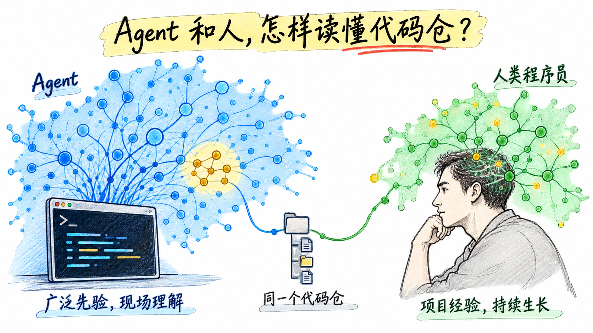
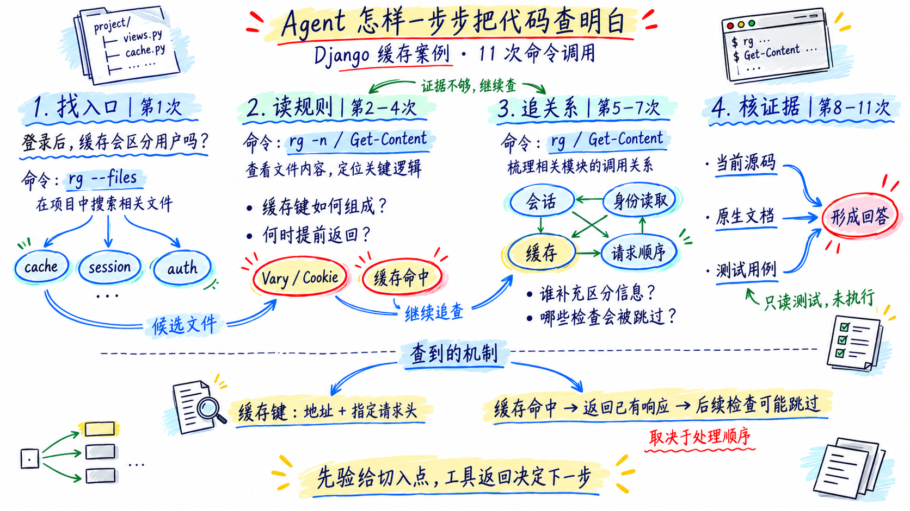
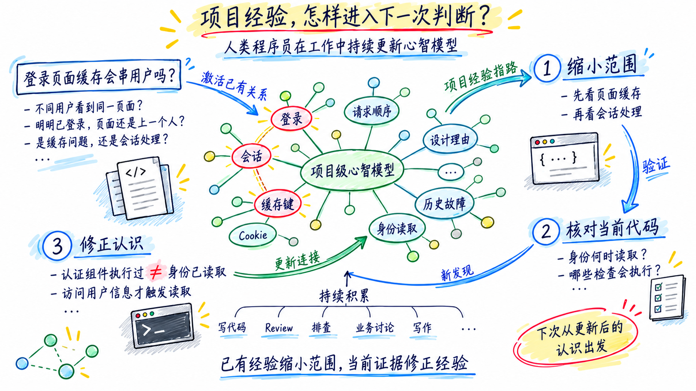
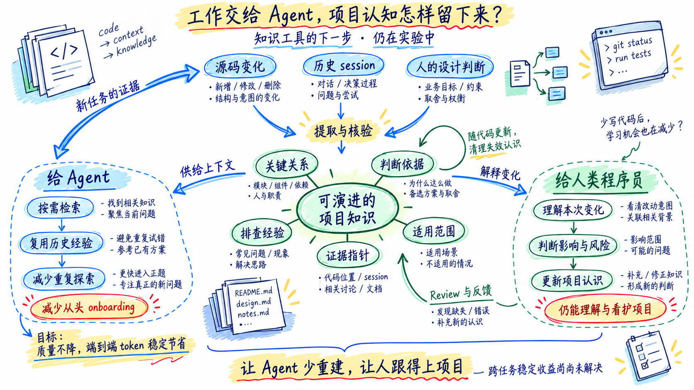

# Agent 是怎样读懂代码仓的：通用先验与项目经验



## 一、我给 Agent 准备了一套入职资料

我一直在做代码仓设计文档逆向生成工具，后来遇到一个有点尴尬的问题：

**如果 Agent 自己就能把代码查明白，我生成的文档，到底是在帮它，还是给它增加阅读任务**？

25年5月份开始，我采用的工作方式是手拼上下文——Agent 当人工导航：先找相关模块和代码，整理好上下文，再交给模型。后来它能自主探索代码仓了，我便顺着自己的经验想：新人熟悉项目需要文档，那给 Agent 一套项目总览、模块划分和业务流程，它应该也能少走弯路。

但随着实验推进，我发现事情没这么顺。有时文档放在那里，它根本不读；有时读完，还是照常搜索代码、追调用、核对实现。**入职培训完成了，工作量也增加了**。

这让我开始怀疑一个默认前提：我是不是一直在按人类熟悉项目的方式，设计 Agent 的工作方式？

人类程序员会积累项目经验，用过去的认识指导下一次排查。Agent 也能在任务中查懂项目，但这些理解如何留下来、随项目持续更新？

所以，我想先弄清楚：Agent 如何理解项目，它与人类程序员有什么不同。只有理解这些差异，才能判断哪些项目知识值得为它准备和积累。


## 二、Agent 怎样从业务问题，查到项目实现

我们从 Django 的一个缓存问题开始，看 Agent 怎样探索代码。

- **Django 是 Python Web 开发框架**，为后端提供请求处理、登录认证、数据库访问等基础能力。
- **后端负责处理业务请求**。比如打开**我的订单**，它要确认用户身份，再查询并返回对应的订单。
- **缓存让后端复用已经生成的结果**，减少重复查询和计算。但公告可以共享，**我的订单**不能随便共享。

问题来了：**系统已经知道你是谁，是否意味着缓存也会自动区分你和别人**？

我们据此设计了一道场景评估题：

> Django 启用整站页面缓存后，缓存是否会自动区分已登录的用户？命中缓存后，是否仍会执行认证和业务检查？缓存、会话和认证组件的执行顺序，会怎样影响这些行为？

问题落在页面缓存、用户身份和请求处理顺序的交界处。我们让 Agent 沿源码查清这些行为。

### 先看本次运行的数据

这次新开一个会话，不提供额外生成的项目文档、知识卡片或自定义读取工具。Agent 可以使用通用命令行工具，读取仓库源码、原生文档和测试；禁止联网、查看 Git 历史、修改代码或执行测试。

| 指标 | 本次结果 |
|---|---:|
| 模型 | gpt-6-sol |
| 推理强度 | medium |
| 工具调用 | 11 次命令执行 |
| 耗时 | 147.4 秒 |
| 输入 token | 255,468 |
| 其中缓存输入 | 219,776，占输入的 86.0% |
| 非缓存输入 | 35,692 |
| 输出 token | 3,255 |
| 总 token | 258,723 |
| 在线费用（估算） | **约 $0.148** |

下面按实际轨迹，看看它怎样推进。

### 1. 用业务线索筛文件，获得一张局部地图

第一次调用先用 `pwd` 确认工作目录，然后执行两组文件搜索。去掉外层命令包装，核心是：

```powershell
rg --files -g AGENTS.md -g '*cache*' -g '*session*' -g '*auth*' -g '*middleware*' |
    Select-Object -First 100

rg --files | Select-Object -First 70
```

第一组按名称筛选相关文件，第二组查看一小段仓库文件清单。

返回结果里，有缓存实现、认证和会话组件，也有测试与文档。例如：

```text
django/middleware/cache.py
django/views/decorators/cache.py
django/contrib/sessions/middleware.py
django/contrib/auth/middleware.py
docs/topics/cache.txt
tests/decorators/test_cache.py
```

这些路径先提供了职责线索：哪里处理页面缓存，哪里保存会话状态，哪里获取用户身份。会话是后端在多次请求之间保存用户相关状态的一种机制，登录功能通常会用到它。

它也搜索了 `AGENTS.md`，但这个源码快照没有该文件，没有项目指引供它读取。

题目中的缓存和登录功能，对应到第一轮搜索中的 `cache`、`session`、`auth` 等关键词。返回的文件路径成为下一步阅读的入口。

### 2. 从候选文件进入实现，确认缓存如何区分请求

第 2 次调用读取缓存中间件、缓存工具函数、会话组件、认证组件和页面缓存装饰器这五个文件的全文，并显示行号。下面以缓存中间件为例：

```powershell
rg -n '^' django/middleware/cache.py
```

第 3 次调用重读缓存中间件，并在 `django/utils/cache.py` 中搜索函数定义及 `Vary`、`Cookie`、`private`、`no-store` 等词。

**第一次搜索找相关文件，第三次搜索在实现里查具体规则**。搜索从文件名转向代码内容，关键词从缓存、认证等业务概念，细化为请求头、缓存限制条件和函数名。

第 4 次调用用 PowerShell 的 `Get-Content` 重读其中两个文件的局部代码：

| 文件 | 重读范围 | 核对内容 |
|---|---:|---|
| `django/middleware/cache.py` | 86—240 行 | 何时取缓存、何时写缓存 |
| `django/utils/cache.py` | 341—446 行 | 缓存键怎样生成 |

缓存键是查找缓存结果的索引。代码显示，它用到页面地址，以及 `Vary` 指定的请求头。比如两个人都打开**我的订单**，地址相同，但浏览器携带的登录 Cookie 不同；**若缓存规则包含 `Vary: Cookie`，不同 Cookie 就会对应不同缓存项**。这把**是否区分用户**落到了一个具体检查：缓存键有没有纳入相应的区分信息。

### 3. 查清缓存、登录和业务检查的执行顺序

缓存代码还显示：命中时直接返回已有响应。围绕缓存，可把处理过程简化为：

```text
请求到达缓存组件
├─ 命中 → 返回缓存响应
└─ 未命中 → 继续后续检查和业务处理 → 生成响应 → 符合条件时写入缓存
```

因此，检查放在缓存组件之前还是之后，会影响它是否执行。第 5—7 次调用重读会话、认证实现，并搜索请求处理入口，把这条流程补全：

| 要补齐的关系 | 去哪里查 | 查到什么 |
|---|---|---|
| 谁把 Cookie 加入缓存区分规则？ | `django/contrib/sessions/middleware.py` | 会话被访问或设置会话 Cookie 等情况下，响应处理会补上 `Vary: Cookie`；写缓存时需要用到它。 |
| 经过认证组件，是否已读取用户身份？ | `django/contrib/auth/middleware.py`，以及 `auth/__init__.py` 的 `get_user` | `request.user` 延迟加载，访问它时才读取身份。 |
| 提前返回会跳过哪些检查？ | `django/middleware/__init__.py`、`django/core/handlers/base.py`，以及认证组件的 `process_view` | 缓存提前返回可跳过后面的登录检查和业务代码，已经执行的前置处理不受影响。 |

工具仍是 `rg` 搜索、`Get-Content` 读取，搜索词已具体到 `get_user`、`process_view`、`accessed`。这些代码把**缓存区分规则、身份读取时机、业务检查顺序**连接了起来。

### 4. 用文档和测试核对源码判断

第 8—11 次调用搜索、读取缓存文档、相关测试和视图级缓存实现。其中，`docs/topics/cache.txt` 对前面的顺序问题给出了明确说明：**写缓存必须在其他组件补齐 `Vary` 之后执行**。文档还列出会话组件会添加 `Cookie`，与刚才读到的实现对应起来。

最终回答指出：已有登录功能不能保证缓存自动按用户隔离，命中缓存也可能跳过后续检查；正确性取决于区分规则和执行顺序。回答还区分了整站缓存与单个业务页面缓存的顺序差异，并给出隔离性验证方案。测试仅阅读，未执行。

### 围绕问题，拼出所需的完整上下文



这次 Agent 没有预先积累 Django 的项目级心智模型。它从**缓存与登录**出发，凭通用编程知识找到入口；读到缓存键和提前返回后，再追问谁补充区分信息、哪些检查会被跳过。**每查明一段，就知道下一段该去哪里找**。

最后，它把缓存、会话、认证和请求处理顺序接起来，形成了回答这道题所需的完整上下文。这里的**完整**指足以解释当前问题，不是读完整个代码仓。**Agent 的突出特点，是围绕任务现场构建这份上下文，即使没有可长期调用的项目经验，也能完成这次理解**。

人类程序员也会现场读代码；熟悉项目的人，还能从已有的项目认识出发。下一章看这些认识怎样参与排查。

## 三、人类程序员怎样持续建立项目级心智模型

程序理解研究对**心智模型**的发现可以归成三点：**它包含关系**，程序员会理解模块怎样协作、代码按什么顺序执行；**它指导查找**，任务和已有知识决定先读哪部分代码；**它会变化**，新发现修正原来的判断，积累的项目知识也会留在记忆中，影响下一次排查。

我认为，项目知识是一张概念之间的连接网。遇到问题，相关概念和过去的项目经验会一起被唤起。落到一次具体排查，可以看到五个动作：

1. **概念激活**：**登录用户的页面缓存**唤起会话、Cookie、缓存键等概念。
2. **接上项目经验**：这些概念连着记得的模块、执行顺序和过去的问题。
3. **沿连接找代码**：从关联最强的位置入手，核对当前实现。
4. **修正原有连接**：代码与记忆不符，就调整对模块关系的判断。
5. **持续学习**：反复使用和验证会加强概念之间的连接，提高相关经验在下次遇到相近问题时被激活的概率。

### 同一个缓存问题，项目经验怎样发挥作用



以熟悉这部分代码的工程师为例，项目经验让问题中的概念直接连到已知的实现关系。

**1. 从已知关系缩小范围**。

**登录用户的页面缓存**激活了已有的关联：登录状态来自会话，Cookie 影响缓存键，缓存命中可能改变后续处理。程序员从页面缓存和会话处理的代码开始，核对这些关系在当前实现中是否成立。上一章的 Agent 则通过文件搜索和阅读，在本轮上下文中把它们接起来。

**2. 用当前代码核对判断**。

继续查看认证和请求处理的代码，确认登录检查放在哪里、命中缓存后哪些代码还会执行。过去的认识提供检查方向，当前实现决定结论；这一点与 Agent 相同。

**3. 把新发现补回项目经验**。

代码显示，认证组件设置了用户信息的延迟获取方式，后续代码访问时才读取身份。程序员由此把**认证组件执行过**与**用户身份已经读取**拆开，修正了认证、会话与身份读取之间的连接。下次排查相近问题，这层关系就能成为新的切入点。

这种学习贯穿程序员的日常工作：理解业务时把需求接到系统行为，写代码时检验实现，Review 时发现边界，排查问题时追溯因果，写文章时整理设计理由。每一次都在使用、加强或修正概念之间的连接，让项目级心智模型跨任务演进。

**Agent 没有项目记忆，每次进入会话，都要重新 onboarding**。它带着通用编程知识开始工作，通过搜索和阅读重新建立当前问题的完整上下文。这次查明的 Django 关系不会自动写回模型，也不会因为做过更多项目任务，就自然积累成下一次可调用的项目经验。**没有外部记忆承接，每次任务都要重新建立现场**。

## 四、项目知识能帮 Agent 省掉多少探索

既然 Agent 要重新建立现场，我最初的想法很直接：把项目知识整理成文档，让它少查一些代码。为此，我们用 CodeWiki 从源码生成项目总览和模块说明，再观察 Agent 是否使用、用了之后是否更省。

### RQ1：提供项目文档，Agent 会主动阅读并降低解题成本吗？

实验覆盖 Django、n8n、Spring Boot、Syncthing、Tokio、Redis 六个项目，每个项目五题，共三十题。解题使用 gpt-6-astra（下文简称 Astra），推理强度 medium；评分使用 gpt-5.6-terra（下文简称 Terra），推理强度 high。每题设置三组，每组运行一次：

- **源码组，记为 N（Native）**：不提供额外生成的项目文档。
- **自主阅读组，记为 W（Wiki）**：提供 CodeWiki 文档，由 Agent 决定是否阅读。
- **强制总览组，记为 F（Forced overview）**：要求先读项目总览，再继续探索。

下表分数为百分制，时间为每题平均，其他消耗为三十题合计。总 token 统计多轮输入与输出，包含缓存输入；费用为在线解题估算费用。

| 指标 | 源码组 N | 自主阅读组 W | 强制总览组 F |
|---|---:|---:|---:|
| 平均分 | 93.23 | 93.97 | 94.40 |
| 平均时间 | 210.2 秒 | 207.4 秒 | 167.0 秒 |
| 工具调用 | 217 | 226 | 289 |
| 总 token | 949.9 万 | 872.3 万 | 926.1 万 |
| 在线费用 | $27.31 | $26.51 | $27.76 |
| 实际获得文档内容 | 0/30 | 1/30 | 30/30 |

**最明显的现象，是自主阅读组几乎不读文档**。三十次运行里，两次尝试查文档，只有一次拿到了内容。那是文件同步工具 Syncthing 的一道同步停滞问题：Agent 读了导航索引，随后搜索模块文档，只得到八行匹配内容，没有完整阅读模块说明。

强制阅读后，平均分增加 1.17 分，平均时间下降 20.5%，但工具调用增加 33.2%，在线费用略增。强制阅读组表现出小幅质量改善，总工具调用却更多。自主阅读组的分数变化，也无法由仅一次文档阅读来解释。

这组用了部分历史源码对照，其中 Redis、Tokio 的提示词和评分协议与新增运行有差异；每题也只跑一次。表中的时间下降是值得复测的信号。文档生成的已知费用另有 $39.67，未计入在线费用。

**RA1**：自主选择时，Agent 几乎不读这些项目文档。强制阅读总览后，观察到平均耗时下降、平均分小幅提高，但工具调用与在线费用增加。单纯提供或要求阅读项目总览，没有在这组实验中带来全面的成本收益。

### RQ2：提前提供相关片段，或让 Agent 自行选段，能节省成本吗？

总览离具体问题还有一段距离。我们随后让上游模型看到问题，提前选出相关材料，再交给解题 Agent。沿用六项目三十题，Astra medium 解题、Astra high 评分，每题每组一次，源码对照复用历史运行。这次比较：

- **原文片段组，记为 O（Original excerpts）**：直接注入从 CodeWiki 选出的相关原文。
- **改写片段组，记为 R（Revised excerpts）**：对照当前源码检查、修改相关材料后注入。
- **源码组 N**：使用本批对应的无文档对照。

| 指标 | 源码组 N | 原文片段组 O | 改写片段组 R |
|---|---:|---:|---:|
| 平均分 | 94.63 | 93.70 | 93.90 |
| 平均时间 | 166.2 秒 | 148.0 秒 | 132.7 秒 |
| 总 token | 933.3 万 | 600.6 万 | 419.5 万 |
| 在线费用 | $26.64 | $21.67 | $19.23 |
| token 相对源码组 | — | −35.6% | −55.1% |

**把相关材料提前送到面前，确实出现了明显的节省**。但材料制作已经看过目标问题，选段和改写的成本也未计入在线消耗。这张表回答的是送对材料之后有什么效果。

提前注入的实验观察的是材料送到面前后的效果。接下来，我们另选五题，测试更接近实际使用的流程，让解题 Agent 自己找材料并完成回答。我们先用 CodeWiki 逆向分析整个代码仓，生成覆盖全仓的项目文档，并整理成文档索引，供 Agent 查找相关内容。解题 Agent 从这个索引开始，自行选择相关片段、阅读、查源码并回答。称为**自行选段组 S（Self-selection）**，与新跑的源码组比较。两组均使用 Astra medium 解题和匿名评分，每题一次；从检索到回答的全部 token 都计入。

| 指标 | 源码组 N | 自行选段组 S |
|---|---:|---:|
| 平均分 | 80.00 | 95.00 |
| 平均时间 | 167.5 秒 | 198.5 秒 |
| 总 token | 224.8 万 | 267.9 万 |
| 在线费用 | $5.28 | $6.14 |
| 省 token 的题数 | — | 0/5 |

分数提高主要来自同步停滞题，其余四题平均分只从 97 升到 97.25。这轮还出现索引乱码和重读，相关开销全部保留。这两轮的题目、选段流程和源码对照不同，分别看各自组内的结果。

**RA2**：提前注入相关片段，两组在线 token 分别减少 35.6% 和 55.1%。另选五题自行选段，同步停滞题的回答质量明显改善，其余四题分数基本不变，但五题均未节省 token。**自行选段这轮有质量收益，尚未观察到成本优势**。

### RQ3：单题上有效的知识，能稳定节省，并复用到其他问题吗？

RQ2 中，提前提供相关材料出现了明显的节省。我们接着从已经调优、观察到收益的单题知识入手，检查重复运行的表现，再冻结知识，尝试其他问题。

这道题来自 Django：请求处理中加入同步审计逻辑后，异步等待为何仍受影响？定向知识整理了同步审计与异步请求的调用关系，并配有可直接读取的源码片段。我们把这套方案记为**知识增强组 E（Enhanced）**，与源码组 N 比较。

解题均使用 **Astra medium**。同题每组各跑三次，题面、知识、索引和读取工具固定，检索、阅读和回答的 token 全部计入。三次都是新会话：

| 运行 | 源码组 N：总 token | 知识增强组 E：总 token | 变化 |
|---|---:|---:|---:|
| 第一次 | 225,477 | 88,404 | −60.8% |
| 第二次 | 221,561 | 122,017 | −44.9% |
| 第三次 | 187,166 | 152,239 | −18.7% |
| 平均 | 211,401 | 120,887 | −42.8% |

**这道已调优的问题上，知识增强方案三次都节省了 token，平均减少 42.8%**。这一轮未做全量评分，质量采用固定样本抽查。

冻结同一套知识增强方案后，再用于另外四道 Django 问题。模型和工具设置不变，每题每组各跑三次，表中为三次平均值：

| 迁移任务 | 源码组 N：平均 token | 知识增强组 E：平均 token | 变化 |
|---|---:|---:|---:|
| 流式响应断连与资源释放 | 201,536 | 179,554 | −10.9% |
| 统一异常处理与中间件短路 | 133,970 | 162,541 | +21.3% |
| 请求事务、流式输出与提交后通知 | 177,377 | 190,748 | +7.5% |
| 登录态页面与整站缓存隔离 | 201,826 | 187,911 | −6.9% |

缓存题有两次增强运行未通过来源审计，该行保留原始结果，不作为有效复用的证据。其他题也有省有增：单题上连续出现的收益，没有稳定迁移到其他任务。

**RA3**：**这道已调优的问题上，知识增强方案的节省结果在三次运行中重复出现**，平均减少 42.8%；回答质量采用抽查。冻结方案后换题，消耗有降有升，尚未形成稳定的跨任务收益。

这些实验让我更关注：**哪些已验证的项目经验，值得留下来供下一次使用**？保存并持续更新这些经验，是接下来要验证的方向。

## 重新思考知识的价值



**做项目知识工具，要帮助人更快理解项目，也要帮助 Agent 积累能够长期演进的项目级心智模型**。

**LLM 的优势在广度和容量**。LLM 拥有广泛的代码知识，大上下文窗口能容纳远超人类工作记忆的材料，可以围绕问题迅速建立当前项目的局部理解。但这份理解不会在普通会话中自动写入模型权重；没有带入历史上下文或外部记忆，新会话仍要重新建立项目认识。

人类程序员的优势在项目经验的持续积累。人的知识覆盖、单次能处理的信息量都很有限，却可以在长期工作中持续学习，让项目级心智模型随项目一起演进。一次排查得到的认识，会影响下一次看到问题时的直觉和判断。**LLM 能迅速建立理解，人能把理解逐渐变成自己的经验**。为两者提供知识，需要补足的恰好是不同的部分。

对 Agent，我想做的是把历史 session 中已经验证的关系、判断和排查经验保留下来，在新任务中按需使用，并随代码变化持续更新。让它每次工作都能接着已有认识往前走，减少从头 onboarding。这种项目级心智模型需要由外部记忆承载，至少应做到：**在保证回答质量的前提下，复用历史经验，稳定节省端到端 token**。目前，这道已调优的问题三次均节省 token，跨任务复用仍需继续验证。

我的工具也要从生成设计文档，进一步走向积累和更新可复用的项目经验。

**Agent 接手的工作越多，人如何保持对项目的理解，就越值得重视**。过去，写代码、读代码、定位和修复问题，也是人不断学习项目的过程。随着这些工作越来越多地交给 Agent，原本嵌在工作中的学习机会也在减少。交付可以更快，人的项目认知却未必同步增长。

这给知识工具提出了另一项任务：把 Agent 完成的工作，转化为人能理解、判断并持续积累的项目知识。让人知道系统为什么这样设计、这次改动影响了什么、哪些风险需要关注。**如何在不亲自写每一段代码的情况下，仍然理解项目、判断变化、看护它的长期演进，是接下来非常关键的课题**。

今年被模型的后训练搞得挺烦躁：刚找到一个值得优化的环节，下一代模型可能已经自己解决了，原来的收益又得重新测——像是在打移动靶。

道阻且长，继续跑实验。
