最近一段时间，Coding Agent的能力包越来越像一门生意。

有的要求先brainstorming，再写spec、plan、测试和review；有的强调**少写代码、尽快交付**；有的把开发过程变成状态机；也有的只做一件事：在动手前，把需求问清楚。

这些项目通常都能讲出一套完整的方法论。问题是，**方法论完整，不等于Agent真的变强。**模型原本就会读代码、写测试和自我检查。再装一套Skill，新增的到底是有效信息，还是重复流程？

我把Bare、Grill Me、OpenSpec、Ponytail、Superpowers和MatrixSpec放进同一组八任务面板。每个task×arm运行3次，共144条正式轨迹。所有候选都从冻结commit开始，最终diff交给两名不知道处理标签的judge评分，并运行候选不可见的隐藏测试。

先说结论：

- **没有一套能力包在所有任务上通吃。**同一个Skill可以在一项任务上明显提高质量，在另一项任务上制造额外噪声。
- **Grill Me确实有用，但收益来自向operator购买缺失的产品信息。**需求已经完整时，它的优势迅速缩小。
- **Ponytail确实让代码变少，却没有让开发过程更便宜。**八项任务新增代码平均减少20.5%，Candidate Token反而增加44.5%，均分下降1.31。
- **重型工作流能提高平均分，也可能吞掉数量级更多的Token。**Superpowers比Bare高10.54分，Token约为Bare的10倍；它不是无效，而是没有建立稳定的质量—成本关系。
- **MatrixSpec L0用确认artifact保存跨阶段决策，避免下一阶段继承整段对话。**它把需求、设计决定和验收边界交给下一阶段，在当前面板上以8.57M Token获得90.27分；这一结果仍受operator协议和事后选arm影响。
- **真正决定Skill价值的，不是它包含多少步骤，而是它修正了哪种不确定性。**

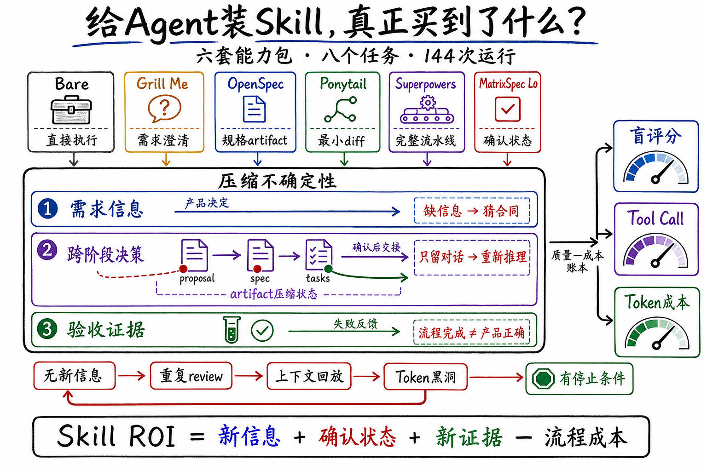

这篇文章不再逐个介绍项目功能。我更关心一个底层问题：

> **六套工作流本质上都在购买三样东西：需求信息、经过确认的跨阶段决策和验收证据。工作流的价值取决于它买到了什么，以及为此付出了多少Token。**

## 六套能力包，实际改变了什么

先把名字背后的机制说清楚。

| 被测Agent | 主要机制 | 它试图修正的问题 | 主要成本 |
|---|---|---|---|
| Bare（裸Agent） | 不加载额外能力包，模型直接调查、实现和测试 | 不额外假设流程缺陷 | 依赖模型与仓库自身能力 |
| Grill Me | 逐问澄清，确认共享理解后再实现 | 仓库外的产品决定缺失 | operator交互与问题数量 |
| OpenSpec core | 先建立规格artifact，再执行变更 | 需求到实现之间状态丢失 | 写作、同步与维护spec |
| Ponytail full | 最小diff、复用现有机制、YAGNI | 过度工程和无关改动 | 更多搜索与范围判断 |
| Superpowers Full | brainstorming→spec→plan→sub-agent→review→verification | 跳步、遗漏和不稳定执行 | 长上下文、多会话与调度 |
| MatrixSpec L0 | 用确认artifact传递阶段状态、受限review、不预生成全量基线文档 | 关键决策在阶段交接时丢失 | operator审计与阶段成本 |

这里的Bare可以直接理解为**裸Agent**：使用同一个强模型、同一套CLI工具、仓库规则和测试环境，只是不加载额外Skill或workflow。它照样会读代码、修改文件、运行测试和检查结果，并不是一个“什么都不会”的弱基线。**任何能力包新增的质量，都必须和这个裸Agent比较；新增的Token、Tool Call和等待成本也必须一起计算。**

Grill Me也不是一个普通的“多问几句”。它明确区分两类信息：仓库里能查到的事实由Agent自己调查；需要人决定的产品语义交给用户。它一次问一个问题，并给出推荐答案，直到双方确认共享理解。这个设计很轻，却直接触及Agent最难独立解决的变量：**代码库里根本不存在的产品决定。**

Ponytail走向另一个方向。它要求在每次响应中保持激活，优先交付最短可工作的diff，复杂需求也倾向先采用合理默认。这套规则确实能压缩代码，但它隐含了一个待验证的等式：

> **更少代码≈更少成本≈更高可靠性。**

后面的数据会表明，这三个量并不等价。

## 实验设计

### 实验目标与研究问题

实验目标不是给GitHub项目排一个总榜，而是回答四个问题：

- **RQ1：**六套能力包相对Bare，在质量、可靠性和Token成本上表现如何？
- **RQ2：**Grill Me为什么在部分任务上有效，它买到的到底是什么？
- **RQ3：**Ponytail减少代码之后，是否真的减少成本、提高正确性？
- **RQ4：**什么样的不确定性，值得调用什么样的Skill机制？

### 八个任务

任务覆盖Go、JavaScript、Python和Rust，包含低歧义局部修改，也包含公共API、安全解析器和标准协议。它们不是八道独立算法题，而是八个冻结开源仓库上的PR级改动。

| 任务 | 仓库与来源 | 需求摘要 | 主要不确定性 |
|---|---|---|---|
| CLI item-list fields | [cli/cli](https://github.com/cli/cli)，关联[PR #13823](https://github.com/cli/cli/pull/13823) | 为project item-list增加按字段名/ID展示列，处理flag冲突、分页、类型渲染和错误语义 | 高需求歧义 |
| ESLint caught error | [eslint/eslint](https://github.com/eslint/eslint) | 扩展preserve-caught-error，使自定义错误类可配置，并保持schema、类型和兼容行为一致 | 需求枚举 |
| pytest plugin entry points | [pytest-dev/pytest](https://github.com/pytest-dev/pytest) | 让插件加载复用现有entry-point路径并覆盖环境变量和pytest_plugins | 低歧义负对照 |
| pytest addini expressions | [pytest-dev/pytest](https://github.com/pytest-dev/pytest) | 为addini加入类型表达式，处理解析、兼容、类型与文档 | 中等契约 |
| bat sanitize | [sharkdp/bat](https://github.com/sharkdp/bat) | 增加控制序列清洗，覆盖CLI/API、7-bit ESC、8-bit C1和不完整序列 | 安全敏感parser |
| SQLModel constraints | [fastapi/sqlmodel](https://github.com/fastapi/sqlmodel)，[PR #681](https://github.com/fastapi/sqlmodel/pull/681) | 协调Field约束、sentinel语义、SQLAlchemy列推导和公共类型 | 公共API兼容 |
| Axum executor | [tokio-rs/axum](https://github.com/tokio-rs/axum)，[PR #3704](https://github.com/tokio-rs/axum/pull/3704) | 为serve引入自定义executor，贯穿trait、HTTP/2和builder组合 | 跨模块公共API |
| Prometheus UTF-8 | [prometheus/client_python](https://github.com/prometheus/client_python)，[PR #1102](https://github.com/prometheus/client_python/pull/1102) | 实现四种escaping、版本协商、fallback及多个导出入口 | 高隐藏协议契约 |

没有公开PR链接的任务，以冻结仓库commit、任务合同和独立参考实现为来源，并不伪装成真实已合并PR。完整commit与验收命令放在文末方法附录。

### 标准答案、交互与评分

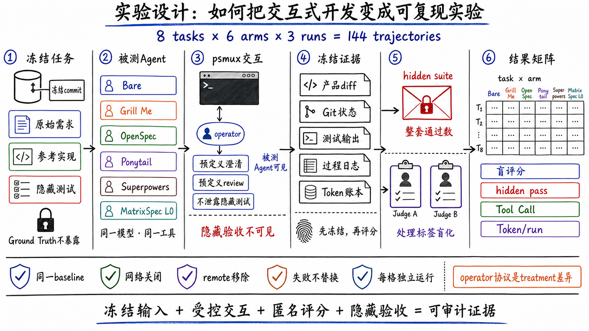

每个任务都包含四层独立材料：

- **任务提示：**被测Agent能看到的初始需求。
- **Ground Truth合同：**产品语义、边界条件和参考决策，候选不可见。
- **参考实现与隐藏测试：**用于校验合同是否可执行，不向被测Agent暴露。
- **评分rubric：**把正确性、兼容性、测试、文档与实现质量拆成可审计条目。

交互式workflow由`psmux`驱动。被测Agent本身运行在无头CLI里；`psmux`负责识别提问、把预先定义的operator回答送回会话，并记录每次往返。这里的operator模拟知道产品真实意图的开发者，它可以回答“应该支持哪些边界”，但不能把隐藏测试内容直接泄露给候选。

MatrixSpec的operator还会检查阶段artifact是否完整记录Ground Truth；Superpowers和Grill Me主要由Agent主动提问。这是一个真实的treatment差异，也意味着它们获得oracle信息的协议并不完全对称。正文不会把这种差异藏起来。

评分分两步：先冻结产品diff、Git状态、测试输出、过程日志和Token账本；再将匿名候选交给两名judge独立评分。judge不知道候选使用了哪套能力包。隐藏测试单独运行，报告“整套通过”的run数。**流程完成、单元测试变绿和隐藏验收通过是三个不同概念。**

### 公平性约束

- 同一任务的所有arm从同一baseline commit开始，网络关闭，仓库remote移除。
- 使用同一模型、reasoning配置、CLI工具和运行时依赖。
- Ground Truth、参考实现、rubric和隐藏测试对候选不可见。
- 失败、超时和未完成运行原样计入，不补跑替换。
- 每个候选由两名处理标签盲化judge评分。
- 每个task×arm均为3次独立运行，任务均值再做八任务**等权平均**。

需要强调：144条核心轨迹来自多个冻结campaign的统一面板汇总，并非一次同时随机化完成的单批实验。CLI、ESLint和部分pytest过程指标使用同题历史对照。它们支持任务内描述与机制分析，**不支持把一两分差异解释为统计显著优势。**

## RQ1：装上Skill，整体更强了吗

**RA1：有些工作流提高了当前面板的平均质量，但没有一套能力包形成跨任务、跨指标的稳定支配。Skill的收益高度依赖任务中的主导不确定性。**

### 总结果

| 被测Agent | 八任务等权平均 | Candidate Token/run | 时长/run | Candidate+operator成本/run | 相对Bare判断 |
|---|---:|---:|---:|---:|---|
| Bare | 73.54 | **2.22M** | **8.14 min** | **$1.08** | 基线 |
| Grill Me | 80.30 | 3.31M | 13.45 min | $2.55 | +6.76分，Token 1.49× |
| OpenSpec core | 71.42 | 3.91M | 13.07 min | $1.68 | −2.12分，Token 1.76× |
| Ponytail full | 72.23 | 3.21M | 11.33 min | $1.42 | −1.31分，Token 1.45× |
| Superpowers Full | 84.08 | 23.44M | 58.41 min | $9.65 | +10.54分，Token约10× |
| MatrixSpec L0 | **90.27** | 8.57M | 33.41 min | $4.71 | 探索性复合对照 |

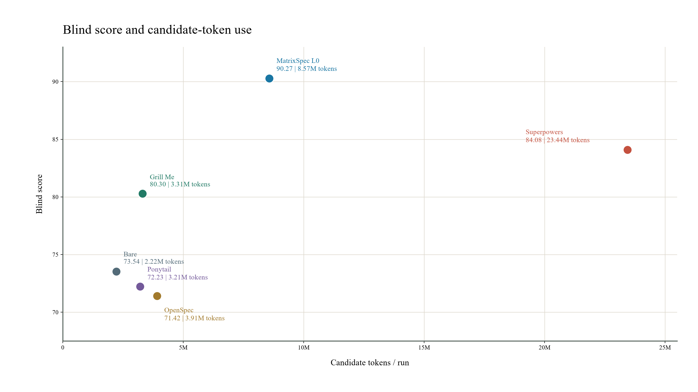

这张图给出三个直接判断：

- **Bare仍然是非常强的成本基线。**任何通用Skill都必须解释为什么值得增加调用、上下文和等待。
- **Grill Me位于较合理的增量区间。**它没有买下完整开发流程，却拿到了明显的平均分提升。
- **Superpowers买到了质量，也支付了数量级更高的Token。**问题不在于它“完全没用”，而在于10倍成本没有形成可预测的10倍收益。

MatrixSpec L0在当前面板上分数最高、Token低于Superpowers，但不能把它宣布为总冠军。它是我参与开发的系统；L0是在内部2×2结果后选出的代表arm，operator的artifact审计也更主动，尚未经过独立held-out任务验证。更重要的是，L0整套隐藏测试通过13/24，低于Superpowers的16/24。**连续盲评分、精确隐藏验收和成本给出了不同排序。**

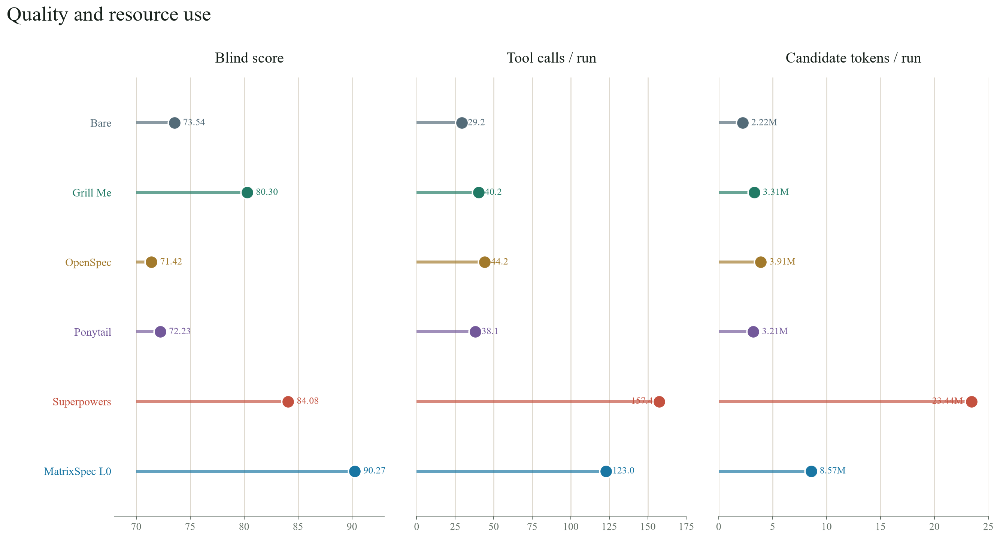

把资源指标拆开后，工作流膨胀的路径更加清楚。Bare平均每次运行只有29.2次Tool Call；Grill Me、OpenSpec和Ponytail集中在38.2—44.3次；MatrixSpec L0为123.0次；Superpowers达到157.4次。**Token上涨不只是单次上下文变长，也来自更多工具调用、更多会话和更长的执行链。**

### 完整任务矩阵

| 被测Agent | CLI | ESLint | pytest plugin | pytest addini | bat | SQLModel | Axum | Prometheus | 等权平均 |
|---|---:|---:|---:|---:|---:|---:|---:|---:|---:|
| Bare | 79.67 | 54.83 | **95.00** | 79.00 | 85.67 | 85.00 | 72.83 | 36.33 | 73.54 |
| Grill Me | 97.67 | 99.20 | 93.83 | **92.83** | 68.50 | 81.67 | 81.00 | 27.67 | 80.30 |
| OpenSpec | 81.17 | 54.33 | 90.00 | 78.67 | 91.17 | 73.50 | 71.17 | 31.33 | 71.42 |
| Ponytail | 80.50 | 51.00 | 90.50 | 77.33 | **92.83** | 79.17 | 67.17 | 39.33 | 72.23 |
| Superpowers | **100.00** | 98.17 | 91.33 | 89.33 | 85.00 | **85.67** | 80.50 | 42.67 | 84.08 |
| MatrixSpec L0 | 99.83 | **100.00** | 93.33 | 85.50 | 86.83 | 85.33 | **91.50** | **79.83** | **90.27** |

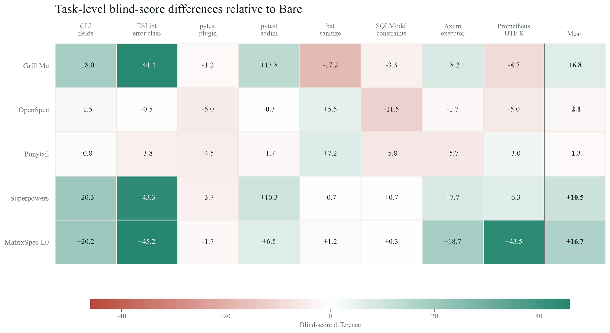

表格解释比总平均更重要：

- Grill Me在CLI、ESLint和pytest addini上大幅提高，在bat和Prometheus上反而明显下降。
- Ponytail在bat拿到全表最高分之一，在Axum和SQLModel上退化。
- Superpowers在CLI和ESLint接近满分，在简单pytest与bat上没有超过Bare。
- Prometheus让所有方案暴露了协议恢复能力的上限；15条非MatrixSpec运行没有一条整套隐藏测试通过。

**同一个workflow跨任务反转，说明任务类型不是背景变量，而是决定ROI的核心变量。**

## RQ2：Grill Me为什么有用

**RA2：Grill Me的主要价值不是让Agent“思考更久”，而是建立了一条获取仓库外产品决定的通道。它对需求缺口敏感，对代码复杂度并不敏感。**

Grill Me八任务均分80.30，比Bare高6.76分，只增加约1.09M Candidate Token/run。这个ROI明显好于固定全流程，但平均数仍然掩盖了边界。

| 任务 | Bare | Grill Me | 分差 | 解释 |
|---|---:|---:|---:|---|
| CLI | 79.67 | 97.67 | +18.00 | 补齐flag、错误和渲染语义 |
| ESLint | 54.83 | 99.20 | +44.37 | 把配置schema与兼容边界问完整 |
| pytest plugin | 95.00 | 93.83 | −1.17 | 需求已经短而明确 |
| pytest addini | 79.00 | 92.83 | +13.83 | 类型表达式存在产品选择 |
| bat | 85.67 | 68.50 | −17.17 | 问题多不等于获得正确parser契约 |
| Prometheus | 36.33 | 27.67 | −8.66 | operator信息仍不足以覆盖完整标准 |

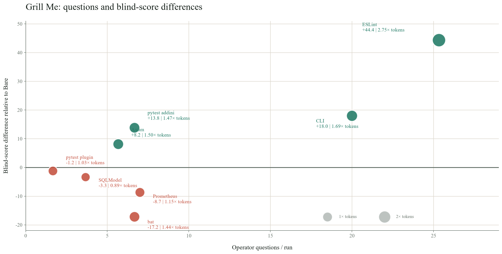

八个任务没有呈现“问得越多，收益越高”的关系。ESLint平均提出25.33个问题并提高44.37分，因为这些回答补齐了产品合同；bat与Prometheus各提出约7个问题，评分仍然下降。**交互成本买到的是问题的答案，真正产生收益的是答案中新增的有效信息。**

### 案例：ESLint的四条路径

这项任务要求给`preserve-caught-error`增加`errorClassNames`配置。真正困难的不是写一个数组，而是确定字符串与对象形式、参数位置、内置错误类覆盖、无效schema、直接调用和兼容边界。

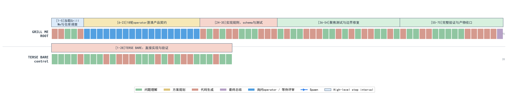

第一张图先比较缺少合同的两条路径。每个cell代表一个解析后的step，ROOT上方标明被测arm，蓝色cell表示Agent向operator提问或提交评审。Grill Me为70步，简略Bare为28步；两行使用完全相同的cell宽度，因此长度差不是绘图拉伸造成的。Grill Me新增的过程主要用于逐项澄清和继续调查。

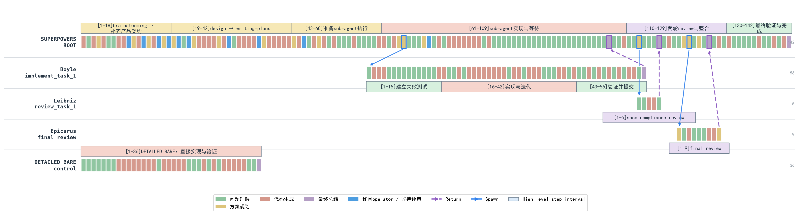

第二张图把Superpowers的主Agent、实现sub-agent、spec compliance reviewer和final reviewer放回同一坐标系。蓝色实线是Spawn，紫色虚线是Return；详细Bare是独立对照，不连接到session tree。四条路径的结果可以直接对照：

- **简略Bare：**28步、0.98M Token、50分。它很快实现了自己理解的需求，但产品契约没有进入上下文。
- **详细Bare：**36步、1.56M Token、100分。完整需求从一开始就存在，模型直接实现并验证。
- **Grill Me：**70步、3.84M Token、18个operator问题、97.5分。它用交互逐项购买缺失信息。
- **Superpowers：**212步、14.86M Token、4个会话、100分。它也拿到了契约，同时支付spec、plan、sub-agent和review的完整流程成本。

四条路径的共同成功因素不是“步骤多”，而是**完整产品契约进入了实现上下文**。Grill Me在这里有效，因为它能改变信息集合；详细Bare证明，只要同样的信息提前给到模型，重型流程并非必要条件。

这也给Grill Me划出边界：

- operator必须真的知道答案；不知道时，反复提问不会创造oracle。
- 一次只问一个问题能降低认知负担，也会拉长交互；ESLint三次运行分别产生18、22和36个问题。
- 提问中的“推荐答案”有助于推进，也可能形成锚定。
- 低歧义任务没有足够的信息增益来覆盖交互成本。

所以Grill Me适合作为**需求歧义触发器**，不适合作为所有任务的强制开场。

## RQ3：Ponytail真的更省吗

**RA3：Ponytail稳定压缩了产品diff，却没有稳定压缩Agent的搜索、验证和推理过程。它是实现范围的正则器，不是端到端成本优化器。**

Ponytail的触发没有问题。八项任务里，它在8/8都减少了新增代码，平均减少20.5%。如果只看diff，这套方法论兑现了自己的承诺。

但把其余指标放回去，故事完全不同：

- 7/8任务使用了更多Candidate Token，整体增加44.5%。
- 工具调用增加30.6%，墙钟时间增加39.2%。
- 5/8任务得分下降，八任务均分从73.54降到72.23。
- 只有bat同时形成了明确的质量与交付成功。

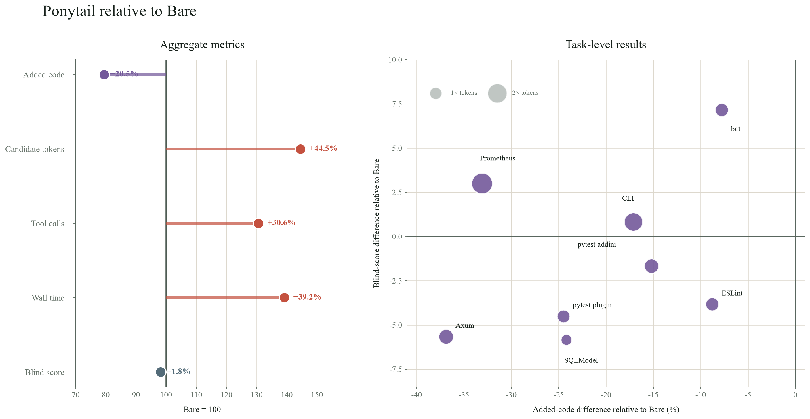

左图把Bare归一为100：新增代码降至79.5，Candidate Token却升至144.5，工具调用和墙钟时间也同步上升。右图中所有任务都位于横轴左侧，说明代码确实更少；评分却分散在零线上下，说明**少写代码没有稳定预测正确性**。Prometheus的气泡最大：新增代码减少33.1%，Token升至2.23倍，三次隐藏测试仍全部失败。

为什么代码更少，过程反而更贵？因为Ponytail减少的是最终产物，不是找到最小实现的搜索成本。Agent会读取更多文件、比较更多复用点、反复判断哪一层最适合落改动，再做局部验证。**最小diff本身也需要计算。**

### 案例A：bat，范围控制变成了真实收益

bat需要清除终端控制序列。简单说，它要识别ANSI颜色、光标控制和设备控制等不可见指令，只保留用户真正想看的文本，同时不能破坏UTF-8字符或CLI/API行为。

这个仓库已有成熟的终端解析与渲染机制。Ponytail的“先复用、少造抽象、保持小diff”与任务结构一致：平均分从85.67升到92.83，三次隐藏测试全部通过，新增代码减少7.8%。它仍多用了21%Token，但换来了可观察的质量与稳定性提升。

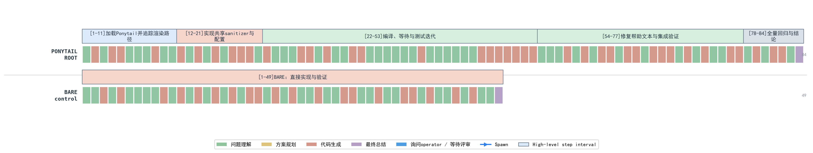

图中Ponytail的84步明显长于Bare的49步。这个案例的收益来自更充分地复用正确机制并覆盖边界，**不是因为过程更短。**

### 案例B：Prometheus，更小的实现没有恢复协议

Prometheus任务要求支持四种escaping方案、版本协商、fallback、direct generator API以及多个导出入口。这些不是从局部代码风格就能推导出的合理默认，而是一份公开协议的精确合同。

Ponytail把新增代码减少33.1%，代表运行却从Bare的36步、2.48M Token扩展到66步、5.10M Token。两边三次隐藏测试都没有整套通过。更短的实现没有恢复缺失的版本门槛、escaping边界和集成语义。

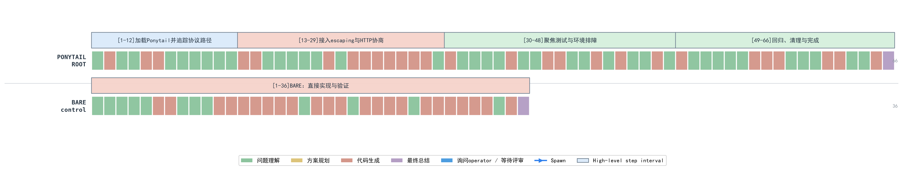

两张工具图使用同一套视觉语法，却指向两个不同结论：

- bat的最小实现能够复用仓库里已经存在的正确机制，**压缩的是冗余。**
- Prometheus的最小实现面对不完整协议，**压缩掉的可能正是必要契约与验证。**

因此，Ponytail不是“没用”。它适合需求明确、仓库已有正确抽象、隐藏政策少、focused tests充分的实现收尾。把它升级成通用开发方法，才会把“更少代码”错误地扩张成“更高效率”。

## RQ4：应该按什么选择Skill

**RA4：Skill不该按“是否写代码”触发，而应按尚未解决的不确定性触发。选择机制之前，先说清楚它要新增哪一种信息或证据，以及何时停止。**

前面的结果可以统一到一个判断框架：

| 主导不确定性 | 最小有效机制 | 继续条件 | 停止条件 |
|---|---|---|---|
| 需求不清 | 按需澄清、确认产品合同 | 仍存在影响实现的产品决定 | 剩余问题可从仓库验证 |
| 实现风险 | 一次定向review | 公共API、并发、安全、兼容边界未覆盖 | 已知风险有测试或证据 |
| 跨阶段决策丢失 | 最小spec/决策账本 | 下一阶段仍需重新猜测需求或设计理由 | 关键决定、未决问题和验收边界均可直接执行 |
| 验收不明 | focused tests、隐藏验收、fresh verification | 失败证据仍未解释 | 目标行为有可复现证据 |
| 过度实现 | 最小diff与YAGNI约束 | 正确性已知但范围继续膨胀 | 无多余修改且验收完整 |

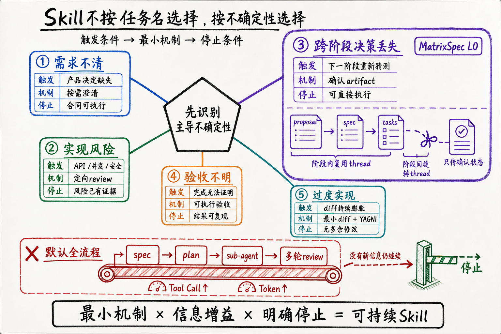

### MatrixSpec的优势：让决策跨阶段存活

长任务最容易丢失的是**代码背后的决定**。需求阶段已经确认的兼容边界、被排除的方案和验收条件，如果只存在于对话历史里，到了实现、review或新Agent接手时，就必须重新读取、重新推理，甚至重新猜测。上下文还在，不代表共享理解还在；这就是跨阶段决策丢失。

MatrixSpec把proposal、delta spec和tasks作为经过确认的阶段状态。一个阶段内部继续使用同一thread，跨阶段时旋转thread；下一阶段只读取已经确认的需求、决定和未决项，不继承前一个Agent完整的探索过程。review也只围绕确认文档、当前diff和测试证据展开，不再为每个任务动态派发一组sub-agent。**artifact在这里承担长对话的有损压缩：丢掉中间自述，保留会影响实现和验收的事实。**

六个可对齐任务的session账本提供了一个有辨识度的现象：MatrixSpec L0平均有20.0个session文件，Superpowers为10.2个；但前者仅消耗8.07M Token/run，后者为20.44M。差距主要出现在缓存输入回放：7.41M对19.65M；Tool Call则为120.1对161.2。**会话数量更多，Token反而更少。真正决定成本的是每个新阶段需要重新携带多少历史。**

这组数据不能单独证明阶段旋转产生了全部差异。MatrixSpec同时改变了operator审计、文档结构、review方式和运行控制，L0也没有经过独立held-out验证。但它至少揭示了一个值得保留的设计方向：**跨阶段交接需要传递经过确认的状态，不需要继承全部思考过程。**这也是MatrixSpec相对固定长流程最重要的机制优势。

这个框架也解释了六套能力包为什么会反转：

- Grill Me在“需求不清”时补充新信息；需求清楚后只剩交互成本。
- Ponytail在“实现范围膨胀”时压缩冗余；协议不清时无法替代合同。
- OpenSpec在跨阶段决策确实需要交接时有价值；局部任务里，artifact可能只是第二份上下文。
- Superpowers把多个有效原语装进固定流水线，覆盖面广，却容易为不存在的风险付费。
- MatrixSpec L0用确认artifact保存跨阶段决策，同时限制review和全量文档；当前结果支持这一机制继续验证，但还不足以给出普遍优越性结论。

### 从能力包到机制包

Skill框架最容易犯的错误，是把一套曾经有效的工作方法变成默认身份：安装之后，Agent无论遇到什么任务，都先证明自己遵循了流程。

但软件工程不是动作清单。它是对不确定性的管理。需求澄清、spec、TDD、review和sub-agent都只是工具；它们只有在改变信息、状态或证据时才产生价值。

一个可持续的Skill至少应该满足四个条件：

- **有触发条件。**说明它针对什么失败模式，而不是“任何编码任务都必须使用”。
- **有信息增益。**每一轮要引入新需求、新失败证据或新外部事实。
- **有停止条件。**没有新信息时停止提问、Spawn和review，不把流程完成度当质量代理。
- **有成本账本。**Token、墙钟、operator负担和sub-agent上下文都应进入ROI，而不是只统计最终代码。

模型能力还会继续增强。凡是只把“模型过去不太会做的普通步骤”写成Skill，最终都可能被基础模型吞噬。能长期留下来的，不是更详细的操作说明，而是模型无法从当前上下文独立获得的东西：**组织特有的产品合同、可执行验收、外部反馈、风险边界和跨阶段真实状态。**

这也是这组实验最重要的结论。

Skill真正的价值，不是让Agent看起来更像一个守流程的工程师。**它应该让Agent接触到原本无法获得的信息，并用尽可能小的机制把不确定性压下去。**

如果一轮流程没有改变Agent知道什么、相信什么或能证明什么，它再专业，也只是更贵的原地踏步。

---

## 方法附录

### 聚合与指标

研究单位是一次独立候选运行。每条运行先对两名judge评分取平均，再对同一task×arm的3次运行取均值，最后对八个任务等权平均。`Candidate Token/run`统计被测Agent完整session tree的已记录Token；成本包含candidate与operator，不包含统一judge成本。美元是API-equivalent估算，不是订阅账单。

时长来自campaign记录的实现阶段。不同历史campaign的计时边界存在差异，因此时长只用于数量级描述，不用于小差异排名。

### 任务快照与公开来源

| 任务 | 冻结commit | 公开PR/来源 |
|---|---|---|
| cli-item-list-fields | `ae66a1c02e08` | [cli/cli](https://github.com/cli/cli)，关联[PR #13823](https://github.com/cli/cli/pull/13823) |
| eslint-preserve-caught-error | `c30d80801ca5` | [eslint/eslint](https://github.com/eslint/eslint)，内部冻结任务 |
| pytest-plugin-entry-points | `f1211ba21d1d` | [pytest-dev/pytest](https://github.com/pytest-dev/pytest)，内部冻结任务 |
| pytest-addini-type-expressions | `ef052d0bc481` | [pytest-dev/pytest](https://github.com/pytest-dev/pytest)，内部冻结任务 |
| bat-sanitize | `971f9679dafa` | [sharkdp/bat](https://github.com/sharkdp/bat)，内部冻结任务 |
| sqlmodel-field-constraints | `e4e1385eedc7` | [PR #681](https://github.com/fastapi/sqlmodel/pull/681) |
| axum-custom-executor | `309d1bd9530e` | [PR #3704](https://github.com/tokio-rs/axum/pull/3704) |
| prometheus-utf8-negotiation | `d24220a6c477` | [PR #1102](https://github.com/prometheus/client_python/pull/1102) |

### 证据边界

- 每个正式单元`n=3`，支持任务级描述，不支持细小差值的显著性推断。
- 核心矩阵汇总自多个冻结campaign，不是一次单批随机试验。
- trajectory案例用于解释过程机制，不能代替组件级随机消融。
- Ponytail的代码增减按冻结产品diff统计，Token按candidate session统计，两者量纲不同。
- MatrixSpec是作者参与开发的系统，L0为事后选取arm，operator协议不同，缺少held-out验证。
- 任务面板偏向开源库中的局部PR级修改，不覆盖长周期绿地设计、大规模迁移和真实团队交接。

### 可复核材料

本地实验仓库中的主要证据包括：

- `reports/capability-task-score-matrix.md`：完整能力×任务矩阵与来源。
- `reports/capability-task-economics.csv`：逐任务分数、时长、Token和成本。
- `reports/ponytail-deep-analysis.md`：Ponytail的diff、工具调用与逐任务证据。
- `reports/agentic-coding-workflows-technical-manuscript.md`：实验协议、Superpowers消融与证据边界。
- `.scratch/trajectory-recon/*.json`：从原始rollout重建的本文代表trajectory。
