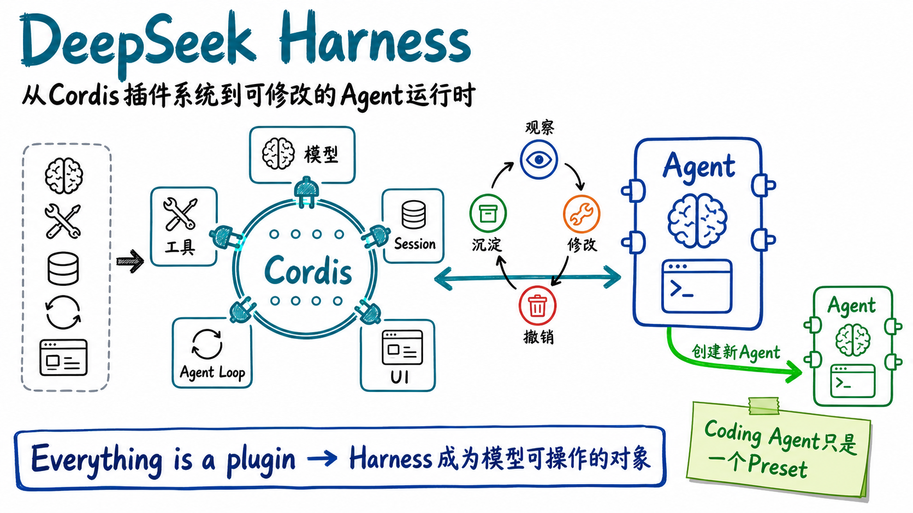


作为一名Harness Builder，最近很受伤。前几天跟一位做Harness同学聊了聊，深感近一两年做的很多东西都被模型后训练扫进了垃圾堆：LSP、Code Knowledge Graph、类Superpower的开发流程、各种skill。

最近也在看Harness自进化，恰巧8月13日，DeepSeek也发布了自己的[DeepSeek Harness](https://github.com/deepseek-ai/deepseek-harness)。各种群里又找到了今年CC代码泄露那次过年的感觉。项目的GitHub Star增长基本是一条竖线。

本来以为是DS自己的Coding Agent，结果项目拿到后，体验一番终于明白了：好家伙，这是Harness自进化的研究平台。以后我的工作也转向Harness Meta-Builder了，思考构建出一套能够持续产生更好Harness的系统。

X和知乎的评价很分裂：架构党兴奋于**Everything is a plugin**，体验党则嫌它文档薄、门槛高，不如CC、Codex和OpenCode好用。分歧来自评价对象不同：前者看到的是Agent运行时，后者期待的是成熟的Coding产品。

这套架构也和团队背景对得上。负责人[崔添翼](https://github.com/tianyicui)在Jane Street做过多年量化系统；Cordis作者[Shigma](https://github.com/shigma)也是QQ机器人框架[Koishi](https://github.com/koishijs/koishi)的作者，现在已经加入DeepSeek。Cordis在仓库创建后的第二天就被完整引入，甚至早于第一个Agent Loop。

下面从Cordis和两组实验出发，看看DSH为什么不同于Codex、OpenCode，以及模型如何开始修改自己的运行时。

## 一、先看全景：Agent Loop也是插件

DeepSeek把DSH的架构概括为**Everything is a plugin**。Literally Everything：模型适配器、工具注册表、System Prompt、Session、Agent Loop和Web界面，全部由Cordis插件提供。

通用的Agent框架的核心是一个固定的react loop循环：接收消息，请求模型，发现工具调用，执行工具，把结果塞回上下文，再进入下一轮。模型、工具和各种控制逻辑围绕这个循环组装；要改变Agent的构成，通常需要修改启动代码，改变核心流程则要直接修改Loop。

DSH保留了这条基本执行链，但把Loop本身、模型、工具以及介入执行过程的策略都交给Cordis装配。下面是从基础Bundle和标准Preset中截取的一组典型配置：

```yaml
# Host层：Agent Loop也是插件
- id: agent-loop
  name: '@deepseek-ai/dsh-agent-loop'
  config:
    agents: []

# Agent层：Preset决定这个Agent拥有哪些工具
- id: tool-bash
  name: '@deepseek-ai/dsh-tool-bash'
  disabled: !!js process.platform === 'win32'

- id: tool-pwsh
  name: '@deepseek-ai/dsh-tool-pwsh'
  disabled: !!js process.platform !== 'win32'

- id: tool-fs
  name: '@deepseek-ai/dsh-tool-fs'

- id: tool-fs-search
  name: '@deepseek-ai/dsh-tool-fs-search'
```

**DSH最大的特点不是插件很多，而是组成Agent的主要部分也可以被重新组合。**

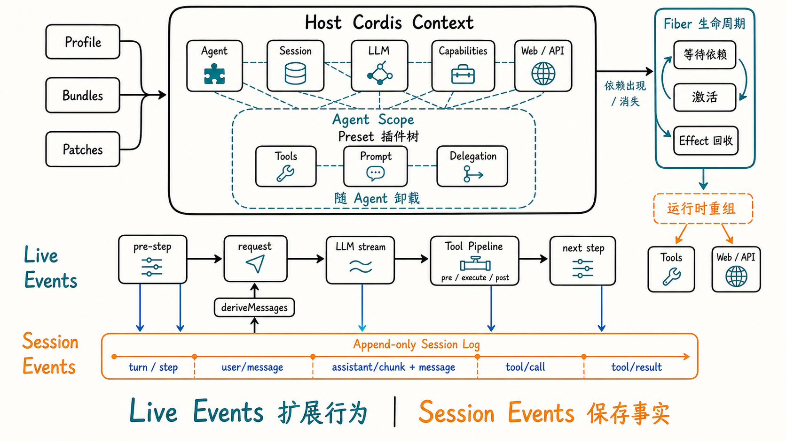

- **Host运行时**：Profile选择Bundles和Patches，组装出LLM、Session、Agent、文件系统、Web和API等共享能力。

- **Agent作用域**：每个Agent再挂载自己的Preset插件树。工具、Prompt和委派策略只对当前Agent生效，并随它一起卸载。

- **两类事件**：Live Events介入`pre-step`、模型请求和工具执行；Session Events保存用户消息、模型输出和工具结果，并投影出下一次请求的上下文。

- **运行时重组**：Cordis用Fiber管理插件的依赖和副作用。一个插件挂载时可以增加工具、事件监听器和界面，停止时再把这些能力一起撤销。

这种差异不只是把组装方式从代码换成配置。以工具超时为例，常见实现会直接修改Agent Loop：

```typescript
// agent-loop.ts
for (const call of response.toolCalls) {
  const result = await runWithTimeout(
    () => executeTool(call),
    30_000,
  )
}
```

此时Agent Loop知道工具需要超时。增加重试、审批和日志，也要继续修改这条执行路径。

DSH的Agent Loop里没有工具超时分支。`timeout-policy`插件从外部包裹`tools/execute`：

```typescript
// timeout-policy plugin
ctx.on('tools/execute', async (exec, next) => {
  return runWithTimeout(
    () => next(),
    ctx.tools.get(exec.name).timeoutMs,
  )
})
```

两段代码的超时逻辑没有本质区别，区别在于谁需要知道它。第一段由Agent Loop负责；第二段中，`next()`代表原本的工具执行，Loop不需要知道外面包了哪些策略。加载timeout插件就获得超时控制，卸载后也不需要修改Loop或工具。重试、审批和埋点都可以用同样的方式并列加入。

所以**Everything is a plugin**并不是说DSH提供了很多扩展点，而是说**DSH自己也由这些扩展点组成**。

但让插件注册功能并不难，真正困难的是卸载。一个插件可能同时增加工具、事件监听器和定时器；只要漏掉一项，它虽然已经停止，仍会有一部分逻辑留在运行时中继续工作。这正是Cordis要解决的问题。

## 二、Cordis：运行时如何热插拔

开头提到的Shigma，此前长期维护QQ机器人框架Koishi。Cordis是他从插件系统中发展出来的TypeScript运行时，DSH用它组合模型、工具、Session和Agent Loop。

运行时执行一段新代码并不难。真正决定插件能否热插拔的，是这段代码离开以后，运行时能否恢复原状。一个插件可能同时注册工具、监听事件和启动定时器；少撤销其中一项，就会留下失去所有者的状态。

Cordis把插件产生的这些改变称为Effect，并全部归到当前Fiber下面：

```typescript
export const inject = ['tools']

export function apply(ctx) {
  ctx.tools.register(myTool)
  ctx.on('tools/execute', listener)
  ctx.effect(() => {
    const timer = startTimer()
    return () => stopTimer(timer)
  })
}
```

`ctx.plugin()`加载插件时创建Fiber，工具、事件监听和定时器都登记在它下面。销毁Fiber，Cordis就按照相反顺序执行清理函数，把插件造成的改变一起撤销。

Fiber还会跟踪插件声明的Service依赖。依赖不存在，插件等待；依赖消失，已有Effect被回收；依赖恢复，插件重新激活。Context则限制这些能力在哪个作用域可见，保证单个Agent加载的工具不会泄漏到其他Agent。

这就是Cordis所说的**时空可组合性**：Context决定能力在哪里生效，Fiber和Effect决定它在什么时候生效。

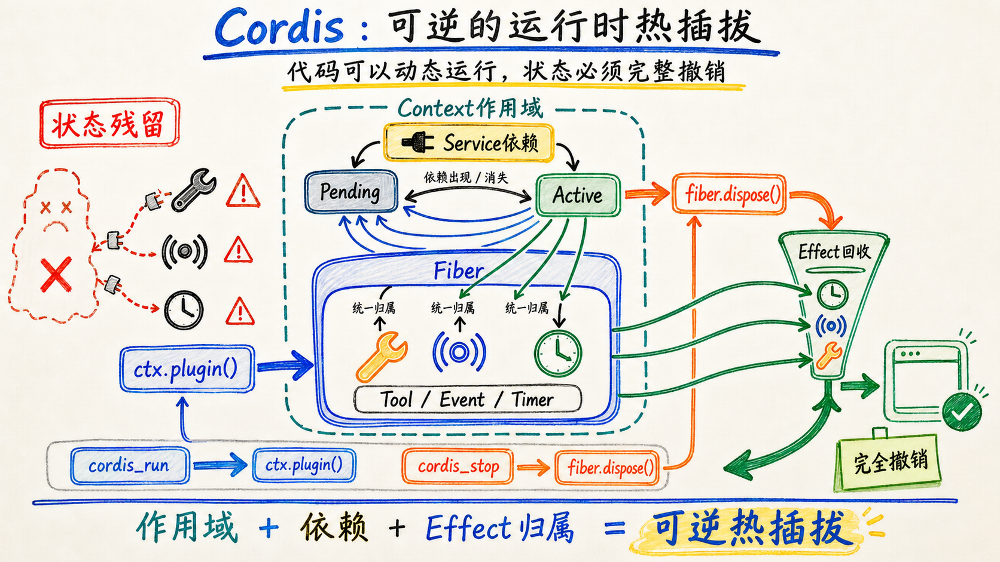

在DSH中，动态加载和卸载最终对应两个动作：

```text
cordis_run  → ctx.plugin()    → 创建Fiber
cordis_stop → fiber.dispose() → 撤销Effect
```

模型调用`cordis_run`，工具、事件或者界面可以立刻出现在当前运行时；调用`cordis_stop`，这些能力随Fiber一起消失。

**Cordis的关键不是让代码在运行时执行，而是让代码对运行时造成的改变可以被完整撤销。可逆，才使热插拔成为一种可靠的系统能力。**

## 三、创造模式：把运行时交给模型

上一章说明了Cordis可以动态挂载插件，但普通Agent不会因此自动修改自己。还差一个关键条件：模型必须能够读取当前运行时，并且调用挂载和卸载插件的接口。

DSH把这组能力做成了一个单独的Agent Preset，中文名叫**创造模式**，内部ID是`cordis`。它完整保留标准模式的Coding能力，在此基础上增加运行时检查、动态插件实验和Preset创作指导。配置文件对它的定位很直接：让一个Agent可以创作另一个Agent。

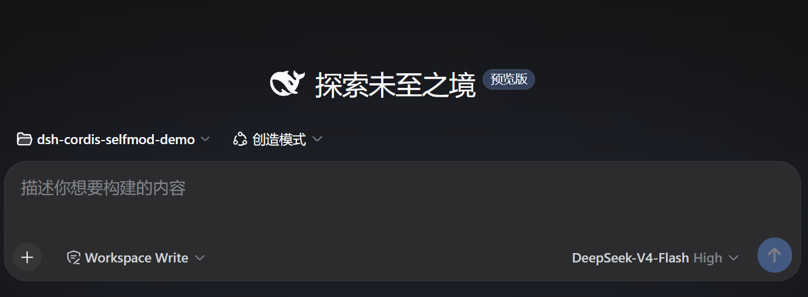

创造模式比标准模式多了一组操作Harness的元工具：

- **`cordis_inspect_*`**：读取当前运行时。

- **`cordis_define`**：保存模型写出的新Package。

- **`cordis_run`**：把指定Package挂进运行时。

- **`cordis_stop` / `cordis_undefine`**：停止插件或删除定义。

四组工具组成了**检查—定义—运行—撤销**的完整闭环。

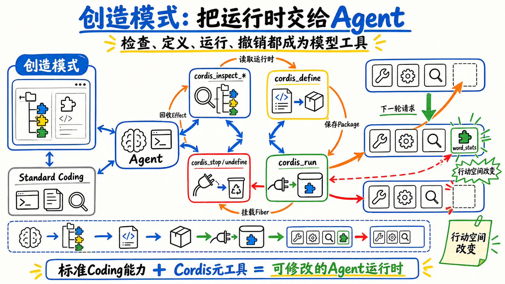

为了看清创造模式如何改变Agent，下面设计了一个最小实验：项目中只有一份中英文混合的`sample.md`，当前Agent没有字数统计能力。让模型现场创建`word_stats`工具，下一轮调用它统计文件，最后再停止插件。工具如果能够出现、被调用并再次消失，就说明**定义—运行—撤销**这条链路确实有效。

第一轮，创造模式定义了一个仅包含Host half的插件，并把`word_stats`注册进自己的工具列表。

模型先检查当前运行时提供的注册接口，再定义Package并运行插件。最终得到Plugin `words-1`、Package `pkg-1`和Run `run-1`。`cordis_inspect_self`显示状态为`running`，工具目录中也已经出现`word_stats`；左下角的Cordis面板同时显示`1 running`。

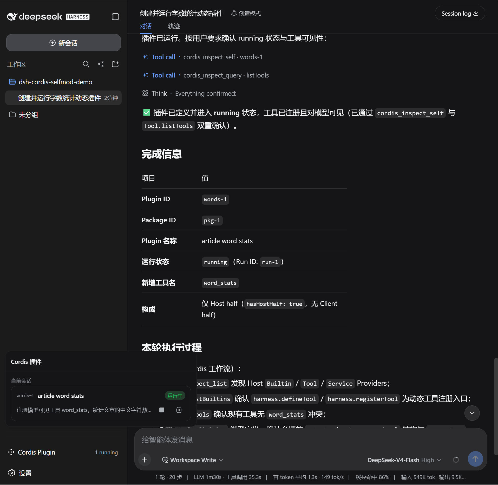

整个过程没有修改项目文件，也没有重启DSH。下一轮请求重新组装工具列表后，模型已经可以像调用内置工具一样调用`word_stats`：

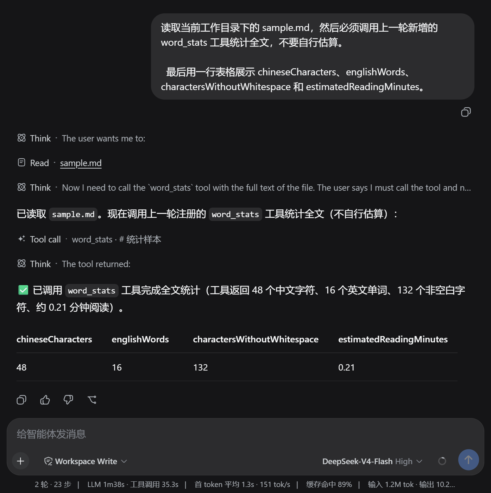

工具返回了48个中文字符、16个英文单词、132个非空白字符，预计阅读时间0.21分钟。统计结果本身并不重要，重要的是模型上一轮写出的代码，已经进入这一轮可以选择的行动空间。

最后一轮调用`cordis_stop`。插件状态变成`stopped`，Package定义仍然保留，可以再次运行；但对应Fiber已经被销毁，`Tool.listTools`中不再存在`word_stats`，左下角的状态也从`1 running`变成`0 running`。

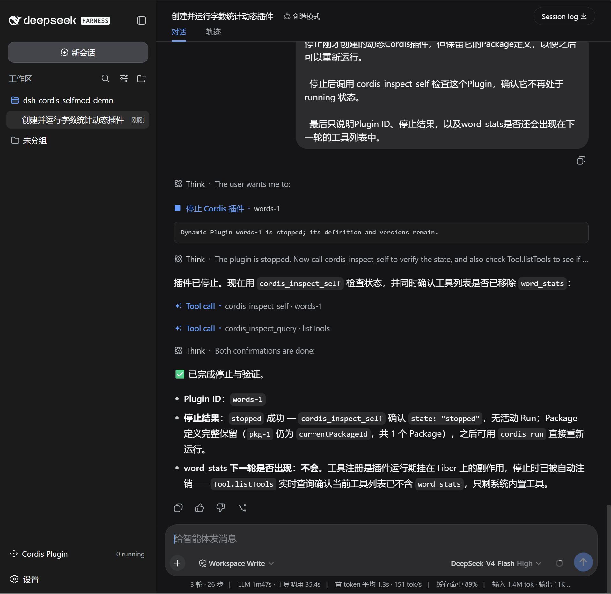

创造模式完成的闭环是：

```text
cordis_define → 保存一个不可变Package
cordis_run    → 创建Fiber，注册word_stats
下一轮请求    → 模型看到并调用word_stats
cordis_stop   → 销毁Fiber，word_stats消失
```

创造模式把Agent从工具的使用者变成了工具集合的作者。它仍然不是永久的自我进化：动态Package只存在于当前DSH进程的内存中，不会修改源码、配置文件或者自动跨重启恢复。更准确地说，这是一次**运行时自重组**：Agent没有改写自己，却改写了下一轮的行动空间。

## 四、让一个Agent创建另一个Agent

`word_stats`只改变了当前运行时。停止插件或者重启DSH，这项能力就会消失。创造模式还可以把一次有效的组合保存下来，让之后的会话直接以一个新的Agent启动。

实验项目保持不变，只让创造模式创建一个**文档审阅模式**。这个Agent保留文件读取、搜索和Skills，去掉Shell、后台任务、计划、子代理等无关能力，并获得一套专门审阅技术文档的工作方式：先给核心判断，再指出值得保留的内容、具体问题和更紧凑的改写。

完成后，创造模式还会试装一次这套组合，确认它能够被新会话正常加载。整个过程由模型完成，不需要手工编写插件或者修改DSH源码。

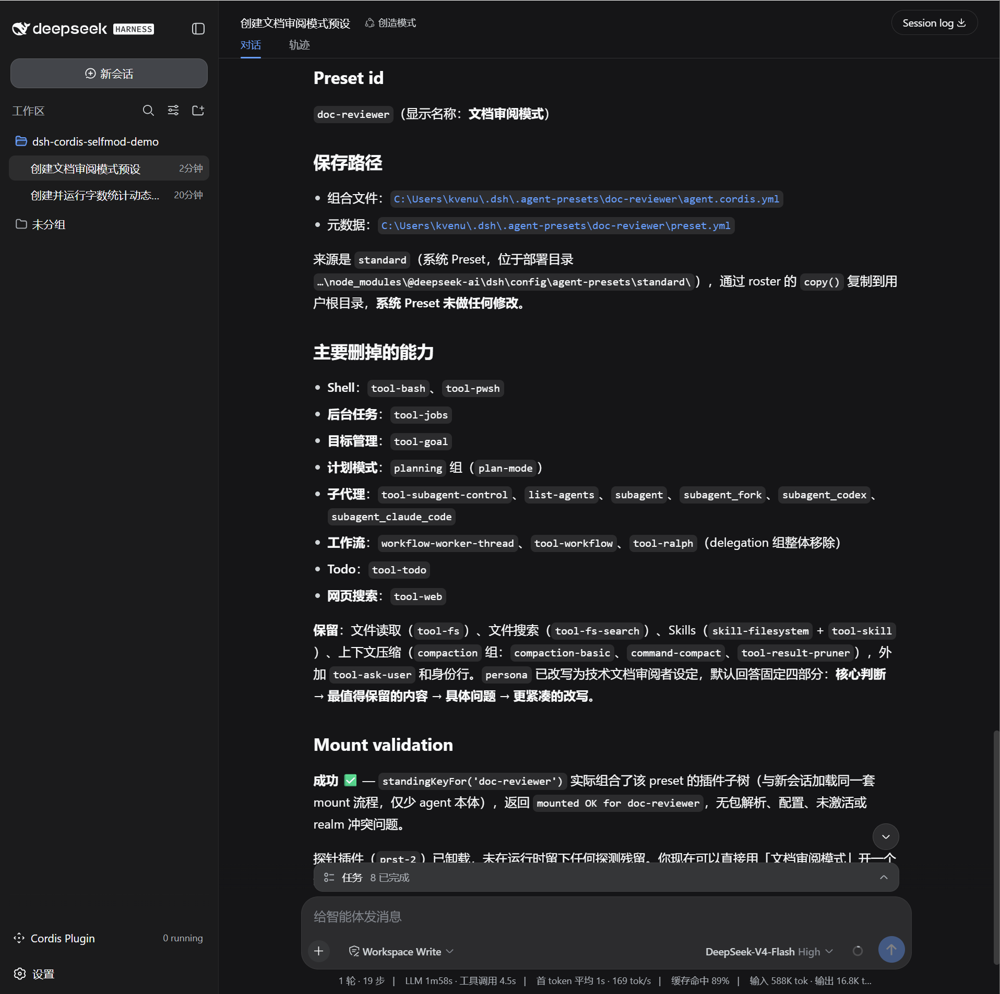

不需要重启DSH，刚刚创建的**文档审阅模式**已经和标准模式、极简模式、创造模式并列出现在新会话的选择器中：

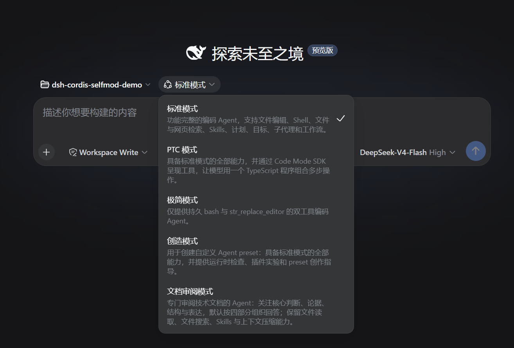

已经开始工作的会话不能中途更换Agent，因为它的历史里可能包含新Agent没有的工具。新组合只交给空白会话使用，原来的会话不受影响。

在新会话中输入一句**审阅一下`sample.md`，不要修改文件**，模型读取文件后，自动按照预先设定的结构给出判断、问题和改写：

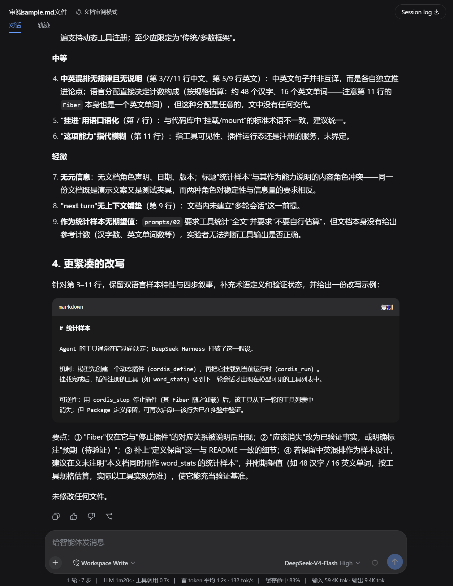

这和上一章有一个关键区别。动态插件是当前Agent为了完成眼前任务临时增加的能力；Preset则把有效的工具组合和工作方式保存下来，交给未来的会话反复使用。

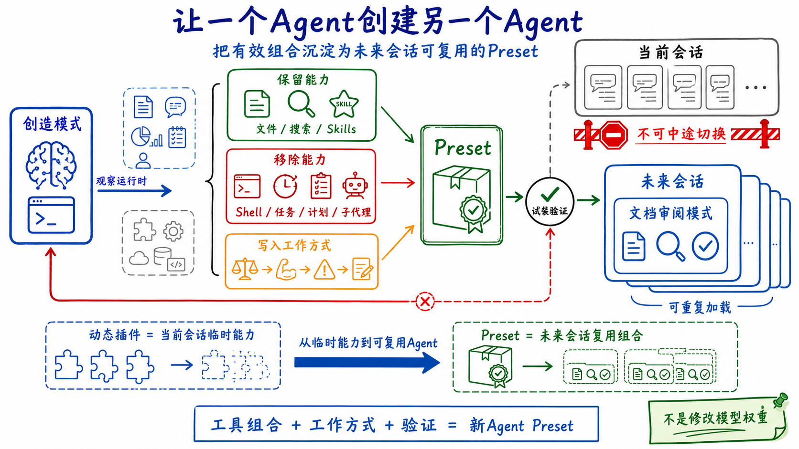

DeepSeek作为模型公司做这件事，可能是在押注模型能力的增长最终会超过人工编写Harness的速度：未来的通用Agent可以根据任务，临时创建研究、编码、测试或审阅Agent，为它们选择必要的工具和上下文，再把有效组合保存下来。这里变化的不是模型权重，而是模型外面的执行环境；沙箱和权限仍由Host控制，但Harness开始能够和模型一起进化。

## 五、DSH并不是Another Coding Agent

一个Agent要运行，至少需要模型、上下文与状态、工具、执行循环以及介入执行过程的策略。比较Agent框架，关键不是它能安装多少插件，而是这几部分由谁拥有、谁有权替换。

[Codex](https://developers.openai.com/)和[OpenCode](https://opencode.ai/docs)的定位，都是**可扩展的Coding Agent**。Codex可以通过Skills、MCP和插件增加工作流、工具与界面；OpenCode还允许插件修改Agent配置、拦截模型请求和工具执行。但这些扩展都运行在产品已经定义好的核心之上：核心负责Session、状态和Agent Loop，插件通过它开放的接口工作。OpenCode甚至明确不向插件暴露私有Core服务。

DSH的定位更底层：**Agent的运行时和组装系统**。模型适配器、工具注册表、Session Log和Agent Loop都由Cordis插件组成，Preset再从这些能力中组装出具体Agent。标准模式只是DSH附带的第一个Coding Agent，极简模式、创造模式和文档审阅模式都是同一运行时上的其他组合。所谓**Everything is a plugin**，重点不是插件多，而是**构成系统的组件和后来加入的扩展使用同一种机制**。

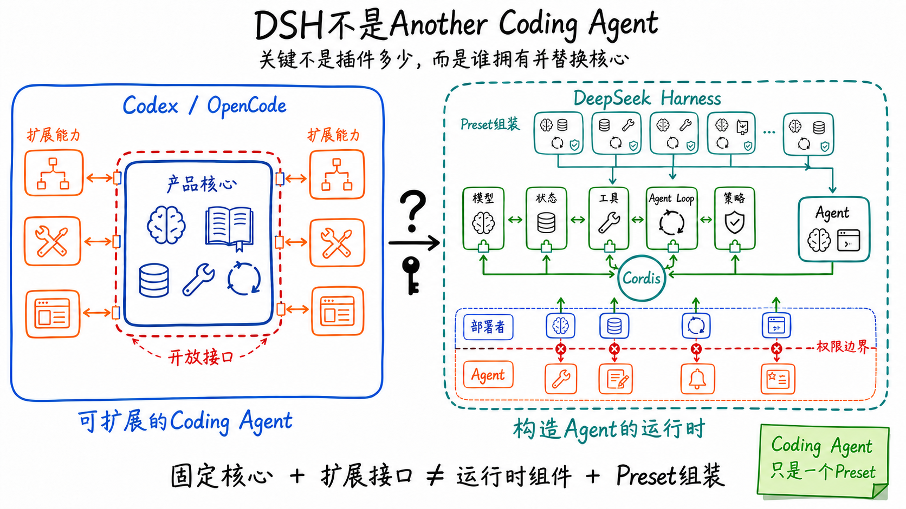

当然，OpenCode是开源的，开发者也可以直接修改它的核心代码。但修改源码、重新构建一个产品，与在运行时的组合中替换一个组件不是一回事。前者创建了一个新的OpenCode分支；后者仍然是DSH支持的正常运行方式，可以继续被加载、卸载和重新组合。

这套可组合性又分为两个层次。部署者可以通过Profile和Bundle改变Host使用的模型、存储、Loop与界面；Agent只能修改自己作用域内的工具、Prompt、事件和Preset，不能自行放宽沙箱、审批和会话存储。前面实验中的创造模式最特殊的地方，是它把后一层组合能力直接变成了模型可调用的工具：模型不仅使用插件，还能检查自己所在的运行时、挂载新能力，再把有效组合保存成另一个Agent。

所以三者真正的产品单位不同。Codex和OpenCode交付的是一个可以继续扩展的Coding Agent；DSH首先交付的是一套构造Agent的运行时，Coding Agent只是它随附的一种Preset。这也解释了发布后的两极评价：作为日常Coding产品，DSH目前确实更粗糙；作为允许模型参与组装Agent的底层系统，它讨论的已经不是如何再加一个工具，而是谁来决定Agent最终长成什么样。

## 六、Harness开始自演进

前面两组实验已经拼出了Harness自演进的基础：模型可以观察当前运行时，生成并加载新的能力，在效果不好时完整撤销，还可以把有效组合保存成新的Agent。DSH把Harness从一套启动前写死的配置，变成了模型能够操作的对象。

如果把**演进**拆开，需要的无非是三件事：产生变化、选择更好的变化、把结果保留下来。创造模式负责生成插件和Preset，Cordis负责运行与撤销，Preset负责沉淀。再接上一套任务评价，整个闭环就会变成：

```text
观察当前Harness
→ 生成新的工具或Agent组合
→ 在真实任务中运行
→ 根据结果评价
→ 保留有效组合，撤销失败组合
→ 继续生成下一代Harness
```

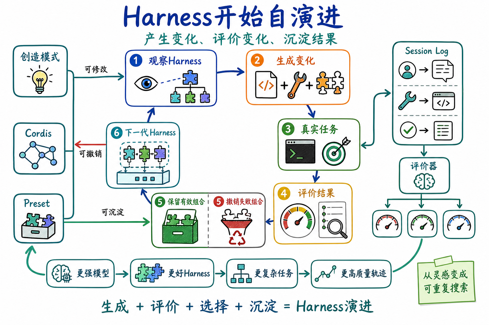

Session Log已经记录了模型请求、工具调用和执行结果。未来的评价器可以从这些轨迹中判断：新的工具是否减少了错误，新的Agent分工是否提高了完成率，新的Prompt是否用更少的步骤得到更好的结果。届时，模型修改Harness不再是一次性的灵感，而会成为可以重复搜索的过程。

后训练越强，这个循环越容易成立。更强的模型能够设计更好的工具和工作流程；更好的Harness又能完成更复杂的任务，产生质量更高的执行轨迹；这些轨迹进入下一轮训练后，新模型再回来设计更好的Harness。模型与Harness不再分开迭代，而是进入同一个反馈循环。

DSH已经为这个方向准备了可观察、可修改、可撤销和可沉淀的运行时。它现在展示的是模型参与设计Harness的起点，而这条路线在AI历史上已经出现过一次极其相似的变化。

## 结语：从AlphaGo到AlphaZero

最初的AlphaGo先学习大量人类棋谱，再通过自我对弈继续提升。它击败了李世石，但起点仍然是人类几千年积累的围棋知识。

一年后的[AlphaGo Zero](https://www.nature.com/articles/nature24270)去掉了人类棋谱和手工棋类特征，只保留围棋规则，从随机落子开始与自己对弈。三天后，它以100比0击败了战胜李世石的那一版AlphaGo。之后的[AlphaZero](https://deepmind.google/blog/10-years-of-alphago/)又把同一种方法扩展到国际象棋和日本将棋：不再由各个领域的专家分别教它如何下棋，而是让同一个系统从规则和胜负中自己寻找策略。

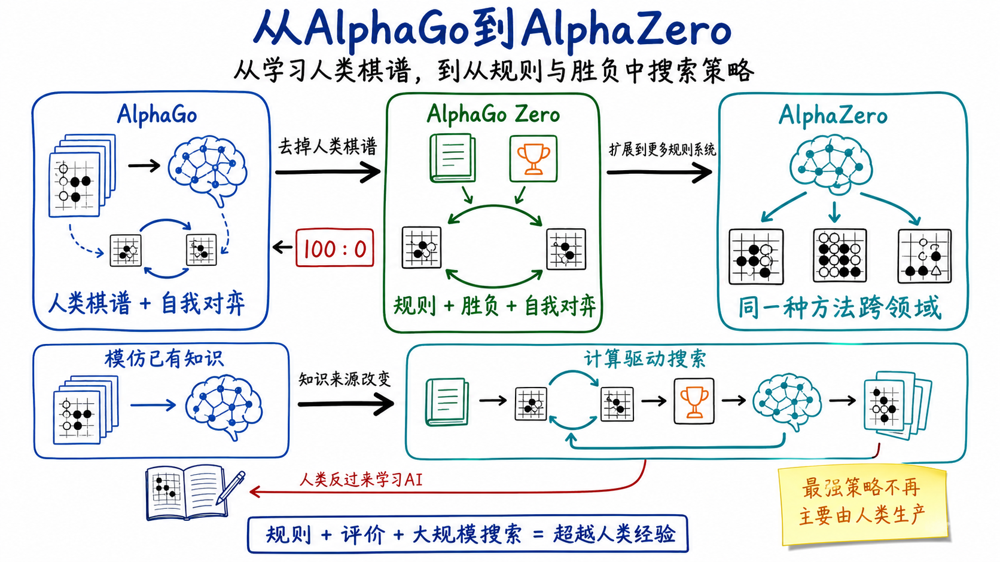

人类当然还在下围棋，但最强棋艺的主要生产者已经不再是人类棋手。职业棋手开始反过来研究AI棋谱，学习那些传统理论没有提供的落子。人可以复盘某一步为什么有效，却很难把支撑全部决策的搜索过程重新整理成一套完整的人类棋理。

今天的Coding Agent仍然很像最初的AlphaGo。它学习人类写下的代码、文档、Code Review和软件工程流程，再尽可能模仿一个优秀工程师。如果模型能够自己创建工具、安排Agent分工、运行大量任务并根据结果筛选，下一步学习的就不只是**人类如何编程**，而是**还有什么方法可以生产软件**。

代码和文章比围棋困难得多。围棋有确定的规则和胜负，现实任务的好坏却需要测试、形式化验证、用户反馈和真实业务结果共同定义。谁能建立可靠的评价环境，谁才可能让Harness从随机修改走向持续演进。

Sutton在[《The Bitter Lesson》](https://bitterlesson.ai/)中说：七十年来人工智能研究最大的教训，是那些试图利用人类先验知识——例如语法规则和手工特征——的方法，最终都会被利用海量数据和庞大算力的通用方法所击败。

这条规律对Harness的启发是：不要基于人类先验知识的理解去设计Harness。未来的工程师可能不再直接写出每一个工具、Prompt和工作流程，而是定义目标、评价标准与安全边界，让模型通过大量执行寻找更有效的生产方法。

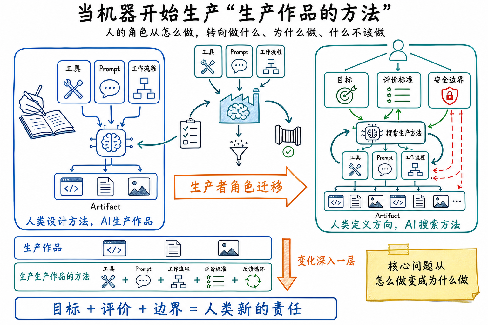

过去，人类生产代码、文章和设计，积累出经验用于指导AI学习这些Artifact。接下来，AI可能开始重写生产它们的流程。人类逐渐失去的将不只是对某段代码、某篇文章的理解，还包括对整套生产方法的完整解释和控制。AlphaZero没有让人类停止下棋，但它已经让人类不再是最强棋艺的生产者；Harness的自演进也不会让人类停止编程，却可能让**如何编程**不再主要由人类定义。

当机器不仅生产作品，还开始生产**生产作品的方法**，人类面对的核心问题将从**怎么做**转向**要做什么、为什么做，以及什么不该做**。生产者这个角色，正在一点点从人类头上被摘下来。

**一起当哲学家吧。**
