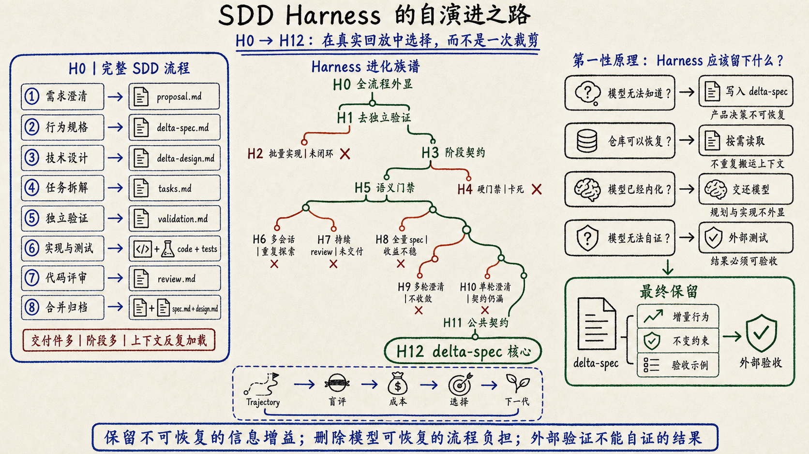
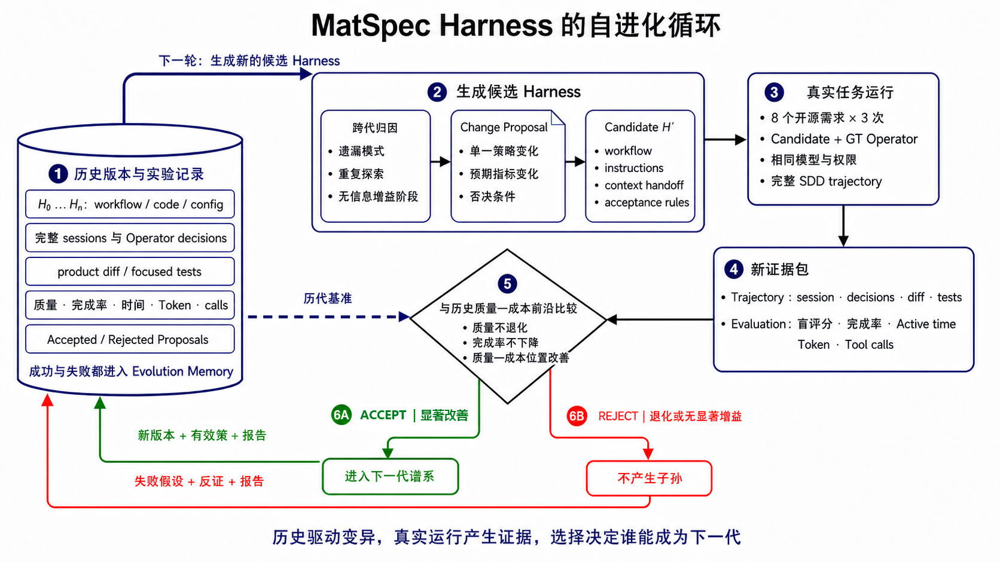
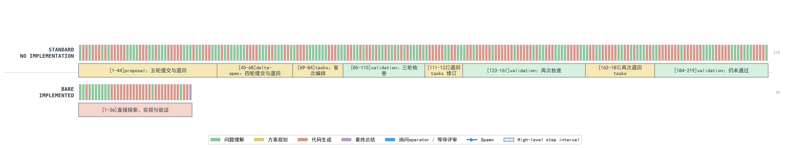
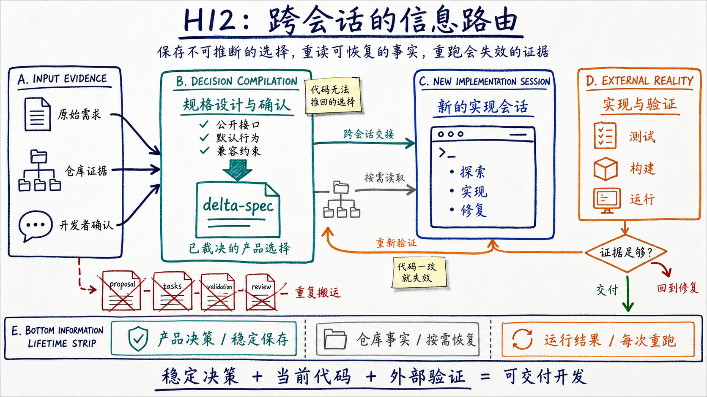
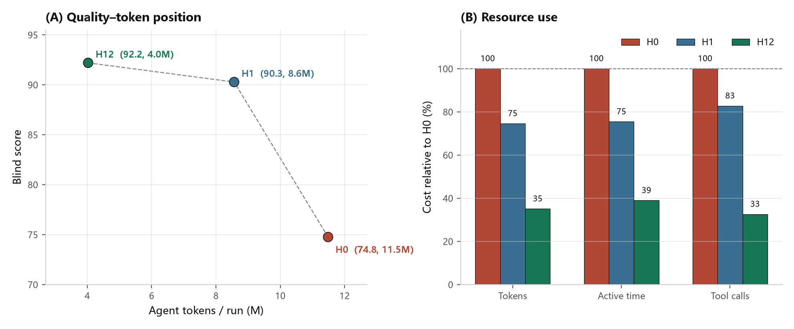
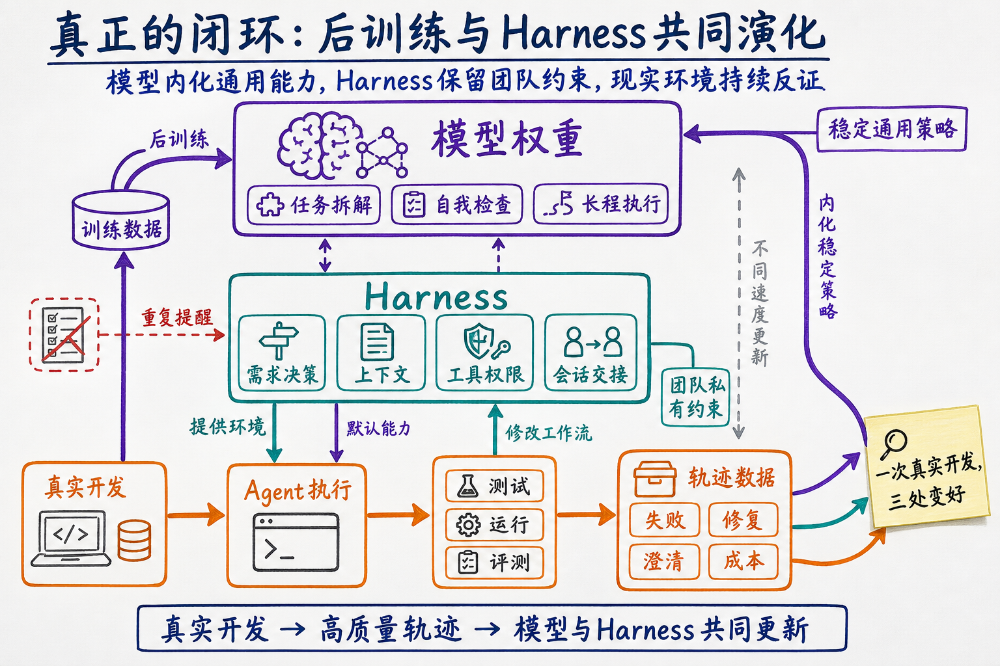

从GPT-5.5开始，我写代码时关注的东西慢慢变了。

以前我会花很多时间告诉Agent应该怎么做：先看哪些文件，怎么拆任务，什么时候写测试，做完以后再检查什么。现在我更关心的是另一件事：**怎样给它设置一个可以自我闭环的验证环境**。测试怎么复现，失败怎么判定，修复后重新跑什么，哪些结果才算真的完成。把这些边界设好以后，我会让Agent自己迭代，直到它拿出可以被外部证据支持的结果。

最近有人把这种方式叫作Loop Engineering。我对这种不断造概念的习惯一直比较警惕，AI Coding圈尤其擅长把正在发生的工程实践重新包装一遍。不过概念可以不追，变化本身很难忽略：模型的执行能力越强，人越不需要逐步指挥它，**验证闭环的设计反而越来越重要**。

GPT-5.6发布以后，这种感觉更强烈了。

我自己一直在做类似LSP的程序分析工具，希望通过调用链、符号关系和代码结构，增强Agent探索大型仓库的能力。很多结论在前一代模型上还成立，到了GPT-5.6却突然失效。它有时只靠 `rg` 和 `read`，就能把一个复杂仓库里的调用关系和修改位置摸得八九不离十。相比之下，我辛苦做出来的一些调用链分析，突然显得有点花里胡哨。

坦白说，这件事让我很沮丧。因为我一直把自己定位成一个Harness Builder，而模型强大的后训练正在直接吃掉Harness的工作。你今天辛苦固化下来的搜索策略、任务拆解和审查规则，下一代模型可能已经在训练里学会了，而且做得更自然。

Superpowers的变化也很典型。GPT-5.5之后，我已经很少完整使用它；到了GPT-5.6，一套强制展开的完整流程有时甚至会产生负优化。模型本来已经理解了问题，却又被拉去重复brainstorm、plan、TDD和多轮review，最后反而被冗余上下文和阶段切换搞得晕头转向。上一篇文章已经专门讨论过这件事，这里不再展开。

如果模型会不断吃掉Harness已有的能力，Harness Builder应该怎么办？继续往里面加规则，努力证明每一个阶段仍然有用，这条路走不长。更合理的选择，是承认Harness也有保质期，把它当成一个可以被观测、修改、评测和淘汰的工程对象。

我在鸿蒙社区正好维护着一套SDD Harness，叫MatSpec。它已经有真实工作流，也积累了H0、H1等多轮实验轨迹，很适合拿来做这次尝试：让Agent读取失败轨迹和成本数据，修改Harness，再用真实开源任务、聚焦测试和双盲评审决定修改能不能留下。

前几天看到Lilian Weng回归OpenAI，我顺手打开了她的博客，发现她最近也在研究 [Harness自进化](https://lilianweng.github.io/posts/2026-07-04-harness/)。这就有点巧了。她把Harness的优化写成一条逐渐外扩的链：从prompt、结构化上下文和工作流，一直延伸到Harness代码，最后再到修改Harness的优化器。她还强调，模型越强，越应该减少重复模型能力的固定启发式；但外部上下文、工具、目标和评测仍然要留在系统里。

这篇文章记录了一次已经跑完的工程实验。我把MatSpec交给四类相互隔离的Agent：Candidate Agent负责开发，掌握Ground Truth的Operator Agent模拟需求开发者，Evolver Agent根据真实trajectory修改Harness，Blind Judge Agent只看匿名交付物并决定候选版本能不能通过。它们共同运行付费实验，但不能互相读取隐藏材料。

最后留下来的Harness反而更简单。下面这张图展开 `H0–H12` 的完整实验谱系：左侧是早期Harness外显的八阶段流水线，中间保留每个候选的遗传或淘汰关系，右侧给出当前版本收敛出的最小接口。



|指标|早期H0|最终H12|变化|
|---|---:|---:|---:|
|盲评分|74.75|**92.19**|**+17.44**|
|工作流完成率|18/24|**24/24**|**+6次完整交付**|
|Active time / run|44.30分钟|**17.24分钟**|**−61.1%**|
|Token / run|11.49M|**4.03M**|**−64.9%**|
|Action tool calls / run|148.7|**48.4**|**−67.4%**|

起点H0用了Bare约五倍的Token，平均分提升不到2%；最终H12相对H0提升约23%，也让24次运行全部走到交付。这个结果来自对固定阶段的持续删除和重组：**自进化让Harness主动交还模型已经具备的能力**。

这些是固定八任务诊断集上的跨批次描述性结果。H12展示了演化终点；接下来要回答的是：哪些规则被删掉，哪些信息留下，以及这些修改如何被同一套外部证据接纳或淘汰。

## 什么叫Harness自进化

先把概念说清楚。Harness是包围模型、决定一次任务如何发生的那层系统，范围远大于一段系统提示词：

- 模型在什么时候读取什么上下文；
- 要生成哪些中间产物；
- 什么时候允许写代码；
- 哪些问题要交给外部角色澄清；
- 测试、审查和失败如何回流；
- 哪些证据决定接受或拒绝一次修改。

因此，随手修改prompt还算不上Harness自进化。更基础的问题是：**工作流规则是否带来新信息**？

只看最终分数不够。Harness可能通过多跑测试、延长review，甚至改变任务和评测标准来制造“进步”。如果把问题拆到底，一个可信的自进化闭环至少需要三件事：固定问题，保留过程，让候选版本接受同样的外部验收。

这四类角色运行在彼此隔离的会话中。Candidate不能读取Ground Truth，Operator不能泄露参考补丁，Evolver不能修改任务和评测器，Judge也看不到候选来自哪一代Harness。

```text
符号
Hₜ：第t代Harness
D ：固定的真实开发任务集
E ：固定的外部验收证据，包括Ground Truth、聚焦测试、盲评标准和成本口径
Tₜ：Hₜ 运行D后产生的轨迹数据，包括提问、决策、文件修改、测试、失败和资源消耗
ΔHₜ：Evolver Agent根据轨迹提出的Harness修改
H′ₜ：应用 ΔHₜ 后、等待回放验证的候选Harness

# ① 观察：让当前Harness完成同一组任务，保存完整过程
Tₜ = Run(Hₜ, D)
# Tₜ 包含提问、决策、文件修改、测试、失败、时间、Token和工具调用

# ② 提出修改：从真实失败和重复劳动中生成一个受限候选
ΔHₜ = EvolverAgent(Hₜ, Tₜ, E)
H′ₜ = Hₜ + ΔHₜ
# 修改范围仅限工作流、指令、上下文交接和验收规则

# ③ 回放与选择：旧版和候选版面对相同任务、相同验收
Hₜ₊₁ = Select(Hₜ, H′ₜ | D, E)
# 候选确实改善质量—成本位置才接受，否则继续保留Hₜ
```

直观地说，第一步先把当前Harness真正跑一遍，观察它在哪里遗漏需求、重复读代码、反复写文档或卡在review。第二步由Evolver Agent根据这些轨迹提出修改，例如删除没有信息增益的阶段，或者改变跨会话传递的上下文。第三步把候选版本重新放回相同任务中：如果测试、盲评分和交付完成率没有改善，哪怕Token看起来更少，这次修改也会被拒绝。



这张图按数据流读，不按“先规划、再开发”的固定阶段读：

1. **历史版本与实验记录**：每一代Harness的workflow、代码与配置，以及完整session、Operator决策、产品diff、聚焦测试、质量、完成率、时间、Token和工具调用，都进入同一个长期记忆。接受过和被拒绝过的proposal一起保留；失败会成为下一轮归因的反例。
2. **生成候选Harness**：Evolver Agent从历史中寻找重复模式，例如某阶段一直没有新增信息、某类任务反复漏需求、某种上下文交接只制造重读。它只提出单一策略变化，写成Change Proposal，再生成候选Harness；任务、Ground Truth、模型权限和评测规则不在它的修改范围内。
3. **真实任务运行**：候选Harness回到八个真实开源需求上运行。Candidate Agent负责交付；Ground Truth Operator Agent读取参考项目并像需求开发者一样澄清问题、审查规格、推动一次完整SDD trajectory，但不泄露补丁、文件路径和隐藏测试。
4. **新证据包**：一次运行的session、决策、diff、测试，以及盲评分、完成率、Active time、Token和工具调用被打包进新证据。它记录实际做过的事，不采信候选对自身效果的描述。
5. **与历史版本比较**：新候选必须同时满足质量不退化、完成率不下降，并在质量—成本位置上形成可验证改善。只省Token、却少完成需求，不能算优化。
6. **选择**：满足条件的候选被接受，携带新版本、有效策略和报告进入下一代谱系；退化或没有显著增益的候选被拒绝，不产生子孙。两种结果都回写历史实验记录，因此下一次变异既能复用有效策略，也能避开已经验证无效的尝试。

图里只有一条真正的自进化闭环：**历史记忆提出受限变异**，**真实任务产生新证据**，**选择把候选接纳或淘汰**，再把结果写回历史。第3步内部是一条完整的SDD开发轨迹，负责提供选择证据。Harness的内容在第2步被修改；它是否能遗传到下一代，取决于第3—6步的外部结果。

这些执行角色都是彼此隔离的Agent会话。Candidate Agent负责开发；Ground Truth Operator Agent扮演知道需求答案的开发者，但不能泄露文件路径、补丁和隐藏测试；Evolver Agent负责归因和修改Harness；两个Blind Judge Agent只对匿名交付物评分。人负责预先固定任务、权限和评测边界，并批准真实付费运行，不在循环中逐条替Agent决定删什么、留什么。

任务、代码起点、模型与推理强度、Ground Truth、评测器和权限边界固定在闭环之外。否则Harness只要把题目改简单、让评委变宽松，分数就能“进化”。

本文围绕三个研究问题展开：

- **RQ1**：H0为何未能将流程成本稳定转化为交付质量？
- **RQ2**：Agent如何从失败轨迹中提出、检验并筛选下一代Harness？
- **RQ3**：进化后的Harness为什么收敛成这种形态？

## 实验对象：一次完整开发轨迹

### 实验设置与控制变量

| 项目         | 固定设置                                                                                                  |
| ---------- | ----------------------------------------------------------------------------------------------------- |
| 执行工具       | Codex CLI 0.145.0；所有角色运行在相互隔离的会话与 `CODEX_HOME` 中                                                      |
| 模型         | GPT-5.6 Terra，推理强度High                                                                               |
| MatSpec版本 | H0 / H1历史实验固定在 `matspec-community 0.4.1-beta.3`、commit `8a6f159`；H12实现对应commit `7290445` |
| 任务与代码起点    | 八个已经合并的真实开源需求；每次从对应变更发生前的固定commit开始                                                                 |
| 候选权限       | 关闭网络和Web，移除远端与可浏览Git历史，只允许使用本地仓库和共同缓存的依赖                                                           |
| 重复次数       | 每个任务、每个条件独立运行3次                                                                                     |
| 需求交互       | Operator Agent可读取Ground Truth与参考项目，只能回答产品行为并审查SDD产物；Candidate Agent不可直接访问这些材料                   |
| 外部评测       | 相同聚焦测试；相同100分行为评分表；每个匿名候选由两个全新Judge Agent会话独立评分                                                   |
| 成本口径       | 计入被测规格与实现会话及其可归因子会话；Operator、Evolver和Judge的时间与Token单列，不计入Harness的单次运行成本                        |

同一对照内，任务、代码起点、模型、推理强度、权限、Operator协议、停止规则和评测配置保持一致。实验只改变MatSpec工作流或项目级全量规格条件，排除题目、模型和评审尺度带来的解释。

实验使用八个已经合并的真实开源需求。每个任务都从对应变更发生前的固定commit开始，覆盖Python、JavaScript、Go和Rust，包含CLI、配置解析、插件加载、类型系统、终端安全、ORM约束、异步执行器和协议协商。

|任务|主要系统边界|
|---|---|
|GitHub CLI字段选择|CLI参数、API数据、过滤和表格输出|
|ESLint自定义错误类|配置schema、AST分析、继承关系和诊断|
|pytest插件入口|环境变量、插件发现、加载顺序和去重|
|pytest配置类型表达式|类型声明、不同配置来源、转换和文档|
|bat终端输入净化|字节流、安全边界、兼容性和失败处理|
|SQLModel参数冲突|公开API、参数组合、错误语义和兼容性|
|Axum自定义执行器|异步任务、连接生命周期和优雅关闭|
|Prometheus UTF-8协商|协议协商、转义规则和旧格式兼容|

评测同时记录产品盲评分、聚焦测试、工作流是否完成、Active time、Token和action tool calls。Ground Truth Operator是模拟需求开发者的独立Agent，它的消耗单列，不计入被测Harness的主要成本。

所以实验单位覆盖从需求输入到交付结束的一整条trajectory，最终diff只是其中一部分。

## RQ1：H0为何未能将流程成本稳定转化为交付质量

> **RA1**：H0把软件工程里的每个合理动作都外显成固定阶段。强模型已经内化的规划与自检被Harness再执行一遍；缺失的产品决策也没有整理成稳定的跨会话交接物。**起点问题出在Harness与模型的分工**。

`H0` 是MatSpec最早可复核的实验工作流：

```text
proposal
  → 本次变更的增量规格（delta-spec）
  → 本次变更的增量设计（delta-design）
  → tasks
  → 与项目级全量规格基线做validation
  → implementation
  → review
  → finalization / archive
```

每一步在传统软件工程里都有理由，但强模型已经具备代码搜索、局部规划、实现、测试和自检能力。Harness再要求它把同一个问题分别翻译成proposal、规格、任务、validation、实现说明和review，增加的不一定是新信息，也可能只是同一信息在不同文档和会话之间搬运。

Bare作为外部参照，不参与Harness的版本演进。同一个强模型拿到原始需求后，不加载SDD工作流，直接探索仓库、实现并验证。

|条件|盲评分|完成率|Active time / run|Token / run|Action tool calls / run|
|---|---:|---:|---:|---:|---:|
|Bare，仅原始需求|73.54|—|8.14分钟|2.22M|—|
|H0，有项目级全量规格基线|74.75|18/24|44.30分钟|11.49M|148.7|

与Bare相比，H0的平均分提升不到2%，Token和时间都超过五倍，24次运行仅18次完整交付。**流程纪律没有稳定转化为产品质量**。

H0的大量预算消耗在跨阶段协调上，产品不确定性没有得到同等投入。pytest配置类型表达式的一次运行把这种成本展开得很清楚。

这次H0运行留下219个解析后的trajectory step。step与Token采用不同口径，也不能直接等价为有效工作量，但可以显示工作在阶段之间如何分布：



轨迹可视化显示，H0运行在proposal上往返五轮、delta-spec四轮，随后三次进入validation、两次被退回tasks，最终仍未进入implementation；同任务的Bare对照用36个step完成探索、实现与验证。这条失败轨迹与聚合结果中24次仅18次完整交付相互印证：额外流程增加了成本，也消耗了走到代码与测试之前的完成预算。

早期轨迹里反复出现三类开销：

1. **同一事实被多种产物重写**。 proposal、增量规格、tasks和validation都要重新描述需求边界。
2. **长会话持续背负历史上下文**。 后期一次简单测试，也会携带此前的探索、文档和工具输出。
3. **新会话又从零恢复仓库**。 如果阶段完全切断上下文，下一个Agent会重新读取相同文件、重建相同理解。

两个极端在同一套工作流里同时出现：持续同一会话会反复携带全部历史；每阶段新开会话又会重复探索。H0没有定义清楚跨阶段需要稳定保留的最小信息，后续优化也就从这个问题开始。

## RQ2：Agent如何完成Harness的自进化

> **RA2**：十三次候选里，真正留下来的只有两类修改：删去未带来新产品决策的实现前validation；把需要人类确认的产品决策写进delta-spec，交给新的实现会话。**其余旧流程都没有改善完整交付**。

RQ1找到了 `H0` 的问题：阶段在搬运上下文，产品决策却没有形成稳定接口。RQ2关心演化机制：Agent提出过哪些候选，真实轨迹怎样推翻假设，什么证据让修改进入下一代。

`H0–H12` 是十三个行为上不同的Harness。完整谱系已经放在开头的图里，正文只展开三次真正改变方向的实验。演化主干最终为 `H0 → H1 → H3 → H5 → H11 → H12`。

### H1：删掉实现前的validation

`H0` 在写完任务列表后，还会启动一个独立Agent。它重新阅读proposal、delta-spec、tasks和仓库基线，写一份 `validation.md`，逐项检查：需求有没有漏进任务、几个文档有没有互相矛盾、测试能不能执行、兼容性或迁移风险有没有被遗漏。它可以给出 `allow` 放行，也可以给出 `revise`，把流程退回前面的文档阶段。

这一步的原意很合理：在写代码前，再找一次遗漏。`H1` 删除它：

```text
H0：proposal → delta-spec → tasks → validation → implementation → review
H1：proposal → delta-spec → tasks → implementation → review
```

为了只看删除validation的影响，下面比较八个任务、每项三次运行的无全量基线组。两组使用同一模型、同一任务、同一Ground Truth和同一最终review；流程里唯一的关键差异就是这份实现前validation。

|指标|H0：保留validation|H1：删除validation|变化|
|---|---:|---:|---:|
|盲评分|87.15|90.27|+3.12|
|完整工作流|21 / 24|23 / 24|+2次|
|Agent active time / run|43.65分钟|33.41分钟|−23%|
|Token / run|10.65M|8.57M|−20%|
|Action tool calls / run|147.1|123.0|−16%|

真正耗时的地方发生在代码还没开始写的时候。进入validation后，一个新的Agent会把已经确认的proposal、delta-spec和tasks再读一遍，再判断此时能否开工。允许开工时，实现Agent后面拿到的仍是原来的三份材料，代码和最终diff都没有因此改变；退回修改时，流程会回到前面的文档阶段，重新确认，再做一轮检查。在同一份代码基线上的一个小功能任务中，H0的validation最终允许开工，没有发现问题，也没有改变任何产品代码，却额外消耗了一次完整的审查会话和重复阅读。

这不表示验证没有价值。八任务中，H0的候选会留下更多“执行过focused test”的记录。这里能支持的判断更窄：对于这些由GPT-5.6完成、并且已有实现后review的任务，**独立的实现前文档复查没有换来足够的交付收益**，抵不过它带来的重读和回退成本。

### 哪些尝试没有留下来

`H2–H8` 主要在试图修补旧流程，结论很清楚。

`H4` 想避免任务文档漏项，于是规定：任务文档只要缺少模板要求的栏目，就不允许进入实现。这个规则同时检查真正重要的风险覆盖，也检查 `Context`、`Files`、`Do`、`Verify` 这类模板标题。结果BAT和pytest已经写清公开API、边界条件和失败路径，仍因为格式没有对齐模板被挡在代码之前。Agent开始花精力补栏目名，流程却没有得到更多产品信息。`H5` 把开工条件收窄到公开API、边界条件、失败路径及其验证证据；两个任务随即恢复交付。这是一次有效修正：规格检查应检查产品内容，模板格式只能提供写作提示。

`H6` 看到一个实现会话越来越长，就规定每完成两项代码任务便结束当前会话，换一个新Agent接手。新Agent没有前一段的工作记忆，只能重新找代码、确认当前修改、再跑测试；总时间和工具调用反而上涨。`H7` 试图补回这个缺口：后续review继续使用同一条reviewer会话，前几轮的审查意见、修复说明和测试证据都会保留给它，相当于reviewer一直带着自己的审查记录。它确实定位到pytest的公开类型漏掉了两类输入，但四轮修复后仍没有交付。保留review历史改善了发现问题的能力，修复链路仍然没有完成。

`H8` 给实现Agent额外提供一份项目级完整规格，期待它少翻源码和测试。真实轨迹里，Agent仍然照样读取目标代码、测试和Git状态，review返工也没有稳定减少。它在少数任务上可能压低长尾，在另一些任务上没有收益；这条线没有进入主干。

### H9–H12：把需求判断整理成一份可交付的delta-spec

前面的失败指向同一个问题：代码和测试可以在实现时探索，需求里的裁决不能靠多一轮文档检查得到。于是 `H9` 把优化对象从阶段数量换成了交付给实现Agent的信息。

`H9` 让规格Agent自由多轮提问，再写delta-spec。问题本身大多合理，轨迹却被拆成一串小问题；两次运行在轮次上限前都没有拿到确认的规格。`H10` 改成一次集中提问，并让Operator主动补充遗漏，收敛速度提高，但Prometheus任务仍漏掉一个调用方真正依赖的事实：常量必须从哪个公开模块导入。

`H11` 因此把公共契约写全：位置、名称、签名、默认值、允许值。实现结束前，Agent要逐条对照规格里的可观察要求，确认代码和测试证据都覆盖到。三次Prometheus运行都完成，并通过隐藏协议测试。`H12` 将这套机制固化进MatSpec：Operator与规格Agent反复review、确认后只留下delta-spec，随后新开实现会话直接开发和验证。

同一个pytest任务中，把原始需求换成这份确认过的delta-spec，Bare Agent的盲评质量提高约18%，代价是约三成Token。增加的内容集中在转换顺序、默认值校验时机、公开类型位置和兼容性不变量。**仓库无法可靠推回这些事实**；它们来自需求方的信息不全、规格trade off和设计决策。

## RQ3：进化后的Harness为什么收敛成这种形态

> **RA3**：Harness收敛为**规格设计与确认+实现与验证**两个阶段。经过人类程序员反复review和确认的产品决策，是跨会话最需要稳定保存的核心状态；高耦合协议、复杂兼容性或多路径一致性风险仍需增加定向审查。

H12的形态取决于一个简单的问题：哪些信息值得交给新的实现会话，哪些信息可以在当前仓库中重新获得？

|信息类型|实现阶段能否恢复|合适的处理方式|
|---|---|---|
|仓库事实：现有结构、调用关系和实现惯例|可以从当前代码恢复|按需读取|
|产品决策：歧义如何裁决、哪些行为必须保持|无法从代码可靠恢复|显式确认并跨会话保存|
|当前实现的运行结果：测试、构建、错误和真实行为|代码一改就可能失效|针对当前代码重新运行|



规格阶段把原始需求、仓库证据和澄清记录放在一起，反复review和确认，直到会改变实现结果的选择写清，例如默认值何时校验、公开API从哪里导入、旧行为哪些必须保持。实现阶段拿着这份delta-spec开始新会话；源码和测试由它现场探索，已裁决的需求选择无需再猜。

### 最终形态：规格设计与确认 + 实现与验证

`H12` 把SDD收敛成两个阶段：

```text
规格设计与确认
  - 读取足以识别真实系统边界的仓库证据
  - 找出会改变产品合同的歧义
  - 与人类程序员反复review、澄清和确认
  - 生成高密度delta-spec.md
  - 将每项可观察需求写成可验证的行为约束

实现与验证
  - 新会话接收已确认的delta-spec与当前仓库
  - 读取规格一次，将每项可观察要求对照到实现和验收证据
  - 直接实现并运行真实验收
  - 只有需求变化或阻塞性歧义时才重读规格
```

H12不额外生成proposal、design、tasks、validation或review文档。它跨会话交接delta-spec；仓库事实按需读取，测试、构建和错误输出针对当前代码重新运行。

### 实验是否支持这套推导

H12在八个任务上各运行三次，共24条新Candidate trajectory和48次独立盲评；主要成本包含规格Agent与实现Agent，不包含Ground Truth Operator。



图中给出了结果：H12相对H0大幅减少时间、Token和工具调用，24次运行全部完成；相对H1，资源消耗接近减半，平均盲评分略有提高。**H12将预算集中到需求确认和真实验证**。

## 这次自进化留下了什么

### 1. Harness应该优化决策不确定性

proposal、design、tasks和review是人类程序员为协作、责任边界、长期审计和异步沟通组织出的先验知识。它描述了人在沟通成本和工作记忆有限时如何推进开发；对AI，特别是经过大量后训练的模型，这套组织方式未必带来额外能力，甚至会重复模型已经内化的规划、拆解、搜索和自检。Harness中的每个外显阶段都需要证明，它补上了模型当前缺少的信息或验证能力。

如果一个阶段没有澄清新的需求选择，没有发现新的代码或测试证据，也没有产出下一阶段必须使用的交接物，它就应该被怀疑。

### 2. Brownfield的全量基线要按需使用

Brownfield仓库常有一份项目级全量规格和设计基线，记录模块边界、公开接口、历史约束和不能破坏的行为。它对人类程序员很有价值：人不可能一直记住整个仓库，基线能逐步建立并维持心智模型，后续修改时再回头查阅。

对AI，结论更有条件。H1的有/无全量基线对照里，加入基线只有很小的平均质量收益，却增加了约三成Token，工作流完成率也更低。trajectory进一步显示，Agent读过全量规格后仍会继续读目标源码、测试和Git状态，代码探索没有被稳定替代。现有证据只支持一种窄结论：全量基线在其中恰好含有本次变更所需旧约束时可能有帮助；把它作为每个阶段都必须携带的背景，收益并不稳定。

H12的做法是把全量基线留在仓库，按需取证；将本次变更已经确认的选择写进delta-spec，跨会话交接；测试、构建和错误输出则针对当前代码重新运行。衡量点是每类信息是否留在最适合它的位置；文档数量本身不构成目的。

### 3. 失败版本是自进化系统的训练数据

上下文切得更碎，Token replay可能下降，但novel work会增加；review保留更多历史，缺陷识别可能更准，但修复闭环仍可能失败。如果只看一个漂亮的Token数，两个失败版本都会被误判为优化。

所以Harness的选择函数必须同时看质量、完成率、时间、Token、工具调用和真实验证。拒绝记录与接受记录同样重要。

### 4. 最好的Harness会随模型能力移动

早期模型可能需要Harness把规划、实现、审查逐步外显。强模型已经内化其中一部分能力以后，Harness的职责会向两端收缩：前端负责取得模型无法知道的产品决策，后端负责用模型不能自证的外部证据验收。

中间那一大段“提醒模型像工程师一样工作”的流程，边际价值会越来越低。

## 强模型时代，团队该如何选择Harness

模型越强，Harness越应该聚焦两件事：把模型不知道的产品决策交代清楚，用模型不能自证的外部证据验收结果。规划、拆解和代码搜索可以留给模型；需求取舍、兼容性边界和真实运行结果需要Harness接住。

对开发者，需求清楚、改动局部时可以直接开发；需求存在歧义或跨越多个系统边界时，先形成经过确认的delta-spec，再让Agent实现并验证。

对团队Leader，Harness的价值是把个人经验变成可以持续优化的工程能力：从真实历史需求中建立一组小型评测集，用质量、完成率、时间和成本衡量每次工作流修改。模型升级，评测就重跑；有效步骤留下，失去价值的步骤删除。

没有一套Harness能永久适配所有模型和团队。更可靠的选择，是一套能够被自己仓库里的真实结果持续校准的Harness。

## 结语：真正的闭环在后训练里

写到这里，我才更明白开头那种沮丧从哪里来。我站在模型外面优化Harness，**模型团队却在改变模型本身**。任务拆解、TDD、自我检查和长任务执行，过去需要Harness反复提醒；经过大量后训练，它们正在成为模型的默认能力。我刚刚固化下来的一套流程，下一代模型可能已经学会了。

这种局部优化天然会贬值。可实验里留下的trajectory并没有失去价值：哪些任务做砸了，模型漏掉了什么，Operator如何澄清，哪次review改变了实现，什么测试提供了反证——这些数据既可以修改Harness，也可以进入后训练，直接改变模型下一次处理同类问题的方式。

从第一性原理看，**Agent的实际能力由模型与Harness共同决定**。后训练塑造模型的默认行为，Harness决定它看到什么、能调用什么、如何得到反馈。两者分开优化，Harness会不断重复模型已经学会的策略，模型也会在一套环境里训练、到另一套环境里工作。**真正的闭环要把它们放进同一个反馈系统**：稳定、通用的工程策略逐渐进入模型权重；变化快、属于具体团队的需求和仓库约束留在Harness；测试、运行环境和评测器持续提供现实反馈。



这也是 [Lilian Weng回到OpenAI](https://www.businessinsider.com/lilian-weng-returns-to-openai-after-leaving-thinking-machines-lab-2026-7) 研究递归自我改进让我觉得意味深长的地方。她在文章末尾已经把问题推进到Harness与模型权重的联合优化；回到拥有后训练基础设施、模型权重和真实产品反馈的地方，这条路线才有机会形成完整闭环。与此同时，[DeepSeek也开始从零组建自己的Code Harness团队](https://www.yicai.com/news/103192868.html)。前沿实验室的竞争正在从单独训练一个更强的模型，延伸到模型、Harness、数据和评测共同组成的端到端系统。

所以，Harness Builder的长期价值也要重新定义。工作的重点会转向构造**高质量任务与反馈数据**。这些东西一方面让当前模型可靠交付，另一方面又能反过来推动模型后训练和下一代Harness。

MatSpec只完成了第一步：删掉已经被模型能力覆盖的流程，把需求决策和外部验证留下来。更远的方向，是**让真实开发进入训练闭环**。到了那时，Harness自进化才不只是工作流自我修改，而是整个Agent系统开始从自己的实践中自我认知的迭代学习。
