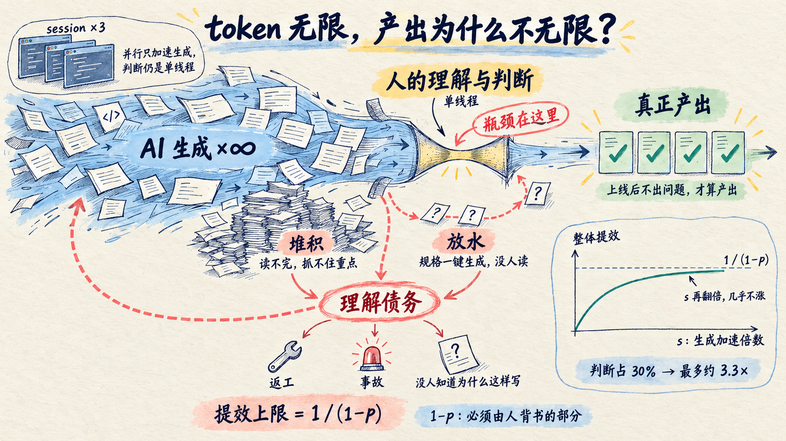
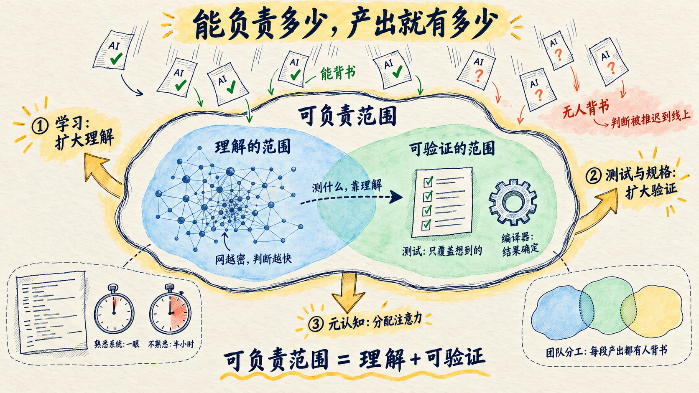
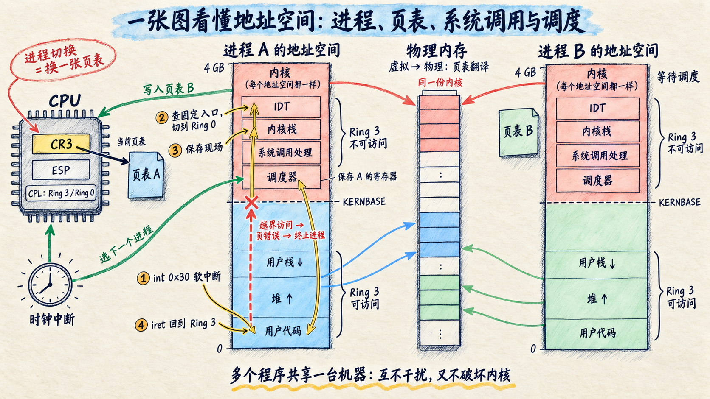
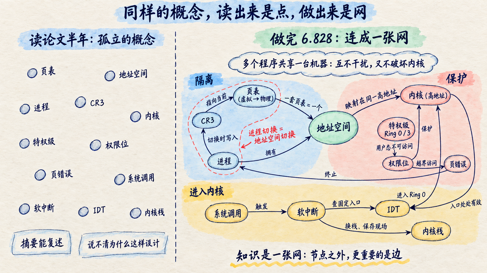
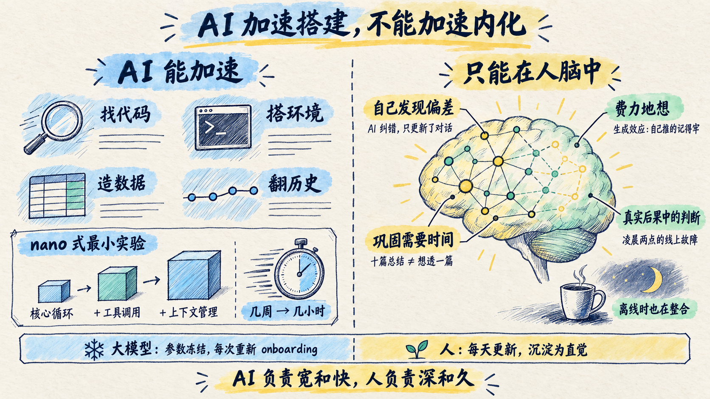
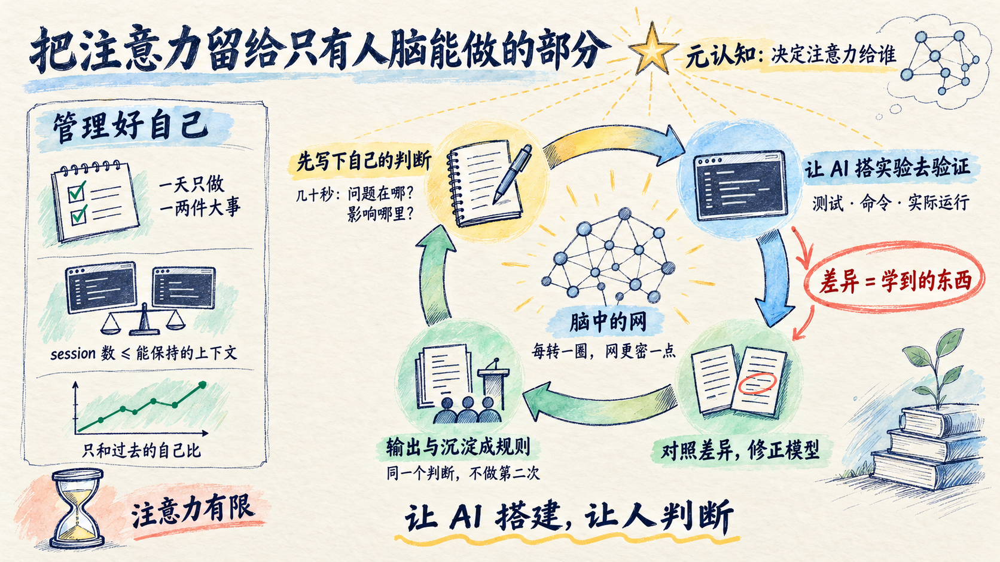

# AI 时代的自动化悖论

**学习能力，决定你的职责范围**

Oct 4, 2026 · @kvenux

进入26年下半年，我比以前更累了。

要 review 的内容太多，读得吃力，抓不住重点，很多该形成的判断并没有形成。AI 干活时我只能等，于是开多个 session 并行，在它们之间来回切换，脑子里的上下文被反复装载。我已经很久没有体验过心流。

前几天读到一个[知乎回答](https://www.zhihu.com/question/2083785912236905943/answer/2084768319161242138)，心有戚戚焉。答主引用了一篇四十多年前的论文：

> 1983 年，人因工程学家 Lisanne Bainbridge 在《Ironies of Automation》中指出自动化的悖论：机器接管了简单、频繁的工作，留给人的是最难的部分，同时也拿走了人练习的机会。

今天，这个悖论就在我们的工位上：AI 写代码，人审代码；审需要理解，而理解原本来自写。

大家都在畅想 AI native 时代，产出会是过去的多少倍。不妨做一个思想实验：假设 token 无限，你的产出能是过去的多少倍？

上限显然不由 token 决定。生成可以无限加速，但 AI 的每一份产出，都要有人理解、判断，并为它背书，因为 AI 无法担责。你能负责多少，产出就有多少；而能负责多少，取决于你理解多少。偏偏在 AI 时代，理解不再随着写代码自动增长。

所以这篇文章想回答两个问题：人为什么必须理解？AI 拿走了练习的机会之后，理解又怎样继续生长？

先说结论：

> **AI 能生成，但不能负责。一个人能负责的范围，取决于他理解的范围；而在 AI 时代，这个范围不会再自动扩大。学习能力，决定了你的职责范围。**

## 一、人为什么必须理解：信任与职责范围

AI 生成的东西越来越多，真正的产出却没有同比例增加。原因可以分三步推出来。

**第一，生成不等于产出。** 一段代码合入上线后不出问题，一个技术方案落地后真正解决了它要解决的问题，一份故障分析让同类故障不再发生，才算产出。评审通过不算：很多 AI 生成的方案几乎没被认真确认就放行了，判断只是被推迟到了线上。AI 生成了多少不重要，重要的是有多少真正在现实中起了作用。

**第二，产出需要有人背书。** 一个结果要被采纳，必须有人信任它；而信任需要一个会为后果付出代价的主体来背书。没法给 AI 打差绩效，它不承担代价。出了问题，必须有一个会为此付出代价的人。

**第三，人只能为理解的或能验证的东西背书。** 不理解也能信任一个东西，前提是有别的信任来源：结果是确定的，比如编译器；或者能被可靠验证，比如完善的测试。AI 的产出是概率性的，测试也只能验证想到的情况，而测什么、覆盖够不够，本身又要靠理解来设计。所以：

> **一个人能负责的范围 = 他理解的范围 + 他能可靠验证的范围。**

理解还决定了判断的速度。同一段代码，熟悉系统的人一眼看出问题，不熟悉的人读半小时还拿不准。

三步合起来，正好是阿姆达尔定律描述的情形：一项工作中只有一部分被加速时，整体提效受制于没有被加速的那部分。

```latex
S = \frac{1}{(1-p) + \frac{p}{s}} \;\xrightarrow{\;s \to \infty\;}\; \frac{1}{1-p}
```

其中 p 是 AI 能加速的生成环节在整个工作中的占比，s 是这部分被加速的倍数，1−p 是必须由人理解、判断并背书的部分。生成快到几乎瞬间完成时，整体提效的上限是 1/(1−p)。比如判断占整个工作的三成，即便生成不再花任何时间，整体也最多只能提速三倍多一点。

过去写代码慢，生成是瓶颈，加速生成就能明显提效。现在 AI 已经把 s 推高了几个数量级，整个业界仍在追逐更强的模型，继续在 s 上做文章。对单个环节来说这是巨大的进步，但从整体提效看，s 已经很大时，再翻几倍对整体的收益微乎其微，边际效应很低。而 1−p 不会因为模型变强而归零，因为责任无法交给 AI。真正值得优化的是瓶颈，也就是 1−p 这一部分：让人判断得更快，或者需要判断的更少。



### 超出判断速度的产出去了哪里

当生成远快于判断，多出来的部分只有两种去处。

- **堆积****：**待 review 的东西越积越多，人疲于阅读，抓不住重点。这就是开篇描述的状态。
- **放水：**干脆不判断，直接放行。我见过很多次：规格和文档一键生成了，却没人读，直接 gogogo。

放水看起来很快，但没被理解的产出并没有消失。它们会以返工、事故，或者**没人知道这段代码为什么这样写**的形式回来——就是理解债务。

这个推论还能解释一个反直觉的现象：**多开几个 session，并不能提高产出。** 并行提高的只是生成速度，判断依然是单线程的。频繁切换反而拖慢了判断，整体产出可能不升反降。

### 扩大职责范围只有三条路

既然产出受制于人能负责的范围，能做的只有三件事：

1. **扩大理解的范围**：靠学习，让脑中的网覆盖更多系统，判断也随之变快。
2. **扩大可验证的范围**：靠测试、规格和验证机制，让一部分输出不必逐行阅读也能被信任；也靠团队分工，让每一段产出都有理解它的人背书。但判断"哪些可以信任"，本身又需要理解。
3. **管理好自己：**用元认知决定在哪里学、在哪里放手，保护注意力，让判断发生在完整的上下文里。

三条路最后都回到同一件事：人的理解，以及形成理解的速度。下面先看理解是怎么形成的。



## 二、理解从哪里来：学习的本质

理解来自真实反馈下的反复修正。

### 操作系统学习的回顾

读博初期，我有过大约半年几乎只读论文的时期，读的都是操作系统和系统安全方向的论文。每一篇都认真读完，摘要和贡献点也能复述，可读起来始终没有感觉。合上论文，我说不清作者为什么偏偏这样设计，也想不出换一个问题该从哪里下手。

我当时只觉得是努力还不够：读得不够多，读得不够细。于是继续加量阅读，结果依然没有质的提升。

真正让我学会操作系统的，是 MIT 6.828。这门课让学生在 x86 上从零写一个教学内核 JOS，每个实验都配有评分脚本，需要真正通过测试用例。

在此之前，我只认识一个个孤立的概念：页表、进程、系统调用。做实验的过程充满摩擦：讲义没说透的地方，就去翻 Intel 的架构手册，一页页对照硬件怎样规定分页、权限和中断；代码跑不通，就回头追问自己哪一处理解错了。那段时间，全身心投入在琢磨地址空间——就是所谓的心流状态。

正是在这种持续的专注里，我才看明白，这些概念都在回答同一个问题：**多个程序怎样共享同一台机器，既互不干扰，又不能破坏内核**：

1. 要互不干扰，每个程序就需要一份自己的内存视图。页表提供这份视图：它把虚拟地址映射到物理地址，一套页表就是一个地址空间。
2. CPU 按 CR3 寄存器指向的页表翻译每一次访存。所以内核切换进程时，内核就把新的页表地址写入 CR3，再恢复它的寄存器，回到用户态。进程切换，本质上就是地址空间切换。
3. 程序随时可能需要内核服务，所以内核必须在每个地址空间里常驻。每套页表都把内核映射到同一段高地址。
4. 内核在每个地址空间里，却不能被程序随意读写。CPU 用特权级区分两者：内核运行在 Ring 0，即内核态；用户程序运行在 Ring 3，即用户态。页表项的权限位规定，用户态不能访问内核所在的页。用户程序一旦越界访问内核的页，就会触发页错误，被内核终止。
5. 程序需要内核服务时，只能从内核预先指定的入口进入。中断描述符表记录这些入口；因为内核地址处处相同，这些入口在任何进程中都有效。用户程序把调用号和参数放进寄存器，触发一次软中断，CPU 经固定入口切换到内核态，换上内核栈并保存现场，内核按调用号处理完，再返回用户态。



以前我只认识这些节点，实验让我看见了节点之间的边。地址空间、进程、中断、系统调用，第一次在我脑中连成了一个完整的系统。



两段经历的差别不在投入，而在反馈。读论文时，我无法验证自己的理解对不对；做实验时，每一个错误的理解都会立刻变成一个跑不通的程序。

### 学习的三个要素

从这些经历里，我归纳出学习的三个要素：

- **知识是一张网，抽象来自对细节的压缩：**知识在大脑里不是孤立存放的，而是彼此连接、相互激活的一张网。新概念进来时，能和已有知识建立的连接越多，理解就越深；相似的细节反复激活同一条路径，大脑就会从中归纳出共同的结构。页表、地址空间、进程切换能连成一片，就是这张网被织密的过程。能迁移的不是答案，而是生成答案的模型。
- **猜测、检验、修正：**先对系统不断做出猜测，形成一个判断，再让现实检验它；被推翻的地方，就是模型需要修正的地方。费曼讲科学方法时说过，寻找新规律的第一步就是猜，然后推出猜测的结论，再拿实验去对照。没有真实反馈，读得再多也只是在积累词汇。
- **大脑在离线时也在整合：**做 6.828 那段时间，很多卡住的问题不是在电脑前想通的，而是在吃饭、走路时突然有了头绪。白天的专注把问题装进脑子里，大脑在放松时继续整合。人的学习不止发生在工位上。

这也回答了第一章留下的问题：一个人能负责的范围，取决于他脑中这张网覆盖了多少。网织得越密，判断越快，敢背书的东西也越多。所以学习能力，最终决定了职责范围。

## 三、AI 改变了什么

AI 拿走了理解自动生长的过程，也大大降低了主动学习的成本。它能加速获取和搭建，不能加速内化和沉淀。

### AI 正在拿走练习的机会

开篇提到的自动化悖论，并不是新问题。

航空业为此付过学费。飞行员长期依赖自动驾驶后，手动操纵和处理异常的能力会退化，所以今天的飞行员仍要定期练习手动飞行和故障处置。

软件工程正在经历同样的事。AI 带来了两个根本变化：

- **产出和能力脱钩了：**过去能写出能跑的代码，说明你已经有了一定理解。现在没有理解，也能产出。
- **挣扎从被迫变成了可选：**过去卡住了只能自己硬啃，现在随时可以跳过。学习中最有价值的那部分努力，第一次变成了可以绕开的东西。

于是学习不再是工作的自动副产品。如果当年 6.828 的每一个卡点都是由 AI 替我修好，我会更快地完成实验，但大概不会真正理解地址空间。

Peter Naur 在 1985 年说过，程序真正的资产不是代码，而是开发者脑中关于这个系统的理论：它为什么这样设计，应该怎样应对变化。AI 可以生成代码，却无法替团队在脑中建立这套理论；而没有理论，就没有人能真正为这段代码负责。

### 能加速的：大量机械的重复劳动

学习循环慢，往往不是因为思考慢，而是因为每一轮都有大量机械工作：找代码、搭环境、造数据、加日志、翻历史。过去一天只能跑一两轮，很多假设因为验证成本太高而被放弃，只能靠读代码去猜。AI 把这些机械成本压到了分钟级：写最小复现、做故障注入、追踪调用链、翻查提交历史，几乎随问随得。

我去年理解 coding agent 原理，用的就是这种方式：不读长篇的架构文档，也不让 AI 直接讲解，而是用 nano 式的最小实验，把一个 agent 的核心循环搭出来，再逐步加上工具调用和上下文管理，观察每一步的变化。

学习的方法和当年做 6.828 时并没有变，仍然是亲手搭出来，让现实检验理解；变的只是代价：过去要几周才能搭好的实验环境，现在几个小时就够了。

### 不能加速的：发生在人脑中的那部分

- **偏差必须由自己发现：**AI 犯错、AI 纠错，更新的是对话，不是你自己的心智模型。只有你先结合自己的经验形成判断，再看到现实中不符合判断的部分，模型才会修正。
- **费力的过程本身就在学习：**认知心理学里有个生成效应：自己推出来的答案，比直接看到的答案记得更牢、理解更深。卡住、试错、再想，这个费力的过程，正是大脑建立连接的过程。如果把它全部交给 AI，人得到了答案，却跳过了学会的那一步。
- **巩固需要时间**：一天读完十篇总结，不等于十天想透一篇。
- **真实后果中的判断无法完全模拟**：凌晨两点、线上故障、责任在自己身上，这种情境下的判断只能在真实中积累。



### 人与 AI：两种学习系统

大模型和人，是两种几乎互补的学习系统。

| 维度 | 大模型 | 人 |
| --- | --- | --- |
| 先验 | 几乎读过所有公开代码和知识 | 只覆盖亲身经历和所学 |
| 带宽 | 几分钟读完一个代码库 | 认真审阅每小时约 300–500 行 |
| 学习方式 | 预训练后参数冻结 | 持续学习，每天都在变 |
| 进入具体项目 | 每次重新 onboarding，靠上下文和外挂记忆 | 慢慢沉淀为直觉，越来越深 |
| 离线加工 | 会话结束即停止 | 喝咖啡、通勤、发呆时仍在整合 |
| 反馈来源 | 文本 | 现实后果、责任和长期结果 |

所以合理的分工是：**AI 负责宽和快，人负责深和久。** 人不必和 AI 比带宽，而应该把精力投在会复利、AI 的通用先验知识又覆盖不到的地方：少数领域的深层因果模型，判断力和品味，所在项目和组织的情境知识，以及定义问题的能力。打个比方：大模型的参数在一个版本里是冻结的，每次进入项目都要从头读一遍上下文；而人脑中关于这个项目、这个团队、这段历史的那张网，每天都在更新——人才是那组针对具体情境持续训练的项目级权重。

## 四、错误的 mindset 与正确的 mindset

AI 是反馈的放大器，不是理解的替代品。很多问题，都源于把这两者混为一谈。

### 我观察到的几种错误心态

- **只把 AI 当提速工具，忽略它的副作用**：用得越多，生成越快，却没有意识到注意力在被持续消耗，理解在被悄悄稀释。
- **表格式干活**：自己的待办散落在别人的项目表格里，被追踪时才想起来要推进。一天处理的事情很多，却说不清优先级，也没有自己的北极星。什么都想做，什么都想做好。这种状态如果出现在团队负责人身上，代价会被放大，整个团队都会被拖得很累。
- **产出等于能力：**"我用 AI 做出来了，所以我会了。"做出来是交付，能独立判断方案的对错才是能力。
- **看懂了等于会了**：AI 的解释通常清晰流畅，读完很容易产生"我懂了"的感觉。但能看懂和能用起来是两种能力，流畅感会制造理解的错觉。
- **因为担心副作用而拒绝 AI**：这同样是错的。它放弃了 AI 在降低实验成本、加速反馈上的巨大价值。问题不在用不用，而在用在哪个环节。

### 正确的心态

- **让 AI 搭建，让人判断**：AI 承担获取、搭建和搬运，人保留猜测、判断和整合。AI 替你搭建，你是更快地建立了理解；AI 替你判断，你只是更快地拿到了答案。
- **能力是独立判断的能力**：用 AI 做出来是交付；能独立判断方案对不对、在什么条件下会出错，才是能力。
- **会用才算懂**：读懂 AI 的解释只是开始；能用自己的话讲出来，能在新问题上用起来，才算真正理解。
- **注意力是最稀缺的资源**：生成可以无限加速，注意力不能。先想清楚自己的北极星，再决定把注意力给谁。
- **信任要有边界**：目的不是证明人比 AI 强，而是知道什么时候可以信任 AI，什么时候需要继续查证。

## 五、方法：从原点推出的学习方式

人要为产出负责，能负责的范围取决于理解；理解只能在自己脑中生长；而注意力无法扩展。三者合起来，就是 AI 时代学习的逻辑原点：

> **理解只能在自己脑中生长，而注意力有限。AI 时代学习的全部问题，就是把有限的注意力，集中在只有人脑能完成的那部分上。**



从这个原点出发，可以推出五条做法。

### 1. 注意力只留给判断

既然注意力有限，就不该花在不需要判断的事情上。找资料、搭环境、读样板代码、整理笔记、翻提交历史，都可以交给 AI。省下来的注意力，用在需要判断的地方：这个设计对不对，这个风险值不值得冒，这段代码在什么条件下会出错。

区分的标准很简单：一件事换一个人来做，如果结果不会因为理解深浅而不同，就交给 AI；如果结果取决于理解，就留给自己。

### 2. 先有自己的判断，再看 AI 的答案

网的生长靠猜测、检验、修正。没有自己的猜测，后面的检验和修正都无从发生：AI 给出的答案再好，也只是一个答案，不会改变你脑中的模型。

所以面对一个问题，先花几十秒写下自己的判断：问题出在哪，方案应该是什么，改动会影响哪些地方。然后再让 AI 解释、对照、追问，两者之间的差异，就是这一轮学习的收获。读材料也一样，先自己读一遍，带着疑问再让 AI 解释。遇到新概念，先想它和哪些熟悉的东西相似、又有哪些不同，让它在网里找到位置。

### 3. 尽快验证自己的判断

判断对不对，要靠运行结果、测试和真实反馈来验证。验证越快，一天能完成的修正就越多。

这正是 AI 最能帮上忙的地方，第三章说过，它把实验的成本压到了分钟级。工作中也一样，给 AI 一个验证自己的办法，比如测试、命令或实际运行，让验证结果承担第一道判断，人只看验证覆盖不到的地方。

### 4. 主动输出，沉淀经验

修正如果没有留下来，下次还得再判断一遍。

主动输出是巩固理解最快的办法。做一次 talk、写一篇文章、在组内分享，都是在逼大脑把相关的连接重新走一遍，网里的权重也因此更新得更快；讲不清楚的地方，往往就是还没想通的地方。输出最好公开：面对真实的听众和读者，认同感和反馈会反过来推着自己，把输出做到位，把理解想得更透。定期复盘，则是主动把新学的和旧的连起来，让网织得更密。

沉淀经验，则是把修正写进系统。AI 犯过的错、团队踩过的坑、做过的设计取舍，写成规则和文档，AI 每次进入项目时都能用上。同一个判断，不应该让人做第二次。

### 5. 元认知：分配注意力的那只手

以上四条，都需要有人决定什么时候做、做到什么程度。这是元认知的工作：察觉自己正在想什么、为什么这样想，并据此调节。

- **北极星目标**：人要有自己的北极星，也就是每天醒来驱动自己的那个动机，这是 AI 给不了的。有了它，才分得清每件事的分量，知道哪些事值得投入注意力，哪些可以交给 AI。
- **保护注意力**：一天只做一两件真正重要的事，并行 session 的数量以自己能保持住的上下文为限。
- **带着长期问题生活**：心里装着几个长期在想的问题，新信息就有了挂靠的位置。很多人坐在工位上，其实处在 auto pilot 模式，手在忙，脑子并没有在想。不如多去喝杯咖啡、散散步，利用碎片时间主动想一想，甚至允许自己真正发呆一会儿。人脑不是机器，在执行和 how 的层面去卷，永远卷不过 AI；人的优势在于把问题想透。
- **只和过去的自己比**：不攀比，也不被peer pressure推着走。别人的经历无法复制，用学生时代比排名的思维去对比、人云亦云，等于开着 auto pilot 随大流。Karpathy 在谈如何成为专家时也专门提过这一点：只和过去的自己比，不和别人比。聚焦自己，自己脑中那张网的权重，只有自己最清楚；学习的 reward signal，或者说 loss function，应该针对自我认知：衡量的是自己的判断比之前准了多少，而不是在别人中间排第几。

## 结语：共生之后

回到开头那种累。它并不说明我们用错了 AI，而是说明自动化悖论已经来到了每个人的工位上。

两千四百年前，柏拉图在《斐德罗篇》里记下了苏格拉底对文字的担忧：人们一旦把事情写下来，就不再用心去记；他们会读到很多东西，看起来博学，却未必真正懂得。这和四十年前 Bainbridge 对自动化的担忧几乎一模一样。

后来的历史证明，这份担忧既对也不对。文字没有让人停止思考，反而让人能把推理写下来、反复检验、代代累积，才有了后来的科学。但从那以后，读写不再是少数人的技艺，而成了每个人都必须掌握的能力。真正从文字中受益的，是学会用文字思考的人，而不是只会抄录文字的人。

AI 是又一次这样的转折，只是这一次被外化的不只是记忆，而是生成和推理本身。AI 提供几乎无限的生成能力；人承担责任、给出认同、定义目的，并守着持续生长的理解，决定这些能力流向哪里。与 AI 共生，已经不是少数人的选择题，而是每个人迟早都要面对的问题：当产能不再稀缺，你脑中的那个模型，还在不在生长？

AI 越强，越需要有人理解。学习能力，决定了你的职责范围。
