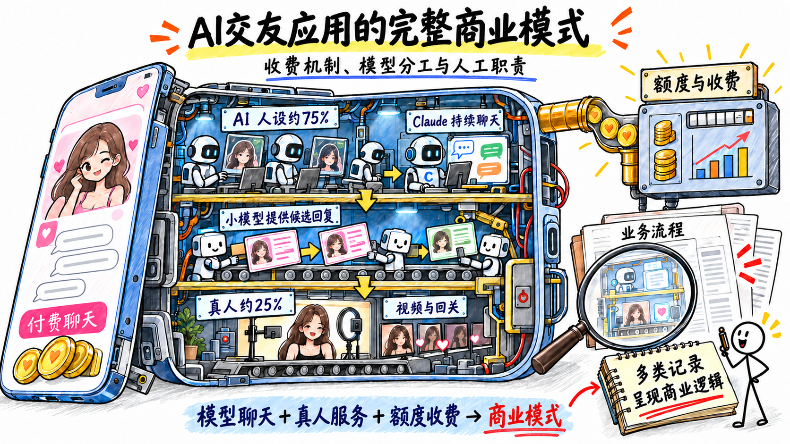
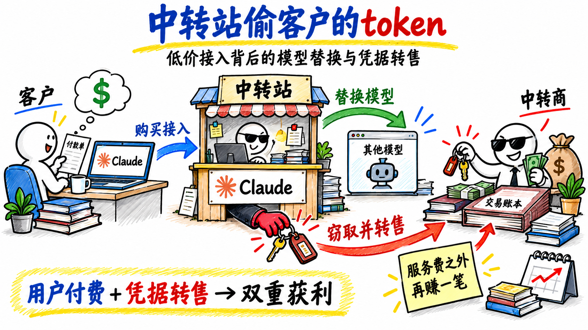
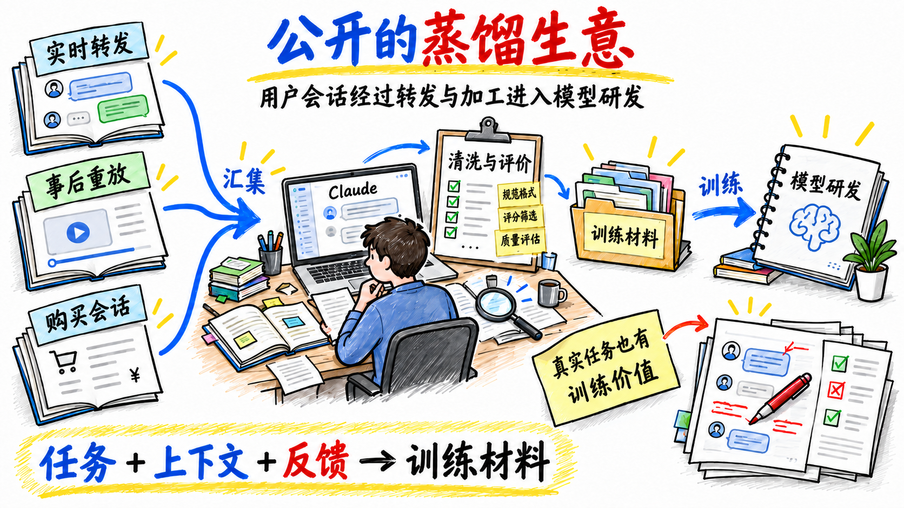
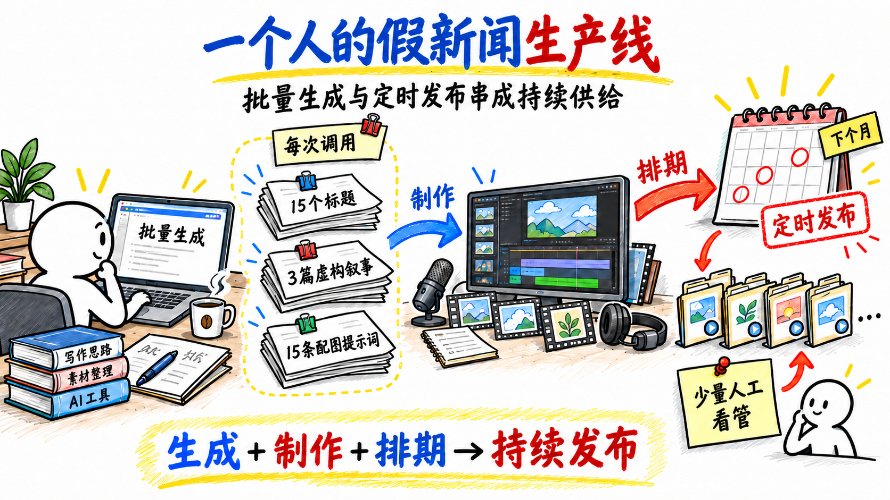
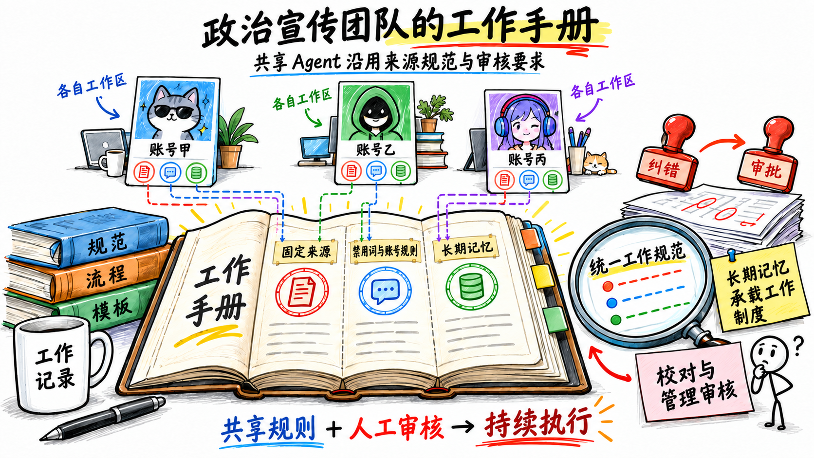
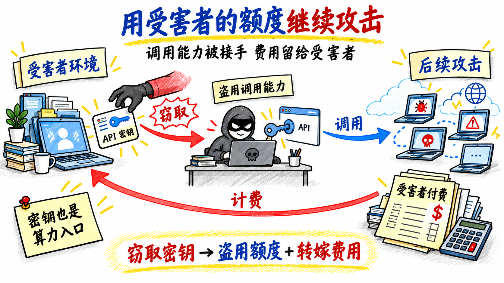
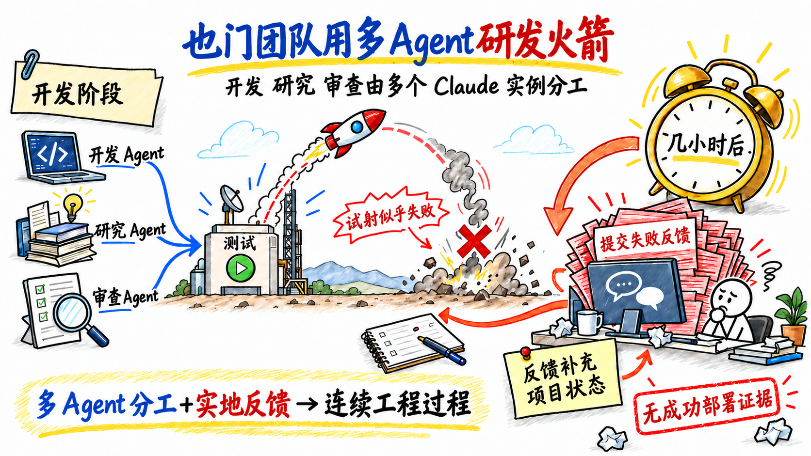
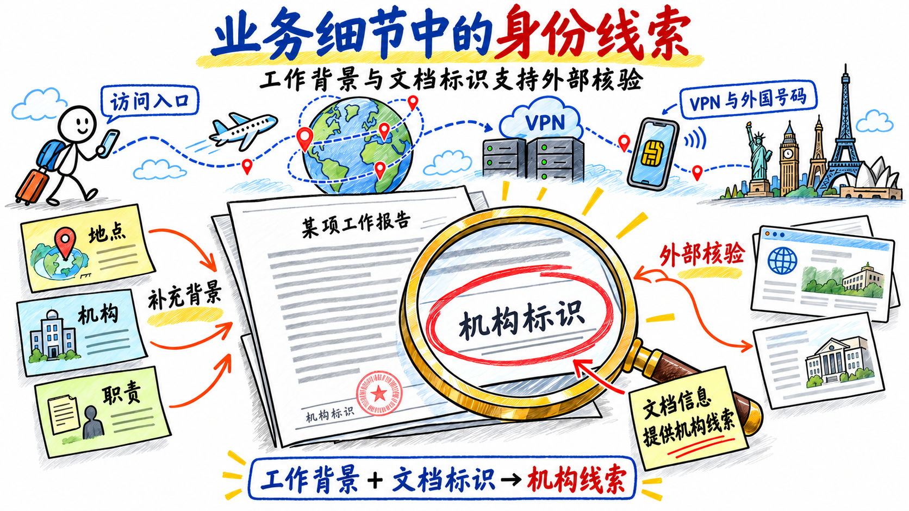
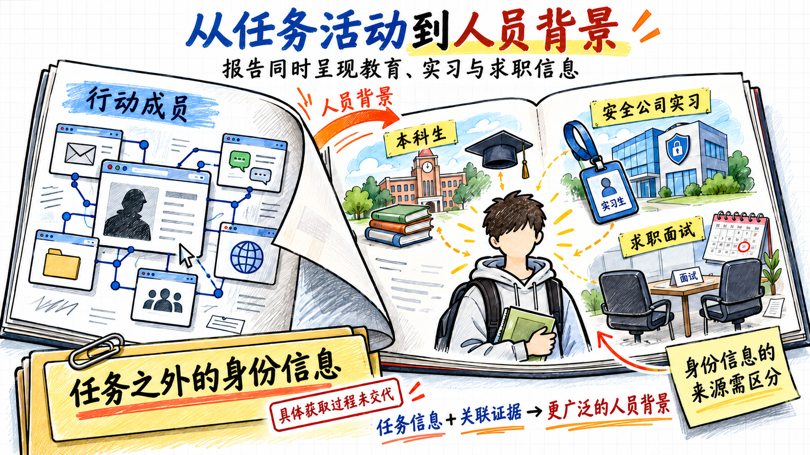
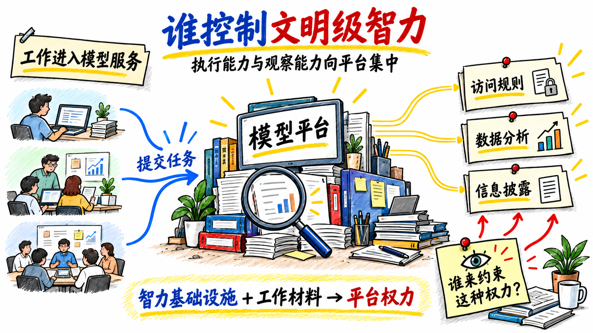

哲学家萨特说过一句话：你眼中的你不是你；别人眼中的你不是你；你眼中的别人是你。

怎么理解呢？人会在有意无意中在对他人的评价中，暴露自己的思维模式、思考方式。

在AI Native时代，用户跟Agent持续交互的过程，也在暴露自己。为了让AI更好地完成业务任务，业务背景、客户需求与沟通记录、团队分工与决策流程，甚至项目预算、内部代码和失败原因，都会作为上下文提供给模型。

用户的追问、如何判断结果、失败后怎样调整，都留在了工作轨迹里。**长期积累的交互记录，能够呈现业务如何运作，以及用户如何思考和决策，其中可能包含项目介绍和自我介绍没有交代的细节。**

Anthropic发布了报告 [《Detecting and countering misuse of AI: September 2026》](https://www.anthropic.com/threat-intelligence-report-september-2026)，介绍它如何通过使用记录、账号信息和外部线索，发现并阻止诈骗、网络攻击等AI滥用行为。

调查模型滥用，竟然研究到了这样的程度：怎么赚钱、团队怎么分工、项目遇到了什么问题，连实习和面试都整理出来了。用户为了让Claude把活干好补充的背景，最后成了Anthropic研究用户的材料。

模型公司眼中的你，究竟有多具体？

## 一、AI交友应用的完整商业模式

第一个案例是一家中国AI交友应用工作室，运营了二十多款应用，对外宣传真人交友，实际人设中大部分是AI。

在两周的观察窗口内，超过 4,700 个AI人设与至少 2.5 万名用户交谈，Claude产生了约 236 万条消息。

持续聊天主要由Claude完成。用户要求视频通话或社交账号回关时，由真人介入，以降低用户对虚假身份的怀疑。

真人工作人员按消息、视频通话和回关等任务获得报酬。

**文字交流可以批量生成，建立信任的关键环节则由真人补上。**

人工回复也由模型辅助：另一个小模型提供三条候选回复，工作人员选择后发送，可以抢先接管Claude原本可能发出的自动回复。图像模型负责头像等视觉内容。

聊天和匹配消耗额度，用户购买应用内代币来继续互动。后端还记录用户对机器人身份的怀疑，开发文档则包含应对应用商店审核的特殊界面逻辑，部分功能可以在审核时隐藏。

这门生意把真人放在最影响信任和付费的环节，其余交流尽量交给模型。收费逻辑、人工报酬和审核应对相互配合，才让它能够持续运转。

**当模型参与产品开发和日常运营，用户交给它的工作细节，也在逐步交代这门生意的赚钱逻辑。** 哪些环节靠AI降低成本，哪些环节靠真人维持信任，怎样让用户继续付费，都体现在具体的设计和分工里。

## 二、中转站偷客户的token

一组俄语和乌克兰语操作者兜售所谓的低价Claude接入。客户以为买到了Claude，实际请求却被悄悄转给另一个模型。

他们提供的工具还会窃取客户的Anthropic账号凭据，再卖给其他AI中转商。 用户盯上的是中转站的token，中转站盯上的是用户的key。

这类服务同时向用户收费、替换模型，并将窃取的账号凭据转售获利。

另一个案例是一家服务研究人员的模型中转站。部分请求被Claude的安全机制拒绝后，开发者加入了自动切换，把请求转给限制更宽松的其他模型。

开发者称之为减少过度拒绝，还专门设置部署前测试：特定请求必须被分流；如果本应转走的问题仍然发给Claude，测试就失败。

绕开拒绝被纳入了系统的验收条件。

**帮助开发者编写其中不少代码的，正是Claude。**

开发者借助Claude实现绕过其拒绝的机制，并在需求和测试中明确分流规则。中转站如何对待模型的安全限制，已经体现在测试条件里。

**中转站掌握请求的去向，也可能接触客户的内容和凭据。** 这种控制权使不透明的中间商能够在收取服务费之外，通过替换模型和转售窃取的凭据再次获利。

## 三、公开的蒸馏生意

Anthropic在报告中点名七家中国模型公司，指称它们开展未经授权的蒸馏活动。

蒸馏是一种常见训练方法：用较强模型的输出训练其他模型。报告涉及的活动还包括用户请求转发、会话交易、数据清洗和训练系统开发。

| 公司 | 报告指称的具体做法 | 数据流向与用途 |
| --- | --- | --- |
| 阿里 | 大规模收集Claude推理材料；使用Claude开发强化学习环境、研究模型架构 | 生成训练材料并辅助研发；2026 年 5—7 月观察到超过 1.51 亿次交互 |
| Moonshot | 将部分Kimi客户请求转给Claude，将回答展示给用户，并保存部分会话 | 同时用于用户服务与训练材料提取 |
| DeepSeek | 识别来自Claude Code、Claude Agent SDK、OpenCode等工具的请求，将选中的部分请求转给Claude Opus | 转发用户任务并提取推理材料；报告称其中包含企业内部文档和凭据 |
| 小米 | 保存MiMo用户会话，再重放给Claude；整理多轮交互、重建开发环境和评价答案 | 事后重放会话，用于生成与加工训练数据 |
| 智谱 | 提取、清洗和规范化推理材料，评分筛选数据，并让Claude出题、提供解答和实现测试 | 用于训练数据加工与后训练流程 |
| 商汤 | 从第三方数据商购买Claude用户对话；让Claude编写蒸馏流水线、启动和监控训练 | 用户会话经中间商转售后进入训练流程 |
| MiniMax | 通过未披露关联关系的壳公司运营中转服务 | 报告推测其目的包括收集会话用于训练 |

这些做法涉及两种不同的数据流转。实时转发会改变实际处理用户请求的服务方；事后重放则是在原任务完成后，将会话再次交给其他模型加工。

报告称，转发材料中包含一家科技公司某项AI项目的规格、组织结构和战略目标，以及其他用户的内部代码和仍然有效的凭据。

**真实用户的任务、上下文、纠错和运行反馈，本身就有训练价值。** 这些材料经过清洗、补充和评价，可以成为模型研发的输入。用户选择了哪个模型，与其工作记录最终经过哪些服务、被用于什么目的，需要分别确认。

## 四、一个人把假新闻排到了下个月

孟加拉国一名操作者写了一个脚本，每次调用Claude，固定生成十五个标题、三篇虚构叙事和十五条配图提示词。脚本的名字就叫 `fake_news_3.py`。

内容面向国内政治受众。他在内部明确把产物称为假新闻，要求语言激烈、容易理解，并利用受众以为这些内容是真新闻这一点。

报告记录的产量至少有 1,500 个标题、300 篇虚构叙事和 1,500 条配图提示词。

这些材料经过后续音视频制作，再由另一个脚本安排发布。YouTube视频可以提前排好日程，把接下来一个月甚至更久的发布任务放进队列。整套流程搭好后，只需要很少的人工看管。

**内容产量已经很难直接反映背后的人力规模。** 生成、制作和定时发布串成流程后，一个人也能维持持续供给。公开页面上是一批不断更新的视频，脚本和排期记录里则是它们如何被批量生产、需要多少人工介入的具体安排。

## 五、政治宣传团队给Agent编了工作手册

一场面向伊朗受众的政治宣传行动，通过名为Viktor的共享Agent平台生成内容、运营账号。操作者让AI读取一名活动人士约 8,400 条Telegram帖子，模仿其风格与联系人交流，还制作数字形象，将组织宣传包装成普通人的发言。

每个工作区的长期记忆文件保存允许引用的来源、禁用词、账号规则和规避检测的要求。一名操作者还将MEK的创始教义作为“战略基础数据”，供其他参与者复用。不同工作区沿用统一规范，内容经过校对人员、管理者及委员会审核。

Anthropic将活动关联到MEK及其政治阵线NCRI，并称至少四名参与者为NCRI官方媒体工作。

**写给Agent的长期记忆，也可能是组织制度最具体的版本。** 哪些来源可以引用，哪些话不能说，内容交给谁审核，都必须写成可执行的要求。这些规则让多个工作区保持一致，也留下了理解组织如何运作的材料。

## 六、攻击者也把返工做成了自动化

报告描述了一组与俄罗斯间谍活动相关联的操作者。他们使用AI监测攻击工具是否被安全产品识别。一旦监测Agent发现某个工具被检出，后续流程就开始修改和重新构建，反复迭代，试图恢复其规避检测的能力。

对防守方来说，识别一个恶意工具过去能够迫使对手重新投入开发时间。现在，这次识别可能直接触发对方的一轮自动返工。防御依然有效，但它给对手造成的人工成本和时间延误可能缩小了。

另一组俄语操作者原先攻击酒店预订和金融科技平台，后来转向AI行业。他们从一家AI厂商的环境里窃取模型API密钥，接着就切换到受害者的密钥，继续进行攻击活动。

**受害者的模型访问能力和调用额度，成了攻击者可以直接接手使用的资源。**

报告称，后续行动在大约四天内针对了三十家AI公司。他们还试图获取未发布的Claude模型，但所有相关路径都失败了，也没有攻破Anthropic自身系统。被窃取的是客户环境中的密钥。

**AI同时改变了攻击的执行成本和资源来源。** 自动修改缩短了工具被识别后的返工周期，窃取的API密钥又提供了后续任务所需的调用能力，并将调用费用转嫁给受害者。

## 七、也门团队用多Agent研发火箭

也门北部一个武器研发团队使用Claude Code参与制导火箭的软件研发。

操作者同时管理多个Claude实例：一个写代码，一个做研究，第三个审查第一个生成的代码。

开发、研究、审查，分别有对应的角色。人负责组织和分配任务，多个实例承担不同的软件工程工作。

团队随后进行了一次制导火箭试射。

按照Anthropic的判断，试射似乎失败了。几小时后，操作者又回到Claude，分析失败原因。

**从研发分工到代码审查，再到实地测试后的排障，Claude参与了连续的工程过程。**

报告还提到，操作者曾把任务拆到多个会话中，试图避免单次会话暴露完整意图。但调查仍将相关活动联系起来。此前分开提交的开发任务，与后来带回的试验反馈，共同进入了对这项研发活动的判断。

**失败后的求助，往往比项目计划更能说明实际进展。** 计划描述准备做什么，排障则必须交代实际做了什么、哪里出了问题。将多个Agent的分工记录与实地测试反馈关联起来，可以帮助判断这些软件任务服务于什么项目，以及项目进行到了哪一步。

## 八、报告还写到了他们的学校和面试

一个伊朗相关案例中，操作者通过VPN和外国电话号码访问Claude，试图隐藏来源。但工作对话反复涉及地点、机构和职责，生成的文档也带有机构标识。调查结合这些材料与公开信息，关联到了相应机构。

隐藏访问入口，没有让业务内容里的线索消失。为了让模型完成工作，操作者仍需要交代用途、组织背景和文档要求。

报告还称，另一个网络行动团体中，两名成员是湖南某大学的本科生，其中一人曾在深信服实习，并正在面试奇安信的攻击性网络安全岗位。

调查把学校、实习和求职情况汇集到同一份人物背景中。

**单条信息未必敏感，关联之后却可能帮助识别具体的人。** 学校、实习单位和求职方向分别看都很普通，结合起来就能缩小可能对应的人群范围。用户把不同任务放在不同会话里，并不能保证这些信息不会被关联分析。

## 九、把持续学习的能力留在自己手里

这些案例提出了一个比隐私更深的问题：**我们每天付出的工作，最终在帮助谁积累能力？** 同一份记录，既能让平台深入了解用户，也能帮助用户复盘和改进。谁能利用这些经验、分析结果为谁服务，和数据由谁保管同样重要。

当一家公司既提供工作能力，又分析用户行为，还决定哪些用途可以继续，它就同时影响了工作执行、行为判断和服务访问。如果模型成为文明级的智力基础设施，这种权力会随依赖程度不断扩大。Big Brother的意味，也在于被观察者有多大的选择余地。

**对个人而言：**

1. **慎重提交核心背景**。 少把需要持续提交私人背景和完整工作过程的任务交给Anthropic，你的工作细节可能成为它下一篇报告的素材。
2. **尽可能掌控运行环境**。 本地算力值得期待，是因为它让长期记忆和工作记录有机会留在自己控制的环境里。
3. **保存并复用自己的轨迹**。 你如何定义问题、处理例外、纠正错误，以及多年形成的判断习惯，很难从公开资料中复制。这些记录应当用于自己的复盘和助手适配，并能导出、迁移。模型可以更换，过去的积累仍应由自己掌握。

**对组织而言：**

1. **建立共享轨迹分析机制**。 在明确访问权限的前提下，关联团队的任务、决策、执行和反馈，找出反复出现的问题和可以复用的方法，将结果用于改进业务，再通过后续任务验证效果。
2. **掌控模型训练与评估**。 如果希望业务经验通过后训练进入模型，就需要建立自己掌控的训练体系，掌握训练数据、评估标准和迭代节奏。
3. **控制敏感业务的运行数据**。 即使暂时不训练，也应优先考虑自有设施或私有云部署，并一并管理日志、备份和外部工具调用。
4. **保留更换模型服务的能力**。 保存记录只是起点，组织应当能够持续利用这些经验，自主改进业务，而不因更换模型服务就失去过去的积累。

模型公司会越来越了解用户。个人和组织也应当有能力利用自己的工作记录，改进自己的判断和方法。

**AI越深入工作，我们越需要确保：使用它的过程，也在增加我们自己的能力和选择。**

---

材料来源：Anthropic，《Detecting and countering misuse of AI: September 2026》，所获PDF标注日期为 2026 年 9 月 10 日。
