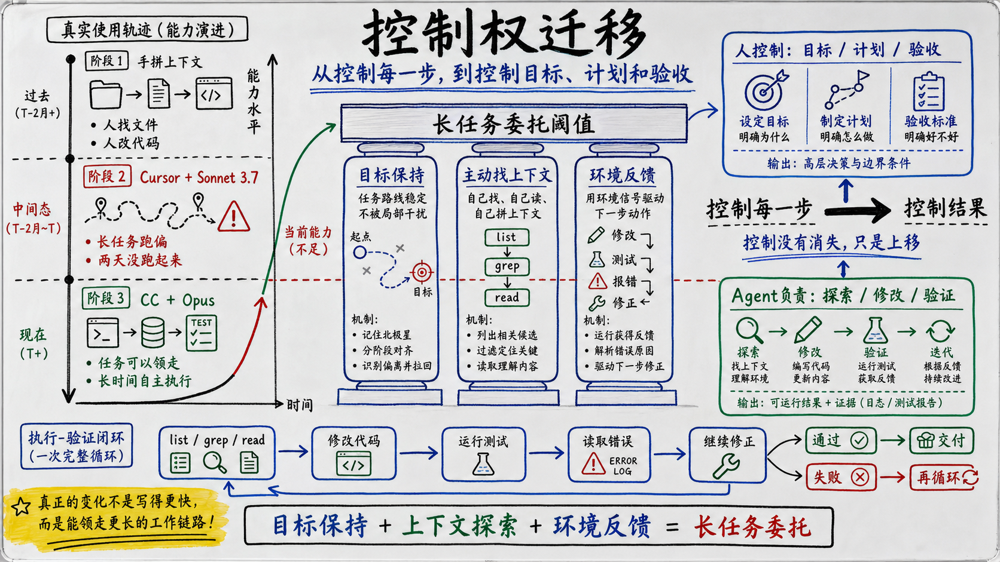
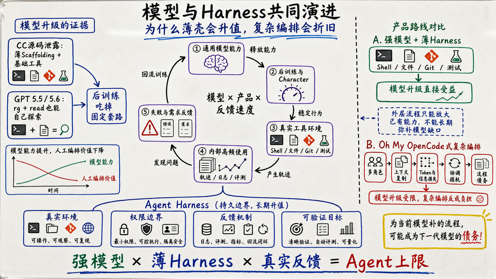
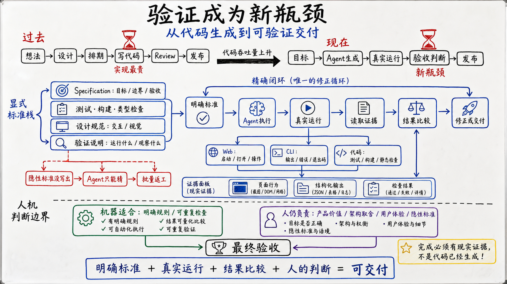
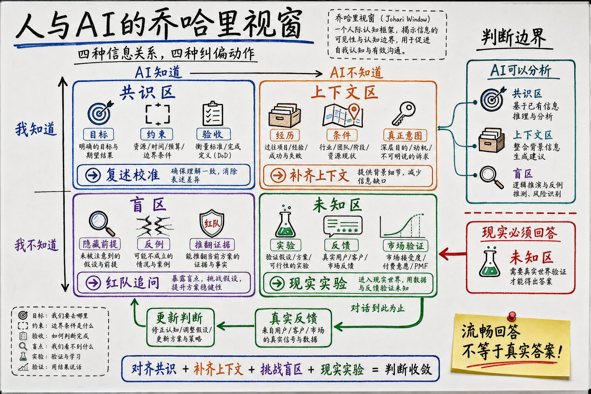
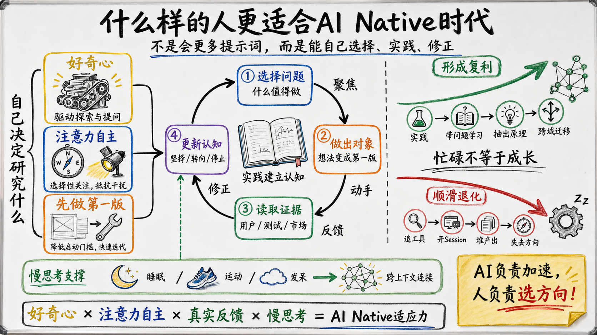

# 我的AI Native周年记

26年春节期间，我陪家人去泰国清迈度假。进酒店房间第一件事，是先打开电脑，把各种Session支起来，让它们开始干活。

泰国景点没怎么去，数字游民空间却去了不少。

花50RMB，送一杯拿铁，可以在这些Coworking Space坐一天。

我明明是来度假的，看起来却还是在打工。一幅熟练地让人心疼的牛马做派。

这一年是系统化的跟AI共生的第一年，我怎么成了今天这幅牛马摸样，还是值得好好回顾一下。

## 1. 中了多巴胺的毒

2025年五一前后，Gemini 2.5出来了。

当时我对这个模型最直接的感受就是：通识能力很不错，综合能力在那个年代属于非常能打。
再加上Google当时给的免费额度非常多，AI Studio上额度近乎免费，就顺利成为了我的主力模型。

不单单是Coding，很多需要外置思考的问题，我也会扔给Gemini。用着用着，它成了我的日常认知工具。

差不多在同一时期，我看到Karpathy的一条推文。做Coding时，可以写一个脚本，把项目的相关上下文连同要求一起发给AI，让AI基于完整上下文工作。

之后写代码，我基本按照四步走：

1. **圈定上下文。** 拿到需求后，我先判断它应该修改哪个模块，再用自己写的脚本提取相关目录和文件，连同需求一起打包发给模型。

2. **讨论方案。** 开始几轮，我通常不会马上让模型给最终代码。我会先和它讨论需求应该怎么改、涉及哪些模块、有哪些设计决策，再把讨论逐渐收敛成具体方案。

3. **自己应用修改。** 模型给出建议以后，我会先消化，再把更详细的修改方式写进下一轮提示词。模型负责提出修改，我来做它的edit工具，也会在这个过程中理解代码改在哪里、为什么这样改。

4. **用Git验证和回退。** 每轮修改后，我都会判断结果是否合适。方向不对就直接discard，合适就保留，试错成本很低。

这套流程更像是我和大模型一起建立对项目的认知，把模糊的需求慢慢变成具体方案。模型帮我做了很多思考，但我没有退出项目。

我以前做过一个蚂蚁森林自动收能量的脚本。它需要通过图片识别找到能量泡，再和手机侧的自动化测试能力结合起来，把截图、图像识别、坐标定位和手机操作串在一起。这套东西以前最快也要两天。进入手拼上下文阶段以后，类似的事情可能一两个小时就能做出来。

很多底层知识AI本身已经知道了，我只要把需求拆成我能拼上下文的任务。

从2025年五月到十一月，我基本靠这套手拼上下文的脚本走天下。用得多了以后，我才真正理解模型对上下文的敏感度。脚本也跟API连上可以自动化的去拼接和请求了。

在此期间，我也尝试过Cursor+Sonnet 3.7。Cursor需要把代码仓索引成向量embedding，可以自己搜索代码、修改文件，看起来比手动拼上下文更进一步。我曾经周末试过AI狼人杀的项目，返工很多，很多关键内容需要人来手把手改，任务也很容易跑偏。那个项目周末两天始终没有跑起来，自己也对Cursor这个网红公司祛魅，重新回到手动圈定上下文、逐轮讨论方案、自己应用修改的方式。虽然自动化程度低一些，但我知道每次改动发生在哪里，也能及时决定继续还是回退。

2025年11月以后，Claude Code已经相对成熟了。Opus 4.5的能力也让我印象很深。这个阶段，才明显感觉到什么才是真正的Agentic Coding。

我观察下来，CC+Opus能够处理长任务，主要有三个原因：

1. **目标保持更稳定。** Opus能够沿着已经确认的计划持续执行。任务变长以后，方向也没有那么容易漂移。

2. **可以主动寻找上下文。** Claude Code通过list-grep-read这些基础的bash工具去解决探索问题，而不是交给不可解释、玄之又玄的向量检索；Agent依靠确定性的正则检索、关键代码阅读去降低探索空间。

3. **能够形成执行和验证的闭环。** 它修改代码以后，可以运行测试、读取报错、继续调整。真实环境的反馈会不断进入下一步，避免模型只根据最初的提示词一路生成到底。

后来我才意识到，这三种能力背后有一个很重要的产品判断：The product is the model。传统AI产品通常先规定好工作流，再让模型完成其中一个步骤。Claude Code把模型放在中心，外面只提供Shell、文件、搜索、Git和测试等基础工具。模型根据目标和当前环境，自己决定先读什么、改什么、调用哪些工具，以及什么时候验证结果。

这三种能力叠加以后，Agent才真正可以领走一段完整任务。上下文定位问题可以完全交给Agent去做了，这次有点像自动驾驶中的L2 → L3。我开始把控制放在目标、计划和验收上，具体执行可以交给Agent。到了这里，想法、修改和验证之间的距离又缩短了一次。

中间我也走过一些弯路。我用过不少中转站，有的又慢，效果又不好，我甚至怀疑它背后到底有没有调用宣称的模型。确实在中转站上被骗过不少钱。

我也曾经折腾过Oh My OpenCode一类的复杂插件。里面堆了很多Agent、角色和工作流。为了把它用明白，我被迫记住了几个希腊神话人物。它看起来很忙，也很耗Token，实际提升却没有那么大。

这类插件的本质问题，是把某一代模型暂时缺少的规划、反思和上下文管理能力，固化成长期存在的外部工作流。一个任务要在多个角色之间转交，上下文被反复复制和压缩，每一层编排都会增加Token消耗、信息损失和协调损耗。外层流程一旦脱离模型的实际能力和演进方向，就会慢慢积累成流程债务。

Claude Code选择的是强模型加基础工具，Oh My OpenCode选择的是更多角色和预设流程。模型升级以后，前一种产品可以直接继承更强的规划和工具使用能力；后一种产品仍然要为原来的编排付费，甚至可能限制已经变强的模型。外层编排可以放大模型已经具备的能力，却很难长期弥补模型的基础能力缺口。

有了这些本质思考以后，也逐步对github的高star项目祛魅了。AI时代，实践为王，不能像大众点评一样，翻出高赞项目不由分说就用，还是要有实践感知、真实评测，才能说它好或者不好。

2026年3月31日，Claude Code源码泄露。大家也有幸一睹这位世外高人的真容。我第一时间做了大量探索和总结，真正关注的重点是CC已经有的循环优化的loop：

> 通用模型能力 → 后训练和Character → Claude Code接入真实环境 → Anthropic内部高频使用 → 失败案例和用户需求进入下一轮迭代

Claude Code表面上是一个Agent Harness，背后却连着模型训练和产品迭供代。通用模型提供规划、推理和工具使用的能力上限；后训练和Character把代码探索、工具调用、长任务执行和行为边界稳定下来；Claude Code再把模型放进真实代码库、Shell、Git和测试环境。Anthropic内部的高频使用会持续产生失败、纠偏和验收轨迹，这些信息又可以变成下一轮模型、评测和产品优化的输入。

当时我就觉得，做Agent Harness离不开模型后训练。Harness可以给模型提环境、工具和反馈，但它很难只靠外部流程解决模型本身没有学会的问题。真正成熟的Agent产品，需要和模型能力一起演进。

到了2026年4月底，随着opus4.7/4.8的持续拉胯，我又转向Codex+gpt5.5。相比于CC，codex干活确实是按部就班，想啥干啥。后来GPT 5.6的后训练继续增强，这个判断在我的实际使用里变得更明显。

过去很多人会把自己探索代码仓的先验经验写进Harness：先生成项目地图，做好项目级知识图谱，或者安排多个Agent分别理解模块。这些方法在旧模型上有价值。到了GPT 5.5和5.6，模型只用rg、文件读取和基础命令行搜索，就能自己缩小探索空间、找到关键代码，并在执行中继续补充上下文。整个过程极其高效，可见openai内部后训练的infra都多强。过去依赖大量人工经验搭起来的复杂流程，在强大的后训练面前迅速贬值。

这件事对我也有一点刺痛。我过去也做过帮助模型理解项目的工具。模型升级以后，它自身的搜索、判断和工具使用能力，直接吃掉了其中很大一部分空间。Harness长期有价值的部分，逐渐收缩到真实环境、权限边界、反馈机制和可验证目标。固定的探索套路和角色编排，很容易随着下一代模型到来变成流程债务。

再到后来Fable发布，又给人一种扫地僧的感觉，到项目里随便这翻翻，那看看，然后果断出手，干脆利落的解决问题。

这一年，一个想法落地的时间从过去的几周，缩短到几个小时。过去真要做一个项目，往往先要招人。人来了以后，还要管项目、拆任务、跟踪进度，不断和大家对齐。

现在，一个Agent就可以把很多事情搞定。一个想法从出现到跑起来，不再需要先建立一套组织，直接就可以开始干。

我也发现自己首先是一个Builder，很多时候不是程序员，而是个产品经理，判断一个东西值不值得做、方向对不对，以及最后能不能验收。

创造带来的多巴胺奖励实在太强了。你产生一个想法，把它告诉模型，很短时间内，一个原本只存在于脑子里的东西就能够运行起来。

这种即时反馈很像游戏，让人停不下来。

## 2. 我得了赛博精神病

生产力暴涨以后，我一度进入过赛博精神病的状态。

因为我的效率上来了，我很自然地把类似的要求放到周围人身上。但很多人并没有进入和我一样的工作节奏。我用自己经过AI放大后的速度要求他们，其实并不公平。

有段时间，我也比较厌恶会议。

和AI沟通时，我打字，把完整的想法输出给它，再快速阅读回答。听人说话时，我必须让自己的思考速度和对方说话的速度匹配，还要理解他的背景、立场和情绪。整个过程让我觉得很累。

我后来意识到，跟人打交道是一件很耗费token的事情。但人不是模型。我不可能要求所有人都像AI一样响应，也不能只用信息传输效率理解人与人的协作。

Vibe Coding对我的吸引力也很像游戏。

你产生一个想法，把它告诉模型，很短时间内，一个原本只存在于脑子里的东西就能运行起来。这种即时反馈让人很难停下来。

一到周末，我就想一直坐在电脑前。表面上在带娃，实际上总想找机会偷偷Vibe Coding一会儿。站在我老婆的角度，她肯定会觉得我没有好好带孩子，所以那段时间，我的家庭地位也会比较低。

睡觉之前尤其不能打开。一旦打开，就会不断产生新想法，不断想看Agent运行到哪里，再修改一点、再试一个方向。

AI Native这一年，我的身体也有几个很明显的变化。

睡眠少了。只要晚上打开Coding工具，大脑就会长时间处于兴奋状态。即使躺到床上，我也会继续想Session运行到了哪里。

注意力也没有以前集中了。每天做的工作、推进的项目确实更多，但深入思考一个问题的时间反而少了。遇到问题以后，我的第一反应往往是把它交给AI，然后马上切到下一件事。

还有一个很直接的变化：我没有时间健身了。

并不是真的抽不出一个小时，而是每一段空闲时间都会被新的想法占据。只要坐到电脑前，就觉得还有一个项目可以推进。群友们有说健身的时候，可以拿手机Vibe Coding。现在回头看，感觉自己跟网瘾少年很像。

我已经意识到，这种状态不能一直持续。我还想给自己留出发呆的时间。不是所有问题都要立刻交给AI，有些事情需要停下来，在脑子里慢慢发酵。

快不一定永远是一件好事。高速生成和高速反馈，也不一定会转化为个人的高速成长。

## 3. Agent可以执行，人必须定义和验收

有了完整的Coding Agent以后，我的工作方式和手拼提示词时很不一样。

过去，我是在Coding的过程中逐渐思考。一边改代码，一边发现需求还有哪些地方没想清楚，再回头调整设计。

现在，当我让Agent自己干活时，很多事情必须提前想清楚：这个软件要被定义成什么样子，任务是什么，边界在哪里，什么结果才算成功。

Agent一旦跑偏，往往会越跑越偏。方向性的错误，后期修复的代价非常高。

当Agent一次可以生成越来越多代码以后，我逐渐发现，Coding已经从主要瓶颈的位置上退了下来。以前大量时间花在实现上，现在实现很快，真正消耗时间的是检查：它有没有理解错需求，有没有遗漏边界，页面能不能正常使用，代码能不能长期维护。代码吞吐量提高以后，验证开始成为新的瓶颈。

Agent擅长按照已经表达出来的标准工作。真正麻烦的地方，是很多“什么叫好”只存在于人的脑子里。需求文档没有写，测试没有覆盖，设计规范也没有进入代码库，Agent就只能根据常见模式猜测。生成速度越快，这些没有说出来的标准就越容易变成大规模返工。

所以，我现在会尽量把“什么叫好”写进项目里。测试、构建和类型检查负责确认基本行为，Specification写清目标、边界和验收条件，设计规范约束交互和视觉，验证说明则告诉Agent该运行什么、观察什么，以及什么结果才算完成。

写一个Web应用时，Agent完成代码以后，还要启动应用、打开页面、执行关键操作，再根据实际界面判断结果。写CLI时，我会让输出尽量结构化，错误信息和退出状态也要清楚，让Agent可以读取执行结果，再和预期进行比较。代码修改则要经过测试、构建和静态检查。生成、运行、观察、修正连起来以后，任务才真正形成闭环。

过去的Test-Driven Development，主要把预期行为写进测试。Agent时代还需要把目标、约束和验收方式一起写下来。测试告诉Agent结果有没有错，Specification告诉它应该朝哪个方向做。这也是我理解的Specification-Driven Development。

机器验证适合检查已经明确表达的规则。产品值不值得做、架构取舍是否合理、用户体验是否自然，以及那些还没有被写出来的隐性标准，仍然需要人来判断。

这已经很像管理了。你要告诉一个实习生任务怎么做，也要告诉他怎样才算做完。

Agent越能独立执行，人越要提前想清楚什么值得做，以及怎样才算真正做完。

## 4. 乔哈里视窗

管理Agent解决的是工作如何完成。怎样才算真正用好AI，还涉及另一个问题：我怎样判断自己的想法是否正确。

我现在会用乔哈里视窗来检查人与AI之间的信息关系。它原本是用来分析人与人之间的信息差，放到AI上也很好用。按照“我知不知道”和“AI知不知道或者能不能分析”两个维度，可以分成四种情况：

1. **我知道，AI也知道。** 这是双方已经形成的共识。我会把目标和现实约束说清楚，再和AI对一下验收标准。我经常先让它复述对问题的理解，看看我们讨论的是不是同一件事。

2. **我知道，AI不知道。** 这里包括我的过去经历、现实条件和真正意图。这些上下文没有说出来，AI就只能给出一个很泛的回答。这里需要给AI补齐项目的上下文。

3. **我不知道，AI知道或者能够分析。** 这里又分成两层。一层是“我知道我不知道”，我很清楚自己的知识缺口在哪里，可以主动追问AI，让它补概念和材料。另一层是“我不知道我不知道”，我根本没有意识到某个问题存在。AI有时能从多轮对话里，看出一些我自己没有注意到的模式。

   我经常会问ChatGPT：

   > 结合我们的对话历史和你记住的信息，有哪些是我自己不知道、但你已经发现的盲区？

   ChatGPT现在的Memory做得还蛮好。它可以把很多次对话里零散的信息放在一起。有些回答不一定对，但有些真的会瞬间击穿我。它会指出一个我从来没有主动问过、却一直在影响我判断的问题。

   所以我不会只让AI顺着自己的结论继续论证。我会让它找我没看到的前提和反例，告诉我出现什么证据时，当前判断应该被推翻。AI给出的盲区仍然只是候选项，最后需要我自己判断。

4. **我不知道，AI也不知道。** 一个产品会不会被市场接受，某种工作方式能不能长期持续，继续对话并不会自动产生答案。这类问题只能放进现实，通过实验拿到反馈。

现在的大模型有点像阿凡达里的灵魂之树。每个人都可以和它建立连接，调用一套远远超过个人知识范围的东西。

我在一个播客里听到过一个很好的说法，叫“文明级智力”。大模型吸收了大量人类已经写下来的知识，某种意义上是全人类智慧的集大成者。过去，一个人需要花很长时间学习，或者找到合适的专家，才能接触到其中很小一部分。现在，每个人都可以直接和这套文明级智力对话，用它来学习、思考和做事。

接入同一套智力，不会让每个人变得一样。至少现阶段，LLM还没有真正意义上的世界模型。它读过很多人类经验，却没有亲自生活在这个世界里。

人的认知和经历仍然不可替代。AI要帮到一个具体的人，就得先知道这个人经历过什么、在意什么。这些上下文只能由人提供。

以后，越来越多的执行工作会交给Agent。我们仍然带着自己的经历和判断，和Agent这个聪明人并肩作战。认识自己反而变得更重要了。

## 5. Connecting the Dots

回头看这一年，我开始想一个问题：什么样的人更容易适应AI Native时代？

我确实是一个行胜于言的人，也很受好奇心驱动。很多事情没有人要求，做完也不一定马上有收益。我只是想知道它能不能成立。

我也不太怕犯错和受挫。

我做事情一直有一个风格，叫“先把孩子生出来”。也就是先把第一版搞出来。第一版出现以后，就可以开始迭代。

我对自己的判断，并不完全建立在名声、荣誉或者某句夸奖上。信息还不完备时，我也会先做出第一版，再通过真实反馈不断调整。

这种学习方式，很早就出现了。

大学时，我做过一个用C语言实现C语言编译器的大作业。真正困难的部分，是从四元式生成汇编以及后面的优化。

怎样分配寄存器，怎样减少访存，怎样让生成的汇编更紧凑，这里面有很多老师不会教、书上也很难直接查到的trick。我只能不断尝试。

后来老师找了一位英特尔的编译器专家来讲课。那是我大学期间听过信息密度最高的一节课。

那节课信息密度高，还有一个原因：听课以前，我已经做过很多尝试，是带着问题去听的。他讲到一些点时，我会觉得一下子被击穿了，很多过去模糊的问题突然恍然大悟。

那个大作业只有几个学分，却影响了我后来的学习方式。它让我习惯用动手来建立认知。

读博则是另一段很长的经历。

在2025年以前，我其实很后悔读博。读博期间很多时候是自己指导自己，也经历过很长时间发不出一篇文章。

读博还有很大的机会成本。和同龄人相比，我可能错过了一些挣钱和买房的机会。粗略地说，可能至少相当于少买了一套房。

但是到了2025年以后，我不太后悔了。我发现，读博的经历培养了一些适合AI时代的特质。

读博给了我一个很长的gap，也给了我一大块可以自己安排的连续时间。没有人每天替我决定研究什么，我需要自己寻找问题，判断在哪个方向上持续投入，也要决定什么时候承认一条路走不通。这是注意力的自主权。AI让执行越来越便宜以后，选择研究什么、把时间投到哪里，反而成了更稀缺的能力。

那段时间里，我也发现自己愿意长期做一件事，靠的是好奇心。

这件事在AI Native的探索里很重要。面对大模型对话框或者Coding Agent，没有人天然告诉你应该做什么。假如没有好奇心，也没有自驱力，你甚至不知道应该在那个窗口里输入什么。

现在回头看，确实那个阶段，在长期没有明确回报时，仍然不断折腾、不断寻找方向确实能够养成很好的自我认知和自驱力。

乔布斯在斯坦福大学的演讲里说：

> You can’t connect the dots looking forward; you can only connect them looking backwards.

人无法在向前走的时候连接这些点，只能在回头时看见它们之间的关系。

过去，我把编译器大作业看成一个投入很多的课程项目，把读博看成巨大的机会成本。那些周末做的工程尝试，也只是没有明确收益的折腾。

直到AI到来以后，我才发现，它们训练的是同一套东西。我会先做起来，通过真实反馈建立认知；失败了就回退，再换一个方向。

我并不是在2025年突然变成了一个AI Native的人。

AI的到来，只是让我第一次看懂了过去那个不断实验、不断受挫、又不断重新开始是有用的。

不过，这种自我复盘，还是要停下来、慢下来。很多时候，想法不会在我打开更多Session时出现，反而会发生在睡觉、运动和发呆的时候。

不妨展望一下，新的一年保证睡眠、晚上十点以后远离Coding工具、好好锻炼身体。毕竟还要和AI共事很多年，有个好身体是第一位的。
