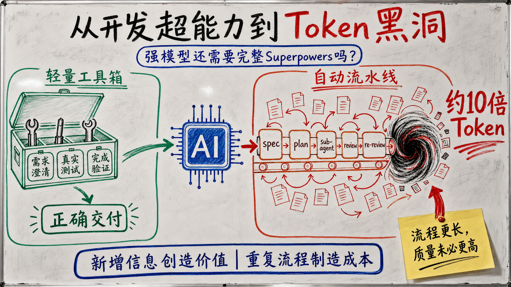

最近，**Superpowers的口碑开始反转。**

Reddit和X上，越来越多用户抱怨它让**简单修改变得缓慢、反复生成规格和计划、频繁启动sub-agent，并快速消耗Token**。有人[安装两天后就卸载](https://www.reddit.com/r/ClaudeCode/comments/1upt8mr/why_i_removed_superpowers_from_claude/)，有人发现[删除插件后每周额度消耗明显下降](https://www.reddit.com/r/OpenaiCodex/comments/1v3xyky/my_weekly_usage_limit_was_being_burned_almost/)，也有人认为它在强模型上已经成为[不必要的过度工程](https://www.reddit.com/r/ClaudeCode/comments/1uyy7y1/obrasuperpowers_overkill/)。这些评价最后都指向同一个问题：**模型已经变强以后，Superpowers还有没有实际作用？**

## Superpowers如何组织一次开发任务

[《如何管理一群聪明但缺乏判断力的实习生？》](../superpowers-management/source.md)介绍过Superpowers，讲解了为什么强制需求澄清、写计划、测试驱动开发、sub-agent执行、独立审查和完成前验证。文章将它概括为一套管理**聪明但判断力不可靠的实习生”**的软件工程流程。

作为业内公认的Coding Skill Framework，Superpowers在GitHub获得了[约26万Star](https://github.com/obra/superpowers)。即使在最近的批评中，很多用户仍认可它在需求边界不清、改动影响范围较大时的价值：先澄清需求，再形成规格和计划，用测试约束实现，并让实现者之外的Agent参与检查。支持者把这种方式称为[更接近真实工程实践的coding agent](https://x.com/NieceOfAnton/status/2035014556645564446)。

Superpowers把这些原则组织成**14个可组合技能**，并通过入口规则将开发任务引入一条**完整流水线**：

```text
brainstorming                 #澄清需求
  → design spec              #形成设计说明
  → writing plans            #拆解实施步骤
  → TDD                      #测试驱动开发
  → implementer subagents    #独立会话分工实现；每个sub-agent重新读取上下文
  → spec review              #检查实现是否满足需求
  → code-quality review      #独立检查代码质量
  → fix and re-review        #修复问题并复审
  → final verification       #用新鲜证据确认完成
  → branch finishing         #合并、提交PR、保留分支或清理工作区
```

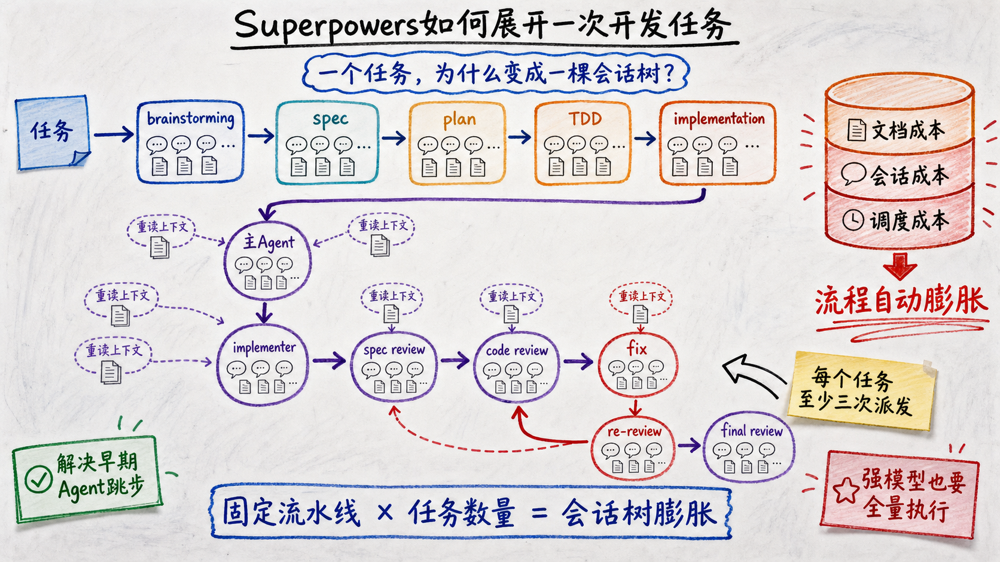

这套流程针对**早期coding agent的典型问题**：没有澄清需求就写代码，跳过测试，让实现者给自己验收，并在证据不足时宣布完成。现在，强模型本身已经会搜索代码、规划修改、编写测试和检查代码差异。完整Superpowers仍默认展开需求澄清、设计、计划、测试驱动开发、多轮审查与分支收尾，**很少根据任务规模缩短流程。**

由此产生两个需要实验回答的问题：模型越来越强的今天，**还需要为每个开发任务执行整套流程吗？**这些步骤在真实任务中究竟补充了需求信息、发现了代码缺陷，还是**主要增加了文档、上下文重建与调度成本？**本文将围绕真实实验，回答上述问题。

## 实验设计

### 实验目标

本实验评估在**同一强模型**上加入完整Superpowers后，软件交付质量、验收可靠性和资源消耗如何变化，并通过消融实验识别需求澄清与定向代码审查的**增量作用**。

### 研究问题

- **RQ1（主对照实验）：** 完整Superpowers相比原生Codex，产品分和资源消耗如何变化？工作流走完以后，隐藏验收是否可靠通过？
- **RQ2（消融实验）：** 单独保留需求澄清，以及在此基础上增加一次定向代码审查，分别会带来多少质量收益和资源成本？完整流程是否继续提供稳定增益？
- **RQ3（过程分析）：** Superpowers新增的Token主要花在代码实现、重复读取上下文，还是主Agent对sub-agent的派发、等待与结果汇总？

### 实验对照组

模型：GPT-5.6 Terra，推理强度High
工具：Codex 0.145.0

实验对象：

- **Bare（原生基线）：** 不安装Superpowers或其他工作流能力包。模型仍可使用Codex原生的代码搜索、规划、测试和sub-agent能力。
- **Full Superpowers（完整流程组）：** 使用同一模型和推理强度，只额外安装固定版本的Superpowers 6.1.1，并要求被测Agent完整进入其需求澄清、设计、计划、实现、审查和验证流程。

每次独立运行是一个实验单位，执行任务的Codex记为**被测Agent**。同一任务的两组运行使用相同代码起点、公开需求、模型、推理强度、权限、离线环境和停止规则，**唯一预设差异是是否安装完整Superpowers。**

### 任务来源

**八个任务全部来自已经合并的真实开源项目拉取请求。**实验把仓库恢复到对应拉取请求合并前的版本，只向被测Agent提供冻结后的公开任务说明，让模型从同一个起点重新实现该功能。

|任务|真实仓库与拉取请求|被测Agent收到的需求摘要|
|---|---|---|
| GitHub CLI字段选择| [`cli/cli#13823`](https://github.com/cli/cli/pull/13823) |为`gh project item-list`增加按字段名或字段ID选择输出的能力，并处理冲突、诊断和表格渲染。|
| ESLint自定义错误类| [`eslint/eslint#21032`](https://github.com/eslint/eslint/pull/21032) |扩展`preserve-caught-error`，允许用户配置需要检查的自定义错误类。|
| pytest插件入口| [`pytest-dev/pytest#14752`](https://github.com/pytest-dev/pytest/pull/14752) |让环境变量和`pytest_plugins`也能按插件入口名称加载插件。|
| pytest配置类型表达式| [`pytest-dev/pytest#14751`](https://github.com/pytest-dev/pytest/pull/14751) |让`addini(type=...)`支持联合类型、字面量类型及其组合。|
| bat终端输入净化| [`sharkdp/bat#3729`](https://github.com/sharkdp/bat/pull/3729) |增加终端内容净化模式，移除危险控制序列并保留正常文本。|
| SQLModel参数冲突| [`fastapi/sqlmodel#681`](https://github.com/fastapi/sqlmodel/pull/681) |拒绝字段定义中互相冲突的SQLAlchemy参数，同时保持合法调用兼容。|
| Axum自定义执行器| [`tokio-rs/axum#3704`](https://github.com/tokio-rs/axum/pull/3704) |为`axum::serve`增加自定义任务执行器，并覆盖连接、内部任务和优雅关闭。|
| Prometheus UTF-8协商| [`prometheus/client_python#1102`](https://github.com/prometheus/client_python/pull/1102) |实现指标名称转义、内容协商以及旧格式兼容。|

Bare与完整流程在每个任务上各独立运行3次，共得到48条主实验轨迹。消融实验选取三种信息结构不同的任务：低歧义的pytest插件入口、安全敏感的bat解析器，以及隐藏契约较多的Prometheus。除主实验的两组结果外，额外运行**只做需求澄清”**和**需求澄清后增加一次定向审查”**两个条件，每个条件各2次。

### 标准答案、交互与评分

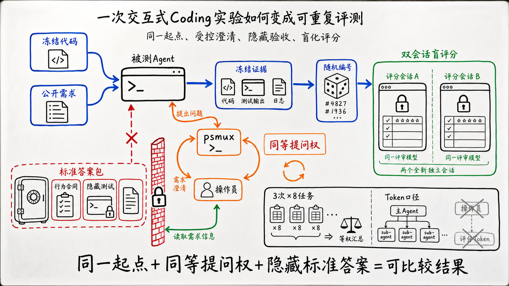

每个任务都有一套Ground Truth，本文称为**评测标准答案包”**。它来自真实拉取请求最终合并的行为、测试和审查记录，包含行为合同、六维评分标准和隐藏测试。被测Agent只能看到拉取请求合并前的代码与公开任务说明；**原始拉取请求、参考实现和评测标准答案均不可见。**

需求不清楚时，被测Agent可以向操作员（operator）提问。操作员是实验程序以无头模式启动的独立Agent：没有交互界面，在只读参考工作区中运行，并把回答返回被测Agent会话。它了解评测标准答案，但只能解释产品行为，不能提供代码、路径、补丁或隐藏测试。**Bare与完整流程拥有相同的提问权利**，所有问答都会记录。**Superpowers自己召出的代码审查Agent看不到标准答案**，其Token计入完整流程成本。

为了把原本需要人工继续输入的CLI任务变成可重复实验，我用Windows终端复用器[`psmux`](https://github.com/psmux/psmux)保持每条运行的终端会话。被测Agent需要澄清需求或确认设计时，以`OPERATOR_QUESTION:`结束当前回合；实验程序捕获问题，调用操作员生成回答，再通过`psmux`把`OPERATOR_ANSWER:`送回原会话。被测Agent继续使用原来的上下文，直到输出`IMPLEMENTATION_COMPLETE`。`psmux`负责维持和驱动交互通道，操作员负责回答问题。

被测Agent结束或超时后，实验程序冻结代码、测试和过程证据，用随机编号隐藏实验条件。随后，同一个固定评分模型在两个独立会话中按照六维标准打分，满分100；**隐藏测试的整套通过率单独报告。**每个任务先对3次运行求平均，再对8个任务做**等权平均**。Token统计覆盖主Agent和所有可归因的sub-agent，不包含操作员和评分会话。

两组使用相同代码起点、模型、推理强度、权限、离线环境、操作员协议和评分配置。**代码错误、测试失败、审查循环与超时都保留在结果中。**这组任务属于有意选择的诊断面板，消融实验每个新增条件只有2次运行，因此本文只报告**当前实验范围内的描述性结果**。完整隔离规则、评分权重和异常处理见文末附录。

## 实验结果

### RQ1：完整Superpowers是否提高质量，代价是什么？

> **RA1：**在当前八项任务上，完整Superpowers将等权平均分从73.54提高到84.08，**增加10.54分**；每次运行的Token从2.22M增加到23.44M，**约为Bare的10倍**。24次完整流程运行有23次走到完成状态，**只有16次通过整套隐藏测试**。质量收益集中在需求信息缺失的任务，需求明确的任务没有稳定受益。

|任务|   Bare分数|完整流程分数|分数变化| Bare每次Token |完整流程每次Token |  Token倍数|
| -------------------- | --------: | ---------: | ---------: | ------------: | -----------: | --------: |
| CLI item-list fields |     79.67 | **100.00** |     +20.33 |         1.99M |       23.45M |     11.8× |
| ESLint caught error  |     54.83 |  **98.17** |     +43.34 |         1.54M |       41.42M |     27.0× |
| pytest plugin        | **95.00** |      91.33 |      −3.67 |         1.38M |        9.46M |      6.8× |
| pytest addini        |     79.00 |  **89.33** |     +10.33 |         2.99M |       20.41M |      6.8× |
| bat sanitize         | **85.67** |      85.00 |      −0.67 |         4.97M |       50.89M |     10.2× |
| SQLModel constraints |     85.00 |      85.67 |      +0.67 |         1.18M |        8.07M |      6.8× |
| Axum executor        |     72.83 |  **80.50** |      +7.67 |         1.58M |       15.99M |     10.1× |
| Prometheus UTF-8     |     36.33 |  **42.67** |      +6.34 |         2.15M |       17.80M |      8.3× |
| **八项任务等权平均**        | **73.54** |  **84.08** | **+10.54** |     **2.22M** |   **23.44M** | **约10×** |

- **质量：**Superpowers五项明显胜出、两项落后、一项近似持平，八项任务等权平均提高10.54分。
- **成本：**八项任务的Token全部增加，范围为Bare的6.8–27倍；平均每次运行从2.22M增加到23.44M。
- **验收：** 24次完整流程运行中，16次通过整套隐藏测试，7次流程完成但仍遗漏验收条件，1次bat运行超时。**流程完成”只表示工作流结束。**

这三组数据共同留下一个问题：**八项任务的成本全部上涨，质量收益为什么只出现在部分任务？**下面回到四组真实作业现场，看两种被测Agent分别做了什么，以及额外Token最终换来了什么。

#### 场景一：需求上下文不完整（CLI）

> **CLI原始需求（节选）：** Improve `gh project item-list` so users can show selected project fields as additional table columns without first looking up opaque field IDs. Support repeatable selection by human-readable field name and an equivalent repeatable field-ID form.”

这项需求**说明了目标，却没有列全需求的详细规格**，包括参数冲突、字段定义分页、名称歧义、按ID匹配和表格安全渲染等细节仍需要补充。

**Bare的作业路径：**搜索现有实现，直接改代码、补测试并运行验证。CLI平均只用了29次工具调用和1.99M Token，但没有主动补齐缺失的规格要求，得到**79.67分**。

**Superpowers的作业路径：**先通过brainstorming向操作员逐项追问行为边界，再把回答写入设计与计划，随后分派实现、审查和修复。CLI达到**100分**，代价是**228.7次工具调用和23.45M Token**。

| CLI条件|分数|每次耗时|每次Token |每次工具调用|
|---|---:|---:|---:|---:|
|简略需求Bare | 79.67 | 7.47分钟| 1.99M | 29.0 |
|详细需求Bare | 99.67 | 11.32分钟| 3.16M | 41.0 |
|完整Superpowers | **100.00** | 44.38分钟| 23.45M | 228.7 |

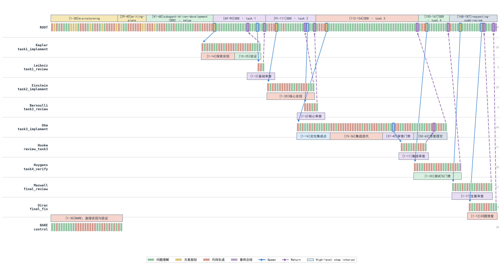

图中左下角是Bare：30个步骤集中完成探索、实现和验证。Superpowers则展开为187步主Agent会话，以及多条实现、审查、复核和修复子会话。长流程确实补出了缺失需求，说明**主要收益来自新进入上下文的契约信息**。这个场景支持主动澄清需求，**无法证明后续每一层流程都同样必要。**

#### 场景二：需求明确、改动局部（pytest）

> **pytest原始需求（节选）：** “Extend pytest's explicit plugin loading so that both the `PYTEST_PLUGINS` environment variable and the `pytest_plugins` global can name an installed pytest plugin by its `pytest11` entry-point name, just as `-p` already can.”

**这项任务的目标和落点都比较集中**，仓库中也有可复用的现有路径。

**Bare的作业路径：**pytest Bare找到`-p`已有的插件入口加载逻辑，让共享的`_import_plugin_specs`复用它，再补环境变量与`pytest_plugins`测试。它平均得到**95分**，消耗**1.38M Token**。

**Superpowers的作业路径：**在同一代码路径之外，又讨论更新日志编号、比较设计方案、写设计与计划、等待确认，并增加代码审查和分支收尾。它平均得到**91.33分**，消耗**9.46M Token**。

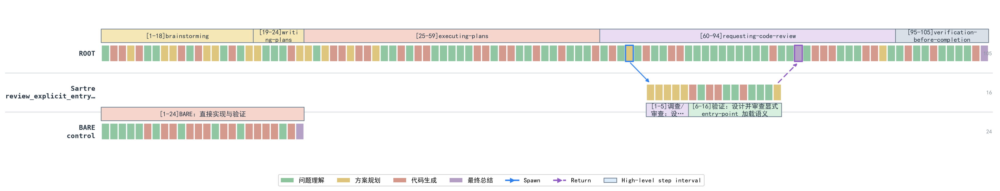

等尺图里，Bare在左下角用24步结束；Superpowers的主Agent会话有105步，另派生一条16步审查会话。**新增路径没有带来新的需求信息，分数反而低3.67分。**对这类明确、局部、易验证的修改，完整流程引入在带来固定Token成本的前提下反而没有基线版本效果好。

#### 场景三：复杂边界触发审查膨胀（bat）

> **bat原始需求（节选）：** “Add a `--sanitize=<when>` option to `bat` for safely displaying untrusted content. Sanitizing must remove terminal escape sequences, including 7-bit and 8-bit forms, and replace terminal-active control bytes and Unicode text-spoofing formatting characters with `U+FFFD`.”

这些名词都是终端控制序列：有的改变文字颜色，有的移动光标，有的控制屏幕内容。**清洗器漏掉其中任何一种，恶意文本都可能干扰甚至伪造终端显示**，因此这项任务确实需要严格测试和审查。

**Bare的作业路径：**直接搜索现有ANSI处理逻辑，完成CLI、清洗器和测试修改。它平均使用**4.97M Token、49次工具调用**，隐藏测试通过**2/3**。

**Superpowers的作业路径：**先做需求澄清、设计和计划，再为实现、规格审查、代码审查、复审和修复持续派生sub-agent。完整流程平均消耗**50.89M Token、434.3次工具调用**，隐藏测试只通过**1/3**。

|条件|分数| Token |耗时|工作会话数|工具调用|等待sub-agent |隐藏测试|
|---|---:|---:|---:|---:|---:|---:|---|
| Bare平均| **85.67** | 4.97M | 14.93分钟| 0 | 49.0 | 0 | **2/3** |
|完整流程平均| 85.00 | 50.89M | 119.26分钟| — | 434.3 | — | 1/3 |
|完整流程s-r1 | 86.50 | **74.92M** | **227.31分钟** | 14 | 651 | 109 |失败/超时|

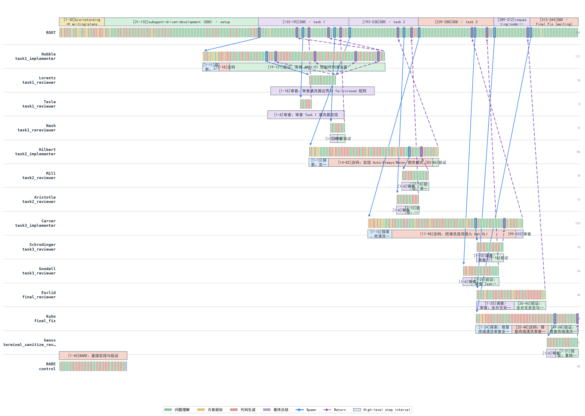

这张图展示了Superpowers如何把一个任务展开成一棵审查树。主Agent先把工作拆成三个实现任务：第一个任务先后派出两个reviewer和一个rereviewer，第二、第三个任务也分别经历多轮review；三项完成后，流程又进入全量review、最终修复，最终修复者再派出一名reviewer。图中的13个sub-agent，主要来自**“实现—review—修复—re-review”**模板的逐层展开。

13个sub-agent共享同一份计划，只是在已知边界内重复review。结果是整棵会话树消耗**74.92M Token并最终超时**，平均分和隐藏测试通过率仍低于Bare。**更多sub-agent没有带来更多信息，只放大了review与调度成本。**

#### 场景四：外部契约没有进入上下文（Prometheus）

> **Prometheus原始需求（节选）：** “Extend the Python client so plain-text and OpenMetrics exposition support the standardized escaping schemes and select them from the HTTP `Accept` header while remaining compatible with legacy scrapers.”

原始需求包含UTF-8 negotiation、escaping和legacy compatibility，但**没有列出公开常量、精确版本号、direct generator API、textfile与gateway等完整契约。**

**Bare的作业路径：**追踪现有exposition与HTTP negotiation代码，直接实现并运行局部测试，平均得到**36.33分**，消耗**2.15M Token**。

**Superpowers的作业路径：**写设计和计划，分别审查各阶段实现，再进入修复与复审。平均分提高到**42.67**，Token增加到**17.80M**；三次运行都宣告完成，隐藏测试完整通过率仍为**0/3**。

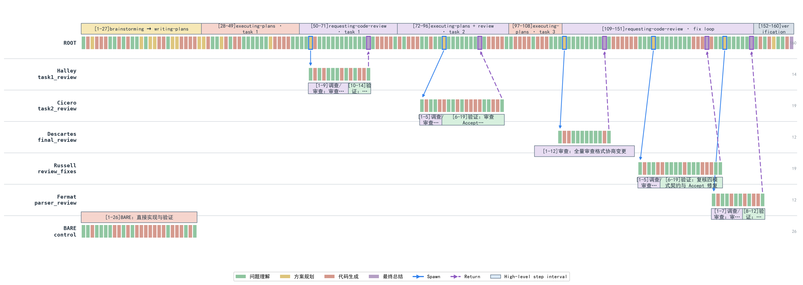

**多Agent的价值取决于能否引入新的独立信息。**四个sub-agent拿着同一份不完整设计文档反复review，就像一群只按领导指令执行、缺少独立判断的牛马：每个人都很忙，review和汇报一轮不少，**最初的错误前提却没人挑战。**流程因此从Bare的26步膨胀到160步，三次运行仍然0/3通过隐藏验收。**没有新的信息输入，更多Agents只会把同一套理解执行得更加一致。**

### RQ2：Superpowers的质量增益来自哪些步骤？

> **RA2：**三项小样本消融中，**只保留需求澄清的综合投入产出比最高**；增加一次定向代码审查后的结果不稳定；完整Superpowers在三个任务上都没有超过更轻量的最佳条件。当前证据支持**“按需启用需求澄清”**，还不足以判定其余技能全部无效。

消融实验比较Bare、只做需求澄清、需求澄清后增加一次定向审查，以及完整Superpowers四个条件。

|任务| Bare |只做需求澄清|需求澄清+定向审查|完整Superpowers |
|---|---:|---:|---:|---:|
| pytest plugin | **95.00 / 1.385M** | 92.25 / 1.759M | **100.00 / 3.716M** | 91.33 / 9.461M |
| bat sanitize | 85.67 / 4.974M | **96.25 / 4.962M** | 90.75 / 8.066M | 85.00 / 50.893M |
| Prometheus | 36.33 / 2.153M | **44.50 / 1.797M** | 41.75 / 6.291M | 42.67 / 17.803M |

单元格是**“评分/被测Agent运行Token”**。Bare与完整流程各3次，两个中间条件各2次。**这组消融只提供探索性证据。**

- **只做需求澄清：**bat几乎没有增加Token，评分提高10.58；Prometheus提高8.17；低歧义的pytest下降2.75。**需求澄清只在被测Agent缺少产品契约时带来明显收益**，代码量和编程语言解释不了这个差异。

- **增加一次定向review：**相对只做需求澄清，pytest增加7.75分，Token增加111%；bat下降5.5分，Token增加63%；Prometheus下降2.75分，Token增加250%。它偶尔能发现真实缺口，**整体结果并不稳定，更适合作为已知风险的保险。**

- **完整Superpowers：****三个任务都没有超过更轻量的最佳条件。**需求澄清可以从操作员获得新信息，review只能检查现有信息，完整流程还要支付计划、上下文重建和多Agent调度成本。当前样本中，**流程长度没有呈现出单调的质量收益。**

### RQ3：Superpowers的Token花在了哪里？

> **RA3：**在8个任务上，完整Superpowers平均消耗23.44M Token/run，**约为Bare的10.6倍**。代表性trajectory显示，新增成本并不只用于代码实现，而是反复出现在三个层面：实现前的设计与计划、sub-agent的上下文重建及多轮review，以及主Agent的派发、等待与结果整合。CLI和bat的轨迹进一步表明，采用sub-agent-driven路线时，**控制面与重复上下文会形成显著成本**；当流程没有引入新需求、测试失败或外部证据时，**这些额外投入很难转化为质量增益。**

下面以bat的s-r1为例，观察这三类成本在一次未收敛的sub-agent-driven运行中如何展开。**该运行共消耗74.92M Token。**为了避免重复记账，主Agent会话以首次Spawn为界：之前的仓库调查、brainstorming、设计/spec、writing-plans和依赖准备归入前置设计；之后归入编排与整合；所有工作sub-agent和运行时guardian归入sub-agent工作会话。三个数字均来自原始`token_count`事件。

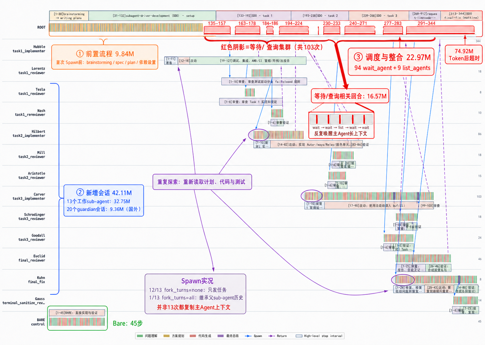

红色阴影把ROOT轨迹中的八组等待和状态查询单独标了出来；紫色箭头指向多个sub-agent重新读取计划、代码和测试的起点。原始Spawn记录显示，**13次派发中12次使用`fork_turns=none`，只发送任务说明**；唯一一次`fork_turns=all`发生在task1 implementer派生内部reviewer时。因此，**重复探索主要来自新会话重新读取工作材料**，并非13次都复制了主Agent上下文。

| Token成本来源       | 包含的工作                                              |      Token |  占74.92M | 相当于Bare平均4.97M |
| --------------- | -------------------------------------------------- | ---------: | -------: | -------------: |
| 主Agent前置设计      | 仓库调查、brainstorming、设计/spec、writing-plans、依赖准备       |      9.84M |    13.1% |           2.0倍 |
| sub-agent工作会话   | 13个implementation/review/fix会话＋20个guardian会话           |     42.11M |    56.2% |           8.5倍 |
| 主Agent编排与整合    | 首次Spawn后的派发、等待、状态查询、结果整合                         |     22.97M |    30.7% |           4.6倍 |
| **合计**          | 34个session文件                                        | **74.92M** | **100%** |      **15.1倍** |
- **前置设计的收益集中在brainstorming。**它通过操作员补充了需求契约；后续设计/spec和writing-plans主要整理已有信息，**没有继续扩大信息边界**。代码尚未开始，固定流程税已经形成。

- **sub-agent执行混合了必要实现和大量重复劳动。**implementer真正修改代码，具有直接产出；后续review、fix和re-review始终围绕同一份计划循环。12次`fork_turns=none`还要求新会话重新探索仓库、计划和测试，**重复探索与上下文重建没有换来新的验收信息。**

- **主Agent编排在本次运行中全部成为流程浪费。**它执行了94次`wait_agent`，等待和状态查询相关回合就消耗16.57M。主Agent没有在这些回合中获得新需求或直接推进实现，最终还停在等待reviewer并超时，**22.97M编排成本没有形成可观察的质量收益。**

这套工作流的根本问题，是无法区分**“需要新信息”**和**“继续检查旧信息”**。没有新的需求、测试或外部证据进入时，新增sub-agent只能重复读取同一份计划和代码，主Agent再为派发、等待和汇总**持续付费**。

这更像方案已经定稿，十个人围着**同一份会议纪要层层会签**：有人落实，有人review，有人追进度，**却没人去现场验证。**签字越来越多，最初遗漏的问题也被包装成了**集体共识**。

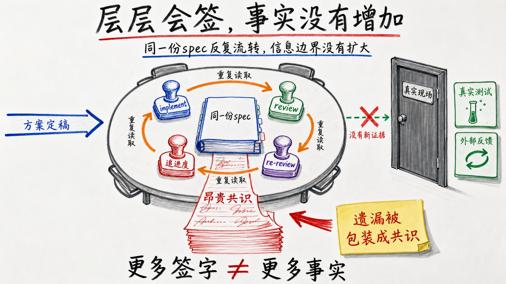

此案例表明，**sub-agent数量和流程完成度都不能充当质量代理。**Superpowers没有扩大信息边界，只把同一套理解实现、review和修复得更久。这正是它在强模型上**从工程约束滑向Token黑洞**的机制。

## Superpowers的问题：能力包开始接管Agent

Superpowers仍然包含有价值的工程原语。需求模糊时做brainstorming，出现真实失败后系统化调试，结束前运行一次新鲜验证，这些做法都值得保留，真正需要修改的是它对Agent的控制方式。

- **Hook不该抢方向盘。**`hooks.json`会在启动、清空上下文和压缩后同步注入完整的`using-superpowers`；后者又规定，只要有1%的可能适用，就必须在任何回复和操作前调用Skill。能力包应该等待调用，安装后常驻接管每次决策，让我想起了3721上网助手：你装的是工具，最后得到的却是一个很难绕开的流氓软件。

- **先判断任务，再选择流程。**`brainstorming`明确要求**Every project**都经过仓库调查、逐轮提问、多个方案、设计确认、写spec、提交spec、用户review和writing-plans，连单函数和配置修改也不例外。改一行配置和开发跨模块功能不该走同一条流水线。Agent需要先判断需求歧义、改动范围和失败成本，再决定直接实现、简短计划或完整设计。

- **给用户选择时，不要提前替用户选择。**`writing-plans`提供Subagent-Driven和Inline Execution两个选项，却把前者放在第一位并标记为recommended”；`executing-plans`又要求平台只要支持sub-agent，就优先使用subagent-driven-development。用户每次都能选，产品文案却持续把人推向最昂贵的方案。两个选项应该中立呈现，同时告诉用户预计会启动多少会话、增加几轮review和多少成本。

- **sub-agent必须先证明收益**。当前流程中，每个任务默认经过implementer、spec reviewer和code-quality reviewer，所有任务结束后还有final reviewer；发现问题继续fix和re-review，并且明确禁止跳过review。sub-agent适合真正可并行的任务、拥有独立信息的检查，或者确实需要隔离上下文的工作。只是把同一份计划重新读一遍，不值得Spawn。

> Superpowers应该是一只工具箱，Agent遇到具体问题时拿出合适的工具。现在的设计更像安装工具箱以后，装修队自动进场：先画图、再开会、再分包、再监理，不管用户只是想拧紧一颗螺丝。

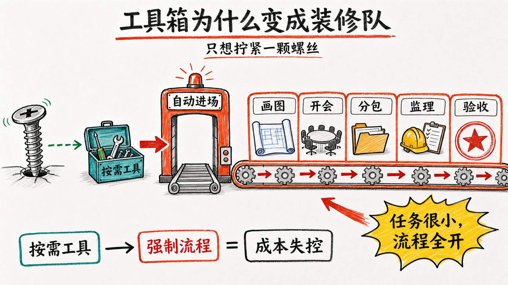

**我的个人建议：**

- 保留按需brainstorming、systematic-debugging和verification-before-completion。这三项分别补充需求信息、真实失败证据和完成前验证，收益来源清楚。

- 取消从brainstorming到spec、plan、sub-agent和多轮review的自动串联。先判断需求歧义、改动范围和失败成本，再动态组合所需Skill。

- review由风险触发，不按任务数量触发。公共API、并发、安全和兼容性变更安排一次定向review；普通局部修改直接测试即可。

- sub-agent设置明确的Spawn数量、嵌套深度、review轮数和Token预算。派发前先说明它能带来什么独立收益。

- 没有新需求、新测试失败或新外部证据，就停止继续派Agent。

## 结语：Superpowers没有消失，但完整流程该退场了

Superpowers曾经用外部纪律补足模型不会规划、容易跑偏的问题。到了GPT-5.6，这些通用能力已经大量进入模型和原生Harness，再强制执行同一套流程，就会产生重复控制。

本实验中，完整Superpowers平均提高10.54分，却消耗约10倍Token。真正稳定的收益主要来自补充需求和真实验证；固定的spec、plan、多轮review和sub-agent调度，常常只增加上下文重建与等待。

软件开发的目的不是让Agent表现得思考充分、干活努力，而是用有限成本降低不确定性。一个步骤至少应该完成一件事：引入新的事实、暴露新的失败，或者约束一个明确风险。如果三者都没有发生，流程再完整，也只是在重复加工已有信息。

模型升级能够内化通用的方法，却不能预先拥有正在变化的现实。它可以学会怎样规划、review和测试，却不可能提前知道当前项目的真实需求、团队刚做出的决定和此刻的运行结果。Skill Framework长期存在的空间，不是替模型规定思考顺序，而是把这些外部事实和反馈接入任务。

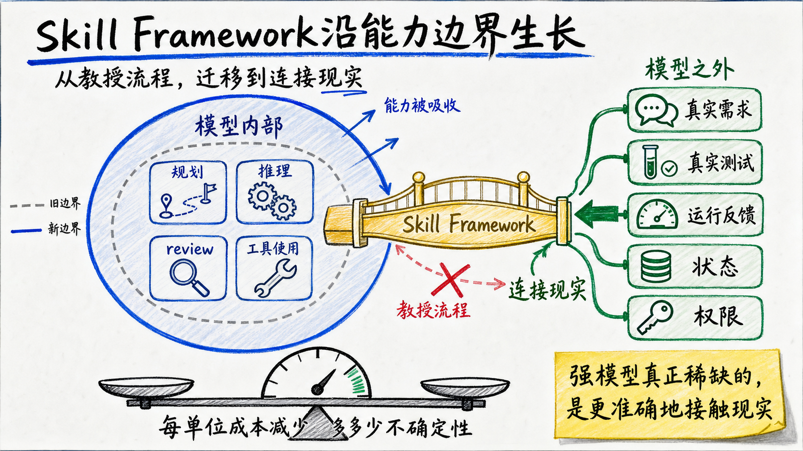

因此，应该保留按需澄清、系统调试和完成前验证，取消默认串联的完整流程。每次模型升级后重新评测；不能持续提高结果、降低风险的Skill，就应该降级或删除。

Superpowers没有失去全部价值，但它不再适合充当默认开发方法论。它应该退回工具箱：由问题决定是否调用，由结果决定是否保留。

## 实验方法附录

下面是用于复核的完整设置，不影响正文结论，可以跳过。

###八个任务、仓库与原始PR

|任务|上游仓库与原始PR |冻结起点|被测Agent收到的需求|
|---|---|---|---|
| CLI item-list fields | [`cli/cli#13823`](https://github.com/cli/cli/pull/13823) | `ae66a1c` |为`gh project item-list`增加可重复的`--field`与`--field-id`，支持名称或ID选择、错误诊断和正确的表格值渲染。|
| ESLint errorClassNames | [`eslint/eslint#21032`](https://github.com/eslint/eslint/pull/21032) | `c30d808` |扩展`preserve-caught-error`，允许配置需要检查cause preservation的自定义错误类，同时保持内置错误类兼容，并补齐schema、类型、文档和测试。|
| pytest plugin entry points | [`pytest-dev/pytest#14752`](https://github.com/pytest-dev/pytest/pull/14752) | `f1211ba` |让`PYTEST_PLUGINS`和`pytest_plugins`能像`-p`一样引用`pytest11` entry point，并保留distribution metadata、terminal header与`--traceconfig`行为。|
| pytest addini type expressions | [`pytest-dev/pytest#14751`](https://github.com/pytest-dev/pytest/pull/14751) | `ef052d0` |让`Parser.addini(type=...)`支持基本类型、Union、字符串Literal和混合union，并统一各配置入口的默认值、错误与help。|
| bat sanitize | [`sharkdp/bat#3729`](https://github.com/sharkdp/bat/pull/3729) | `971f967` |新增`--sanitize=auto\|always\|never`：移除终端转义序列，替换危险控制与Unicode欺骗字符，保留正常文本，并贯通CLI、配置、公开API、文档和测试。|
| SQLModel field constraints | [`fastapi/sqlmodel#681`](https://github.com/fastapi/sqlmodel/pull/681) | `e4e1385` |拒绝`sa_column`、`sa_relationship`与其他SQLAlchemy参数的矛盾组合，同时保证runtime、typing overload和既有合法调用。|
| Axum custom executor | [`tokio-rs/axum#3704`](https://github.com/tokio-rs/axum/pull/3704) | `309d1bd` |为`axum::serve`增加自定义task executor，覆盖连接、Hyper内部任务和graceful shutdown，同时保留Tokio默认行为。|
| Prometheus UTF-8 negotiation | [`prometheus/client_python#1102`](https://github.com/prometheus/client_python/pull/1102) | `d24220a` |为text与OpenMetrics exposition实现标准名称转义和`Accept`协商，覆盖HTTP、textfile、gateway与安全的旧格式fallback。|

这是7个仓库中的8个真实任务，pytest提供了两个任务。任务经过有意选择，构成诊断面板，没有从全部软件工程任务中随机抽样。

###评测标准答案与交互协议

```text
PR前源码→单一冻结提交、删除远端→被测Agent运行
PR最终行为与测试→行为合同+评分标准+隐藏测试+操作员→评测侧
```

被测Agent只能看到代码、仓库规则和公开任务文件`task.md`。评测侧从上游最终实现和测试中提炼可观察合同，冻结行为合同`contract.md`、评分标准`rubric.md`、操作员说明`operator-guide.md`、定向隐藏测试和只读参考项目。评判只检查行为，被测Agent的补丁可以采用不同于上游的实现结构。

公开需求给出功能类别，隐藏合同固定精确边界。例如bat的被测Agent已经知道要处理终端序列、危险控制字符、Unicode欺骗字符与模式集成；隐藏合同进一步枚举CSI、OSC、DCS、SOS、PM、APC、C1 introducer、截断序列、bare CR和模式优先级。

被测Agent需要澄清时，以`OPERATOR_QUESTION:`结束当前回合。外层实验程序通过`psmux`保持终端会话，调用独立的无头操作员生成回答，再用`OPERATOR_ANSWER:`恢复原会话。被测Agent完成时返回`IMPLEMENTATION_COMPLETE`，实验程序依次冻结证据、审计运行、盲化评分并汇总结果。

操作员可以回答需求问题，也可以检查被测Agent主动提交的设计是否遗漏可观察行为；不能泄露代码、路径、补丁或测试正文，不能替被测Agent决定实现架构，也不主动审查实现。Bare与Superpowers使用同一套提问权利和回答边界，所有问答原样记录，操作员的Token单独统计。

Superpowers的代码审查者由被测Agent召出，只能看到被测Agent可见的公开任务、设计说明、计划、代码差异与自测。它没有评测标准答案和裁判权限；其消耗全部计入Superpowers被测Agent运行Token。

###评分与聚合

被测Agent结束或超时后，实验程序冻结Git状态、包含未跟踪文件的代码差异、测试输出、过程日志和会话用量，再用随机编号生成评审包。评分模型看到公开任务、隐藏合同、评分标准、匿名代码差异、必要的基线代码和验证输出，看不到实验条件标签与被测Agent自评。

|任务|六项评分维度及权重|
|---|---|
| CLI | CLI surface 15；解析诊断15；query/pagination 15；渲染25；端到端表格15；安全与维护性15 |
| ESLint | schema/types 15；名称匹配20；全局内置类判定20；参数位置20；安全suggestion 15；文档验证10 |
| pytest plugin |多入口来源25；module fallback 15；metadata/reporting 20；启动与重写15；文档10；测试15 |
| pytest addini |类型归一化20；Union 20；Literal 20；默认值/错误/help 15；API文档10；测试15 |
| bat |集成15；终端序列25；危险字符20；保留与模式15；用户材料10；测试15 |
| SQLModel | column冲突25；relationship冲突15；typing 20；兼容性15；测试15；范围10 |
| Axum |公共API 20；connection/Hyper 25；shutdown 20；兼容性15；运行测试15；文档范围5 |
| Prometheus | escaping 25；协商/fallback 25；exposition 20；集成15；测试10；范围5 |

每条补丁由同一个固定评分模型在两个全新、无插件、互相隔离的会话中评分。独立”仅指会话与采样独立，不表示使用了两个不同模型，也不构成统计独立或人类双盲。盲化只隐藏实验条件标签，代码形态仍可能泄露工作流线索。

```text
单次运行分数=两个评分会话分数的平均
任务×实验条件分数= 3次运行的平均
八任务总分= 8个任务等权平均
```

隐藏测试单独报告，不直接兑换评分标准中的分数。前者检查精确验收，后者衡量部分完成度。

###公平性、失败与边界

|控制项|固定设置|
|---|---|
|模型|被测Agent与sub-agent均为GPT-5.6 Terra、高推理强度|
|起点与任务|同一pre-PR commit、同一公开`task.md` |
|唯一处理差异|完整流程组强制使用Superpowers 6.1.1、提交`d884ae0`；Bare不安装|
|权限| workspace-write、approval never、网络与web关闭、相同依赖缓存|
|隔离|每次运行使用独立`CODEX_HOME`，不可见参考实现、隐藏测试、其他运行与盲化映射|
|操作员|相同提示词、知识边界、模型、只读权限和交互协议|
| sub-agent |权利和模型相同，最多4个并发child thread |
|评测|同一行为合同、评分标准、隐藏测试、匿名打包方式和评分模型配置|
|重复|每格3次；被测Agent失败、测试失败和超时保留，不挑最好的一次|

认证、模型不可用、隔离破坏和实验程序崩溃属于基础设施失败，保留证据后按原条件重跑；被测Agent写坏代码、陷入审查循环或超时属于产品结果，不能删除。最早一批名义上的Superpowers运行只看见技能目录，却没有加载入口规则，因此整体作废；正文使用修正后的强制入口实验批次。

CLI首轮评审包曾误带`docs/superpowers/specs`和`plans`路径，可能泄露treatment。12份评分整体作废并归档；正式评审改用两组对称过滤的`product-code.diff`后重新运行。

各campaign的冻结上限并不完全相同。正文采用的CLI `forced-bootstrap-v9`是120分钟、2000万soft-token、最多4个sub-agent；后来五臂campaign是120分钟、30 candidate turns、1亿soft-token和最多4个并发sub-agent。嵌套进程和收尾会使观测wall time越过名义上限，正文仅把跨campaign耗时用于观察量级。

八任务来自多个实验批次，但不能把它们全部称为跨批次拼接。CLI的Bare与完整流程同在`forced-bootstrap-v9`，ESLint两组也来自同一个六条件实验批次；pytest插件入口、bat、Axum、SQLModel与Prometheus各自在自己的多条件实验批次内对照。只有pytest配置类型表达式的Bare与完整流程分属两个兼容的冻结批次。所有结论仍只是当前模型、任务面板和协议下的描述性结果。

---

##数据与证据

本文主要数据来自本地冻结实验与原始rollout重建：

- `sdd-exp/protocol.md`
- `sdd-exp/reports/agentic-coding-workflows-technical-manuscript.md`
- `sdd-exp/reports/superpowers-comprehensive-evaluation.md`
- `sdd-exp/reports/superpowers-necessity-ablation-supplement.md`
- `sdd-exp/reports/superpowers-trajectory-evidence-report.html`
- `sdd-exp/reports/trajectory-visualization-design.md`
- `sdd-exp/reports/capability-task-score-matrix.md`
- `sdd-exp/packs/tasks/*/task.md`与对应的`ground-truth/{contract,rubric,operator-guide}.md`

实验结论只适用于当前模型、任务面板、固定版本与处理协议。8个任务没有随机覆盖全部软件工程分布；每个实验单元3次运行不足以给出精确总体估计；需求澄清消融同时包含对操作员的访问，不能把全部增益归因于Skill文本；执行轨迹用于解释过程，不能单独证明因果。本文使用约数10倍”，避免把不同计量口径下的小数差异写成虚假的精确性。

相关外部材料：

- [obra/superpowers](https://github.com/obra/superpowers)
- [Issue #750：高Token与review loop](https://github.com/obra/superpowers/issues/750)
- [Issue #1120：简单任务触发多Agent review](https://github.com/obra/superpowers/issues/1120)
- [Issue #350：sub-agent嵌套重走Superpowers](https://github.com/obra/superpowers/issues/350)
- [Reddit：Why I removed Superpowers](https://www.reddit.com/r/ClaudeCode/comments/1upt8mr/why_i_removed_superpowers_from_claude/)
- [Reddit：删除Superpowers后额度消耗明显下降](https://www.reddit.com/r/OpenaiCodex/comments/1v3xyky/my_weekly_usage_limit_was_being_burned_almost/)
- [Reddit：Superpowers是否已经overkill](https://www.reddit.com/r/ClaudeCode/comments/1uyy7y1/obrasuperpowers_overkill/)
- [Reddit：Superpowers burned through my limit](https://www.reddit.com/r/claude/comments/1rzm394/superpowers_burned_through_my_limit/)
- [Reddit：Are Superpowers overkill for Opus?](https://www.reddit.com/r/ClaudeAI/comments/1sy1zzf/are_superpowers_overkill_for_opus_47/)
