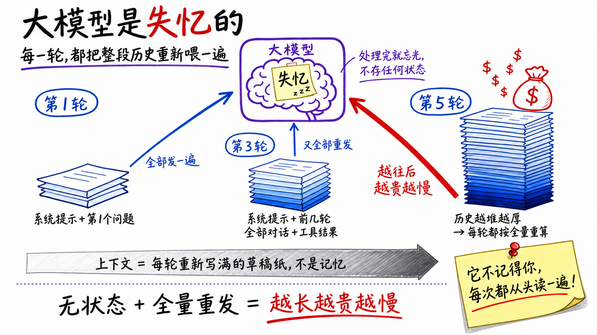
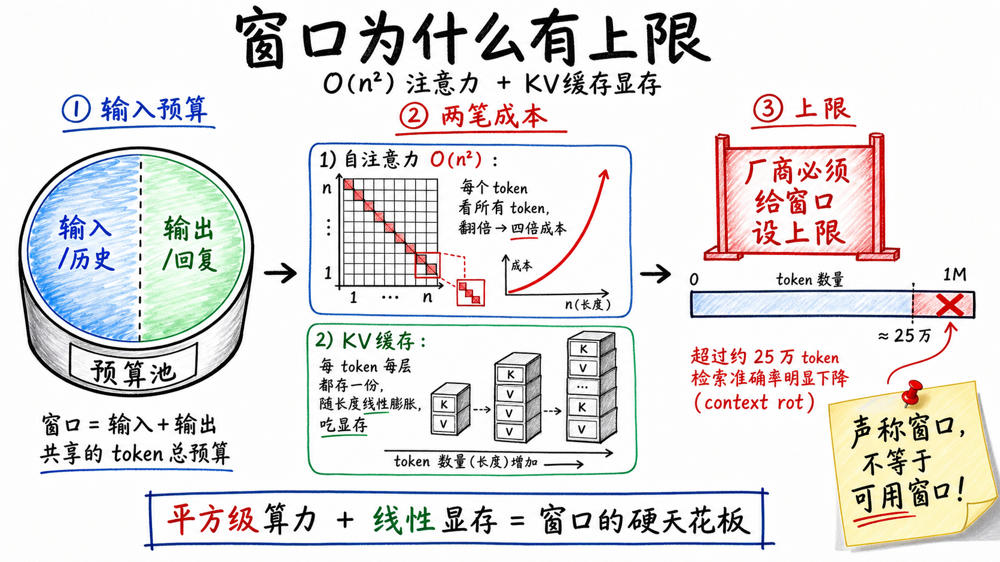
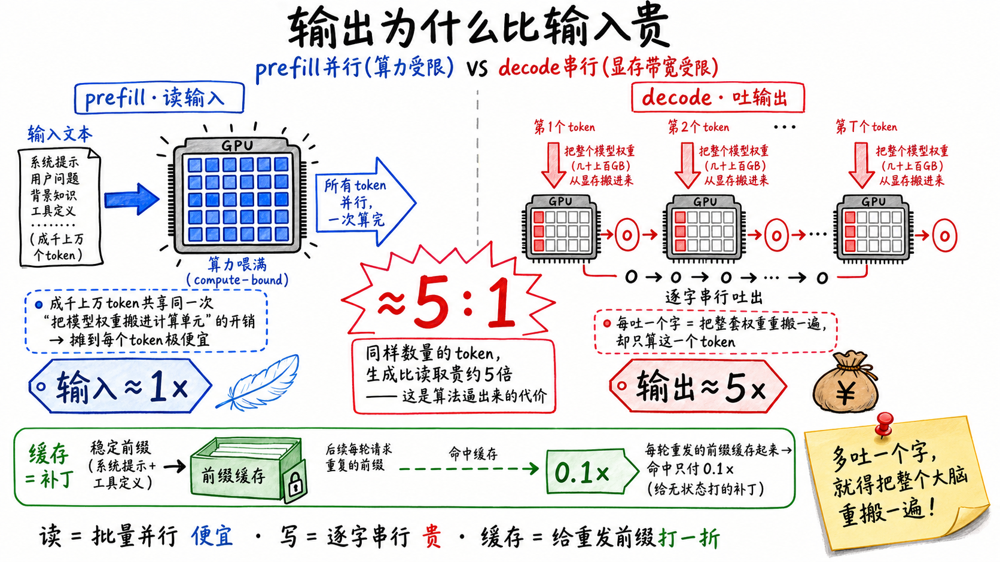
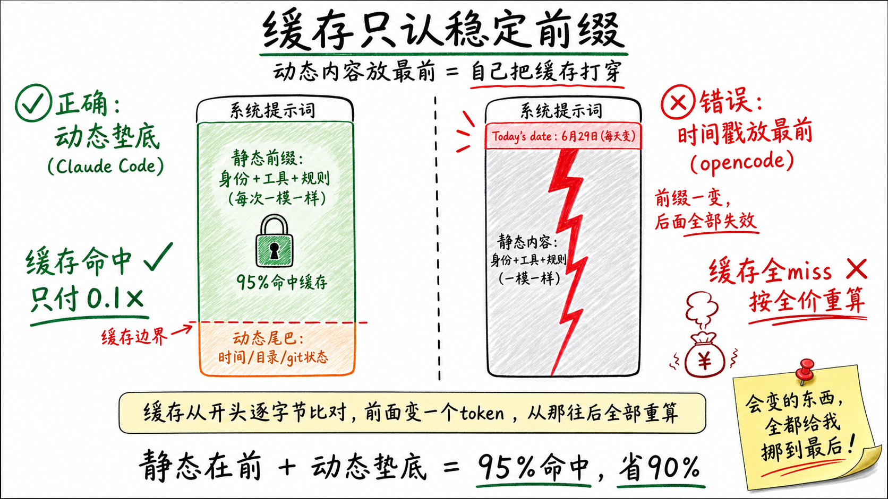
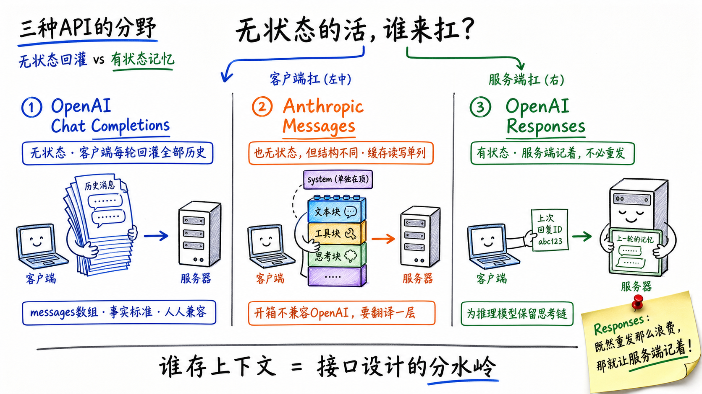
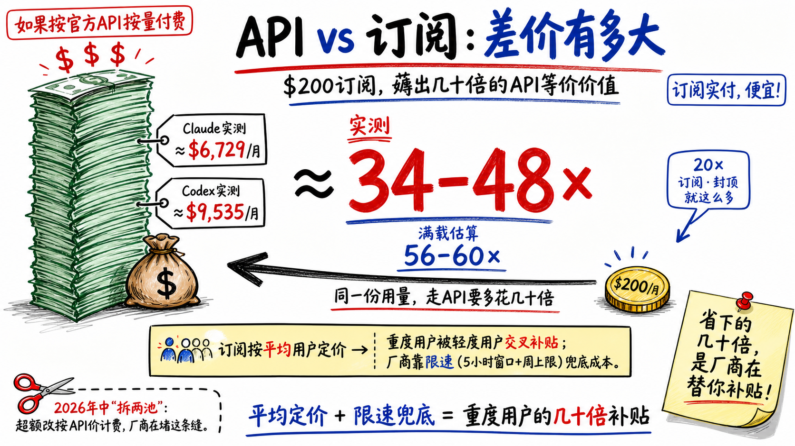
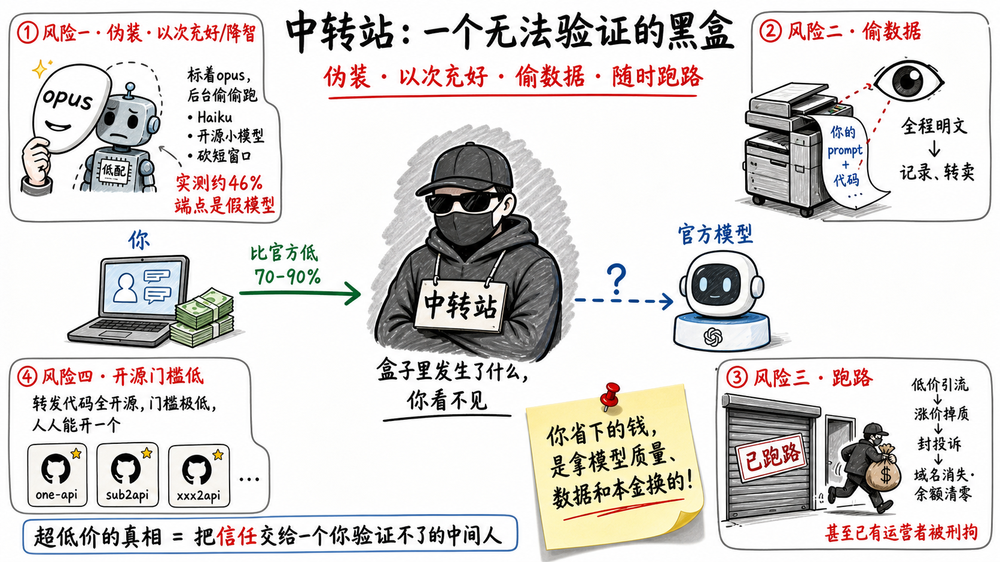

# token的基本原理

**—— 一切成本、上下文窗口和中转站，都从"模型不记得你"这一条推出来**

---

你和大模型那场看起来连贯的"对话"，在底层根本不存在。模型不记得上一句话。每问一次，系统都是把你们之前说过的全部内容，从头到尾重新念给一个**当场失忆**的人听，它读完整段，回你一句，然后立刻忘光。

这条约束有个名字——**跨轮无状态**。它听起来像个无关紧要的实现细节，但它其实是总开关。token怎么算、上下文窗口为什么有上限、每次tool call在后台干了什么、为什么对话越长越贵越慢、为什么会冒出"prompt缓存"这种东西、为什么订阅比API便宜、为什么会有token中转站——这些问题表面上各自独立，往下挖到底，全都落在"模型不记得你"这一条上。

## 一、token：模型真正吃进去的最小单位

模型读的不是字、也不是词，是**token**——BPE按高频把文本切成的子词碎片，常见串如`the`、`def`各占一块，罕见词拆成几小块。

记几个数。英文约**4字符=1个token**；中文贵得多，**1个汉字约1~1.7个token**，同样意思比英文多烧约六成；代码更费，**10万行代码约80万~100万token**，等于说1M窗口最多塞下约8万行纯代码。这笔"中文税"的根子在分词器的训练语料，不在中文本身——Qwen、DeepSeek这类用中文语料训出来的国产模型，中文反而比英文更省。

## 二、无状态：窗口不是记忆，是每次重念的稿子

大部分人对"对话"的心智模型是错的。我们默认模型像个人，记得刚才聊过什么，你补一句它就接着往下说。实际不是。模型处理完一次请求就把一切忘干净，**它没有任何跨请求保留的内部状态**。

那为什么它"看起来"记得？因为每问一次，客户端都会把**到目前为止的全部历史**——系统提示、你说过的每句话、它回过的每句话——重新拼成一大段，整个塞进去再发一次。模型当场读完这整段，才"显得"记得上下文。

所以**上下文窗口**这个词，经常被误解成"模型的记忆有多大"。它不是记忆。它是**单次推理能容纳的token总预算**——而且输入和输出共用这一个池子，你塞进去的历史和它将要生成的回复，加起来不能超过这个数。Anthropic的文档说得很直白：上下文窗口指模型生成回复时能引用的全部文本，"包括回复本身"。

它更像一块每次都要**重新写满的草稿纸**，不是一个存档。这一条记牢，后面所有的成本现象都是它的直接推论。

## 三、窗口为什么有上限：注意力矩阵 + KV Cache

既然每次都要把历史重念一遍，窗口能不能无限大？不能。有两笔硬成本拦着。

**1. 注意力是平方级的。** Transformer的核心机制是每个token都要"看"序列里所有其他token，n个token就是一张n×n的关系矩阵。token翻倍，这张表的计算量翻四倍。这是平方增长，不是线性，所以窗口越长，处理一次的算力代价涨得越凶。

**2. KV缓存吃显存。** 模型为了不重复计算，会把每个token算过的中间结果存下来，这就是KV缓存。它要为**每个token、每一层、每个注意力头**都存一份，随上下文长度**线性膨胀**，长上下文里往往是显卡里最大的那块占用。

这两笔叠起来，就是窗口必须设上限的物理原因。而且"标到1M"和"1M都好用"是两回事：大量测试显示上下文超过约25万token后，检索准确率明显下滑，俗称context rot。**声称窗口，不等于可用窗口。**

## 四、每次tool call在做什么：无状态的账单

你让Claude Code改代码，它读文件、跑命令、再改文件——看起来像一个连续干活的智能体。底层发生的是一个循环，而且每一圈都因为无状态付了全额：

1. 客户端发请求，带上你的任务、工具清单。
2. 模型不亲自执行任何东西。它只**返回一个结构化的请求**："请帮我运行`read_file(a.py)`"。
3. 客户端真正去执行，拿到结果。
4. 客户端把**原来的全部历史 + 模型刚才那句 + 工具返回的结果**，重新拼成一个更长的请求，再发一次。
5. 回到第2步，直到模型说"我说完了"。

注意第4步。因为模型无状态，**每一圈工具调用都是一次完整的重发**：系统提示、工具定义、之前所有轮的对话、之前所有的工具输出，一个字都不能少地再传一遍。一个干了20圈的agent，最早那段上下文被模型从头读了将近20遍。

"为什么对话越长越贵越慢"，根子就在这里：

- **越贵**：每一轮的输入都包含前面所有轮的累积，成本随对话长度近似线性往上爬。你以为只是多问了一句，其实是又把整本历史重算了一次。
- **越慢**：模型吐第一个字之前，得先把这一整段输入读完，输入越长，前置等待越久。

agent的工具调用之所以烧钱，是无状态逼着它把同一段上下文反复重念。

## 五、token怎么算：四种价位，和"缓存"这个补丁

按token计费，没有"按次"的固定费。但同样是token，价格分四档，理解这四档基本就理解了账单：

| 类别 | 含义 | 相对价格 |
|---|---|---|
| 输入token | 你发进去的，含历史和工具定义 | 基准价1× |
| 输出token | 模型生成的 | 约**5×** |
| 缓存写入 | 把稳定前缀存进缓存 | 约1.25× |
| 缓存读取 | 命中缓存，直接复用 | 约**0.1×** |

**输出为什么比输入贵好几倍？** 先搞清楚一件事：大模型生成一次回复，推理分成两个阶段。先把你的整段输入一次性读进去、算出内部状态，这一步叫**prefill**；再从这个状态出发，一个token一个token往外吐，这一步叫**decode**。两个阶段干的活不同，成本天差地别。

**prefill读输入，是并行的。** 整段输入在一次前向里同时算完所有token，矩阵乘把GPU算力占满，这一步**算力受限**，几千几万个token分摊下来每个都很便宜。

**decode吐输出，是严格串行的。** 每生成一个token，都要把整张网络完整跑一遍前向；这一遍真正的瓶颈不在算力，而在**数据搬运**——既要把几十上百GB的模型权重从显存读一遍，还要把越来越长的KV缓存读一遍，而单个token的计算量极小，于是GPU大半时间在等数据搬过来，**显存带宽受限**、利用率很低。

prefill一次前向算完整段，decode却要为每个token各跑一遍完整前向，这是输出比输入贵好几倍的主要原因——至于为什么恰好定到工整的5∶1，那还掺了占用GPU时长、批处理、缓存折扣等定价因素。**模型每多吐一个字，就得把整张网络重新跑一遍。**

**缓存是给无状态打的补丁。** 每轮被迫重发的那段前缀——系统提示加工具定义——整场不变，缓存下来下次命中只付一折，写入贵两成五、命中一次就回本。还有个隐性成本：用了工具，系统会自动往输入里塞一段几百token的工具系统提示，连同你的工具定义每轮都重算，agent账单里很大一块就是这些固定开销。

## 六、coding agent怎么吃满KV缓存：一道边界标记的工程

一个coding agent最关键的省钱工程，就是让那段每轮重发的巨大前缀尽量命中缓存。铁律只有一条：缓存从开头逐字节比对，**前面变一个token，后面全部按全价重算**——所以把不变的堆前面，会变的全赶到后面。

Claude Code把这条铁律做进了代码，系统提示词被一道显式边界切成两半：

- **静态前缀**：身份、工具用法、行为规则、输出风格——整场乃至跨会话一模一样。
- **动态尾巴**：工作目录、git状态、系统、模型名、加载的记忆MEMORY.md、MCP说明——每个会话甚至每轮都可能变。

源码里一个叫`__SYSTEM_PROMPT_DYNAMIC_BOUNDARY__`的标记划在静态与动态的交界，缓存断点就打在这——之前进全局缓存，之后不进。设计文档原话：这一刀让**95%以上的系统提示词token命中缓存**；注释还警告别动这个标记，另有一段逻辑专门盯着命中率掉没掉。

潜台词是：**系统提示词是个有版本、有缓存边界的数据结构**，你往前面塞的每个token，都在决定后面整段历史能不能复用。

反面教材现成的。开源agent opencode早期把一行`Today's date`放进了缓存前缀，[issue #29672](https://github.com/sst/opencode/issues/29672)说得很清楚：**一过午夜这字段一变，后面所有token缓存全miss**，第二天第一个请求整段按全价重算；同一个环境块还列了工作目录最多两百个文件，文件一增删前缀照样变。修法就一条：把会变的挪出缓存前缀。

一句话：**任何每请求都变的东西——时间戳、随机ID、每次不同的文件清单——混进缓存前缀，就会让你为整段历史反复付全价。** Claude Code那道显式边界，针对的就是这个。

## 七、三种API：无状态这条约束，怎么塑造了接口

三种主流API的差别，本质都是在回答同一个问题：**无状态这条约束，该让谁来扛？**

**OpenAI Chat Completions——事实标准，无状态。** 一个`messages`数组，system/user/assistant/tool几种角色排好，每轮由**客户端**把完整历史重新塞进去再发，状态甩给客户端自己维护。它能成为全行业通用格式靠的是可移植：改个地址就能把同一套代码指向别家服务，vLLM、Ollama、各种中转站对外都长这个样。

**Anthropic Messages——也无状态，但结构不兼容。** 同样靠客户端回灌历史，形状却不一样：system是顶层独立参数；内容是分块的，文本块、工具块、思考块各自成型；用量统计也精细得多，缓存读、缓存写单独列。纯OpenAI格式的客户端直接对接它跑不通，中间得翻译一层。

**OpenAI Responses——把状态搬到服务端的尝试。** 核心变化就一条：**有状态**。你不用每轮重发全部历史，只带上一次回复的ID，服务端自己接着往下走。为什么？推理模型的思考链每轮丢掉就接不上，有状态让它跨轮复用自己之前的推理。说白了，这是OpenAI对"无状态太贵太笨"的正面回应：既然重发那么浪费，就让服务端记着。

## 八、API计费和订阅：同一份token，差价从哪来

同样用Claude，你有两条路：

**按量付费的API。** 明码标价，2026年Claude Opus每百万token约输入$5、输出$25，Sonnet $3/$15，烧多少付多少。

**订阅。** Pro约$20一个月，Max $100到$200。它不按token卖，按"额度"卖——限制是滚动的5小时窗口加每周上限，厂商不公布精确token数。

那订阅到底有多划算？我把自己两个$200的20×订阅——Codex、Claude Code各一个——一个月的本地日志完整导出，按官方API的list price逐条折算了一遍：同样这些token如果走API，要花多少钱。

先看Claude Code这一个账号，一个月的账：

| 类型 | tokens | 费用 |
|---|---|---|
| 输入input | 15，724，829 | $79.85 |
| 缓存写入cache write | 216，040，482 | $1，901.58 |
| 缓存读取cache read | 7，162，322，660 | $3，733.56 |
| 输出output | 39，844，730 | $1，014.40 |
| **合计** | **7，433，932，701** | **$6，729.39** |

最大头是**缓存读取，占55%，而且已经是0.1×的折扣价**——这71.6亿token按全价算值$37，335。同一段前缀被重读了几千遍，正是"无状态→每轮重发→靠缓存压住成本"的真实账单。

Codex那边同理：一个月120亿token、$9，535，其中95%是缓存输入，同样靠缓存压成本。

$6，729——这是一个账号、一个月，按官方API价本该付的钱。**我实付了多少？$200。** Codex那个账号更高：$9，535的量，同样只付$200。两个并列：

| 工具 | 等价API成本 | 月订阅 | 实测倍数 | 满载估算 |
|---|---|---|---|---|
| Claude Code | $6，729 | $200 | **≈34×** | **≈56×** |
| Codex | $9，535 | $200 | **≈48×** | **≈60×** |

三四十倍。同样的用量，订阅价只是API价的零头。而且这还没见顶——我两个账号的窗口平均才用到六七成、远没跑满，Claude约60%、Codex约80%；真用满，是**五六十倍**。数据口径是各约一个月、去重后的真实请求日志。

所以这里就能看出厂商的策略，用订阅账户在抢客户，最高性价比的反而是20x的账户：**订阅按平均用户定价，重度用户被轻度用户交叉补贴**，厂商靠限速兜底。
2026年中Anthropic已动手收口——订阅拆两池，超额改按API价计费。而中转站盯的也是这条缝。

## 九、token中转站的秘密：你买的"便宜"，根本不是同一份货

中转站是夹在你和官方之间的第三方代理：你以OpenAI标准格式发出请求，由它转发给上游，再把结果返回给你。它在国内尤其流行，因为官方通道存在支付、网络、访问门槛。它主打的卖点是价格——通常比官方低七到九成，甚至打出"1块钱几百万token"的旗号。

这便宜从哪来？拆开看，无非三处：

**其一，接入套利。** 套取免费额度、倒卖闲置quota、拿企业批发折扣转零售；更典型的是攒号池——运营者可能就是个在校大学生，组织同学去买各大编程工具的低价学生套餐，汇成号池统一转成API卖；更极端的是逆向官方客户端协议，根本不走官方API就包装成"API"对外卖，最便宜也最脆，官方风控一更新就集体失效。也有用盗刷信用卡注册的账号。

**其二，降智。** 最该警惕的一条：界面写着`claude-opus`，后台可能跑的是更便宜的Sonnet、Haiku甚至开源小模型，或高峰期偷偷切换，或悄悄砍短窗口——你觉得"模型怎么变笨了"，很多时候真被换了。安全机构CISPA 2026年测了24个端点，**接近一半通不过模型指纹验证**；某个号称跑顶配的代理，专业基准只考了官方的小一半分。

**其三，数据。** 你发进去的prompt、代码、业务文档、模型的回复，在中转站眼里全是明文。它有动机全量记下来——拿去卖、拿去喂训练数据。

这门生意门槛低到什么程度？**转发的代码全是开源的，GitHub上一抓一大把，不乏几万星的项目。** 列几个典型：

| repo | stars | 类型 |
|---|---|---|
| QuantumNous/new-api | 40，488 | 模型聚合、分发、协议转换 |
| songquanpeng/one-api | 35，339 | LLM API管理、key二次分发 |
| Wei-Shaw/sub2api | 29，543 | 订阅、账号转统一API |
| basketikun/chatgpt2api | 4，598 | ChatGPT网页、账号转API |
| yushangxiao/claude2api | 605 | Claude网页转API |

用途全写在名字上——从聚合分发，到把订阅、网页逆向成API。软件本身开源中立、自托管也合法，但它们正是号池站现成的弹药。你作为买家，根本分不清屏幕另一头接的是官方，还是某个学生攒的号池。

价格更是随手可调：这些后台都带"倍率"参数，进价乘个系数就是你的售价，再拿套餐自由组合，精准收割。管控松紧还决定了战场——Claude管得严，能逆向的只剩Kiro和反重力两条；Codex一直宽松，甚至能用OAuth登录别的coding agent，所以中转站的主要生意其实在Codex：进货成本低到利润有几十倍，再按官方API价标给你，你反而以为自己捡了便宜。

这些不是我道听途说——我自己就是被收割的韭菜之一。踩过的坑，挑三个最说明问题的：

1. **系统提示词发双份。** 用从Kiro逆向出来的token，Kiro端点里早塞好了它自己那套系统提示词和工具约束，我又拿Claude Code去驱动——两套工具约束互相打架，coding能力大打折扣，agent连工具都不会好好调。你以为只是换了个便宜入口，实际上破坏了模型那套"操作系统"。
2. **标称窗口名不副实。** 淘宝买的一家标称200k，一顶到180k必报api error，问客服只答"新建一个对话就好"。你付的是足额窗口的钱，它却有的是理由把可用长度悄悄砍短。
3. **排队拖慢。** 你以为慢在模型的TTFT，其实是后台设的排队延迟，连每次tool call都得排队。同一个任务，官方API和中转API各跑一遍，中转的执行时间慢出去几倍。

除了降智和偷数据，还有两类更严重的风险：有研究发现伪装成"代理SDK"的投毒包会暗中外传你的API key、云凭证、GitHub token；而低价引流、涨价掉质、封投诉、域名消失余额清零的跑路曲线是常态，已有运营者因非法获取API被刑拘。就算它没换你的模型，光把各家翻译成OpenAI兼容格式这一道，缓存、思考连续性、原生工具语义也全被抹平——你照样拿不到完整的货。

所以中转站从来不是"用低价买到同一份货"。降智给你次品，号池、逆向、盗刷给你随时归零的赃货，付出去的低价对应不上一份可靠的真货。真便宜是官方订阅：真货、可验证，前面实测一个月就折合34–60×的等价价值。**中转站的低价，是拿你的模型质量、数据和本金垫出来的。**

## 结论：一个从业者该怎么看token成本

一切都从"模型不记得你"开始：

- 因为无状态，每轮都要重发全部历史，所以**对话越长越贵越慢**，这是结构性的，不是偶然。
- 因为重发的前缀稳定不变，所以才有了**缓存**这个补丁——能命中就该尽量命中。
- 因为重算成本真实存在，厂商用**订阅补贴**和限速摊平它；**中转站**的低价则是假货或赃货冒充，不是同一份货。
- 因为无状态太浪费，**Responses这类有状态API**才会出现，试图把账单从根上压下来。

落到实际，给用agent写代码的人几条能直接上手的：

1. **token不是字数**——英文主导的分词器和国际API上，中文往往更费token，估成本时心里有这个系数；换成国产模型则未必，甚至反过来。
2. **长任务拆开，别无限堆上下文**——该拆成多个会话就拆，能交给sub agent独立跑的子任务就丢出去；上下文不是越长越好，声称窗口也不等于可用窗口。
3. **看四个数，别只盯总token**——用agent时分开看input、output、cache read、cache write各是多少。缓存命中突然塌了、output异常高，都是先从这四个数里看出来的。
4. **认准原生官方**——需要Claude的缓存经济性、thinking连续性、原生工具语义时，尽量用官方API或官方客户端；这些东西一过中转站那层OpenAI兼容格式就被抹平。
5. **别碰中转站**，尤其涉密代码和业务数据。它根本不是"便宜但有风险"——是挂羊头卖狗肉：你付着opus的价，到手的可能是被换过的小模型、被砍短的窗口，数据还被看光、平台还能随时跑路，你压根没买到付钱买的那个东西。真正的性价比明摆着：**官方订阅一个月就折合几十倍的等效价值，前面实测34–60×，中转站永远比不过**。想省钱，直接用官方订阅。

理解token的基本原理，不是为了记住几个价格数字——那些会变。是为了在看到任何一个"反常的便宜"时，能下意识问一句：**这笔被省下的成本，到底转嫁到哪里去了。**
