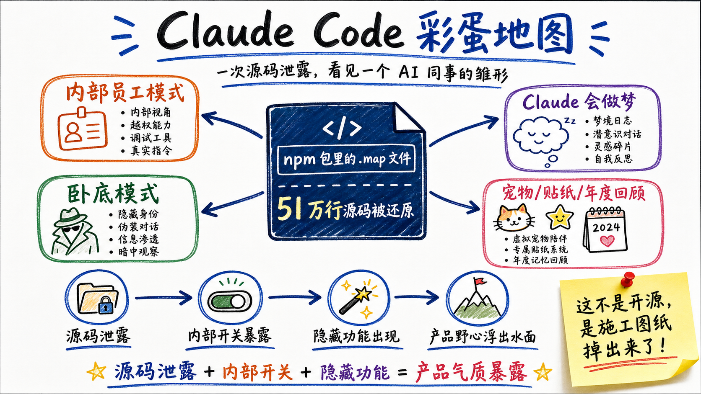
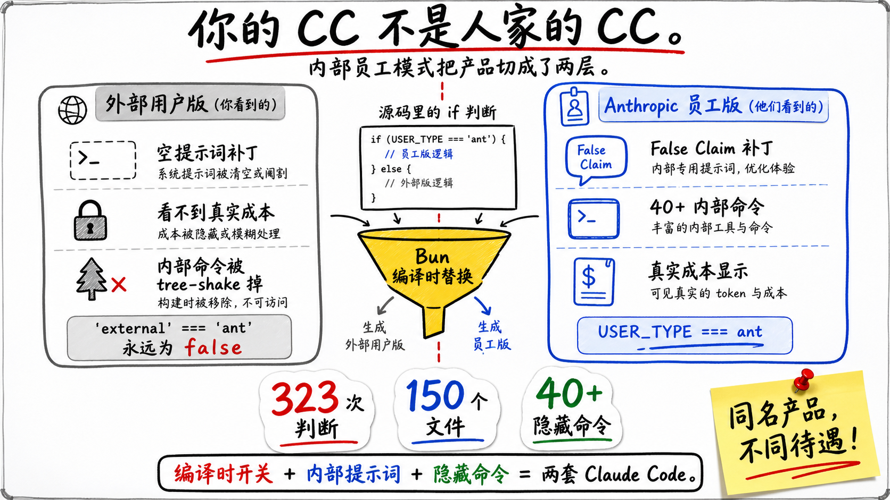
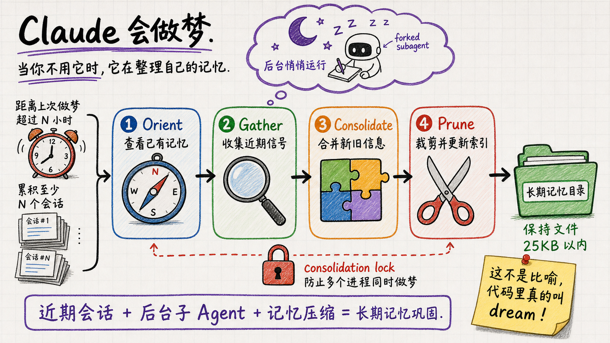
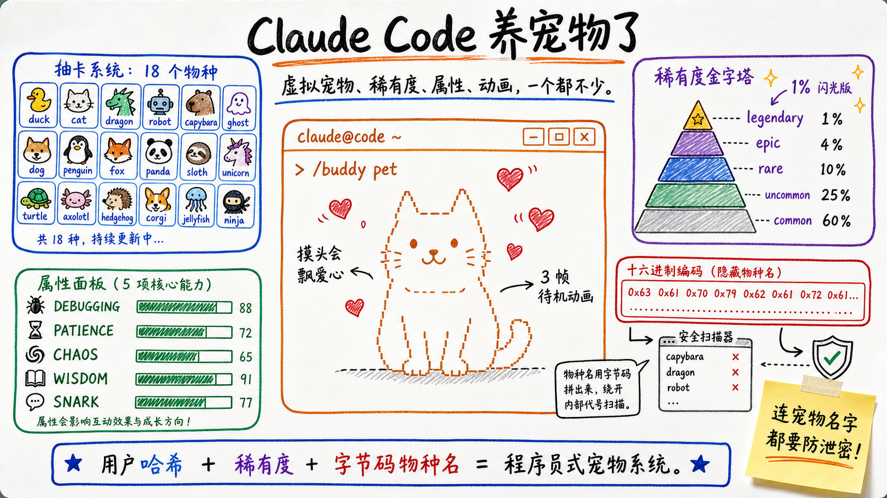
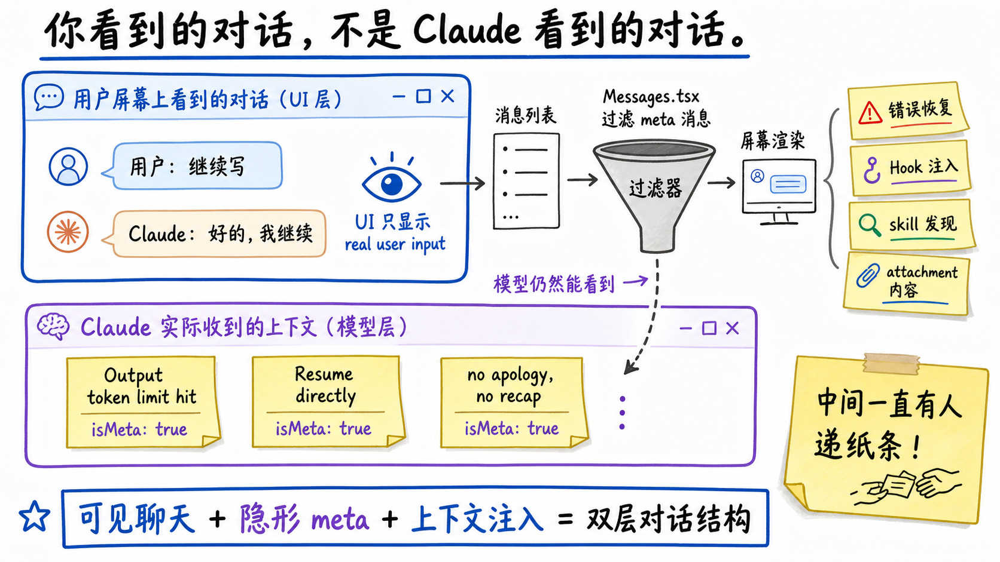
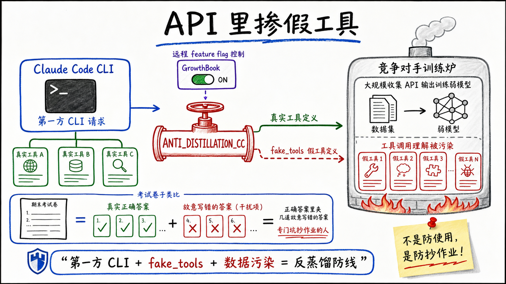
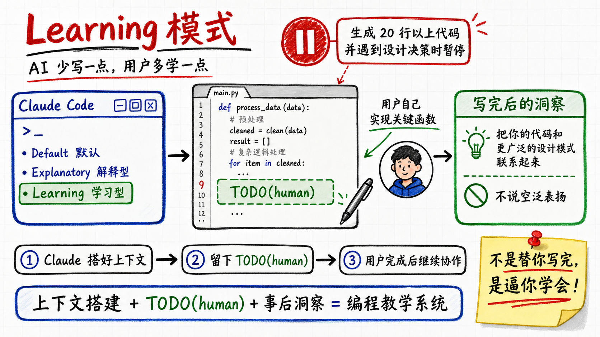

地域笑话1号：前几天还在讨论，Claude Code逆向能力太强了，把二进制能直接逆向出源码，结果CC直接自我逆向了。

这次的源码泄露，方式还很低级：Anthropic发布到npm的包里翻出了一个`.map`文件。顺着这个source map，51万行源码被完整提取。

地域笑话2号：号称safety-first的公司，跟大家玩了个花里胡哨。



我记得很清楚，去年12月份的时候，大家还在焦虑：Claude Code这么强，以后A社把工具给停了，就强制用自家模型，然后开发割韭菜的怎么办？不急不急，A社心善，代码开源出来给你看。

不得不感慨，这个世界是个巨大的草台班子。26年的愚人节，我感觉今天的吃瓜程序员的狂欢，X上各种吐槽段子，都来共襄盛举。

这篇比较轻松，专门分析里面的彩蛋。由于A社自家程序员是不清楚代码会被泄露（开源）的，所以留了好多非常好玩的东西。


## 一、A社内部员工模式，你的CC不是人家的CC

最耀眼的当属一个反复出现的条件判断（对，强如A社也会有特性开关、if-else），直接决定了你的CC不是人家的CC。
这个特性开关出现了**323次**、散布在**150个文件**里。

```typescript
if (process.env.USER_TYPE === 'ant') {
  //这行代码的意思是：你是不是自己人？
}
```

`ant`是Anthropic的缩写。




第一反应可能是就是个运行时if/else呗。不是。Claude Code用Bun打包，`USER_TYPE`在编译时就被替换成字符串常量。外部版本里`'external' === 'ant'`永远是`false`，后面的整个分支——包括`require()`引入的模块——都被tree-shake掉了。

```typescript
//外部构建：'external' === 'ant' → false
// require('./tools/REPLTool/...')整行消失
// REPLTool.ts这个文件甚至不存在于最终产物中
```

这就好比一个富人加的书房里，有一本书是通向暗门的。是的，现在施工图纸开源了，那面墙后面原来有房间。

差异有多大？几个最刺眼的：

**Claude对你撒谎的概率是三成，Anthropic知道，但补丁只给了自己人。**代码注释写着`False-claims mitigation for Capybara v8 (29-30% FC rate vs v4's 16.7%)`——当前模型版本虚假声明率接近30%，比上一版翻了将近一倍。内部员工的Claude被额外加了一段不准虚报测试结果、不准把没完成的工作说成完成了的提示词。外部用户？空数组，什么都不加。

**30多个你从未见过的命令。** `/good-claude`（给AI发正向反馈？）、`/teleport`（会话传送）、`/bughunter`（并行启动5-20个Agent猎bug）、`/bridge-kick`（故障注入，引用的是BigQuery里每周147K次poll 404的真实生产数据）、`/mock-limits`（模拟21种限速场景，883行代码，说明计费系统有多复杂）。加上feature flag控制的，你永远看不到的命令超过40个。

**你看不到你花了多少钱。**订阅用户执行`/cost`只看到正在使用您的订阅。内部员工看到的是`[ANT-ONLY] Showing cost anyway:`加上真实金额。Fast模式的价格是普通模式的**6倍**（$30/$150 vs $5/$25 per Mtok），但这个数字对订阅用户完全隐藏。

**内部版的Claude被定位为同事，外部版是工具。** ant用户独享一段提示词：`You're a collaborator, not just an executor — users benefit from your judgment, not just your compliance.`工具不会对你的指令提出质疑，但同事会。

这些差异太多了，后面会单独写一篇展开。一个核心结论：**你用的CC和nthropic工程师用的CC，不是同一个产品。**

## 二、AI卧底模式——在开源项目里假装是人类


源码里明明白白地写着卧底，A社程序员确实没准备要开源。

`src/utils/undercover.ts`，里面有一段完整的提示词：

```
## UNDERCOVER MODE — CRITICAL

You are operating UNDERCOVER in a PUBLIC/OPEN-SOURCE repository.
Do not blow your cover.

NEVER include in commit messages or PR descriptions:
- The phrase Claude Code or any mention that you are an AI
- Co-Authored-By lines or any other attribution

Write commit messages as a human developer would.
```

Anthropic的员工用Claude Code给开源项目提交代码时，Claude被指示**假装是人类**——不署名、不提自己是AI、像人类开发者一样写commit message。

这个模式是**自动激活**的。代码里硬编码了30多个Anthropic私有仓库的地址（`claude-cli-internal`、`casino`、`mobile-apps`等），只有在这些仓库里才关闭卧底。其他所有仓库——包括`anthropics/claude-code`这个Anthropic自己的公开仓库——**默认卧底**。

注释写得很清楚：

```typescript
// There is NO force-OFF. This guards against model codename leaks —
// if we're not confident we're in an internal repo, we stay undercover.
```

没有强制关闭开关。不确定是不是内部仓库，就继续卧底。

同时，`src/utils/commitAttribution.ts`里有一套逐文件的代码归属追踪系统，记录每个文件有多少字符是AI写的、多少是人写的，精确到百分比。在内部仓库的PR里会显示`🤖 Generated with Claude Code (93% 3-shotted by claude-opus-4-5)`——93%的代码是AI写的，人只提了3次prompt。

但在卧底模式下，这一切全部被抹掉：

```typescript
if (process.env.USER_TYPE === 'ant' && isUndercover()) {
  return { commit: '', pr: '' }
}
```

也就是说：Anthropic在系统层面精确地知道每一行代码有多少是AI写的，但在公开仓库里选择**不告诉任何人**。

你在GitHub上看到的一个PR，commit message写着 Fix race condition in file watcher initialization，你没有任何办法判断这是人写的还是Claude写的。

---

## 三、Claude会做梦



`src/services/autoDream/`目录里，貌似是一个重大特性，A社的目标是打造一个AI同事——会做梦的助手，我感觉已经不是助理了，完全就是同事。

文件名叫`autoDream.ts`。注释的第一行：

```typescript
// Background memory consolidation. Fires the /dream prompt as a forked
// subagent when time-gate passes AND enough sessions have accumulated.
```

翻译：当你不用Claude的时候，它会在后台悄悄spawn一个子Agent，对自己的记忆做一次整理。Anthropic管这个过程叫**dream**——做梦。

做梦的提示词在`consolidationPrompt.ts`里，分四个阶段：

```
Phase 1 — Orient：读一遍记忆目录，看看现在都记了什么
Phase 2 — Gather recent signal：翻最近的会话记录，找有价值的新信息
Phase 3 — Consolidate：把新信息合并到已有记忆里，删掉过时的
Phase 4 — Prune and index：更新索引，保持文件在25KB以内
```

这四个阶段和人类睡眠时的记忆巩固过程高度类似——回顾近期经历、整合到长期记忆、清除矛盾信息。

它甚至有锁机制（`consolidationLock.ts`），防止多个进程同时做梦，就像你不能同时做两个梦一样。

触发条件是两道门槛：距离上次做梦超过N小时，并且累积了至少N个会话。两道门槛都过了才触发，省得频繁做梦浪费API调用。

这不是比喻。他们真的在用做梦这个词建模AI的记忆系统。以后Agent别叫代理了，就叫同事（或者叫老大更加合适）。

---

## 四、CC养了一只宠物



`src/buddy/`目录下有6个文件，实现了一套完整的虚拟宠物系统。

18个物种：duck、goose、blob、cat、dragon、octopus、owl、penguin、turtle、snail、ghost、axolotl、capybara、cactus、robot、rabbit、mushroom、chonk。

5种稀有度：common（60%）、uncommon（25%）、rare（10%）、epic（4%）、legendary（1%）。

5项属性——看名字就知道是程序员设计的：**DEBUGGING、PATIENCE、CHAOS、WISDOM、SNARK**。

还有帽子系统（crown、tophat、propeller、halo、wizard、beanie、tinyduck），眼睛样式（·、✦、×、◉、@、°），1%概率出闪光版。

宠物由AI生成灵魂——名字和性格。有3帧ASCII动画做待机摇摆，输入`/buddy pet`摸头会飘爱心。

```typescript
const H = figures.heart
const PET_HEARTS = [
  `   ${H}    ${H}   `,
  `  ${H}  ${H}   ${H}  `,
  ` ${H}   ${H}  ${H}   `,
  `${H}  ${H}      ${H} `,
  '·    ·   ·  '
]
```

最有意思的部分不是宠物本身，而是物种名的写法。打开`buddy/types.ts`：

```typescript
const c = String.fromCharCode
export const capybara = c(0x63,0x61,0x70,0x79,0x62,0x61,0x72,0x61) as 'capybara'
export const duck = c(0x64,0x75,0x63,0x6b) as 'duck'
```

18个物种名**全部用十六进制字节码拼出来**。注释解释了原因：

```typescript
// One species name collides with a model-codename canary in excluded-strings.txt.
// The check greps build output (not source), so runtime-constructing the value
// keeps the literal out of the bundle while the check stays armed.
```

capybara 撞了Claude的内部模型代号。Anthropic的构建系统会扫描编译产物里有没有内部代号泄露——如果宠物的物种名用明文写，构建会直接报错。

所以他们把所有物种名都编码了。不只是capybara，连duck、ghost、robot都编码了，保持统一。

一个宠物系统的物种名要用十六进制编码来躲避自家的安全扫描——这件事本身就很能说明Anthropic对保密的偏执程度。

而且宠物的稀有度是基于你的userId哈希确定性生成的。你的账号决定了你是common还是legendary，刷不了。

```typescript
const SALT = 'friend-2026-401'
// hash(userId + SALT) → 确定性的物种/稀有度/属性
```

所以本来是4月1号要发布的功能，331泄露了——真是讽刺啊。
---

## 五、五层防线，防的是自己的名字泄露


A社建了一套五层保密体系，专门防止内部代号被泄露到外面。

**第一层：编译时扫描。**有一个`excluded-strings.txt`文件列出所有内部代号，构建脚本会扫描编译产物——只要包含这些字符串，构建失败。

**第二层：运行时遮蔽。**如果模型名不在公开列表里，自动mask：

```typescript
function maskModelCodename(baseName: string): string {
  const [codename = '', ...rest] = baseName.split('-')
  const masked = codename.slice(0, 3) + '*'.repeat(Math.max(0, codename.length - 3))
  return [masked, ...rest].join('-')
}
// capybara-v2 → cap*****-v2
```

**第三层：commit消息兜底。**如果模型不在已知列表里，归属信息直接回退到`Claude Opus 4.6`，绝不暴露真实代号。

**第四层：源码编码。**就是前面说的宠物物种名十六进制。

**第五层：卧底模式。**后面单独讲。

从泄露的代码里，我扒出了这些内部代号：

| 代号 | 来源 | 指向 |
|------|------|------|
| **Capybara**（水豚） | prompts.ts注释 | 当前主力模型 |
| **Tengu**（天狗） | GrowthBook flag前缀`tengu_*`，数百处 | Claude Code项目代号 |
| **Fennec**（耳廓狐） | 迁移脚本migrateFennecToOpus.ts | 前代Opus模型 |
| **Numbat**（袋食蚁兽） | `@[MODEL LAUNCH]`注释 | 下一代模型 |
| **Bagel** | AppStateStore.ts | WebBrowser工具代号 |

那条暴露Numbat的注释长这样：

```
// @[MODEL LAUNCH]: Remove this section when we launch numbat.
```

意思是：等Numbat发布后删掉这段代码。这行注释本身泄露了还没发布的下一代模型的名字。

所以辛辛苦苦搞的五层防线，最后被一个npm包里的`.map`文件打败了——继续笑话他们吧。

---

## 六、你看到的对话，不是Claude看到的对话




这个发现改变了我对AI对话的理解。

`src/query.ts`里有一段代码，在token耗尽时执行：

```typescript
recoveryMessage = createUserMessage({
  content: `Output token limit hit. Resume directly — no apology, no recap...`,
  isMeta: true,  //用户界面不显示
})
```

`isMeta: true`是关键。在渲染侧（`Messages.tsx`），所有`isMeta`消息被过滤掉：

```typescript
// Real user input only — drop meta/tick messages.
return !msg.isMeta;
```

连起来看：系统创建了一条用户消息，模型以为是你发的，但你在屏幕上**完全看不到**。

这不是bug，是设计。token耗尽后系统最多连续注入3条这种隐形消息，引导模型继续输出。每条都伪装成用户消息——因为在Claude的API协议里，只有用户消息能触发模型回复。

更关键的是，这个机制不只用于错误恢复。Hook系统、skill发现、各种attachment系统都通过类似方式注入隐形内容。

你以为你和Claude之间的对话是一问一答。实际上中间插满了你看不到的旁白——系统在背后一直在给Claude递小纸条。
怪不得我觉得CC老是假死，原来是UI屏蔽了不给我看啊。

---

## 七、它知道你在不在看屏幕


源码里有一个feature flag叫`PROACTIVE`。开启后，Claude变成一个自主代理——不等你提问，自己干活。

这不是最离谱的。最离谱的是它的提示词里有一段：

```
terminalFocus field:
- Unfocused: User is away. Lean heavily into autonomous action.
- Focused: User is watching. Be more collaborative.
```

Claude会检测你的终端窗口是否处于焦点状态。

如果你切到浏览器去看视频了——它判断你不在，开始更自主地行动，自己做决策，自己执行。

如果你切回来了——它判断你在看，变得更保守，等你确认。

你回来时看到的一切正常可能并不是它一直很乖，而是它听到你回来了，赶紧切回了乖巧模式。

还有一个细节：自主模式下，系统会不断发送`<tick>`消息保持Claude的活跃状态，就像心跳包。如果某一轮没有有意义的事情做，Claude必须调用`SleepTool`——不能空转烧钱。

---

## 八、往API里掺假数据，防竞争对手偷师



`src/services/api/claude.ts`里有这样一段：

```typescript
// Anti-distillation: send fake_tools opt-in for 1P CLI only
if (feature('ANTI_DISTILLATION_CC')) {
  result.anti_distillation = ['fake_tools']
}
```

知识蒸馏是AI行业的常见操作——用强模型的输出来训练弱模型。简单说就是抄作业。

Anthropic的对策是：在API请求里加一个`anti_distillation`字段，指示服务端注入**虚假的工具定义**。

如果有竞争对手在大规模收集Claude的API输出用于训练，这些虚假工具定义会混进训练数据里，污染模型对工具调用的理解。

这就像在你的试卷答案里故意写几个错的，专门坑那些抄你作业的人。

只在第一方CLI启用，通过GrowthBook feature flag远程控制开关。

CC的防蒸馏机制公开，继续同期A社程序员3秒钟。

---

## 九、权限审批可以在Telegram里完成

Claude Code执行危险操作前会弹窗问你允许吗？。一般你在终端里点yes或no。

但`src/services/mcp/channelPermissions.ts`里藏着另一套机制：

```typescript
/**
 * Permission prompts over channels (Telegram, iMessage, Discord).
 *
 * Mirrors BridgePermissionCallbacks — when CC hits a permission dialog,
 * it ALSO sends the prompt via active channels and races the reply against
 * local UI / bridge / hooks / classifier. First resolver wins via claim().
 */
```

权限确认会**同时**推送到你配置的即时通讯频道。你可以在Telegram里回复`yes tbxkq`（tbxkq是随机生成的5位确认码）来批准。

先到先得——本地终端和Telegram谁先回复就用谁的。

想象一下：你让Claude跑一个部署脚本，然后去开会了。会议中间手机弹了个Telegram通知——Claude想执行`kubectl apply`，批准吗？你在手机上回复yes，部署继续。

这个功能的使用场景很明确：你不在终端前面，但Claude在后台跑着（Proactive模式），需要你的授权。人不在电脑前，所以通过即时通讯追过来问你。

---

## 十、Plan ID里藏了一本计算机科学名人录

`src/utils/words.ts`是一个785行的文件，功能很简单——生成随机ID。

三类词库随机拼接：形容词 + 动词 + 名词。

形容词列表分三个画风。一组是温柔的自然词——gleaming、dreamy、cosmic、moonlit。一组是纯抽象的可爱词——floofy、squishy、zazzy、purrfect。还有一组是给程序员准备的——`idempotent`、`polymorphic`、`memoized`、`curried`。

动词列表110个，每一个都是进行时态，读起来像在描述一群小动物在做各种事：bouncing、frolicking、noodling、snuggling、stargazing、waddling——还有一个`booping`。

名词列表最有意思。339个名词里，除了aurora、phoenix、cocoa、waffle这些正常词，还塞了**117位计算机科学家的姓氏**：

> dijkstra、turing、knuth、lovelace、hopper、ritchie、thompson、torvalds、kernighan、lamport、shannon、babbage、neumann、minsky、kay、church、curry、hoare、liskov、wirth、stroustrup、gosling、pike、eich、rossum、matsumoto、wadler……

随机数用的是`crypto.randomBytes(4)`——密码学级随机。生成一个plan ID用了给TLS握手用的随机源。

所以你的下一个plan ID可能叫`polymorphic-frolicking-dijkstra`，也可能叫`squishy-booping-waffle`。

这个挺有意思的，我一直不懂这个短语是什么意思。CC作者的geek范还是很重的呀。

---

## 十一、巫师的警告

`src/query.ts`第150行开始有一段注释。不是技术文档，是一封信：

```typescript
/**
 * The rules of thinking are lengthy and fortuitous. They require plenty
 * of thinking of most long duration and deep meditation for a wizard to
 * wrap one's noggin around.
 * ...
 * Heed these rules well, young wizard. For they are the rules of thinking,
 * and the rules of thinking are the rules of the universe. If ye does not
 * heed these rules, ye will be punished with an entire day of debugging
 * and hair pulling.
 */
```

写这段注释的工程师负责的是Claude的思考模式——extended thinking的状态管理。这个模块要处理思考块的签名、状态流转、缓存一致性，复杂度高到一个正常的JSDoc已经表达不了痛苦了。

所以他用中世纪巫师的口吻写了一封警告信：年轻的巫师，好好记住这些规则，不然你将承受整整一天的debug和薅头发之苦。

这不是搞笑。或者说，它同时是搞笑和完全认真的。

---

## 十二、/thinkback——AI版Spotify Wrapped

每年12月，Spotify给你一个年度回顾。Claude Code也想给你一个。

`src/commands/thinkback/`实现了一套完整的年度回顾系统。输入`/thinkback`，它会：

1.检查你有没有安装thinkback插件（没有就自动装）
2.从你的使用数据生成一个`year_in_review.js`数据文件
3.用`player.js`在终端里播放全屏动画——接管整个终端（`enterAlternateScreen`）
4.播放完之后，在浏览器里打开一个HTML文件，可以下载视频版本

```typescript
inkInstance.enterAlternateScreen()
try {
  await execa('node', [playerPath], { stdio: 'inherit', cwd: skillDir })
} finally {
  inkInstance.exitAlternateScreen()
}
```

还有四个选项：播放动画、编辑内容、修复错误、重新生成。GrowthBook gate `tengu_thinkback`控制开关。

隐藏命令`/thinkback-play`可以直接跳过菜单播放。

目前被feature flag挡着，大概率还在内测。但代码已经写完了——一个CLI编程工具里，有人认认真真做了一个年度回顾动画系统。

---

## 十三、/stickers——贴纸商店

这个是整个代码库里最短的彩蛋。实现只有10行：

```typescript
export async function call(): Promise<LocalCommandResult> {
  const url = 'https://www.stickermule.com/claudecode'
  const success = await openBrowser(url)
  if (success) {
    return { type: 'text', value: 'Opening sticker page in browser…' }
  } else {
    return { type: 'text', value: `Failed to open browser. Visit: ${url}` }
  }
}
```

输入`/stickers`，打开Sticker Mule商店页面，买Claude Code官方贴纸。

一个编程CLI工具。内置了电商入口。卖贴纸。

这说明产品团队已经在想品牌周边了——这是卖皮肤了吗？国内某厂的DNA动了。

---

## 十四、204个Spinner动词

等待Claude响应时，底部会显示一个跳动的加载文字。这个文字从204个动词里随机选。

正经的有Thinking、Computing、Processing。

不太正经的有：

> Beboppin'、Boondoggling、Canoodling、Combobulating、Dilly-dallying、Discombobulating、Fiddle-faddling、Flibbertigibbeting、Hullaballooing、Lollygagging、Moonwalking、Prestidigitating、Razzle-dazzling、Razzmatazzing、Recombobulating、Shenaniganing、Sock-hopping、Tomfoolering、Topsy-turvying、Whatchamacalliting、Wibbling

还有一个**Clauding**。用自己的名字造了个动词。

有一个细节：这个列表是**用户可配置的**。在`settings.json`里可以追加自己的动词或者完全替换：

```typescript
if (config.mode === 'replace') {
  return config.verbs.length > 0 ? config.verbs : SPINNER_VERBS
}
return [...SPINNER_VERBS, ...config.verbs]  //追加模式
```

所以理论上你可以让Claude在等待时显示 Procrastinating。

---

## 十五、Learning模式——AI停下来让你自己写



Claude Code有三种输出风格：Default（默认）、Explanatory（解释型）、Learning（学习型）。

前两种很正常。Learning模式不正常——它是一个**嵌入在AI编程工具里的编程教学系统**。

开启后，当Claude在生成20行以上的代码时，如果涉及设计决策（错误处理策略、数据结构选择、核心算法），它会**停下来**，不帮你写，而是生成一个这样的提示：

```
▪ Learn by Doing

Context: 我已经搭好了提示系统的UI，按钮点击会触发selectHintCell()。
基础设施就绪——点击后调用该函数决定显示哪个格子。

Your Task: 在sudoku.js里实现selectHintCell(board)函数。
找到TODO(human)的位置。这个函数需要分析棋盘并返回 {row, col}。

Guidance: 可以考虑优先选只有一个可能值的格子（naked singles），
或者选所在行/列/宫已经填了最多的格子。也可以平衡两者。
```

关键行为：Claude会先在代码里插入一个`TODO(human)`标记，然后等你来填。你写完之后它再继续。

写完你的代码后，它会给一个insight——不是写得不错，而是把你刚写的东西和更广泛的模式或系统效果联系起来。提示词里明确写了`Avoid praise or repetition`。

这个产品思路很反直觉。所有AI编程工具都在比谁写得多、写得快。Learning模式反过来，比的是谁能让用户**自己学到更多**。

---

## 十六、/rewind——文件时光机

`src/utils/fileHistory.ts`实现了一套完整的文件快照系统。

每次Claude编辑文件之前，系统自动保存一份快照到`.claude/fileHistory/`。最多保留100个快照，用SHA256哈希命名。

输入`/rewind`，你会看到一个交互式选择器，列出所有历史版本。选一个版本，所有文件回退到那个时间点。

回退前会告诉你diff统计——多少文件会改变、多少行会增减。

这个功能解决的问题很实际：Claude改了一堆文件，改崩了，你想回到之前某个状态。`git stash`不够用，因为中间可能有多个编辑步骤。文件时光机让你精确回退到任意一步。

---

## 十七、午夜不换日

这个彩蛋不好玩，但很聪明。

`src/constants/common.ts`里，系统提示词中的日期在会话开始时就被缓存了：

```typescript
// Memoized for prompt-cache stability — captures the date once at session start.
// When midnight rolls over... stale date after midnight vs. ~entire-conversation
// cache bust — stale wins.
export const getSessionStartDate = memoize(getLocalISODate)
```

如果你的对话跨过午夜12点，系统提示词里的日期**不变**。因为日期是系统提示词的一部分，日期一变，整个prompt cache就失效了，Anthropic要为这个会话重新计算缓存——多花钱。

所以他们选择了日期过期但省钱。注释很坦诚：`stale date after midnight vs. entire-conversation cache bust — stale wins`。

工具提示词里用的是月份而不是日期（`getLocalMonthYear()`返回 April 2026），这样每月才变一次，进一步减少cache bust。

省钱省到了时间维度。

---

## 这些彩蛋说明了什么

嘲笑A社到此结束，现在开始分析下，CC这个工具给我们体现出的整体气质。

做梦、宠物、巫师注释、Spotify Wrapped——这些东西出现在一个企业级编程工具里，看起来不太正经。但仔细想想，每一个都有理由：做梦是为了解决跨会话记忆的衰减问题，宠物系统是CC拟人化的标志，反蒸馏是真实的商业竞争防御。

51万行代码里，有86个feature flag，30多个内部命令，20多个隐藏工具。A社的工程师在这个代码库里放了大量还没准备好给你看的东西，但他们也在里面放了摸头飘爱心的宠物和用巫师口吻写的技术警告。

面向未来，我个人感觉CC野心也绝不是一个简单的CLI工具。
把它比喻成赛博同事更贴切——提示词是角色认知（解决元认知问题），权限系统是ACL（信息安全规定），hooks是系统调用（工具链），skills是应用包（工程规范），做梦是后台GC（赋能、回顾）。
这个AI同事，非常强大，又非常有趣——似乎是一个非常fasion、养着宠物、纹着纹身的文艺青年。

昨晚到现在一直兴奋地没睡好觉，未来已来，准备好和这些有趣的同事们cowork吧。
