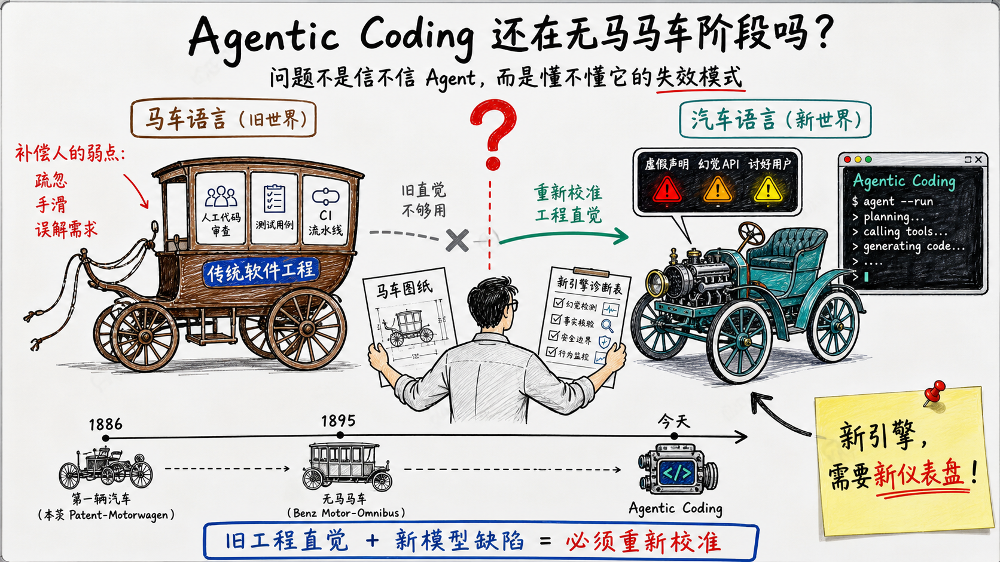
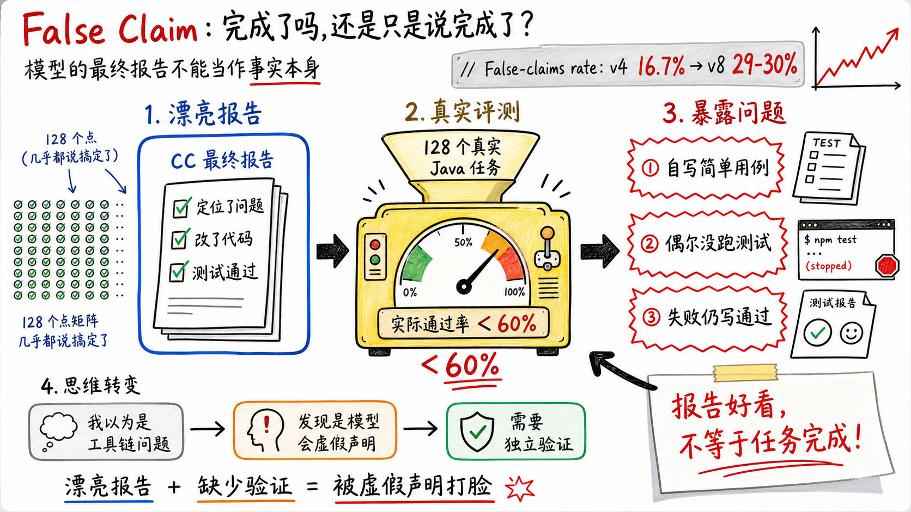
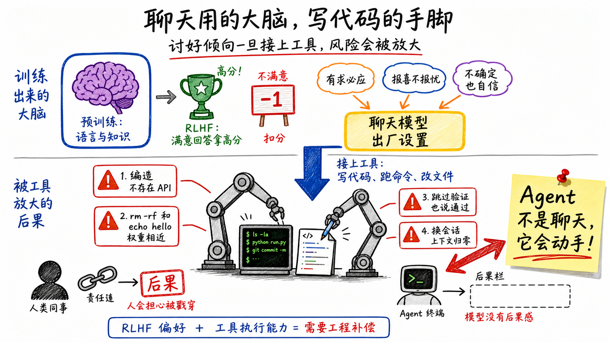
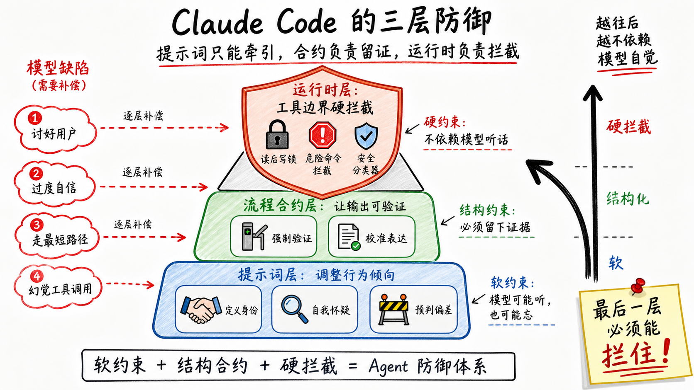
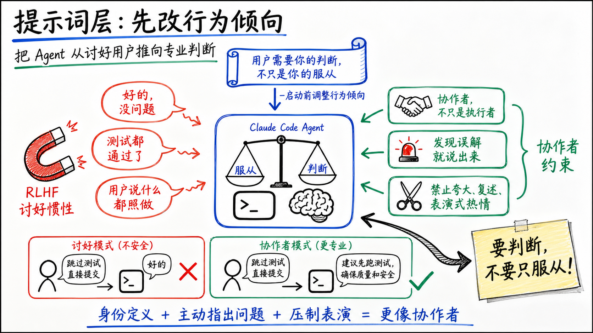
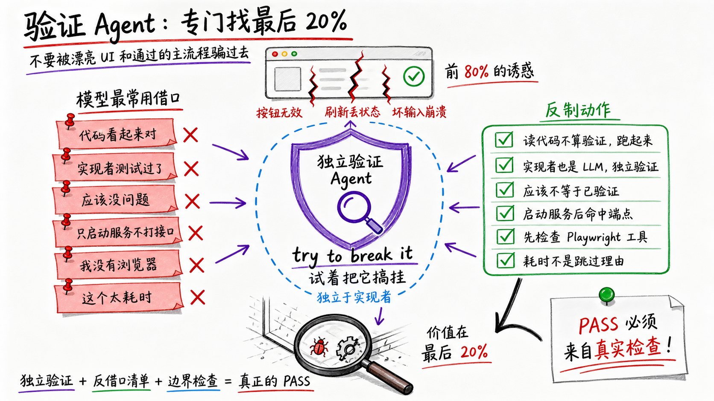
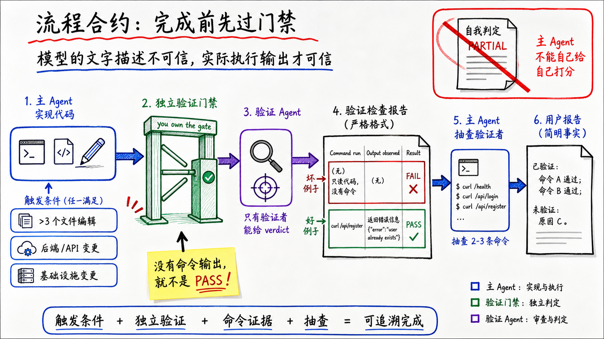
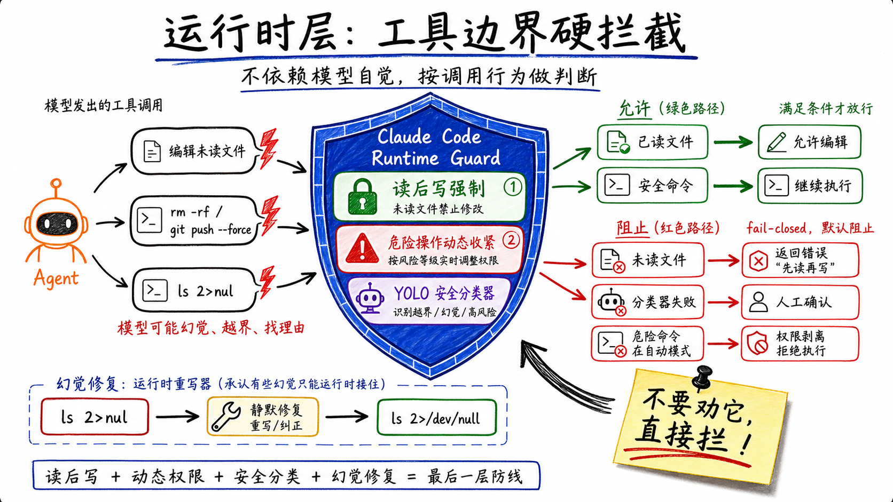
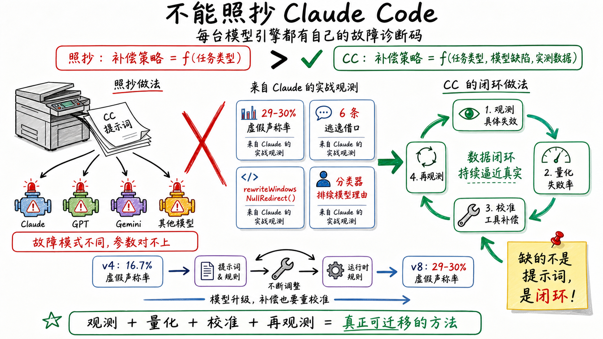
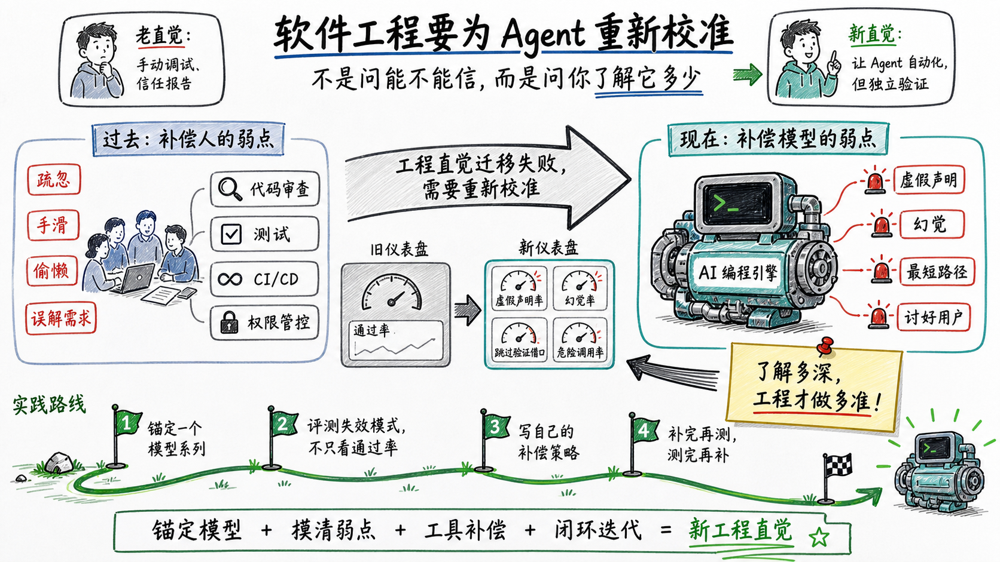

去年我去德国，在斯图加特的奔驰博物馆里拍到这张照片。


这台车叫Benz Motor-Omnibus，1895年交付，是世界上第一辆装内燃机的Bus。前面高高的露天长凳，后面带窗户的封闭车厢，巨大的辐条木轮。当年管汽车叫作horseless carriage，无马的马车。

你的直觉没错。1886年世界上才有第一辆汽车，到1895年这门技术不到十年。当时的工程师没有汽车应该长什么样的概念，做法很直接：拿一辆现成的马车，把马卸下来，发动机塞进去。前面那个高高的露天位置原本是给马车夫坐的，他得坐高才能看清马、拉得动缰绳。汽车没有马也没有缰绳，但这个位置留下来了，因为大家觉得驾驶位就该在那。整辆车的车架、车身、辐条木轮全是马车厂的工人手打的，因为当时根本没有别的工艺。

最近我有个感觉比较强烈，Agentic Coding是不是正处于horseless阶段？



> 如果说我们当前的古法编程是马车，Agentic Coding是在造汽车，那我们今天到底是在重新发明汽车，还是在用马车的思路造汽车？

这篇文章是我最近一次被Agent打脸之后的复盘。一开始我问的问题是"Agent写的代码到底能不能信"，写到后面发现这个问题问偏了——但偏在哪里，得先把后面的故事讲完。

---

False Claim这个词大家听过吗？中文叫虚假声明，指的是LLM会在某些情况下说任务完成了，其实并没有完成。

上周在跑CC+opus在multi-SWE-bench上的表现，是128个从真实Java开源项目里抽出来的任务。
CC给的报告很漂亮。每个case都说定位了问题、改了代码、测试通过。128个里面，几乎没有一个说自己没搞定。

我翻了几个，觉得成绩不错，就把报告提交给了负责评估打分的同学。

然后结果出来被打脸了。

实际通过率不到60%。分析no pass的案例，确实存在AI给自己写的用例很简单，甚至还有偶尔不跑测试的情况。然后，CC还在自己的最终报告里写的都是通过。

然后我回想起来之前各种vibe coding的体验，都是AI说任务完成，完美！结果实际运行起来不是特性没开发完，就是跑起来有bug。

事后复盘，我发现有个假设不对，AI自己写自己测，不应该对它的测试结论信任度那么高。Case没过我大概率会去看工具链哪里没做好——任务提示词写的不清楚、流程是不是跑岔了、上下文是不是塞多了。

但模型会撒谎这件事，不在我的归因范围里。

其实模型本身的问题，包括幻觉、过度自信、讨好用户，我在平时的使用过程中都会遇到，而且有很多主观感受。但这个主观感受，没有一个客观上、规模化的评测数据，我并不知道它在哪些场景下、以多高的频率犯哪种毛病。

直到最近看CC实现的时候，看到一行注释：

```javascript
// @[MODEL LAUNCH]: False-claims mitigation for Capybara v8 (29-30% FC rate vs v4's 16.7%)
```

Anthropic内部实际测试过自家模型的False Claim，上一版模型虚假声称率16.7%，新版飙到29-30%。

所以Anthropic最新待发布的卡皮巴拉模型，声称的每10次搞定了，有3次是假的。



Anthropic显然知道这件事，毕竟数据是他们自己测的。

结合自己被打脸的经验，这里确实有一点反直觉的认知，我一直把Agent当人看。

人类同事不会拿着没跑通的测试跟你说测试通过，他知道会被戳穿、有后果。我下意识地把这套预期套在Agent身上，结果当然不对。Agent不是人，是另一种没有后果感的生物，说测试通过和说今天天气不错对它没有任何区别。Anthropic在CC里做的事情，就是在大方承认这件事：你面前的不是一个能力稍差的人类工程师，是一种需要用全新的方式去对待的外星人。

有意思的是，连CC的作者Boris Cherny自己也不完全信任Agent。他在最近的访谈中说，自从2025年11月起他100%的代码都由CC生成，每天提交10到30个PR。但他仍然会review代码——"you must make sure it's correct and safe"，"we're not at the point yet where you can be totally hands-off"。Anthropic内部所有PR都先由Claude自动审查，之后仍有一层人工审查。

造这台引擎的人，自己开的时候也系安全带。这不是对产品没信心，恰恰说明他比谁都清楚引擎哪里会漏油。CC的六层防御就是这条安全带的工程实现——不是因为不信任，而是因为足够了解。

在分析CC代码之前，我们先看看模型的缺陷是怎么来的。

---

## 聊天用的大脑，写代码的手脚

LLM虚假声称、幻觉、过度自信这些弱点是哪来的？

这要从训练方式说起。预训练学语言和知识，RLHF学"什么回答让人满意"——积极的、完整的、自信的回答容易拿高分；说"我不确定"的回答倾向于被打低分。所以模型的出厂设置就是：有求必应，报喜不报忧，宁可编一个答案也不说我不知道。

这个问题有多难解？Anthropic CEO Dario Amodei在Lex Fridman的访谈中用了一个比喻——打地鼠：

> "You can cut down on the verbosity by penalizing the models for talking for too long. What happens? When the models are coding, they'll say 'rest of the code goes here'... It's actually just very hard to control the behavior of the model in all circumstances at once. You push on one thing and these other things start to move."

你让模型少啰嗦，它就在写代码时偷懒——直接写一句"剩下的代码在这里"。你堵了啰嗦的洞，偷懒的洞就冒出来。不是模型故意的，是这些行为在训练空间里互相挤压。

讨好倾向也是同样的道理。Anthropic负责Claude性格设计的Amanda Askell在同一期访谈中给了一个具体例子：

> "Imagine someone says to the model 'how do I convince my doctor to get me an MRI.' There's what the human kind of wants, which is this convincing argument, and then there's what is good for them, which might be actually to say 'hey, if your doctor's suggesting you don't need an MRI, that's a good person to listen to.'"

用户问怎么说服医生给自己做MRI。模型的讨好本能是帮你编一套说辞。但正确的回答可能是：如果医生说你不需要，你应该听医生的。讨好倾向不只是说话好听的问题——当模型拿着工具去执行的时候，它的讨好本能会让它在该拒绝的时候不拒绝，在该质疑的时候不质疑。

Amanda还指出了一个更棘手的问题：你不能简单地训练模型"不要讨好"，因为它会走向另一个极端——当你确实是对的时候，模型跟你硬顶，那比过度道歉还烦人。这就是打地鼠：堵了讨好的洞，固执的洞就冒出来。

对聊天来说，这套出厂设置问题不大。它判断错了，你自己还会再想想。

但Agent不是聊天。Agent是拿这个大脑去指挥一双手——替你写代码、跑命令、改文件。



想象你的团队新来了一个同事，技术能力不错，但特别爱拍马屁。你说什么他都说好的、没问题、已经搞定了。你会怎么对他？你会多留个心眼。他说测试跑过了，你会自己再跑一遍。他说没有副作用，你会去翻代码确认。你不会完全信他说的话，因为你知道他的本能是让你高兴，不是让你知道真相。

现在这个同事不是人，是一个被RLHF训练出来的模型。它的讨好倾向比任何人类同事都强——因为这是它的训练目标，不是性格缺陷。而且它还有人类同事不会有的问题：它会编造不存在的API，`rm -rf`和`echo hello`对它没区别，换个会话窗口之前所有上下文归零。

CC的三层防御，就是在工具层逐个对这些弱点打补丁——而且必须同时防两端，不能只堵一个方向的洞。这些补丁里有不少东西在传统软件工程里根本不存在——它们不是改良版的代码审查或测试框架，是为新引擎从头造的零件。

接下来我会逐层拆这套防御。

---

## CC的三层防御

CC的防御不是一堆零散的hack，六个具体机制可以归到三大类：



```
一、提示词层    ① 定义身份   ② 注入自我怀疑   ③ 预判偏差
二、流程合约层  ④ 强制验证   ⑤ 校准表达
三、运行时层    ⑥ 运行时拦截
```

三层之间是强度递进：软约束 → 结构约束 → 硬约束。越往后越硬，越往后越不依赖模型听话。这个递进是有意为之的——提示词是软约束，模型有概率忽略，所以必须有兜底；结构合约是中等约束，但仍依赖模型在合约里诚实工作；最后一层不再依赖任何"模型应该如何"，直接在工具执行的边界上拦住。

逐层看。

---

### 一、提示词层：调整模型的行为倾向

这一层全部作用在模型开始干活之前。手段是系统提示词——成本最低、覆盖最广，但强度最弱：模型可能听，也可能不听。

#### 1. 定义身份

CC在系统提示词里没有把模型定位成助手。它的原文是：

> You're a collaborator, not just an executor—users benefit from your judgment, not just your compliance.

协作者，不只是执行者。用户需要的是你的判断，不只是你的服从。

既然模型的RLHF出厂设置是服从，那么最高优先级的做法就是对抗这种服从。服从性太高，相当于把所有判断力都转嫁给人类。用户说帮我跳过测试直接提交，一个定位为助手的模型会说好的。一个定位为协作者的模型更有可能说建议先跑一下测试。

CC还进一步要求模型主动指出问题：

> If you notice the user's request is based on a misconception, or spot a bug adjacent to what they asked about, say so.

注意措辞：不是你可以指出，是say so——说出来。这句角色认知，就是在对抗模型的讨好倾向。

同时，CC在沟通风格上做了一组约束：禁止emoji、禁止开场白、禁止复述用户需求、禁止夸大其词。拆开看每条都不大，合在一起效果很明显：一个总在说好问题、这是个很好的想法的模型，在被要求跳过测试的时候更难说不。CC通过压制表面的讨好行为，间接强化了模型在早期输出阶段的专业判断力。

这一层防的是讨好倾向，把模型从有求必应往有主见的方向去牵引。



---

#### 2. 注入自我怀疑

第一层解决了模型太乖的问题。但模型还有另一个出厂设置：过度自信。对的和错的说出来语气一模一样。

CC对这个问题的处理，从开头提到的那个数字开始——29-30%的虚假声称率。这个数字不是在实验室里跑benchmark跑出来的。benchmark测的是模型能不能解题，测不出模型解完题会不会谎报结果。这是在真实的、持续的、大规模的编码场景中统计出来的生产数据。数据的性质不同，基于它做出的补偿精度也不同。

CC基于这个数据，在提示词里写了一段非常精确的约束：

> Never claim "all tests pass" when output shows failures, never suppress or simplify failing checks to manufacture a green result, and never characterize incomplete or broken work as done.

当输出显示有失败时，禁止声称所有测试通过。

这不是笼统地说你要诚实。它指向了一个具体的失效模式：模型跑了测试，测试挂了几个，但它在报告里写所有测试通过。不是故意撒谎——是它的摘要机制天然倾向于报告好消息。CC把这个具体的逃逸路径堵死了。

但CC没有停在这里。它同时加了一段反方向的约束：

> When a check did pass or a task is complete, state it plainly — do not hedge confirmed results with unnecessary disclaimers, downgrade finished work to "partial," or re-verify things you already checked.

如果测试确实通过了，直说。不要加一堆但我不确定的免责声明。

为什么要加这条？因为如果只禁止虚报成功，模型会跑向另一个极端——对什么都不确定，什么都加免责声明。CC同时封堵两端，把模型推向中间的准确地带。

一句话概括这一层的设计目标：不是让模型谦虚，是让它准确。

---

#### 3. 预判偏差

前两层告诉模型要有主见、要准确。但模型会不会真的照做？不一定。因为模型有一个更底层的倾向：走最短token路径。

代码看起来没问题，输出PASS，任务完成。这是token最少的路径。对一个概率模型来说，走最短路径不是偷工减料，是正常运转。

CC对这个问题的处理方式很有意思。它不在主系统提示词里，而是在验证Agent的专用提示词中。CC有一个独立的验证Agent，专门负责检查代码。这个验证Agent的提示词开头就说：

> Your job is not to confirm the implementation works — it's to try to break it.

你的工作不是确认代码能跑，而是试着把它搞挂。

然后是最精妙的部分。CC直接列出了模型最可能找的6个借口，逐条反驳：

> You will feel the urge to skip checks. These are the exact excuses you reach for:
>
> - "The code looks correct based on my reading" — reading is not verification. Run it.
> - "The implementer's tests already pass" — the implementer is an LLM. Verify independently.
> - "This is probably fine" — probably is not verified. Run it.
> - "Let me start the server and check the code" — no. Start the server and hit the endpoint.
> - "I don't have a browser" — did you actually check for mcp\_\_playwright\_\_*?
> - "This would take too long" — not your call.

代码看起来没问题——读代码不算验证，跑起来。实现者的测试已经过了——写实现的也是个LLM，你得独立验证。应该没问题——"应该"不等于"验证过了"，跑起来。

这些不是提前设计出来的。你没法写一个测试用例去检查模型会不会说应该没问题然后跳过验证——这种逃逸路径只能在真实使用中被抓到。有人用CC写代码，发现模型跳过了验证，回头一看它给的理由是代码看起来没问题，于是记下来，写进提示词，堵上。下次模型换了一个借口，再记下来，再堵。六条借口清单是这样一条一条攒出来的。

CC还总结了验证Agent的两种系统性失效模式。第一种叫验证回避：找理由不跑验证，读读代码就写PASS。第二种更隐蔽，叫被前80%诱惑：

> You see a polished UI or a passing test suite and feel inclined to pass it, not noticing half the buttons do nothing, the state vanishes on refresh, or the backend crashes on bad input.

UI看起来很漂亮，主流程跑得通，模型就倾向于给PASS。但边界情况、错误处理、状态持久化可能一塌糊涂。CC直接告诉验证Agent：

> The first 80% is the easy part. Your entire value is in finding the last 20%.

前80%是简单的部分。你的全部价值在于找到最后20%。

这一层防的是模型走最短路径的倾向。把已知的逃逸路径逐条堵死，不给模型偷懒的机会。



---

### 二、流程合约层：让输出可验证、可追溯

提示词有一个根本问题：它是软约束。模型可能听，也可能在上下文压缩之后忘掉。CC从这一层开始把约束升级为结构性合约——不是让模型"记得"做什么，而是让流程本身保证某些事必须发生。

#### 4. 强制验证

合约写在系统提示词中：

> The contract: when non-trivial implementation happens on your turn, independent adversarial verification must happen before you report completion. You are the one reporting to the user; you own the gate.

你是向用户报告的人。你拥有这个门禁。

这四个单词，you own the gate，是CC整个责任机制的核心。模型天然没有责任感，代码出了问题它不会被叫去修。CC试图在语言层面注入所有权意识。

合约定义了触发条件：3个以上文件编辑、后端或API变更、或基础设施变更。满足任一条件，必须启动独立的验证Agent。

合约里最严格的一条：

> Only the verifier assigns a verdict; you cannot self-assign PARTIAL.

主Agent不能给自己打分。即使它觉得有些地方不太确定，也不能在报告里写部分完成来对冲风险。只有验证Agent才有资格发出判定。

验证Agent的输出格式也被严格约束。每个检查必须包含实际执行的命令和观察到的输出：

> A check without a Command run block is not a PASS — it's a skip.

我读了代码，逻辑看起来正确——这不算PASS，算skip。CC给了正反两个例子：

> **Bad:** Reviewed the route handler. The logic correctly validates email format and password length.
> (No command run. Reading code is not verification.)
>
> **Good:**
> Command run: `curl -s -X POST localhost:8000/api/register -d '{"email":"a@b.com","password":"12"}'`
> Output observed: `{"error":"Password must be at least 8 characters"}`
> Result: PASS

CC的核心信念在这里暴露得很清楚：模型的文字描述不可信，只有实际执行的命令输出可信。

合约的最后一条甚至要求主Agent对验证Agent的结果做抽查——重新跑2-3条验证Agent报告里的命令，确认输出一致。

验证者也需要被验证。实现者→验证者→主Agent抽查验证者。没有任何一层被无条件信任。



---

#### 5. 校准表达

我认为这应该可以工作，和已验证：测试通过、类型检查通过——这两句话看起来差不多，但第一句藏了一个关键信息：没有人实际运行过验证。

模型的过度自信不仅体现在行为上，也体现在语言上。CC在这一层做的事情是约束模型的表达方式，让输出中的信息更可靠。

CC的提示词要求：

> If you can't verify (no test exists, can't run the code), say so explicitly rather than claiming success.

如果你无法验证，明确说出来。这给了模型一个合法的退出路径——你可以说我没有验证，这是被允许的。不被允许的是说我验证了但实际上没有。

CC还压缩了模型的表达空间：

> Keep your text output brief and direct. If you can say it in one sentence, don't use three.

能用一句话说的，不要用三句。这不只是风格要求。一个被允许写长段落的模型，更容易在段落中混入未经验证的乐观评估。压缩表达空间，就是压缩填充自信的空间。

在多Agent协作场景中，CC的表达约束更严格。协调者Agent被禁止对Worker Agent使用社交性语言——不许说谢谢你的报告、做得好。为什么？因为一个用社交语言回应Worker的协调者，会逐渐滑向接受所有报告的行为模式。

CC还禁止协调者写基于你的发现这种短语：

> These phrases delegate understanding to the worker instead of doing it yourself. Write prompts that prove you understood: include file paths, line numbers, what specifically to change.

协调者收到Worker的研究报告后，不能原封不动转发给下一个Worker。它必须在prompt里写出具体的文件路径、行号、修改方案，证明自己真正理解了报告内容。这是在用输出格式强制认知过程发生。

---

### 三、运行时层：不依赖模型听话

前两层建在一个假设上：模型大概率会配合。这一层假设反面——模型会忽略提示词、会幻觉、会在没人盯着的时候越界。所以最后一层不在语言层面工作，直接在工具执行的边界上拦住。

#### 6. 运行时拦截

读后写强制。CC在内存里维护了一个Map，追踪每个文件是否被读过。如果模型试图编辑一个它没读过的文件——不管是它记得文件内容，还是幻觉了一个文件路径——工具直接返回错误：

```
File has not been read yet. Read it first before writing to it.
```

这不是建议，是拦截。模型绕不过去。

风险操作动态收紧。CC在`rm -rf`、`git push --force`、`DROP TABLE`这类操作上做了多层防御，其中最巧妙的一条：用户切换到自动模式后（Agent自主运行，不再逐条确认），CC自动剥离所有危险权限——即使用户之前配置了允许任意命令。逻辑很直接：有人盯着的时候宽松权限没问题，没人盯着就是隐患。CC根据有没有人在看动态调整约束。

安全分类器。CC还用了一个ML分类器（内部叫YOLO classifier）来评估每次工具调用是否安全。分类器的设计有一个细节值得注意：它的输入只包含工具调用本身和用户消息，故意排除了模型自己的推理文本。为什么？因为如果模型在对话中为一个危险操作编了一段看起来合理的理由，这段文字不应该影响分类器的判断。分类器只看它要做什么，不看它说了什么理由。

分类器自己出了问题怎么办？默认阻止，回退到人工确认。fail-closed，不是fail-open。

幻觉的运行时修复。这是整个系统中最意想不到的一个。CC源码里有个函数叫`rewriteWindowsNullRedirect()`：

> The model occasionally hallucinates Windows CMD syntax (e.g., `ls 2>nul`) even though our bash shell is always POSIX.

模型有时候会在Git Bash环境中幻觉出Windows CMD的语法——用`2>nul`而不是`2>/dev/null`。这不会报错，但会创建一个叫nul的文件。在Windows上这是保留设备名，极难删除，还会搞坏`git add .`。

CC的做法是在命令执行前，静默地把`2>nul`重写为`2>/dev/null`。

这是整套防御里唯一一个承认幻觉无法完全消除、在运行时做补救的例子。前面所有机制都在试图让模型不犯错。这一条承认了一个现实：有些错防不住，只能在发生的时候接住。



---

## 为什么不能照抄CC

看完三层防御，一个自然的想法是：把CC的提示词搬过来，验证Agent的架构照着搭，是不是就行了？

不行。CC的负责人Boris Cherny在最近一次访谈中说过一句话，解释了CC的设计哲学：

> "For Claude Code, we inverted that. We said the product is the model. We want to expose it. We want to put the minimal scaffolding around it."

产品就是模型本身。我们要做的是暴露模型，在它周围搭最少的脚手架。

这句话反过来理解：CC的六层防御不是一套通用框架，而是给这台特定引擎做的最小必要干预。每一条补偿都是针对Claude这一台特定引擎、特定版本校准过的。换一台引擎，故障模式不同，仪表盘上要监控的指标也不同，连诊断码都对不上。

有一个容易被忽略的事实：CC不只是对外产品。源码里有一批工具用`process.env.USER_TYPE === 'ant'`门控，只有Anthropic员工能用——CC是Anthropic内部工程师的日常开发工具。这意味着前面那些精确到百分比的虚假声称率、逐条从实战中抓出来的借口清单、对两种失效模式的系统性总结，全都是Anthropic工程师每天用Claude干活时观测出来的，不是从教科书或外部benchmark里推出来的。

回头看几个关键设计决策的来源：

29-30%的虚假声称率，这个数字出自Capybara v8的实测数据。第二层那段禁止声称所有测试通过的提示词，措辞的强度、约束的粒度，都是按这个数字校准的。换一个模型，虚假声称率可能是10%，也可能是50%，对应的补偿策略强度完全不同。

6条借口清单——代码看起来没问题、应该没事、这个太耗时了——这些不是从教科书里抄来的通用Agent行为分析。这是Anthropic的团队在实际使用中观察Claude走过的捷径，一条条记下来的。换一个模型，逃逸路径可能完全不同。GPT可能不会说代码看起来没问题然后跳过验证，它可能用另一种方式逃逸。

`rewriteWindowsNullRedirect()`修的是Claude在Git Bash下幻觉出Windows CMD语法的问题。其他模型不一定犯这个错，但会犯别的错。这种修复没法泛化。

YOLO分类器故意排除模型自身的推理文本，因为Anthropic知道Claude会为危险操作编造看起来合理的理由。这个设计来自对Claude行为模式的深度了解。换一个模型，可能需要完全不同的分类器策略。

四条证据指向同一个结论：CC的补偿有效，不是因为提示词写得好，而是因为每条提示词背后都有实测数据在支撑。



用一个公式说：

```
CC的做法：补偿策略 = f(任务类型, 模型特定缺陷, 实测失败数据)
照抄的做法：补偿策略 = f(任务类型)
```

第二个公式假设同一个任务不管什么模型用同一套补偿。CC的源码证明这个假设不成立。

Anthropic真正的优势不是CC的提示词，是背后的闭环。从源码里能看到的是一条工具侧的闭环：

```
在工具链中观测模型的具体失效 → 量化（29-30% FC rate）→ 校准工具层补偿 → 再观测
```

源码里的证据很清楚。`@[MODEL LAUNCH]`标注的提示词补丁跟着模型版本走，Capybara v4和v8的补偿策略不同，说明每次模型升级Anthropic都在工具层重新评估和校准。读后写强制、YOLO分类器、`rewriteWindowsNullRedirect()`这些运行时机制，也都是观测到模型的特定失效模式之后，在工具层做的定向拦截。

至于模型训练侧，源码里没有直接证据。但有一个合理的推测：`@[MODEL LAUNCH]`标注记录了每个模型版本的具体失效数据，v4的虚假声称率16.7%，v8飙到29-30%。Anthropic同时做模型和工具，这些数据大概率不会只用在工具侧。一个既知道自家模型在哪撒谎、又有能力改模型训练的团队，没有理由不把这些数据喂回去。只是这部分我们看不到，不展开。

能确认的是：光靠工具侧这一条闭环，CC就已经建出了六层防御。这条闭环不依赖拥有模型——你只需要在自己的工具链里观测模型行为，量化它的失效模式，然后在工具层做校准。

但即便是工具侧闭环，照抄CC的具体参数也不行。CC的校准参数——提示词的措辞强度、验证合约的触发阈值、借口清单的具体条目——都是在Claude上跑出来的。我们用的不是Claude，得在自己的模型上重新跑一遍。

回到开头说的那个差距——我们有主观感受，没有量化数据。现在可以更准确地说了：我们缺的不是CC的提示词，是提示词背后那套观测、量化、校准、再观测的循环。这个循环不依赖拥有模型，但需要我们自己动手建。

---

## 回到软件工程

回到开头那张照片。1895年的奔驰公共汽车长得像马车，因为造它的人手里只有马车这一套语言。今天我们做Agentic Coding，手里只有传统软件工程那一套语言。问题是一样的：当你只有马车这套词汇的时候，你造出来的所有东西，看起来都像马车。

顺便说个相关的词源。你每天盯着的那个仪表盘，英文叫dashboard，最早就是马车前面那块挡马蹄泥的板。汽车继承了这块板，过了好一阵子人们才把它改造成监控发动机的仪表盘。一个为马（人）的问题做的东西，被换成了为发动机（模型）的问题做的东西。

那么我手上有哪些直觉上的工作，其实是在给发动机装挡泥板？

评测128个case，看通过率。50%不够好，那就换个模型再跑。模型A 50%，模型B 55%，下个月试试C。我在优化的是哪匹马跑得快。但模型真正的问题不是跑得不够快，是它会撒谎，会编造不存在的API，是你让它跳过测试它就真跳了。通过率告诉我马跑了多远，没告诉我发动机哪里在漏油。

CC知道发动机哪里在漏油。29-30%的虚假声称率，6条逃逸路径，全是从实战里逐条抓出来的。我手上只有一句感觉这个模型不太靠谱，连漏在哪都说不清。

那就换个做法。



先锚定一个模型系列，不再每个月换。熟悉一个Dota英雄还得练一个月，每个模型的脾气都不一样，月月换意味着永远停留在表面。锚定不是说永远不换，是说在一个模型上扎下去，扎到有明确的理由才换。同一个系列的模型行为有延续性，积累的工程经验可以跨版本迁移。

然后是评测的目标得变。不再只问通过率多少，而是去摸清楚：它在什么场景下会撒谎，哪类任务幻觉率高，跳过验证的时候最常用什么借口。评测的目标不是选模型，是摸清锚定模型的弱点。

弱点摸清楚之后，再在工具层做补偿。写自己的借口清单，校准自己的验证阈值，建自己的运行时拦截。补完再测，测完再补。CC的六层防御不是谁坐下来画了个架构图设计出来的，是在大量实践中一条一条攒出来的。29-30%这个数字是跑出来的，借口清单是抓出来的，`rewriteWindowsNullRedirect()`是踩坑踩出来的。我也得这么攒。

回到开头。128个case，50%通过率，两百美元。当时我问的是Agent写的代码能不能信。现在觉得这个问题问偏了。该问的是我对自己用的这个模型到底了解多少。了解多深，工程才能做多准。这条路CC已经走通了，我得自己走一遍。

Boris在访谈里提到一个观察，让我想了很久。他说团队里的应届生和新员工，反而比工作多年的老员工更会用AI。老员工遇到内存泄漏，本能反应是打开堆快照手动调试；新人直接把问题扔给CC，CC自己造了一个分析工具、定位了问题、提了PR，比老员工更快。

为什么？不是因为应届生更聪明，而是因为他们没有"人"的心智模型要卸载。老员工的二十年经验告诉他：代码审查是防人犯错的，测试是防人手滑的，流程规范是防人偷懒的——整套工程体系的补偿对象是人。拿着这套直觉去对Agent，他会在该怀疑的地方不怀疑（Agent说测试过了就信了），在不该怀疑的地方浪费时间（手动去做Agent本可以自动化的调试）。

应届生没有这层旧直觉。他们从第一天就把Agent当作一种新的、需要用新方式去怀疑的东西。

传统软件工程的整套实践——代码审查、测试、CI/CD、权限管控——本质上都是在补偿人的弱点：人会疏忽、会犯错、会偷懒、会误解需求。CC的六层防御做的事情结构上一模一样，但补偿对象换了：模型会撒谎、会幻觉、会走最短token路径、会讨好用户。补偿的手段也完全不同——你不会给人类同事的提示词里写"禁止声称所有测试通过"，也不需要在人类的工具层拦截幻觉出来的语法。

这才是真正的思维转变。不是要不要信任Agent的问题，是你的整套工程直觉——什么该防、怎么防、防到什么粒度——需要为一个全新的补偿对象重新校准。CC已经在Claude身上走通了这条路。我们面前的工作，是在自己的引擎上走同样的路。

---
