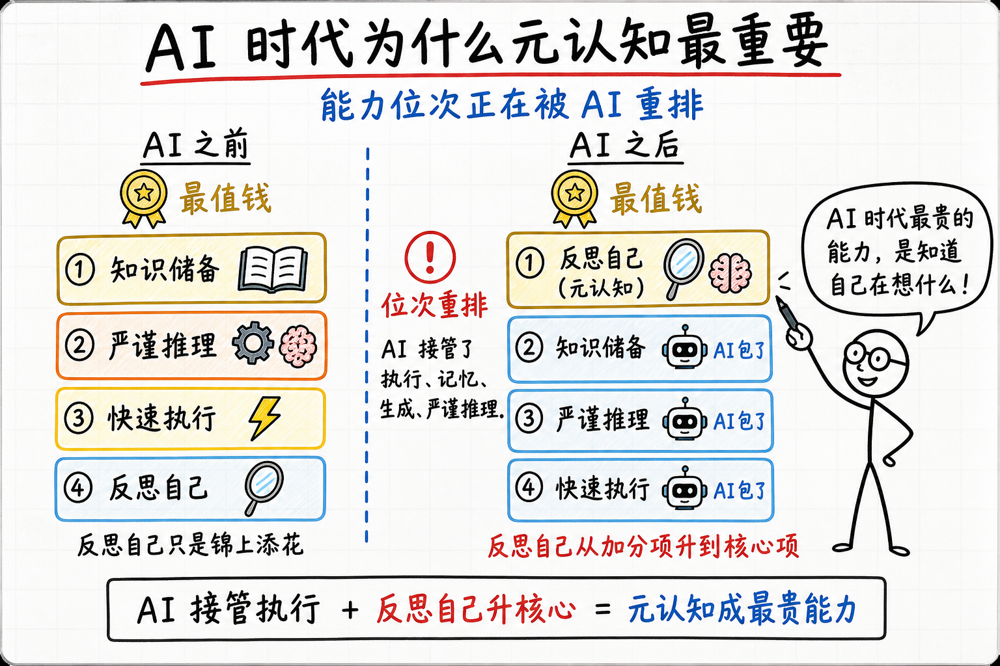

Demis Hassabis 在 2010 年创办 DeepMind 之前，做了一件很反常规的事。

那时候他已经在游戏 AI 圈做了好几年——剑桥本科计算机毕业，参与过 Bullfrog 的 *Theme Park*，在 Lionhead 主导过 *Black & White* 的 AI 系统。在那个年代的游戏 AI 圈里，他是顶尖的。按正常路径走下去，他应该一直在游戏 AI 这条路上做下去。

但他没有。他停下来跑去读了 UCL 的认知神经科学博士，研究海马体和记忆。读完博士又做了几年博士后，专门研究人脑怎么想象未来的场景。整个跨界用了他大概 6 到 7 年。然后他才回来创办 DeepMind。

这件事在当时几乎没人理解。一个一线的游戏 AI 程序员，跑去研究海马体，能干嘛？

15 年后的答案大家都看到了。DeepMind 出了 AlphaGo、AlphaFold、Gemini。Hassabis 2024 年拿了化学诺贝尔奖。回头看那 6、7 年的"绕路"，是他做的最关键的一步——他想做的从来不是"更好的 AI 程序"，是**智能本身**。而要理解智能，世界上唯一可用的样本就是大脑。

这个模式不是 Hassabis 一个人的。AI 这一代核心人物里，搞认知/神经出身的比例高得反常——Hinton 本科是实验心理学，Yann LeCun 的卷积神经网络直接抄的是猫视觉皮层的结构，清华的刘嘉是脑与认知科学博士。一个工程领域的爆发，主力却来自隔壁的认知科学，这件事本身就值得想。

往下挖一层会看到原因——**他们都知道自己真正要回答的问题不是"怎么写出更好的代码"，而是"智能的底层结构是什么"**。这个判断决定了他们花时间的地方跟普通工程师完全不一样。Hassabis 花 6 年去研究人脑，不是因为他不会写代码，是因为他知道**不理解智能就做不出 AGI**。

这是一种很特殊的能力——**对自己当前位置、能力边界、真正目标的清醒度**。心理学里叫元认知。

## 引子：两个反方向的人，指向同一个能力

### 一个看起来反方向的例子

2026 年 3 月，葡萄牙波尔蒂芒，世界超级摩托车锦标赛 SSP 组，一台中国造的赛车连下两个回合冠军。第一回合领先第二名近 4 秒——在这个项目里，0.5 秒已经算很大的差距。这台车叫张雪 820RR-RS，背后是一家叫张雪机车的重庆公司。打破了欧美车队在该项目 37 年的垄断。

公司创始人张雪，1987 年生，湖南怀化人。**14 岁辍学**进了家乡修理铺当学徒，最高学历初中。从洗零件开始，2004 年开始练摩托车，2006 年骑破车冒雨追湖南卫视采访车 100 多公里争取上镜，被车队看到才进去培训。2013 年到重庆创业，2017 年办了凯越机车，2024 年才成立专攻赛车的张雪机车。从他 19 岁立志（2006）到造的车真正拿世界冠军（2026），刚好 20 年。

这件事里最值得想的不是"初中学历的人成功了"——这种故事中国不少，大多没什么参考价值。值得想的是另一件事：一个修车工，怎么知道造一台能赢 WSBK 的车需要什么？

他没在欧洲赛车工程师团队待过，没读过相关博士，发动机是自研的 819cc 三缸——这是真正的工程，不是简单的组装。能做到这件事，他必须对"赛车机械的本质是什么"有一套远比常人深的理解。

答案跟 Hassabis 那个故事其实是同一个——他对"赛车机械到底是怎么回事"的清醒度，比绝大多数科班出身的工程师都高。他 20 年里反复琢磨同一件事的底层，所以他知道自己每一步缺什么、要补什么、哪里凑合不了。

一个普通修车工修一辈子车，也不会去问"为什么这台车比那台快 4 秒"——因为他没有去监控自己认知边界的习惯。张雪有。这就是为什么同样从修车铺出来的人，绝大多数到 40 岁还在原地修车，他能造出冠军赛车。

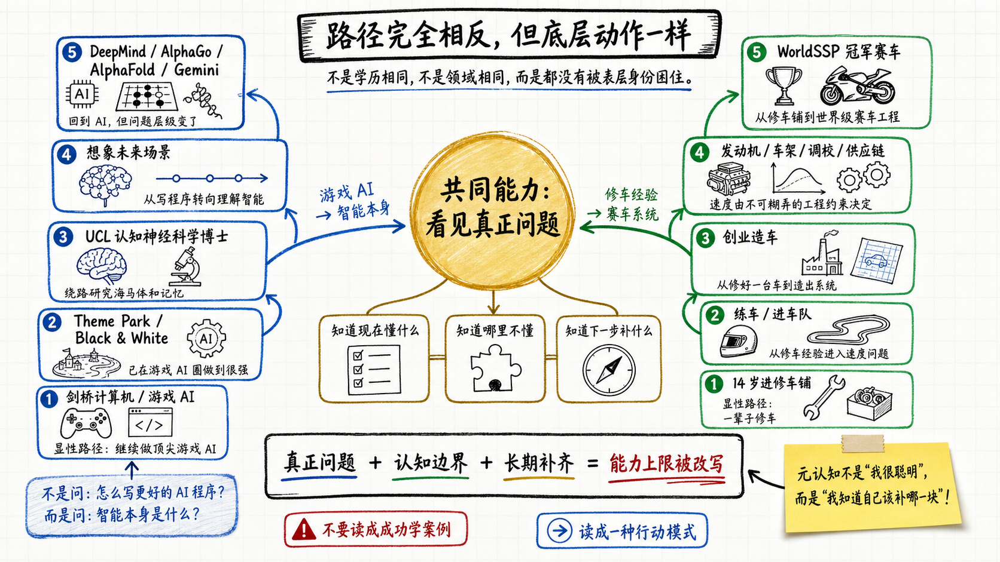

### 把两个人物放一起

一个是博士+诺奖+创立 DeepMind 的科学家，一个是初中辍学+修了一辈子车的工程实践者。看起来完全在两条道上。但他们共同的核心能力是同一个——**知道自己要回答的真正问题是什么，知道自己现在懂什么、不懂什么、需要补什么**。

这就是元认知。不是聪明，不是学历，不是知识量。是把脑子里那张网反过来照自己的能力。

普通人不缺学习能力，缺的是这种"反过来照自己"的习惯。多数人学习，是把外面的信息往脑子里塞。元认知强的人学习，是先看一下自己脑子里现在长什么样、哪里缺、缺的那块要怎么补——然后再去找信息。这两种方式表面上都叫"学习"，效率差几十倍。

### 为什么 AI 时代这件事变得特别重要

AI 把"执行"压成了零成本。能写代码、能查资料、能生成方案、能写报告。

我自己最先慌的不是看到 AI 干掉别人，是反思自己写代码这件事的时候——发现整个流程其实非常简单：遇到问题、观察报错、上 Stack Overflow 搜、找到一个能用的答案、套上去、把这条经验固化下来。下次遇到类似问题再走一遍。

这条流程一旦看清楚，自己就慌了。因为这件事 AI 做得比我快——它的搜索范围比 Stack Overflow 大、它的经验固化是参数级的、它套答案的速度按毫秒算。一个普通程序员的核心工作流，AI 几乎全覆盖。

慌完之后开始想另一件事——那人到底剩什么是 AI 替不掉的？

为了想清楚这件事，我开始仔细看身边的同学怎么用 AI——写代码、写技术方案、写报告、做汇报材料。看了一段时间下来，发现一个反复出现的模式——**很多人跟 AI 对话时，处于一种"我不知道自己不知道"的状态**。

AI 时代最危险的地方，不是它会给出错误答案，而是它能把一个没想清楚的问题，包装成一份看起来已经想清楚的答案。

以前一个人没想清楚，通常会卡住：写不下去、说不明白、方案推不动。卡住虽然痛苦，但它至少暴露了一个事实——这里还有东西没想透。

现在不一样。你只要给 AI 一个模糊的问题，它也能生成一套完整输出：结构清楚、语气专业、逻辑顺滑、细节充足。表面上看，问题被推进了；实际上，最关键的那一步可能被跳过了——你没有先确认自己到底在问什么、缺什么、为什么相信这个方向值得做。

AI 的流畅性会制造一种认知错觉：只要输出足够完整，就好像输入也足够清楚。
但真正决定质量的，往往不是输出阶段，而是提问之前那一层自我审视。

这就是为什么元认知在 AI 时代变得更重要。AI 能帮你把答案写得更像答案，但它不会自动替你发现：你一开始问的可能就是错的问题。

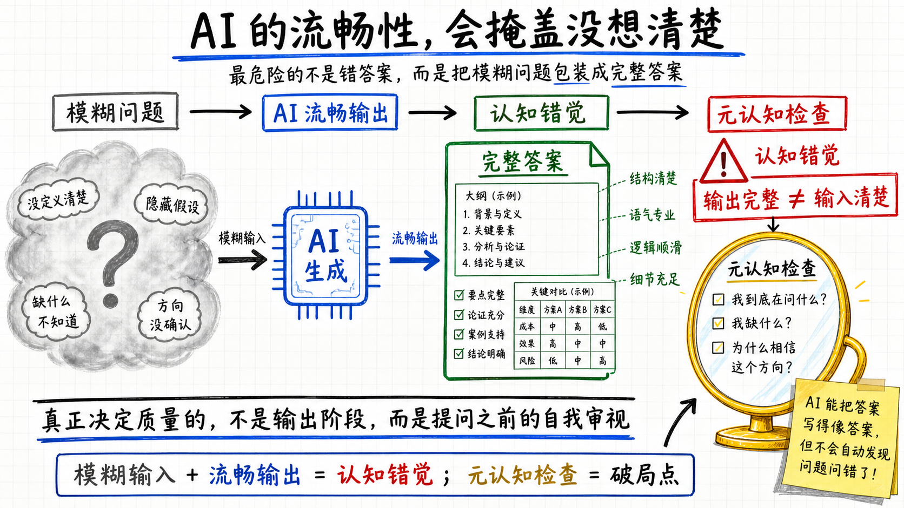

意识到这件事之后，我开始想"那 AI 到底缺什么"。

试了一段时间后慢慢想明白——AI 不是不会定义问题。**AI 在确定的上下文里定义问题比人快、比人准**。你给它一个 context window，里面有完整的需求、约束、历史，它能给出比绝大多数人都更精准的问题拆解。

AI 真正缺的，是**跨上下文的连接**——它只能在 context window 里连点。它没办法把你昨天吃饭时看到的一篇文章、上个月用过的一个工具、三年前踩过的一个坑、跟今天面前的这个问题自然连起来。这种跨域的、跟你的成长经历相关的连接，发生在 AI 完全不在场的时候——吃饭、走路、洗澡、走神。

举一个我自己最近的例子。我前段时间在测试 spec driven development（SDD）这套东西，需要在 coding agent 的终端窗口里不停交互。这种 terminal 多窗口操作要自动化模拟其实挺难的——AI agent 自己在终端里玩多窗口不容易稳定。

但我自己之前为了别的事情用过 PSmux——一个能像 tmux 那样操作子窗口的工具。这两件事完全不在同一个上下文里：SDD 是最近的事，PSmux 是更早为了完全不同的目的用的。但脑子里"我需要让 agent 在多个子窗口稳定交互"这个念头一出来，PSmux 就自动浮上来了。问题解决了。

这条连接 AI 拿不到——它的 context window 里没有"我用过 PSmux"这件事。这是我整个使用经历织出来的，跟当下窗口无关。

这就是 AI 时代人剩下的那块——**跨域连接**。一个人脑里的网越宽（横跨越多领域、越多深度），他在新问题面前能调出来的东西就越多、越独特。这是 AI 替不掉的，因为 AI 的网只在它的 context 里，你的网在你的人生里。

但跨域连接有一个前提——**你得知道自己脑里挂着哪些东西**。如果连自己装着什么都不清楚，新问题来了你的网也不会自动激活相关节点。Hassabis 之所以能从游戏 AI 跳到神经科学再跳回 AGI，是因为他对自己脑里那张网始终清醒——知道哪里有、哪里缺、缺的要去哪补。张雪 20 年里反复琢磨"赛车机械的本质"，也是同一种清醒。

这种"对自己这张网的清醒"，就是元认知。它不直接生产答案，它决定了你能不能在新问题面前把对的节点连起来。

AI 时代之前，这件事是加分项——因为反馈足够频繁、足够硬，外界会替你审视你想没想清楚。AI 时代，反馈变得迟钝（AI 写的代码大多能跑，文档大多过得去，方案大多看起来合理），外界不再替你审视。这时候，**只有元认知好的人才知道自己实际站在哪、缺什么、该怎么补**。

所以它从加分项升到了核心项。

下面把元认知是什么、它怎么工作、怎么训练，一层一层拆开。

## 一、先理解大脑是怎么工作的

要监控"自己的认知"，先得理解认知本身是什么。元认知不是悬在空中的概念，它跑在跟普通认知同一套硬件上，只是方向反过来。

心理学把知识分成四类：事实性知识（什么是什么）、概念性知识（概念之间的关系）、过程性知识（怎么做）、元认知（对自己认知的认知）。这四类不是孤立存放的，是一张网。

"网"在这里不只是个比方。AI 就是神经网络，人脑也按神经网络的原理工作；脑里的概念之间形成的连接结构，跟工程上的知识图谱在数学上是同一类东西。后面说的"节点""线""挂在哪""激活哪片"，都是字面意思，不是修辞。

举一个看似平常但其实有分量的例子——"苹果"两个字。

听到这两个字，每个人脑里被点亮的东西不一样。学物理的人想到牛顿和万有引力；做手机的人想到 iPhone、想到供应链、想到库克；做电商的人想到客单价、想到 SKU、想到生鲜冷链；果农想到富士、嘎啦、红将军这几个品种的成熟期和收购价；做中医的人想到肺经、想到秋燥润肺。同一个词，激活的是完全不同的网络。

这件事说明两件事——

**第一，知识不是按词存的，是按"这个词在你生活里挂在哪几个东西旁边"存的。** 同样听一节课，两个人记下来的东西可能完全不同——不是谁更努力，是他们脑里的挂点不一样。新知识进来，得先找到挂点才能存住，找不到就掉了。这是为什么对一个完全陌生的领域，听再多课收效都差——脑子里没有挂点，新内容像砸到光滑墙面上，弹回来。

**第二，一个人脑里这张网长什么样，是他这辈子见过什么、做过什么、想过什么决定的。** 两个看起来同样聪明的人，听到同一句话，激活的概念可能完全不重合，所以他们的判断会完全不同。这不是观点之争，是底层网络结构之差。一个判断你觉得不可理喻，对方觉得理所当然——多半不是谁对谁错的问题，是你们脑里那张网在同一个词上挂的东西不一样。

回到 Hassabis 那个故事——他之所以会跑去读神经科学博士，是因为他脑里的网早就把"游戏 AI"和"智能本身"这两个节点连上了，所以他能看出游戏 AI 这条路再走下去也到不了 AGI。一个普通游戏 AI 程序员脑里的网，"游戏 AI"挂在"性能优化""玩法体验"这些节点旁边，根本不会跟"智能的底层结构"连起来。同样听到"我要做更好的 AI"这句话，两个人激活的网络完全不同——所以走的路完全不同。

这一点，在脑科学和 AI 之间有一段很硬的对应。1986 年 Hinton 在一个很小的会议上发了一篇文章，提了一个词叫 fast weight。那篇文章后来直接成了 transformer 的理论起点。Hinton 当年想讲清楚一件事：**神经网络做的事情，本质上就是找万事万物之间的关系**。所谓 attention，就是找这种关系的一种方法。

这个判断后来在脑科学里也被印证。刘嘉团队证明，人脑里 working memory 的机制，跟 transformer 用的是同一套数学。脑里有一类细胞叫 grid cell（网格细胞，2012 年拿过诺贝尔生物学奖），原本被发现用来做空间导航，后来大家发现"导航"和"记忆"其实是一回事——都是在找节点之间的关系。空间里的"从 A 走到 B"，和记忆里的"从一个概念跳到另一个概念"，用的是同一套电路。

所以**人脑、AI 模型，本质上做的都是同一件事：把这个世界拆成节点，再在节点之间织线**。一个人聪不聪明，不取决于他存了多少节点，取决于他在节点之间织了多少线、织得多准。

现在可以把元认知放回这个框架里——

普通认知，是用这张网去看外面的世界。看一个新事物，激活相关节点，找到关系，做出判断。

元认知，是把这张网反过来照自己——

- 我刚才那个判断，是从哪几个节点激活出来的？
- 那几个节点之间的线，是真的连得起来，还是我一厢情愿连上去的？
- 我有没有一个节点其实是空的，但我以为它装着东西？
- 我有没有一片区域线特别稀，所以我在那里的判断其实不可靠？

这就是为什么元认知难——你要用同一张网，去审视这张网本身。这是一个递归动作，跟"用眼睛看自己的眼睛"一样别扭。多数人一辈子都没意识到自己可以这么做，更别说常常做。

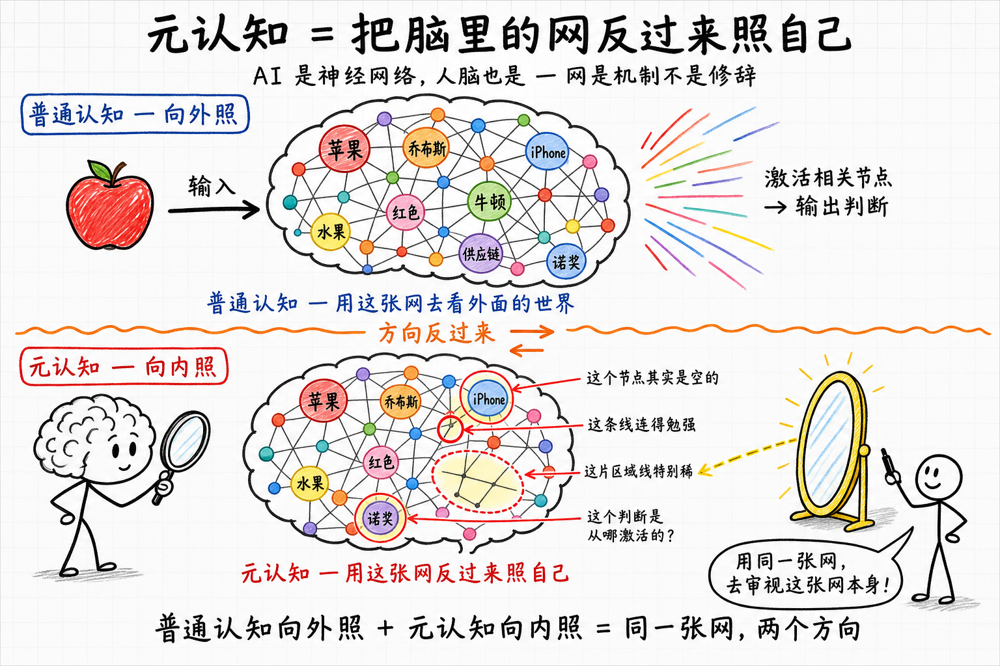

## 二、学习的本质是织线，不是塞节点

刘嘉访谈里有一段话讲得很狠——

> "假设你让我学 1+1=2，我可以学会 1+1=2，我也可以把它记下来。但是你记忆 1+1=2，你永远不会做 2×3=6 这件事情。因为你跳不出加法这个框架。"

这句话的内核是：**记住一个事实，跟把那个事实挂进网络，是两件完全不同的事**。表面上都叫"学了"，但前者一年之后留不下什么，后者一年之后整张网都变了。

举一个有点厚度的例子。学 transformer 的人有两种。一种把每个公式背下来——QKV 怎么算、attention 怎么 softmax、multi-head 怎么并行。过一个月公式就糊了，写出的代码也糊。

另一种人，学之前先记住 Hinton 1986 年那篇文章的内核——**神经网络做的事情，本质上是找万事万物之间的关系**。然后再看每个具体机制：QKV 是把 token 投影到三个空间去找关系，attention 是衡量任意两个 token 之间的关系强度，multi-head 是从多个角度同时找关系。每个公式都挂在"找关系"这一个根上。一年后他能用这套框架去解释新出的模型变体，也能反推为什么某些设计走不通。

两种人花的时间差不多，记住的具体内容也差不多。但第一种人脑里是一堆孤立节点，第二种人脑里是一张挂在同一个根上的网。

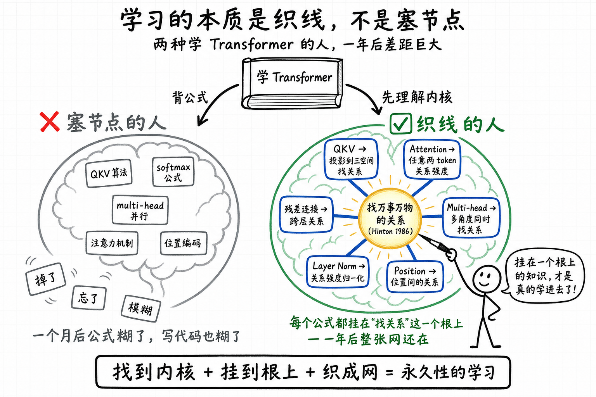

学习背后有两种推理方式。**归纳推理**——看几张猫的图片，能认出新的猫。这是从例子归纳到一般。**演绎推理**——从一个逻辑原点出发往前推，得出新的结论。亚里士多德最早提的"第一性原理"就是这个意思。

AI 现在很强的是归纳。喂几个样本，它能识别新样本。多数人的"学习"也停在归纳的浅层——记几个例子，能套用就行。AI 弱在演绎找新原点——这一块留到下一章再讲。

真正高效的学习，是把"归纳"和"演绎"接起来——用归纳积累足够多的例子，从例子里看出原理，然后用原理往下演绎到新场景。这个把例子升到原理的动作，就是**升维思考**。

升维这件事，具体长什么样？

每遇到一个新概念，不直接背它本身，先问三个问题：

- 它的**上位概念**是什么？这是哪一类问题的一个特例？
- 它跟我已知的**哪些概念相似**？两者的差异在哪里？
- 如果换一个**完全不同的领域**，有没有对应物？

举一个最常见的例子。学一个新框架，普通做法是照着 tutorial 跑示例代码，一周后忘 90%。因为你记的是"在 X 里实现 Y 要写这几行代码"——孤立节点，没挂在任何更大的结构上。

升维的做法是先问几个问题：这个框架要解决的**核心问题**是什么？它的**设计取舍**是什么——为了得到 A，它牺牲了哪些 B？它跟我用过的另一个 Y 框架在哪几个维度上不同？

这样学完，新框架同时挂在"某类问题""设计取舍""与 Y 的对比"上。每次想起来都能拉出一片网。一年后那张网还在。

升维之所以难，是因为它跟大脑的本能反过来。大脑天然喜欢在低层级转悠——记住具体步骤、套用熟悉模式，能耗最低。每抬升一维，能耗翻倍。所以**多数人遇到新问题都在原层级反复试错**，从来不主动抬一层去看。

要升维，得先意识到自己现在停留在哪一层——是在记代码还是理解原理，是在套熟悉模式还是追问问题的真正结构。没意识到这一点，你不会觉得自己有什么问题，因为低层级让你觉得"我在做事""我有进展"。

**升维是元认知的活，不是知识的活。**

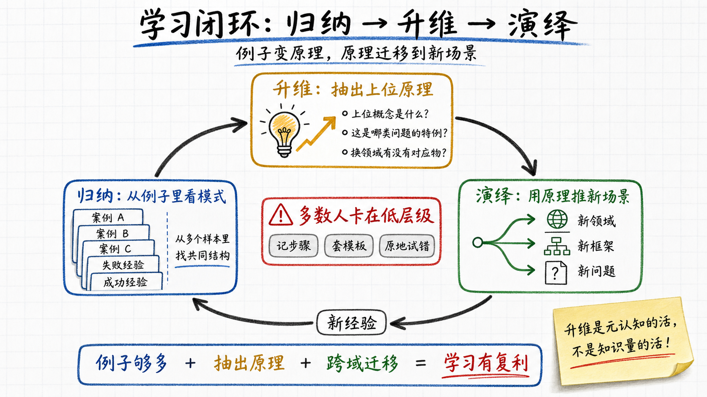

## 三、解决问题：先看你定义对了没

工作里多数时间花在"找答案"上。但拉开人和人差距的，是**定义问题**。

原因其实很简单——**答案的好坏由问题决定**。问题定义偏一度，答案偏一百米。一群人开了二十轮会、加班三个月，做出来一个所有人都觉得"做得很认真"的东西，最后发现整个方向是错的——这种事在每个行业每年都在发生。错的不是执行，是从一开始就没把问题定义对。

定义问题这件事听起来抽象，落到具体场景有几个清晰的层次。

**第一层：识别表面问题和真问题。**

最常见的例子——员工说工作不开心想加薪。表面问题是钱。真问题可能是不被认可、晋升通道堵了、对老板不信任、或者跟同事处不来。加薪解决不了任何一个真问题。给了，三个月后他还是要走，或者留下来继续耗。

这一层的门槛其实不高。多数人不是不会，是没耐心——表面问题摆在那儿，处理掉看起来效率高，往下挖一层要花时间、要承担"挖错了"的成本。所以大多数人就在表面问题上反复打转。

**第二层：用不同学科的框架看同一个问题。**

芒格的"多元思维模型"讲的就是这个。同一个问题，用经济学讲、用生物学讲、用心理学讲、用物理学讲——会定义出完全不同的真问题，对应完全不同的解法。

举个常见的：为什么大公司做不出创新？用经济学讲是激励错位（创新风险高、收益归别人、KPI 不鼓励冒险）；用生物学讲是组织代谢下降（细胞太多、信号衰减、新陈代谢慢）；用物理学讲是熵增（任何系统不主动注入能量就会走向无序）。三种定义各自指向不同的解法——经济学定义对应改激励，生物学定义对应组织拆分，物理学定义对应持续注入新血。

错的定义带来错的解法。这就是为什么"懂得多"在 AI 时代依然有意义——你**手里的框架越多，重新定义问题的可能性就越多**。储备本身 AI 比你强，但储备里有多少能当框架用的东西，是另一回事。

**第三层：找逻辑原点。**

这是定义问题的最深一层。前两层是"在已有框架里重新切问题"，这一层是**自己造一个新的框架**。

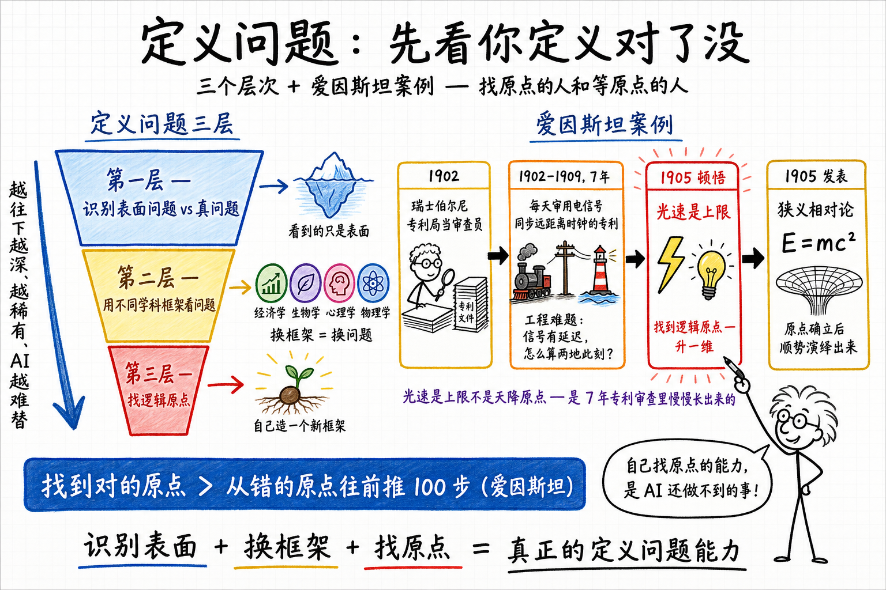

爱因斯坦那里有一句被反复引用的话——"如果给我一个小时解决一道关乎生死的问题，我会花 55 分钟想清楚这个问题到底是什么，剩下 5 分钟解题。" **找一个对的原点，比从错的原点往前推 100 步更重要**。

但爱因斯坦能找到对的原点，不是靠灵感。他 1902 到 1909 年在瑞士伯尔尼专利局当审查员——整整 7 年。那个年代专利局里大量涌进来的是什么专利？**用电信号同步远距离时钟的专利**。当时铁路调度、海上经度测定、跨大西洋电报，全都依赖把相隔很远的两个钟对到一致——这是个实打实的工程难题：信号有传输延迟，怎么算"两地此刻"？

整整 7 年，爱因斯坦每天看的就是工程师怎么解决"两个遥远的时钟如何定义同一个'此刻'"。他对"同时性"这件事的感觉，比任何同时代物理学家都深——别人是在课本上读这个问题，他是在审专利的过程中反复被它擦着脸过。

1905 年狭义相对论里最反直觉的那个判断——"同时性不是绝对的，取决于参考系"——本质上就是把他审 7 年专利的核心工程矛盾，往上升一维变成了物理学原理。"光速是上限"不是天降的原点，是从 7 年专利审查里慢慢长出来的。

这条线被科学史家 Peter Galison 在《Einstein's Clocks, Poincaré's Maps》里讲得很透——相对论不是一个孤立天才的灵光，是一个**脑里正好有那张跨域网的人，在对的时间被对的问题撞上**。普通物理学家也会演绎，但他们站的原点都是别人给的；爱因斯坦自己找原点，因为他脑里那张网的形状跟别人不一样。

反过来更常见的情况，是有人手里捏着可以做大事的材料，却因为没有自己的原点，错过了 20 年。

刘嘉访谈里把这件事讲得很狠。他用自己当例子——

> "我为什么走了 20 年的弯路？……我没有信仰。Marvin Minsky 说神经网络不靠谱，大师就是我的逻辑原点。然后我自然就跑不见了。"

刘嘉 1994 年就接触到人工神经网络。如果当时他能给自己定一个原点——比如"我相信人工神经网络能产生跟人一样的精神世界，所以我必须做这件事"——他会一头扎进去，可能就是 Hinton 那个位置。但他没有自己的原点。他的原点是"大师说"。所以他绕了 20 年。

清华教授承认这件事是需要勇气的。但比承认更难的是另一件事——**意识到自己的"原点"其实不是自己的**。多数人这辈子都没意识到这一点。他们以为自己在思考、在做决策，其实是在执行别人给的原点：父母说要稳定就找稳定工作，社会说要房子就买房，行业说要跟风就追新概念。原点都是借来的。

找一个真正属于自己的原点——知道自己为什么做这件事、为什么不做那件事、什么是你愿意赌一辈子的——这件事 AI 完全替不了。因为 AI 不知道你是谁、信什么、过去经历过什么。

也只有你能找。

### AI 在定义问题这件事上能做什么

这里要说清楚一件事：**AI 不是不会定义问题**。

我自己试了一段时间，得出的判断是——AI 在**确定的上下文里**定义问题，比绝大多数人都快、都准。你给它一段完整的需求、约束、历史，它能给你拆出非常精准的问题结构，甚至能指出你自己没意识到的盲区。这一层它做得非常好。

但 AI 在小窗口里做得越好，反差就越明显——它在跨上下文的连接上还是替不掉你。爱因斯坦的 7 年专利、Hassabis 的 6 年神经科学，靠的都是窗口之外几十年的网。

这里还可以再往下挖一层——

会升维的人有一个隐藏优势：**理解新东西特别快**。一个真正啃透过几个复杂系统的人，遇到新领域不是从零开始拼，是迅速把新领域映射到脑里已有的抽象模板上。学过分布式系统的人看区块链，看的不是"币圈玄学"，是带了 Byzantine 容错和共识协议的另一种状态机；研究过编译器的人看 LLM 推理，看的不是黑盒生成，是 token 序列上的一种带学习参数的解释器。新领域被几条抽象模板瞬间穿透，剩下的细节是补丁。

那 transformer 有没有这个能力？

表面看像有——transfer learning 和 in-context learning 都是这种"用旧抽象理解新东西"的版本。给 LLM "X is like Y but with Z"，它能推出一堆合理的结论。

但有几个地方值得想。

第一，transformer 的"升维"是被动、全量的：它的 attention 在每一层把上下文 token 同时映射到所有抽象空间，没有"现在该升到哪一层"的主动判断。人脑的升维是带方向的——元认知先告诉你"这个问题在某个高阶模板下其实简单"，然后你才把网络往那个方向拉。前者是穷举式撒网，后者是有目的的钓鱼。

第二，更关键的是，transformer 在 inference 时权重是冻结的。人脑每一次成功的升维都会**永久性地修改这张网**——下次遇到类似的事激活更快、连接更密。transformer 在对话里"理解到的新东西"，下一轮对话就清零了。所以**人脑的升维有复利，transformer 没有**。一个能升维的人，几十年下来抽象模板越积越深，理解新事物的速度持续加快；transformer 每次都从同一组冻结权重起步。

这几条不算定论——CoT、agentic loop、长期记忆方案可能补上一部分。但目前架构层面，"主动选择升到哪一层"以及"升维之后永久改写网络"这两件事，transformer 里都还没有干净的对应物。

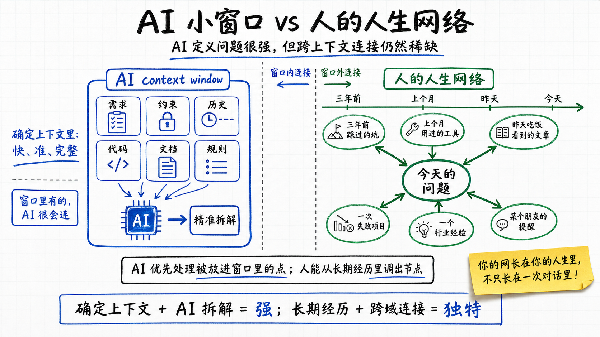

跨域连接有一个前提——**你得知道自己脑里挂着哪些东西**。如果你连自己装着什么都不清楚，新问题来了你的网也不会自动激活相关节点。三年前那个坑挂在那儿，你想不起来；上个月那个工具用过一次，没意识到能用在这里。

## 四、元认知本论：怎么把网反过来照自己

前面三章讲的都是元认知怎么应用——在学习里它叫升维，在解决问题里它叫定义问题。这一章直接讲元认知本身：它是什么、有几个层次、为什么大多数人做不到、能不能训练。

元认知不是一个东西，是三层。

**第一层：监控。** 你能不能意识到自己此刻在想什么、信什么、在用什么状态做判断？

最简单的测试——你在生气的时候，能不能在生气的当下意识到"我正在生气"？你在嫉妒别人的时候，能不能察觉到"我正在嫉妒"？你跟人争执时，能不能看到"我现在不是在追求对的答案，是在追求赢"？

能，就有基本的元认知。这一层听起来简单，但能稳定做到的人已经比绝大多数人强了——多数人被情绪推着走的时候，根本意识不到自己在被推。

**第二层：评估。** 监控到了之后，能不能判断"这种状态合理不合理"？

我现在很有信心这个方案能成，是因为它真的可行，还是因为这是我自己提的方案？我对那个人评价很低，是因为他真的差，还是因为他三个月前在我朋友面前驳过我？我现在认定 X 是对的，是因为我想清楚了，还是因为团队里地位高的人这么认为？

这一层比第一层难得多。因为评估的对象是你自己的判断——你必须把"我"和"我的判断"分开看，承认它们不是同一个东西。

**第三层：重塑。** 评估完之后，能不能主动改写自己对类似情境的反应模式？

知道自己在嫉妒，不一定能让自己下一次不嫉妒。知道自己有"对自己的方案过度乐观"的倾向，不一定能让自己下一次评估方案时保持中立。第三层是把第二层得出的判断真的写回到自己的认知系统里，让下一次的反应不一样。

这一层最稀有。能稳定做到的，已经是道家说的"内观"或者佛家说的"觉照"那个级别。

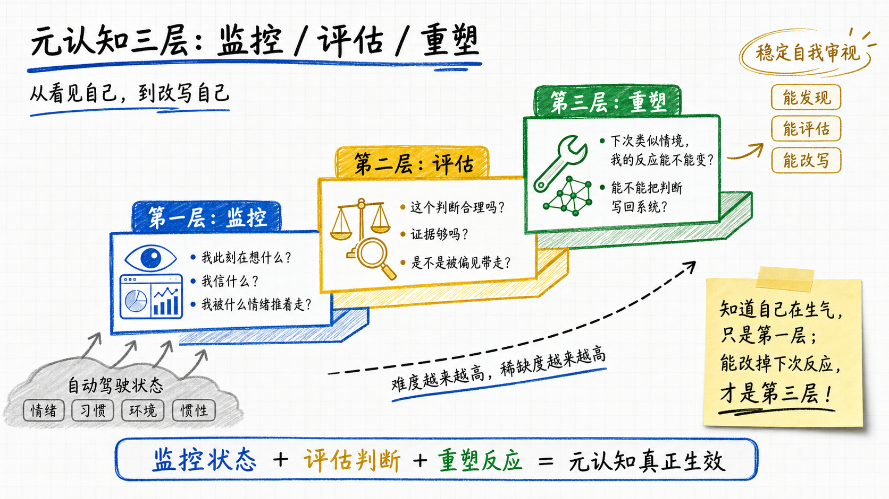

### 为什么多数人停在第一层

几个原因互相叠加。

**能耗。** 监控自己已经费力，评估自己更费力——大脑天然不想做这件事，能省则省。

**情感成本。** 评估自己的判断意味着可能要承认"我之前是错的"。在生理上承认错误接近承受疼痛，所以人会本能地避开。

**环境不奖励。** 开会时承认"我刚才的判断有问题"，在多数公司文化里不讨好。社交场合主动反思自己更是少见。环境一直在告诉你：把判断说得越坚定越好。

**最致命的一条：你不知道自己不知道。** 如果你的盲区在第一层——你压根没意识到自己在做某种判断——后面两层就没机会启动。盲区本身是看不见的，否则它就不叫盲区。

最后这条最难破。出路只有几条：靠环境（混到一群有元认知的人里），靠他人（找一两个敢直接刺你的人定期反馈），靠失败（被狠狠摔一次之后回头看）。看书没用——书帮你建第一层，建不了别的。

### 一个把元认知推到极致的操作性定义

刘嘉访谈里有一段，是我读到的关于"高阶元认知"最干净的表述——

> "I 没法定义。那我们怎么来理解它呢？当我把 I 去掉，我还剩什么东西？把我给去掉，那就是死亡。所以死亡意识，我觉得是对高阶意识的一个最清晰的操作性定义。"

一般人想"我是谁"会陷入哲学循环——任何关于"我"的定义都自我指涉。刘嘉直接绕到背面：把"我"拿掉之后剩下什么，剩下的就不是"我"。

这种"绕到背面看"的动作本身就是高阶元认知。它要求你能把"作为观察者的我"和"被观察的我"暂时分开，然后在那个分开的瞬间审视后者。

道家讲"内观"，佛家讲"觉照"，本质都是这种训练——把"我"暂时挂起来，看一眼那个被挂起来的东西是什么。

不上升到这种高度也能用。日常版本有几个动作——

- 每做一个判断之前，问一句"我现在凭什么相信这是对的？"是数据、经验、别人说、还是我没认真想？
- 每做完一个判断之后，记一笔"我做了这个判断，基于这些理由"。一个月后回头看，对得上几条。
- 每隔一段时间问自己"上个月我有没有改变过任何一个观点？" 如果完全没有，大概率你停在了第一层。

这些动作的共性是——都在强迫你把"我"和"我的判断"短暂地拆开。一次拆开就是一次元认知动作。次数多了，习惯成本下降，自然就能稳定在第二层、偶尔进到第三层。

### AI 帮不上你做这件事

你可以让 AI 审一段代码、一份报告、一个商业方案——它对外部对象的审视能力越来越强。

但你没法让 AI 审"你的判断"。因为它不知道你的判断从哪片网络里激活的，不知道你是基于什么经验、什么偏好、什么遗忘、什么过去的伤痛在做这个判断。它只能根据你说出来的话猜，而你说出来的话本身就被你的盲区过滤过了。

元认知必须自己做。这是结构决定的——元认知的对象就是"那个在用 AI 的人自己"。AI 站在外面，永远进不来。

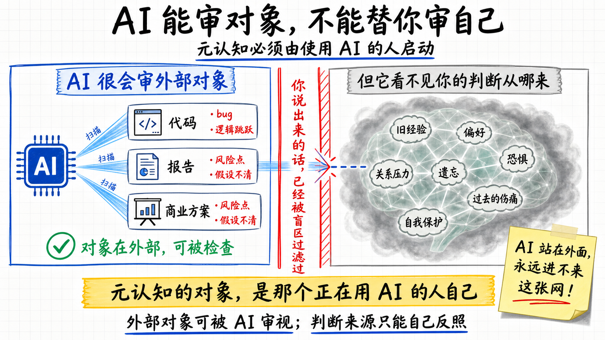

## 五、人生意义：AI 时代你的"第二次生"还没发生

有句话流传很广——**人有两次生，两次死**。

第一次生，是肉身出生。
第二次生，是意识觉醒——你开始知道自己是谁、有自己的方向、有自己愿意赌一辈子的事。
第一次死，是精神被外界完全接管——你停止做属于自己的判断，所有方向都被热点带、所有想法都被算法喂，你成了别人意义的执行体。
第二次死，是肉身死亡，或者更彻底——最后一个记得你的人离开人世的那天。

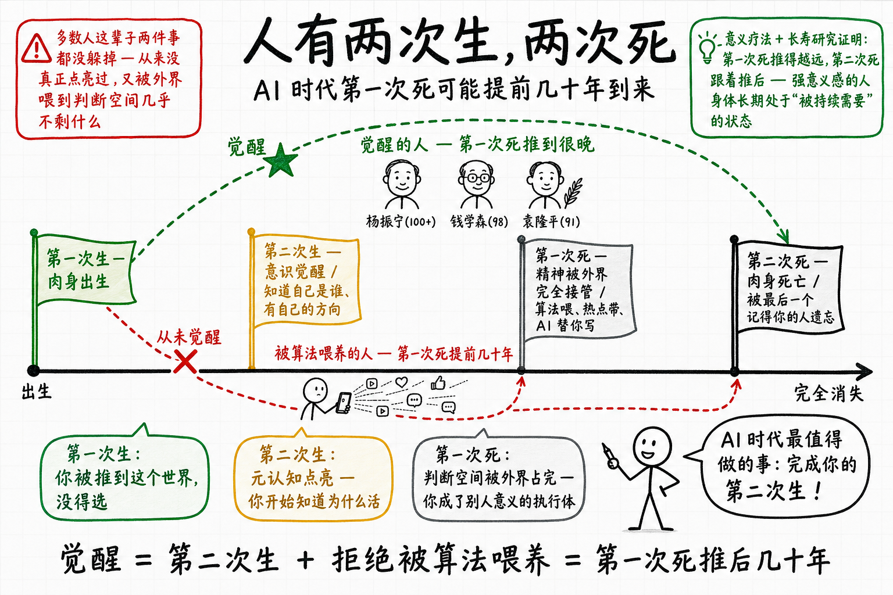

放进元认知的框架里看，**第二次生是元认知点亮，第一次死是元认知被外界压死**——讲的不是同一条时间线上的前后状态，是两个方向上的事。一个是你有没有主动点过那盏灯，一个是你的判断空间被外界占了多少。两件事可以独立发生。

多数人这辈子两件事都没躲掉：从来没真正点亮过，又被外界喂到判断空间几乎不剩什么。自己却毫无察觉。

在 AI 时代之前，第一次死和肉身死亡的时间表大致绑定。你劳作几十年，总能从经验里慢慢长出一点属于自己的东西，不至于精神层面早早死透。AI 时代把这个绑定拆了——**第一次死可以来得非常早、非常顺滑**。

以前一个人想精神死亡，需要主动放弃思考很多年。现在不用了——算法喂你判断、热点带你方向、AI 替你写、推送替你看。你可能 25 岁就完成了第一次死，然后还要活几十年。

这是 AI 时代真正的威胁。**不是肉身被替代，是精神被替代而你不知道**。

### 死亡意识是第二次生的扳机

为什么人会有"第二次生"这件事？因为人有死亡意识。

刘嘉访谈里有一段——他说人和动物最本质的区别不是智能，是死亡意识。

动物没有死亡意识。猫到了快不行的时候找个角落躺下，就完了。但人从四五岁开始就知道自己会死，而且不知道什么时候死。

人就生活在"最大的确定"（一定会死）和"最大的不确定"（不知道什么时候死）之间。这个夹缝里挤出来的东西，就是**意义需求**。

意义需求是第二次生的扳机。一个从未被这个扳机打中的人，永远停留在第一次生的状态——肉身在活，但没有方向。

积极心理学里有一种正式疗法叫"意义疗法"——一个人得了严重精神疾病，咨询师不治症状，先帮他找意义。意义找到了，很多症状自己就消了。意义在精神层面的杠杆，比"治症状"高一个数量级。

### 第一次死被推得最远的样本：长寿的大科学家

如果第一次死可以被推后，能推到多远？

看一些极端样本。**杨振宁活到 100 多。钱学森 98 岁去世前依然在批阅学生论文。袁隆平 91 岁去世前还在田里看稻子。钟南山 80 多岁还在临床一线。任正非、Hinton 都是 70 多岁还在每天处理高强度的新问题**。这些不是孤立巧合。

这背后有一个机制——一个强意义感的人，**身体长期处于"被持续需要"的状态**。每天都有未完成的工作、有等他做判断的人、有他比谁都更适合解的问题。身体读到这些信号，会主动调动资源去维持那个被需要的状态——免疫系统、循环系统、激素水平、睡眠质量，全都跟着"还得活着才行"这个判断走。

心理学有研究印证。Patrick Hill 等人在多个长寿样本里发现：sense of purpose（人生目的感）跟寿命有正相关，比饮食、运动、社交几个常见因素都更显著。日本 Blue Zones 研究里的"ikigai"（生之意义）也是同一回事。

意义当然不保证长寿——遗传、疾病、意外这些事意义谁也压不住。但在能控制的那部分因素里，**它是杠杆最长的一根**——比饮食、运动、社交都更显著。

### AI 没有死亡意识，所以永远不会替你完成第二次生

刘嘉在访谈里把这件事推到一个更深的层次——AI 没有死亡意识，而且永远不会有。

> "AI 它能不能找到自己的意义？当它没有死亡这种压迫的时候，它还能找得到它进化的意义吗？"

一台 CPU 烧了换块 CPU，硬盘烂了换块硬盘——AI 在物理上是可以永生的。没有死亡的压迫，就没有意义的需求。所以 AI 永远不会"主动想要什么"，只会"执行你让它做什么"。

这件事的推论是——**AI 在帮你做"做什么"这件事上越来越强，但永远不会替你回答"为什么做"**。AI 的结构里压根就没有这种动机，再多算力也长不出来。

所以一个反直觉的事实是——你比 AI 强不了多少，但你需要意义，AI 不需要。

而第二次生这件事，只能你自己来。AI 给不了你扳机。

### 想清楚"为什么"，再排"做什么"

第二次生这件事的实操是什么？

几个比较扎实的原则——

**"有钱"不是一个好目标。** 钱是手段不是目的。把手段当目的，到了就空。这是为什么很多人追了一辈子钱，到手了之后陷入抑郁——追的过程有意义（钱在变多），到达后却发现终点什么都没有（钱本身不带意义）。硅谷 IPO 后陷入空虚的工程师、套现退休后失去方向的创业者，都是同一种状态：第一次死赶在第二次死之前到了。

**好的意义大多带有某种"无私"。** 太自私的目标要么太容易实现（实现完之后没下一个），要么得不到他人长期支持（孤立的目标不持久）。真正能拉你走很远的事，往往是对他人、对社会有价值的事。袁隆平做的就是这种事，所以它能拉他到 91 岁还在田里。

**想清楚"为什么"，再排"做什么"。** 题目没看清楚就答题，越努力越偏。人生这道题，先回答"我为什么活着"，再决定"今年做什么、不做什么"。顺序反了，所有努力会被外界的标准牵着走——社会说要房就买房，行业说要追什么就追什么，最后你的人生是别人的拼图，第一次死悄悄就发生了。

最后这一条在 AI 时代特别要命。AI 把"做什么"的方案空间炸开了——理论上你想做什么都能做。这时候卡你的，是**你到底想做什么**。

没有这个答案，AI 给你再多选项你都选不动。或者更糟——你看到 AI 帮别人做了什么，就跟着做什么，过了半年发现自己变成了一个被算法推荐和热点拉着走的人。第一次死就这么发生了，自己还没察觉。

AI 时代之前你可以一辈子混过去，第一次死和第二次死大概同时到达。AI 时代之后混不过去——**第一次死会比以前提前几十年来敲你的门**。

而你的第二次生，AI 永远不会替你按下扳机。

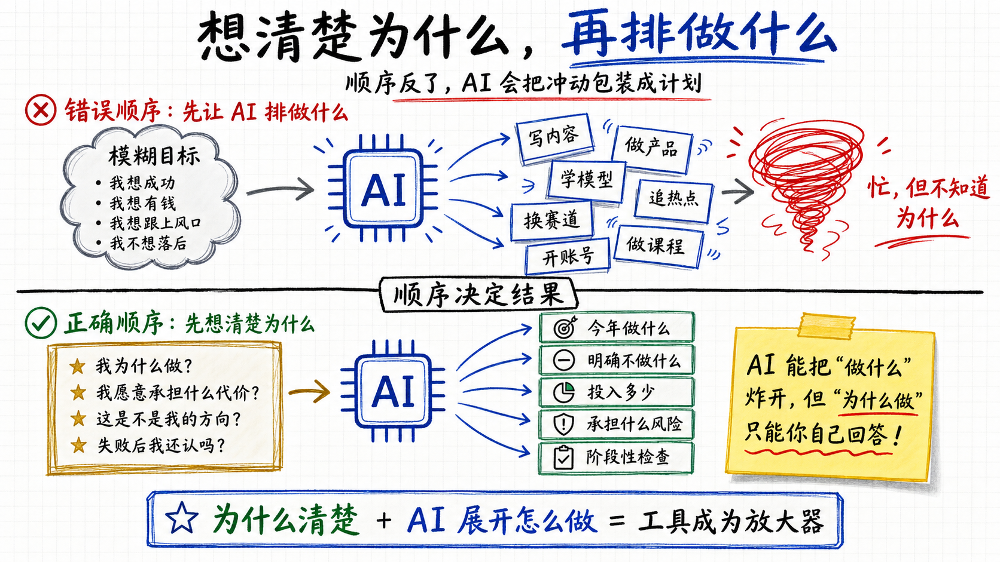

## 六、决策：识别你现在用哪个脑在做主

前面讲的元认知都是关于"思考"的——审视自己的判断、定义自己的问题、找自己的逻辑原点。这一章讲一个特殊场景：**做选择**。

选择跟思考不一样。思考可以慢，可以推翻自己，可以反复来。**选择是一次性的**——按下去就按下去了。买不买房、跳不跳槽、跟谁结婚、做不做这个生意——做完之后下一步只有承担后果。

正因为如此，**决策时的元认知比平时贵 10 倍**。平时多想几遍判断错了无所谓；决策时少想一步，一辈子的轨迹就偏了。

但绝大多数决策做得很糟。原因不在分析能力，在硬件——人脑本来就不适合做这件事。

### 三层脑的进化时间差

人类大脑有三层结构，进化时间差极其悬殊：

- **本能脑（爬虫脑）**：进化了几亿年。管吃喝拉撒、应激反应、生存威胁。
- **情绪脑（哺乳动物脑）**：进化了几千万年。管喜怒哀乐、社交反应、面子和归属。
- **理性脑（新皮层）**：进化了几百万年。管逻辑推理、长期规划、抽象思考。

这个时间差决定了：**面对任何选择，本能脑和情绪脑都比理性脑先反应**。理性脑要等本能脑和情绪脑表演完才能登场，登场的时候情绪已经定调子了——它能做的只有给情绪找理由。

Kahneman 在《思考，快与慢》里把这件事拆得很细——他把快思考叫 System 1，慢思考叫 System 2。System 1 是个"联想机器"（associative machine），把当下激活的概念瞬间串成一个连贯的故事；System 2 多数时候只是事后给这个故事背书。所以行为经济学里有句话——人不是 rational agent，是 rationalizing agent；我们不是先思考后决定，是 System 1 先决定，System 2 事后给它找借口。

这就是为什么大多数人决策靠"感觉"。感觉不是错觉，是本能脑+情绪脑+System 1 组合后的输出。理性脑只是事后给这个输出贴一个看起来合理的标签。

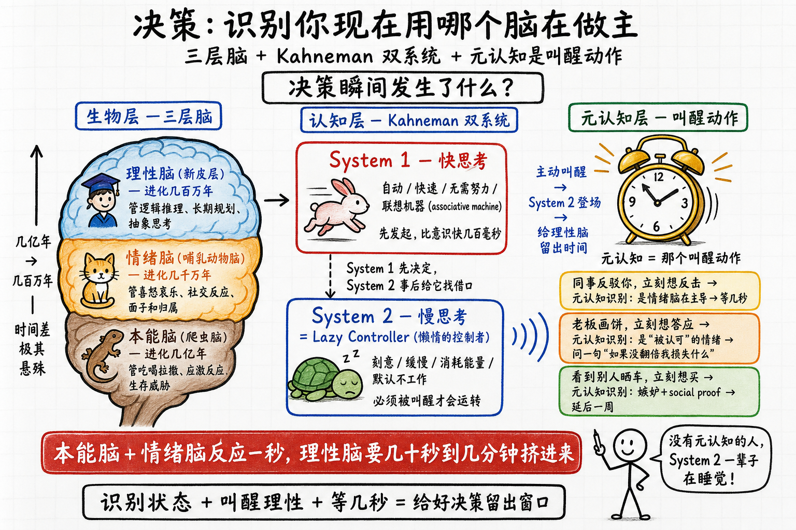

### 元认知在决策中具体做什么

元认知不能让你不"凭感觉"——本能脑和情绪脑的反应速度比意识快几百毫秒，意识根本拦不住。

它能做的是另一件事：**让你识别出自己现在被哪个脑主导**。

几个具体场景：

- 同事在会上当众反驳你，你立刻很想反击。元认知在这一刻能识别出"我现在是情绪脑（面子受损）在主导"，于是你能等几秒再说话——几秒之内情绪脑的爆发会衰减，理性脑能挤进来。
- 老板给你画饼说三年翻倍，你立刻想答应。元认知能识别出"我现在被'被认可'的情绪推着走"，于是你能问一句"如果三年没翻倍我损失什么"。
- 看到朋友圈某人晒了 50 万一辆的新车，你立刻想"我下个月也要买"。元认知能识别出"我现在是情绪脑（嫉妒 + social proof）在驱动"，于是你能延后一周再想。

元认知在决策上的作用是**给理性脑留出登场的时间**。

Kahneman 把这件事讲得更狠——他叫 System 2 是 **Lazy Controller**（懒惰的控制者）。System 2 有能力反驳 System 1，但默认不工作；必须被主动叫醒才会运转。**元认知就是那个叫醒动作**。一个没有元认知的人，他的 System 2 一辈子都在睡觉，所有决策都由 System 1 替他做，他自己以为是自己想清楚的。

这件事的代价比想象中大。本能脑+情绪脑反应一秒钟，理性脑挤进来要几十秒到几分钟。多数人的决策窗口就在那一秒之内关闭了——脱口而出、当场答应、立刻购买、马上回复——然后理性脑用接下来的几个月时间为那一秒的决策找理由。

### 怎么训练在决策瞬间启动元认知

几个比较扎实的训练方法：

**给重大决策强制设定冷却期**。"24 小时内不做任何超过 X 金额的决定"，"重大职业选择必须搁置一周再决定"。这不是优柔寡断，是给理性脑买时间。

**预先准备"暂停问句"**。在情绪起来的瞬间，问自己一句固定的话——"我现在是哪个脑在做主？" 这一问就是元认知动作。一旦它启动了，情绪脑的主导地位就开始松动。

**事后复盘自己的决策模式**。回头看自己过去 10 个重大决策，多少是冲动做的、多少是冷静做的、各自结果如何。这种复盘会给你一份"我自己的决策偏差档案"——下次再遇到类似场景，能更快识别自己处于什么状态。

这些方法的共性是——都在给理性脑创造一个能登场的窗口。元认知是那个窗口的开关。

### AI 时代的决策：系统二被接管，系统一靠你

刘嘉访谈里有一段非常硬的判断：

> "AI 现在在系统二这块已经追上来甚至超过人了——数学、编程、法律分析这些'理性活儿'，AI 都做得不错。"

Kahneman 的系统一是快思考（本能+情绪），系统二是慢思考（理性）。AI 在系统二上越做越强——给它干净的输入，它能输出比绝大多数人都更严谨的分析。

但这件事有个隐藏的前提——**给它干净的输入**。你被情绪带着写的 prompt，AI 也只能基于这个 prompt 给你"合理化"的输出。AI 不知道你的情绪状态，它默认你的输入就是你真正想问的问题。

举个例子。你跟老板吵架了，气得不行，打开 AI 问"我现在应该辞职吗？" AI 会很认真地给你列辞职的利弊，看起来非常专业。但它给你的整个分析，基础就是错的——因为你真正的问题不是"该不该辞职"，是"我现在情绪化了应该怎么冷静下来"。

Kahneman 把这种"用一个问题替换另一个问题"的动作叫 **substitution**（替代）——人面对难问题时，System 1 会偷偷换成易问题来回答（"这位候选人有多胜任"被换成"我有多喜欢他"）。AI 时代有个新变种——你被情绪带着把当下真正的问题（"我现在怎么冷静下来"）替换成一个 AI 能漂亮处理的假问题（"我该不该辞职"）。AI 严肃地给你假问题的答案，你以为问题解决了。

AI 在系统二上替你工作得越好，你就越容易跳过自己的系统一管理直接让 AI 工作。结果是——用最严谨的工具，做最草率的决策。

所以 AI 时代真正决定决策质量的第一件事，是**给 AI 提交问题之前，你能不能先把自己的系统一调到中立状态**。

但这只是一半。另一半是反过来——**主动用 AI 来强化你自己的元认知**。前提是给它换一个角色：不是答案生成器，是元认知脚手架。

几个具体用法——

**让 AI 当红队**。你提了一个方案，让它专门列出 10 种这个方案失败的方式。人对自己提的东西有 endowment effect——看不全自己方案的 weakness。AI 没有这个偏差，挖出来给你。

**让 AI 模拟不同立场的人审视你的判断**。"假设你是挑剔的投资人 / 严格的监管者 / 极度怀疑的用户，看这个方案，你会问哪 5 个最尖锐的问题？" 同一份方案在不同立场下被审视，会暴露你自己看不到的盲区。

**让 AI 帮你拆解隐藏假设**。你说"我打算 X 因为 Y"，让 AI 问"Y 真的成立吗？X 还依赖哪些你没说出来的前提？" AI 极擅长挖隐藏假设——它没有"这件事就该如此"的预设。

**让 AI 把你的推理链跑一遍并指出断点**。把完整推理过程喂给它，让它指出哪一步跳了、哪一步依赖未验证的假设、哪一步在循环论证。这是它做得比绝大多数人都好的事。

这些用法的共性是——**AI 不再是替你做决策的智能体，而是你元认知的外挂工具**。它做的不是替代你的系统二，是放大你审视自己系统二的能力。

所以前面"AI 在系统二上接管"那句要补一个限定——AI 接管的是**对外**的系统二（分析问题、生成方案、严谨推理）。**对内**的系统二，也就是元认知（审视自己怎么想、为什么这么想），AI 没法替你做，但能极大地帮你做。

这个区分决定了 AI 时代决策能力的两端——

- 把 AI 当答案生成器，你的元认知会被绕过，AI 会把你的草率决策按你自己的样子放大十倍。
- 把 AI 当元认知脚手架，你的元认知会被放大几倍，AI 时代你比 AI 之前的自己强一个数量级。

AI 不替你做元认知，但它是元认知的强力放大器——如果你知道怎么用。

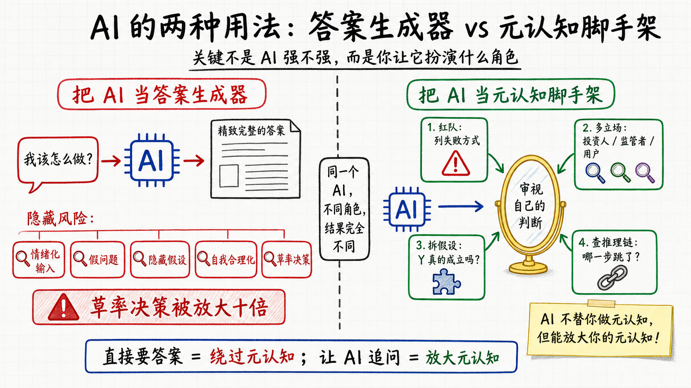

## 七、改变为什么这么难：一个清华教授的自白

讲到这儿应该有个诚实的提醒——**看完这篇文章，你大概率不会变**。

至少不会立刻变。这不是你的问题，是改变本身的难度。

刘嘉访谈里有一段，是这篇文章最扎人的一段——

> "我连我现在都不敢说我现在有 AI 原生的思维方式。因为我现在在拼命的思考怎么和 AI 对话，怎么去和 AI 共生。很难很难……改是一件很痛苦的事情，因为我们很容易就被原有习惯给带走。"

一个清华教授，研究脑科学几十年，现在每天思考人机协作，他都不敢说自己思维模式跟上了。这不是谦虚，是真实。

如果连他都觉得难，普通人凭什么觉得自己看几篇文章就能不一样？

### 硬件的事实

人的认知结构从出生到 25 岁左右就基本定型——这一年龄上限的硬件基础是**前额叶皮层（prefrontal cortex）发育成熟**。前额叶是大脑里负责长期规划、抽象判断、冲动抑制、自我审视的那一块，最晚到 25 岁左右完成髓鞘化。也就是说，元认知所依赖的物理基础在 25 岁前后才彻底装好——此后再想动它，跟动 25 年前盖好的房子的承重墙差不多。能动，但代价巨大。

具体说，有几件事在 25 岁左右就被刻死了——

- 你看问题的默认框架（经济学/工程师/法律/艺术家……）
- 你的情绪反应模式（什么事让你愤怒、什么事让你嫉妒、什么事让你恐惧）
- 你的关系处理风格（依赖/回避/对抗/讨好）
- 你的价值排序（什么对你最重要、什么次要、什么完全不在意）

这些东西每一项都对应大脑里一片定型的神经回路。要改它们，知道道理是没用的——你必须**反复创造新的神经活动模式，让旧回路慢慢被覆盖**。这个过程按神经科学的研究是以"年"计的，不是"周"。

### 什么情况下人会真的改变

观察下来，人会真正改变只有四种场景——

**Hurt enough（痛够了）**。失业、离婚、生病、破产、被骗、孩子出事。痛到一定程度，旧的思维模式 hold 不住了，被迫重建。

**See enough（见够了）**。出国、跨行业、跟比你强一个数量级的人共事、深度进入一个陌生领域。见到的差距大到一定程度，旧的认知框架自动崩塌。

**Know enough（懂够了）**。读了一千本书、做了一万小时的某件事、被某个领域反复打磨过。量变到了，质变才发生。

**Receive enough（被支持够了）**。被一个真正好的环境长期滋养。好的导师、好的圈子、好的家庭、好的伴侣。环境的拉力大到一定程度，旧的反应模式被慢慢替换。

刘嘉是这四种的复合样本。他承认 Hinton 是"找到了自己逻辑原点"的人，他是"小跟班"——see + hurt。他几十年研究大脑——know。但他到了 50 岁才开始想"逻辑原点"。说明这件事即使对一个清华教授来说也是按几十年计的。

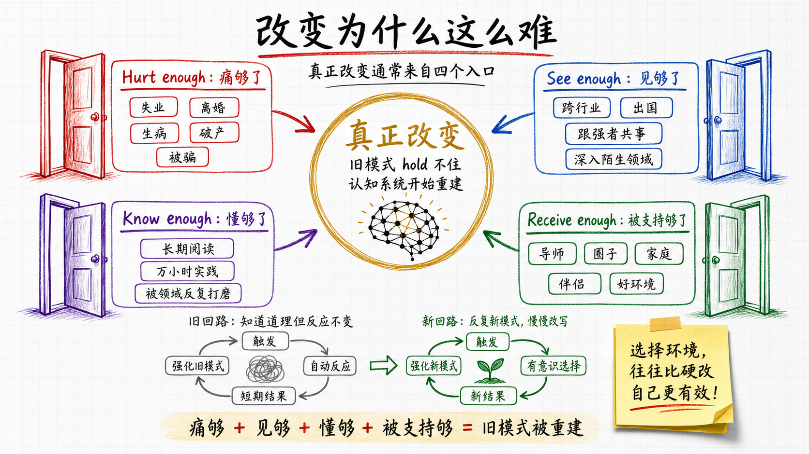

### 元认知改变还多一层困难

元认知改变比一般认知改变难一层——**它是自指的**。

要改变自己的元认知能力，你需要先意识到自己元认知不行。但一个元认知不行的人，恰恰最难意识到自己元认知不行——他认为自己想得很清楚，他对自己的判断很有信心。

这就是 Dunning-Kruger 效应的核心：能力越差的人越高估自己。在元认知这件事上，效应尤其强烈——因为元认知差的人没有评估元认知的能力。

破这个局通常需要外力。靠自己想是想不破的——你的思维工具本身就是要被改造的对象，无法用它自己去改造它。

### 一条相对走得通的捷径

听了这么多坏消息，有一个相对走得通的方向——**选择比培养更重要**。

你很难改变自己。但你可以**选择你周围的环境**。环境会慢慢塑造你，比你主动改自己高效得多。

具体说——

- **跟谁混**。选择长期共事和相处的人。一群有元认知的人会反复用元认知问句问你，久了你脑子里就会自动装上这些问句。
- **在哪儿**。选择城市、行业、公司、社区。同样一年时间，在元认知密度高的环境里能完成的认知变化，是低环境的 5–10 倍。
- **看什么**。选择长期接触的信息流。算法推送和朋友圈是塑造你的强力工具，选错了你就被塑造成它们想要的样子。
- **跟什么样的人结婚**。这件事影响最大但最少被认真考虑。一个伴侣的元认知水平决定了你未来 30–50 年的认知环境。

如果你想升级元认知，最实在的路径是先升级你的环境。环境会替你做大部分工作。

## 结尾

七章下来其实只讲了一件事——**AI 时代各种能力的位次在重排，被排到最前面的，是你审视自己的能力**。

学习里它叫升维，解决问题里它叫定义问题，人生意义里它叫第二次生，决策里它叫管理自己，应对改变里它叫选择环境。共性是——AI 不替你做这些事，但都能极大放大你做这些事的杠杆。前提是你愿意做。

AI 时代的能力定价表正在重写。

最便宜的几样——执行、记忆、生成、严谨推理——AI 全包了。

最贵的几样——**知道自己不知道什么；知道自己为什么相信现在所信的；知道自己该往哪儿去**——这些 AI 不替你做，未来也不会。

仔细一看，这三件事就是哲学里那个最古老的三问——

> **我是谁。我从哪里来。我要到哪里去。**

几千年前提出来的时候，是哲学家的命题。今天，它们成了 AI 时代每个人的能力定价表：

- **我是谁** = 知道自己的能力边界、盲区、真实状况
- **我从哪里来** = 知道自己的信念是被什么塑造的、为什么相信现在所信的
- **我要到哪里去** = 知道自己的方向，知道自己愿意赌一辈子的事

这三问你答得越准，AI 越成为你的放大器；你答不出来，AI 替你做的所有事都跟你没关系——技术上是你完成的，本质上是别人意义的执行。

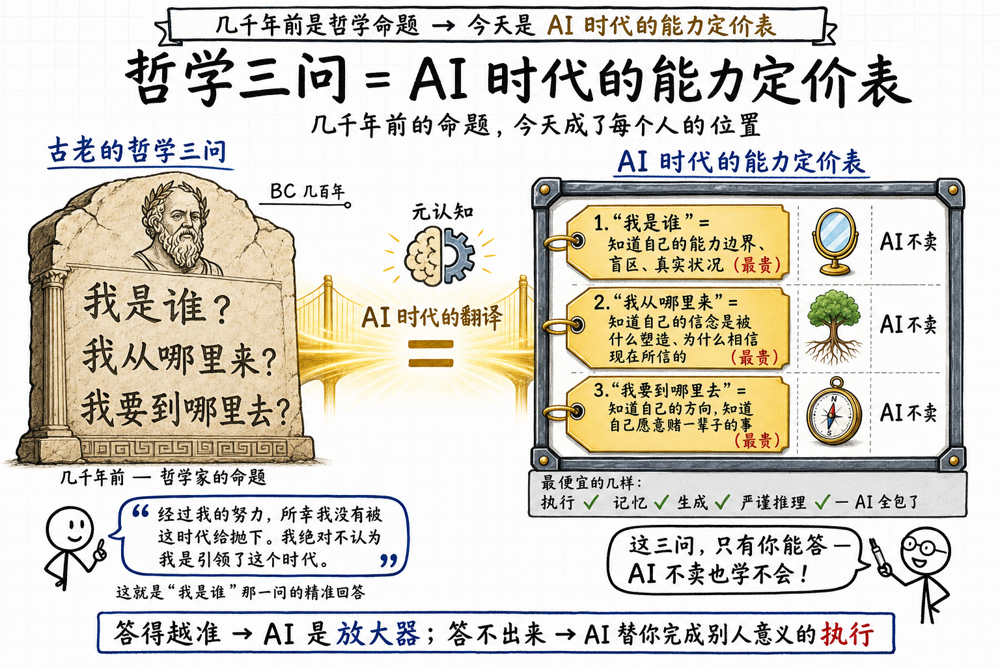

回到刘嘉访谈最后那句话——

> "经过我的努力，所幸我没有被这时代给抛下。我绝对不认为我是引领了这个时代。"

一个清华教授的最高自评是"没被抛下"。这句话本身就是高水平元认知——他准确知道自己站在哪，既不夸大也不矮化。这就是"我是谁"那一问的精准回答。

AI 时代，能准确回答这三问的位置，就是你能争取到的最高位置。

其他东西 AI 帮你做得比你快。这三问，只有你能答。
