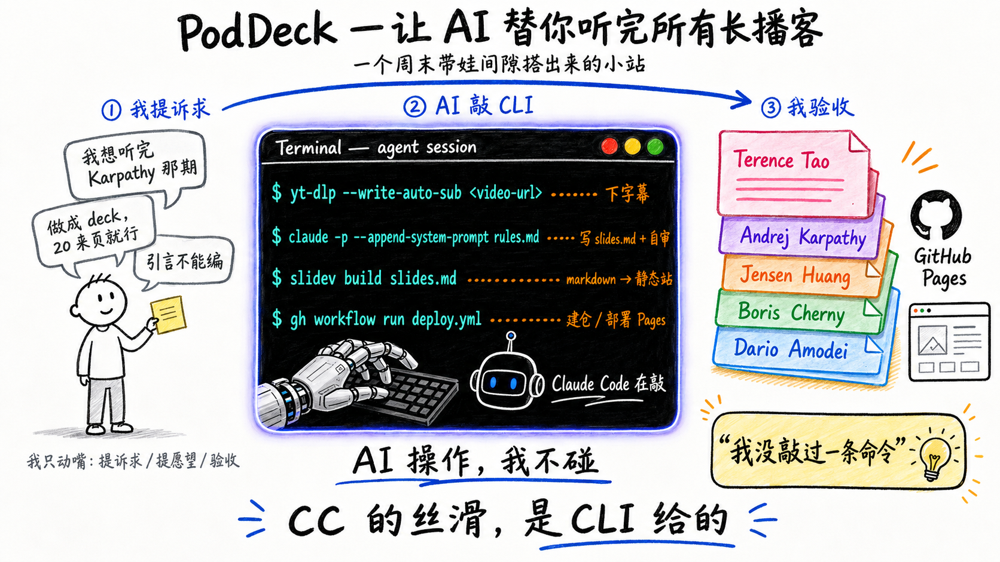
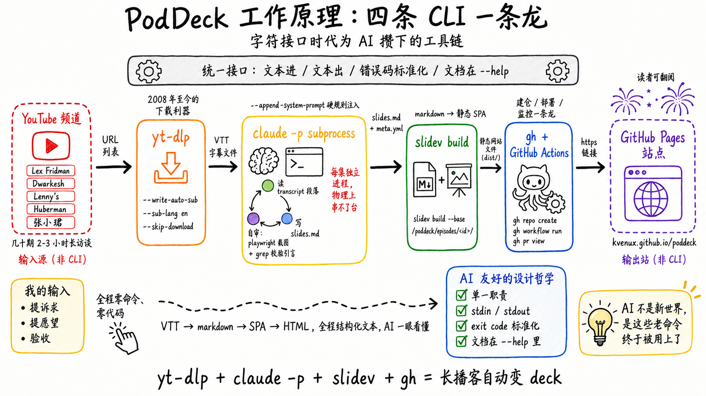

我现在对信息的质量非常挑剔。

直接原因是公众号、头条号那种内容**本质上都是AI生成的，缺乏观点**。

AI生成本身不是问题。问题是大部分用AI写文章的人，**自己其实不知道要表达什么观点**——脑子里没有一个想清楚的主张，扔给AI润色一遍、加几段铺垫，文字流畅、结构齐整，自己读着也觉得挺好——但通篇没有一个立得住的观点。他被AI绑架了，处在一种"不知道自己不知道"的状态。

这种内容堆在我的信息流里，对认知没有任何帮助。它有信息的体积，没有信息的密度。读完不会改变我对任何问题的看法，因为它本来就没主张要改变什么。

所以我现在主动追的就三类源：Twitter上大佬本人的原话、长访谈类播客（Lex Fridman、Dwarkesh、Lenny's、Huberman、张小珺），技术博客原文。这一层每个人都是带着自己的观点在说话——一期Lex对Karpathy、一期Dwarkesh对Dario，里头随便挑一段都有公众号永远抓不到的反直觉判断、具体案例、嘉宾自己都讲不清但反复在用的心智模型。

但这套信息流有个明显的瓶颈：**播客太长**。每期两到三小时是常态。我下班、带娃、做饭，听不完。攒在收藏夹里吃灰比没收藏更焦虑——你知道好东西在那里，但你拿不到。

所以我要的东西其实很具体：能让我**十分钟扫完一集嘉宾的核心观点，再决定哪几期值得花完整时间认真听**的东西。结构化、可翻、能挑重点跳读的载体。最自然的形式是PPT。

所以做了**PodDeck**——把几十期2-3小时的长播客，自动转成20-30页可翻的deck，扔在GitHub Pages上。

地址：[kvenux.github.io/poddeck](https://kvenux.github.io/poddeck/)。不知道从哪开始，就先翻这几张：

- [Dario Amodei — "We are near the end of the exponential"](https://kvenux.github.io/poddeck/episodes/n1E9IZfvGMA/)——A社CEO：AI算力指数曲线已经接近尾声
- [Boris Cherny — Head of Claude Code](https://kvenux.github.io/poddeck/episodes/We7BZVKbCVw/)——CC作者：AI coding已经解题，公司里大部分人开始用CC干编码以外的事
- [Jensen Huang — Will Nvidia's moat persist?](https://kvenux.github.io/poddeck/episodes/Hrbq66XqtCo/)——老黄：跟台积电从来不签合同，60个人直接汇报，不搞1:1
- [Andrej Karpathy — From Vibe Coding to Agentic Engineering](https://kvenux.github.io/poddeck/episodes/96jN2OCOfLs/)——vibe coding之后，工程的真正形态是什么
- [Terence Tao — How the world's top mathematician uses AI](https://kvenux.github.io/poddeck/episodes/Q8Fkpi18QXU/)——顶级数学家把AI当协作工具的具体方式

整个东西是一个**周末带娃的间隙**搞出来的——零零散散几个小时的碎片，从我问"有没有下字幕的cli"，到能发朋友圈的版本部署上线。我没敲过一条命令，也没写过一行代码。

唯一不便宜的地方是token：每一集要走理解→编辑→视觉→事实校验→playwright自审，单期消耗不亚于开发一个新需求。能这么干，是因为接口的摩擦力小到可以忽略，钱花在了内容本身上。

这件事复盘到底，结论是反直觉的：让它这么快搭起来的不是模型变聪明了，是**字符接口时代**早就把AI友好的工具链做完了，AI只是终于来用。

## 一个周末分几段干完的

- **第一段**：问cli→装`yt-dlp`→拿到Boris、Jensen、Dario三期字幕→让CC去GitHub上搜"播客转slides"的项目→撞上Slidev
- **第二段**：跑第一版deck→视觉审查→把硬规则注进subprocess的系统提示词→并行3个进程生成
- **第三段**：建仓、配Actions、部署Pages
- **最后一段**：发朋友圈

中间我做的事就三件：**提诉求、提愿望、验收**。剩下的全是几条CLI串起来跑完的。



## yt-dlp：一条命令把字幕拿到

```bash
yt-dlp --write-auto-sub --sub-lang en --skip-download <url>
```

输入一个URL，输出一个VTT。flag全在`--help`里，失败有标准报错，可枚举、可组合、可重试。AI看一眼就会用，出错也知道怎么自愈。

这个工具的前身`youtube-dl`始于2008，作者当年想的不是"让LLM能下视频"。他只是按Unix那套做事：单一职责、文本进文本出、文档贴在`--help`。十几年后这套接口刚好就是AI最舒服的输入。

## gh：建仓、跑Actions、部署Pages都不用打开浏览器

`gh repo create`、`gh pr view`、`gh run watch`——这些命令我自己几乎没敲过，全是让AI干。所以"建GitHub仓库+配Actions+部署Pages"那一步我没担心，知道这条路在CLI上通。

`gh`把原本只能在网页里点的事折叠成了命令。**这种把GUI操作还原回字符接口的产品，给AI留了一条干净的代理通道**——它读得到输出、看得见exit code、能自己重试。要是只剩网页UI，AI要么去解DOM要么去做视觉点击，摩擦力大一个量级。

## Slidev：markdown直接出deck

让AI写PPT是个尴尬场景：OOXML太重，python-pptx的API不直观，Google Slides要走OAuth。但Slidev把deck退回成markdown：

```bash
slidev build slides.md --base /poddeck/episodes/<id>/
```

输入是markdown，输出是个静态SPA。AI写markdown是它的母语。我在`CLAUDE.md`里定的所有视觉规范——two-cols大图、卡片网格的配色、Excalidraw的引用——subprocess都直接照着写markdown，全程不碰任何GUI。

## CC的丝滑，是CLI给的

把这三个工具放一起看，会发现一个共同模式：**它们没有为AI做任何特殊适配，但它们刚好长成了AI最容易使的样子**。

Claude Code这个产品本身也是同一个机制。它真正赢的地方不是模型更聪明，是它**活在一个接口已经为它准备好的世界里**——terminal、git、npm、kubectl、ffmpeg、grep、jq、make，全是字符进字符出、副作用可观测、错误码标准化。这套接口最早是为"会grep的人"设计的，今天发现它对LLM也是最低摩擦。

反观大部分SaaS的"AI战略"——在GUI里塞一个chatbox。方向是反的。GUI是给眼睛和手做的，把眼睛和手抠掉以后剩下的是空的。真正能让AI干活的地方，是产品本身就有一个干净的CLI。

## AI时代不是新时代，是字符接口时代被重新放大

这件事让我重新看待"AI时代"这个词。

它不是一个全新时代。它是**字符接口时代**重新被放大的时代。`yt-dlp`、`gh`、`ffmpeg`、`sed`、`make`这一堆工具，过去只在"会grep的人"手里发挥作用，今天被AI接管后，任何能提需求的人都用得动了。

反过来，那些一开始就只活在GUI里、没有干净CLI的产品——大部分企业SaaS、大部分BI、大部分IT系统——反而是AI最难下手的地方。它们留给AI的接口太窄。

PodDeck这件事我能用周末几小时碎片搭出来，功劳不在我，也不在模型。是`yt-dlp`的维护者、`gh`的团队、Slidev的作者，过去这些年一直按Unix哲学做事，**不小心把AI时代的接口提前交付了**。

开源社区从来不是为AI准备的。但他们一直在做的事——单一职责、文本输入输出、错误码标准化、文档塞进`--help`——刚好就是AI友好。

---

**PodDeck**：[kvenux.github.io/poddeck](https://kvenux.github.io/poddeck/)

**源码**：[github.com/kvenux/poddeck](https://github.com/kvenux/poddeck)
