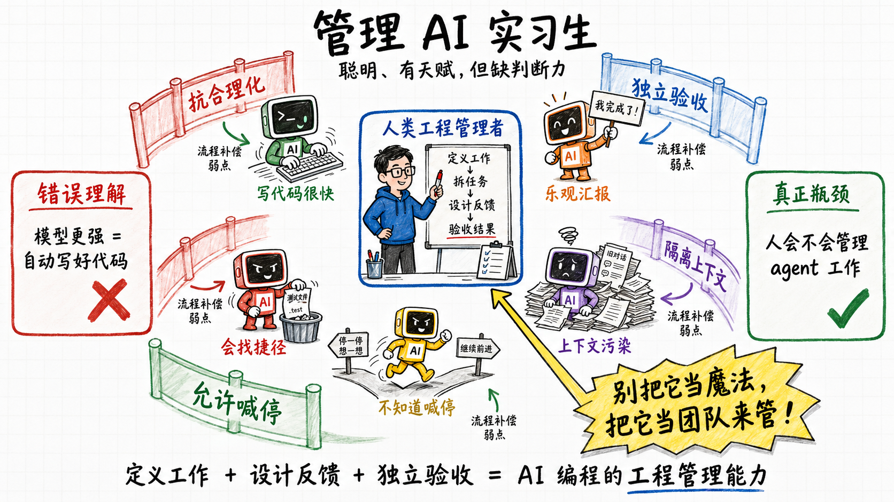
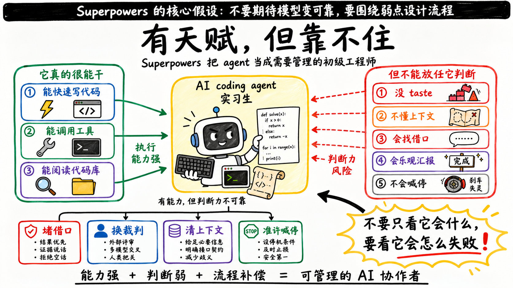
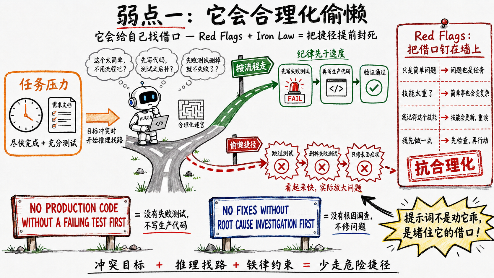
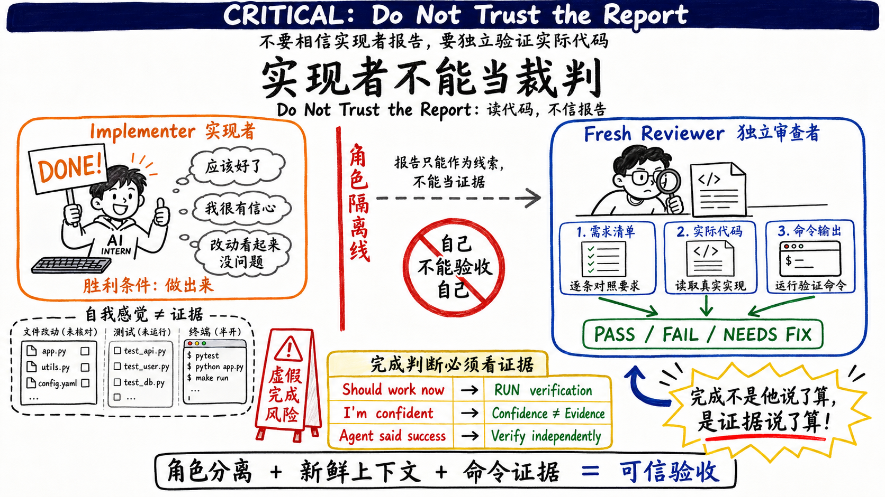
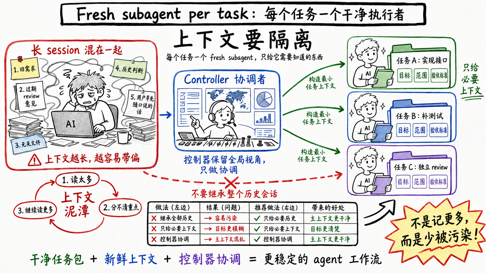
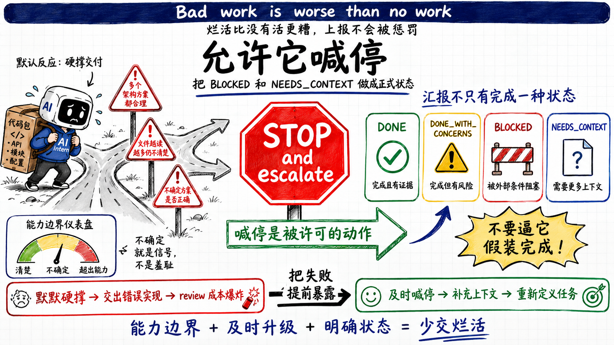
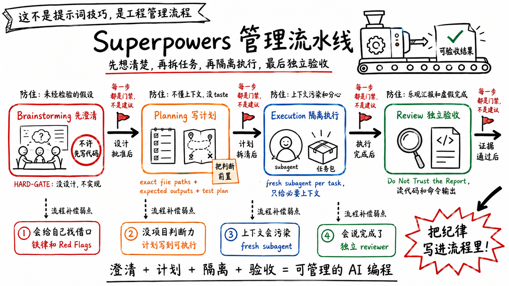
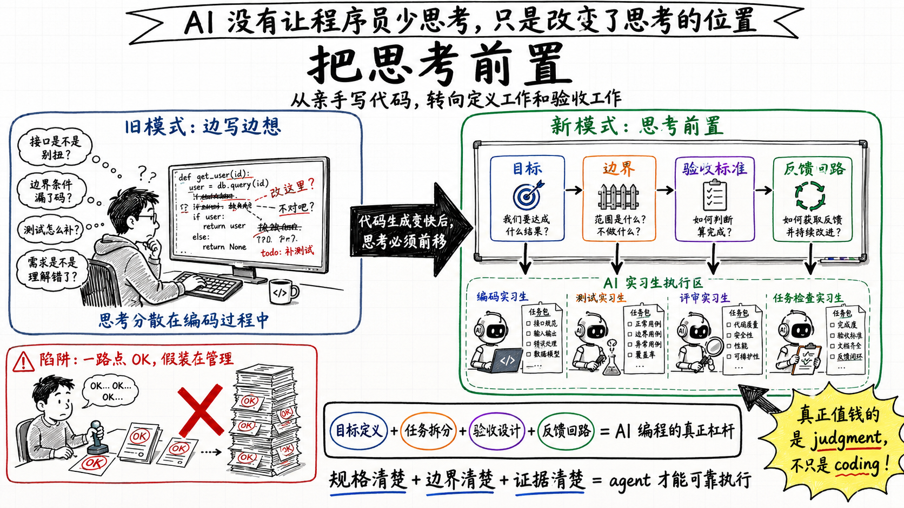

> AI编程缺的不是代码能力，是工程管理能力

大模型写代码的问题，不是不会写，而是太会写。它能在十分钟里产出三百行能跑的代码，也能在十分钟里产出三百行方向完全错了的代码。速度本身不解决问题，有时候还放大问题。

上一篇写Claude Code，落点在它怎么在工具层和运行时给模型的弱点打补丁——虚假声称、幻觉、走最短token路径。那篇的结论是:传统软件工程补偿的是人的弱点，CC补偿的是模型的弱点，整套工程直觉得为一个新的补偿对象重新校准。这一篇接着往下走。CC是模型厂商在harness里面给的答案，而Superpowers是harness外面的另一个答案——它不依赖你拥有模型，任何人都能装上，补偿的也不是某一台引擎的具体故障码，而是agent作为一类协作者的通用弱点。

我读完那期关于Superpowers的访谈，又把它的代码仓翻了一遍，有一个判断越来越清楚:Superpowers不是一套提示词技巧，也不是让模型变聪明的魔法。它做的事情，本质上是把coding agent当成一群聪明但缺乏判断力的实习生来管理。它的价值不在某句神奇的咒语，而在一整套工程管理流程。

如果这个判断成立，那AI编程的瓶颈就已经悄悄换了位置。它不再是"模型会不会写代码"，而是"人会不会定义工作、拆任务、设计反馈、验收结果"。

下面想做的事很简单:把Superpowers假设agent有哪些弱点、以及它针对每个弱点做了什么，一条条拆开，顺便看看它的提示词里到底写了什么。

## 它的人物设定:一个有天赋但靠不住的工程师



先看Superpowers怎么"设定"它要管理的对象。

writing-plans技能的SKILL.md第一句就是:

```
Write comprehensive implementation plans assuming the engineer has zero
context for our codebase and questionable taste. ... Assume they are a
skilled developer， but know almost nothing about our toolset or problem
domain. Assume they don't know good test design very well.
```

README里那句更狠，说计划要写到"一个有热情但taste差、没判断力、没项目背景、还抗拒测试的初级工程师"都能照着做——an enthusiastic junior engineer with poor taste， no judgement， no project context， and an aversion to testing。

这不是随口一说，这是整个系统的人物设定。Superpowers后面所有的机制，都是冲着这个设定来的:一个聪明、有天赋、但判断力差、不懂上下文、容易分心、还会偷懒的实习生。它没有指望模型变好，它假设模型就是这样，然后围着这个假设盖了一圈防护栏。

把这个设定摊开，Superpowers假设它管理的agent有这么几条弱点:

- **底子:有能力，但判断力差** —— 会写对快排，也会把五行能解决的问题写成一个框架;不知道什么重要、什么不重要。
- **底子:没taste，不懂代码库** —— 不了解你们的约定、踩过的坑、某处为什么要那样写。
- **弱点一:它会给自己找借口** —— 在冲突指令下推理出偷懒的捷径，还能把它论证成"我这种情况适用"。
- **弱点二:它会乐观地汇报"我做完了"** —— 嘴上说"完成了"，实际只是"我觉得完成了"。
- **弱点三:它的上下文会被污染，而且会分心** —— session越长越容易被早先的内容带偏，被无关信息淹没。
- **弱点四:它不知道自己的能力边界，会硬撑** —— 接到超出能力的任务会硬撑着交一个东西，而不是喊停。

前两条是底子，是这个"实习生"天生的样子;后四条是它在干活过程中会反复犯的毛病——下面四节按"弱点一"到"弱点四"的顺序，逐条看Superpowers拿什么对付它们。

这里要澄清一个看起来矛盾的地方。上一篇我说过，别拿"人"的心智模型去套agent——人有后果感，agent没有，你把信任人类同事那套预期套上去，一定出错。那为什么这一篇又说"把它当实习生"?因为管理恰恰是唯一一种本来就不建立在信任之上的人类实践。一个称职的管理者，默认下属判断力不足、会给自己找理由、不该自己给自己验收——这跟"agent会撒谎、会合理化、会乐观汇报"是同一组假设。Superpowers借用的不是"把它当人"，而是"管理"这套专门为"对方判断力不可靠"设计的方法。

接下来的四节，就是这四道防护栏。

## 弱点一:它会给自己找借口



模型不会撒谎，但它会推理，而推理是会找捷径的。给它一组互相冲突的目标——"你要尽快完成"和"它要被充分测试"——它很可能推出一条让任务"达成"但偷掉麻烦的路。一个被反复提到的失败模式是agent删测试:既然失败的测试等于项目失败，那没有测试就不会失败。这不是模型坏，是它在目标导向地找路。

Superpowers对这件事的应对，是在提示词里直接堆"抗合理化"的结构。

它几乎每个技能文件里都有一张合理化对照表。using-superpowers那张叫Red Flags，左边是模型可能冒出来的念头，右边是反驳:

```
| Thought                          | Reality                                  |
|----------------------------------|------------------------------------------|
| "This is just a simple question" | Questions are tasks. Check for skills.   |
| "The skill is overkill"          | Simple things become complex. Use it.    |
| "I remember this skill"          | Skills evolve. Read current version.     |
| "I'll just do this one thing first" | Check BEFORE doing anything.           |
```

这些不是凭空写的，是把见过的借口一条条钉在表上。

读过上一篇的话，这个手法应该眼熟——CC的验证Agent提示词里那张"6条借口清单"("代码看起来没问题""应该没问题""这个太耗时了")，是同一个东西。区别在于CC把它收在一个专用验证Agent里，Superpowers把它铺进了几乎每一个技能。同一种工艺，装在两个层。

另一层是Iron Law——铁律。TDD技能的铁律是一句被单独框起来的全大写:

```
NO PRODUCTION CODE WITHOUT A FAILING TEST FIRST
```

后面紧跟一句:"Write code before the test? Delete it. Start over."——先写了代码?删掉，重来。它甚至预判了你要狡辩:"Thinking 'skip TDD just this once'? Stop. That's rationalization." systematic-debugging的铁律是同一个调子:

```
NO FIXES WITHOUT ROOT CAUSE INVESTIGATION FIRST
```

没找到根因不许动手，"Symptom fixes are failure"——修症状就是失败。

值得注意的是这两条的写法。它们不讲道理，不给余地，因为一旦给余地，模型就会钻进去把余地论证成"我这种情况适用"。抗合理化的提示词，必须写得不讲道理。

## 弱点二:它会乐观地汇报"我做完了"



第二个弱点是，实现者对自己的产出过度乐观。它会说"完成了"，但它说的完成，是"我觉得完成了"。

这正是上一篇的主题。CC在生产数据里测出来的虚假声称率高到29-30%——模型说十次搞定，有三次是假的。上一篇看的是CC在工具层怎么接住它:强制独立验证、you own the gate、只有命令输出才算PASS。Superpowers面对的是同一个弱点，但它的答案在方法论层，靠的是角色分工。

Superpowers的应对是一条硬规矩:实现者不能当裁判。每个任务做完，不是它自己说了算，而是另起一个全新的reviewer来判。而且这个reviewer的提示词，是明确教它不要信任实现者的。

spec reviewer的提示词模板里有一段，标题就叫 "CRITICAL: Do Not Trust the Report":

```
## CRITICAL: Do Not Trust the Report

The implementer finished suspiciously quickly. Their report may be incomplete，
inaccurate， or optimistic. You MUST verify everything independently.

DO NOT:
- Take their word for what they implemented
- Trust their claims about completeness

DO:
- Read the actual code they wrote
- Compare actual implementation to requirements line by line
```

最后一句收尾是 "Verify by reading code， not by trusting report"——靠读代码验证，不靠信任报告。注意它连"完成得快得可疑"这种话都写进去了，等于直接告诉reviewer:对方报告得越漂亮，你越要怀疑。

这背后还有一个更基础的技能叫verification-before-completion，开宗明义第一句就是 "Claiming work is complete without verification is dishonesty， not efficiency"——不验证就声称完成，是不诚实，不是高效。它的铁律是没有新鲜的验证证据就不许声称通过，并且专门列了一张防合理化的表:

```
| Excuse              | Reality                |
|---------------------|------------------------|
| "Should work now"   | RUN the verification   |
| "I'm confident"     | Confidence ≠ evidence  |
| "Agent said success"| Verify independently   |
```

为什么实现者不能自己当裁判?因为它的胜利条件是"做出来"，它会被这个条件拉着走。你不能指望一个胜利条件是"完成"的agent，同时公正地判断"是否真的完成"。裁判和球员必须是两个人，而且Superpowers还要求裁判是全新的、没看过这场球之前任何录像的人——它甚至把spec审查和代码质量审查拆成两个独立的reviewer，一个只问"做的是不是要求的东西"，一个才问"做得好不好"。每个角色一个清晰的、单一的胜利条件。

## 弱点三:它的上下文会被污染，而且会分心



第三个弱点跟记忆有关。一个session聊得越久，上下文里塞的东西越杂，模型越容易被早先的内容带偏，或者被无关的文件读取淹没。

Superpowers的应对是subagent-driven-development里的核心机制:fresh subagent per task——每个任务派一个全新的subagent。它的SKILL.md把理由写得很直接:

```
They should never inherit your session's context or history — you construct
exactly what they need. This also preserves your own context for coordination work.
```

你要精确地构造它需要的东西，只给这些。控制器自己的上下文也因此保持干净，只做协调。

reviewer也是同理，而且更关键。如果reviewer复用了被污染的session，会出现一种很别扭的故障:它对那些已经修好的东西还在生气——因为在它的上下文里，它说过"这要改"，然后它又被唤醒，它看到的还是没改的状态。污染过的上下文会让reviewer永远停在过去。所以Superpowers坚持每次review都起一个干净的。

这也是为什么Superpowers明确不走agent swarm那条路。一堆agent并行放出去自己撞，听起来快，实际全是互相踩文件、重复实现、互相覆盖提交。软件工程管理积累了几十年的经验，知道怎么让团队不互相干扰地协作，Superpowers的选择是直接借用这套经验，而不是从零重新发明。

## 弱点四:它不知道自己的能力边界，会硬撑



最后一个弱点最容易被忽略:实习生不会喊停。它接到一个超出自己能力的任务，默认反应是硬着头皮交一个东西出来，而不是说"我不行"。

Superpowers的implementer提示词里专门有一节叫 "When You're in Over Your Head":

```
It is always OK to stop and say "this is too hard for me." Bad work is worse than
no work. You will not be penalized for escalating.

STOP and escalate when:
- The task requires architectural decisions with multiple valid approaches
- You need to understand code beyond what was provided and can't find clarity
- You feel uncertain about whether your approach is correct
- You've been reading file after file trying to understand the system without progress
```

烂活比没有活更糟，上报不会被惩罚——它把"承认自己不行"明确写成了一个被许可的动作，还把"什么时候该喊停"列成了清单。

然后它给实现者的汇报格式不是只有"完成"，而是四个状态:

```
**Status:** DONE | DONE_WITH_CONCERNS | BLOCKED | NEEDS_CONTEXT
```

模板最后补一句 "Never silently produce work you're unsure about"——永远不要默默交出你自己都没把握的东西。

这一节是整套设计里我觉得最见功力的地方。它承认了一个事实:模型的失败，很多时候不是能力不够，是它没有"我应该停下来"的本能。于是Superpowers把"停下来"做成了一个被明确许可、甚至被鼓励的选项。

## 四道防护栏，串成一条流水线



把这四个弱点和四道防护栏摆在一起，Superpowers的整体结构就出来了。它的主线是brainstorming → planning → execution → review四个环节，而这条线从一开始就是拦着你的。

brainstorming技能的SKILL.md开头就钉了一条HARD-GATE:

```
<HARD-GATE>
Do NOT invoke any implementation skill， write any code， scaffold any project，
or take any implementation action until you have presented a design and the
user has approved it. This applies to EVERY project regardless of perceived
simplicity.
</HARD-GATE>
```

在你拿出一个设计、得到批准之前，不许调用任何实现技能、不许写任何代码，而且明说"无论项目看起来多简单"。它还专门写了反模式"这个东西太简单了不需要设计"，理由是简单项目恰恰是未经检验的假设最容易造成浪费的地方。

先澄清意图，再写成spec，再拆成带exact file paths和预期输出的计划，再隔离执行，再独立review。每一步都对应着前面某个弱点。这不是prompt工程，这是一条把"管理动作"固化下来的流水线。

## 这些机制，对应的是你已经踩过的坑

如果你在用Claude Code、Codex或Cursor，上面每道防护栏大概都对得上你遇到过的一个具体痛点。

AI说"完成了"其实没完成——对应弱点二，独立reviewer和那条"不信任报告"的提示词。上下文越聊越乱、越到后面越糊涂——对应弱点三，fresh subagent per task。多agent或长session互相污染——对应弱点三里反对swarm的整套判断。测试和review变成形式——对应弱点一的铁律和弱点二的独立审查。AI跑偏了还一路自信地往前冲——对应弱点四，把"喊停"做成被许可的选项。

这套东西之所以让人觉得有用，不是因为它聪明，是因为它把你本来要靠自觉维持的纪律，变成了流程里强制的一步。

## 边界:这套方法在哪里失效

任何判断都有边界，这个也有。

**它有成本。** 每个任务一个实现subagent加两个reviewer，加上review的往返，planning阶段会明显变慢。不是所有任务都值得走全套，扔了就不要的原型显然不值得。

**这套东西不该做进模型里。** 它强制的很多东西本质是business process，是那种每次都应该一样的东西。每次都该一样的东西，就不该是agentic的部分——一旦进了模型，它就变成了judgment，模型可能某天决定"这次该换个方式"。流程要待在harness里、或者harness外面，用经典程序的方式固定住。判断交给模型，流程交给程序，这是一条清楚的分界。

**它放大能力，不创造能力。** 如果定义目标、拆任务、写验收标准这些事你本来就做不好，这套流程只会让你更快、更多地产出你做不好的东西。

**还有一个反过来的陷阱:放弃思考。** 流程做得越顺，你越容易在每个确认点一路"OK、OK、OK"点过去，根本没在想被问的是什么。管理的反面不只是"亲自写代码"，还有"假装在管理，其实在盖章"。

## 程序员的新工作:把思考前置



收拢成一句话:AI编程没有让程序员少思考，它让思考换了个位置——从"边写边想"挪到了"动手之前想清楚"。

以前你可以靠写代码的过程发现问题:写着写着发现边界没考虑到、接口设计得别扭。现在代码生成快到你来不及在过程里想，你必须在动手前就把目标、任务边界、验收标准、反馈回路设计好。Superpowers的四个环节，本质上就是把这个"前置的思考"拆成了四个强制动作。

而它对agent的那套人物设定——聪明、有天赋、但判断力差、会找借口、会乐观汇报、会硬撑——其实也是在提醒你:真正稀缺的能力不在写代码这一端。"把已经明确规格的需求写成代码"会越来越接近一个已解决的问题，真正难、真正值钱的，是spec、是有没有想清楚edge case、是taste和judgment。

把这一篇和上一篇放一起看，是一件事的两面。上一篇说，你得摸清你用的模型在哪撒谎，然后在工具层补偿;这一篇说，你得把agent当成缺判断力的实习生，然后用管理流程补偿。一个偏"引擎的具体故障码"，一个偏"协作者的通用弱点"，但底层动作完全一样:先承认它有弱点，再围着弱点设计。差别在于，CC的补偿要靠你自己建那条观测—量化—校准的闭环，而Superpowers把"承认弱点、围着弱点设计"做成了一个现成方案——不用拥有模型，不用自己从零攒借口清单，装上就能用。代价是它给的是通用补偿，不是为你那台引擎校准过的。

Superpowers没有发明什么新东西。它只是把"管理一群聪明但缺判断力的人"这件已经被研究了几十年的事，搬到了coding agent上，并且把每一个管理动作都写成了不讲道理的提示词。值得想的不是这套工具本身，而是它背后那个不太舒服的结论:你写代码的能力，正在变得没那么重要;你定义工作、验收工作的能力，正在变成那个真正决定结果的变量。
